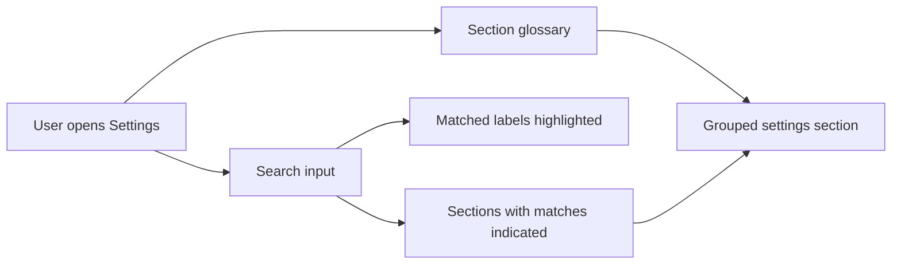

## req_131_settings_search_and_sectioned_navigation - Settings Search and Sectioned Navigation
> From version: 1.11.0
> Schema version: 1.0
> Status: Draft
> Understanding: 92%
> Confidence: 88%
> Complexity: Medium
> Theme: UI
> Reminder: Update status/understanding/confidence and linked backlog/task references when you edit this doc.

# Needs
- Make the Settings workspace easier to scan as the number of preferences grows.
- Add a Settings search input above the settings content so users can quickly find a preference by label or nearby setting text.
- Highlight the matching label text when a search term matches a setting.
- Rework the Settings layout from card-heavy panels into a clearer two-column preferences surface:
  - a left-side glossary/section navigation;
  - a right-side list of all settings grouped by section.
- Combine section navigation with search feedback so users can see which sections contain matches.

# Context
The current Settings workspace contains many independent preference domains: theme, table density, canvas rendering, network summary display, catalog and BOM setup, wire defaults, validation behavior, AI provider setup, and related defaults.

The card layout works for a smaller settings surface, but it becomes harder to scan when users know the concept they want but not its exact section. A search/highlight feature helps direct discovery, while a section glossary plus dense grouped list helps repeated navigation.

This request intentionally captures the product direction before implementation. It can be delivered incrementally: first add search/highlight on the existing Settings surface, then migrate the layout to section navigation and grouped settings lists.

# Functional Scope
## A. Settings search and label highlighting
- Add a Settings search input above the settings content.
- Match against setting labels at minimum.
- Consider matching against short setting descriptions, helper text, and section names when available.
- Highlight the matching substring in setting labels without changing the accessible label text or breaking `label` / `htmlFor` relationships.
- Keep search case-insensitive and whitespace-tolerant.
- Keep Settings usable when the search input is empty.
- Show a clear empty-results state when no setting matches.
- Prefer highlighting over fully hiding unmatched settings for the first implementation, unless later UX review shows filtering is clearer.

## B. Section glossary / navigation
- Add a left-side glossary or navigation list for Settings sections.
- Keep section names short, stable, and domain-oriented.
- Let users jump/scroll to a section from the glossary.
- Indicate the active or focused section where practical.
- In search mode, show which sections contain matches.
- Consider showing match counts per section if it remains visually light.

## C. Right-side grouped settings list
- Replace or reduce the current card-heavy Settings layout with a right-side list grouped by section.
- Keep each setting row scannable: label, control, optional helper text, and validation/status feedback.
- Preserve existing controls and behavior while changing layout.
- Avoid nested cards and decorative card-heavy composition; Settings should feel like a practical preferences surface.
- Maintain responsive behavior:
  - desktop/tablet: left glossary + right grouped list;
  - mobile/narrow widths: glossary collapses or becomes a compact section selector above the list.

## D. Search + navigation interaction
- When search is active, section navigation should help users understand where results are located.
- Matching labels should remain highlighted after jumping to a section.
- Sections without matches may be dimmed, collapsed, or kept visible depending on final UX testing, but users must not lose context unexpectedly.
- Search should not mutate any setting value.
- Clearing search restores the default Settings view.

# Acceptance Criteria
- AC1: A Settings search input is visible above the Settings content.
- AC2: Typing a query highlights matching text in setting labels case-insensitively.
- AC3: Highlighting preserves accessible names and does not break label/control association.
- AC4: Empty search restores the normal Settings display.
- AC5: A no-match search shows a clear empty-results signal without changing persisted settings.
- AC6: Settings are organized into named sections that can be navigated from a left-side glossary on desktop layouts.
- AC7: Selecting a glossary section scrolls or jumps to the corresponding settings group.
- AC8: In search mode, the glossary indicates which sections contain matches.
- AC9: The layout remains usable on narrow/mobile viewports without overlapping controls or hiding required settings.
- AC10: Tests cover search matching, highlight rendering, no-match behavior, section navigation, and at least one accessibility assertion for label/control wiring.

# Out of Scope
- Changing the meaning or persistence schema of existing settings.
- Adding new settings unrelated to search/navigation.
- Global app-wide command search.
- Fuzzy search, keyboard shortcut palettes, or cross-screen search.
- Cloud-synced settings preferences.
- Removing existing Settings functionality during layout migration.

# Definition of Ready (DoR)
- [x] Problem statement is explicit.
- [x] The two user needs are captured separately: search/highlight and sectioned Settings layout.
- [x] UX boundaries are explicit enough for backlog slicing.
- [x] Accessibility risks around labels and controls are called out.
- [x] Acceptance criteria are testable.

# Companion Docs
- Source discussion: user request after `1.11.0` release refresh.
- Related request: `logics/request/req_130_ai_agent_follow_up_memory_persistence_and_workflow_polish.md` for Settings-adjacent AI provider preferences.

# Delivery Status
- Not started.
- Intended as a post-`1.11.0` Settings usability improvement.

# References
- `src/app/components/workspace/SettingsWorkspaceContent.tsx`
- `src/app/hooks/useUiPreferences.ts`
- `src/tests/app.ui.settings.spec.tsx`
- `src/tests/app.ui.settings-canvas-render.spec.tsx`
- `src/tests/app.ui.settings-canvas-callouts.spec.tsx`

# AI Context
- Summary: Add Settings search with label highlighting and refactor Settings into a section glossary plus grouped settings list for better scanability.
- Keywords: settings, search, highlight, glossary, section navigation, preferences, settings layout, label accessibility, grouped list
- Use when: Planning or implementing Settings discoverability, search, section navigation, or a Settings layout refactor.
- Skip when: Work targets unrelated Modeling, Analysis, Network Summary exports, or AI Agent operation behavior.

# Backlog
- To be created from this request.
- `item_605_settings_search_and_label_highlighting`
- `item_606_settings_section_glossary_and_grouped_preferences_layout`
