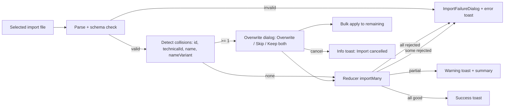

## req_132_network_import_conflict_resolution_and_feedback - Network Import Conflict Resolution and Explicit Feedback

> From version: 1.12.5
> Schema version: 1.0
> Status: Done
> Understanding: 90%
> Confidence: 85%
> Complexity: Medium
> Theme: Import/Export
> Reminder: Update status/understanding/confidence and linked backlog/task references when you edit this doc.

# Needs
- Make network import predictable and never silent when an identity collision happens with an existing network.
- Every collision must surface an explicit overwrite choice to the user; the only way to overwrite an existing network is now through the import flow itself, not through a manual delete-then-import workaround.
- Extend conflict detection to also match by raw network `id`, not only by `technicalId`, `name`, or `nameVariant`.
- Replace the silent `-import` / `-IMP` rename behavior by an explicit "Keep both — rename incoming" user choice in the overwrite dialog.
- Offer a bulk shortcut row in the overwrite dialog so that multi-candidate imports do not force a click per network.
- Guarantee that every terminal import outcome (success, partial, failure, cancellation, reducer rejection) surfaces a temporary toast popup with a clear reason, plus the existing `ImportFailureDialog` for terminal failures and reducer rejections.
- Propagate reducer-level per-network rejection reasons (`empty name`, `payload incomplete`, `ID already exists`, `technical ID already exists`) back to the controller so they reach the toast and the failure dialog instead of being dropped silently.

# Context
The current import path (`src/app/hooks/useNetworkImportExport.ts` + `src/adapters/portability/networkFile.ts`) only detects collisions by `technicalId`, `name`, and `nameVariant`. A raw `id` collision is silently resolved by renaming the incoming network with a `-import` suffix and adding a warning to the import summary. The aggregated toast reads "Networks imported" even when entries have been silently renamed or dropped by the reducer.

Today, the only reliable way to overwrite an existing network is to delete it before re-importing. This is destructive (it breaks intra-workspace references such as harness assemblies), slow, and not acceptable for everyday workflows where the user simply wants to refresh a workspace from an exported snapshot.

Backlog item 027 originally introduced the overwrite dialog. This request closes the regressions that have appeared on top of that foundation and tightens the user feedback contract end to end.

# Functional Scope
## A. Conflict detection coverage
- Extend `detectOverwriteCandidates` so that a raw `id` collision between the imported network and an existing network produces a candidate with `matchReason = "id"`.
- Keep current matching by `technicalId`, `name`, and `nameVariant` (after stripping `-imp\d*` / `-IMP\d*` suffix).
- A single imported network may match an existing one through multiple reasons. The dialog surfaces the strongest reason (priority: `id` > `technicalId` > `name` > `nameVariant`) but stores the full set internally.

## B. Overwrite dialog options
- Per-candidate choices: **Overwrite existing**, **Skip**, **Keep both (rename incoming)**, available for every match reason.
- The default highlighted choice per candidate is **Overwrite existing**.
- A bulk row **Apply to all remaining** offers the same three actions. Selecting a bulk action assigns its choice to every candidate that has not been resolved individually yet. Per-candidate clicks made afterwards override the bulk default.
- A **Cancel** button leaves the workspace untouched, clears the file input, closes the dialog, and emits an `info` toast "Import cancelled".

## C. Overwrite semantics
- **Overwrite existing** replaces the existing network by the incoming network and preserves the existing network's `id` so intra-workspace references (harness assemblies, master connector refs, links) keep resolving.
- **Skip** leaves the existing network untouched and does not insert the incoming network. The candidate is listed in `summary.skippedNetworkIds`.
- **Keep both (rename incoming)** inserts the incoming network with the `-import` / `-IMP` suffix scheme already used today and lists the rename in `summary.warnings`. No suffix rename happens automatically anymore.

## D. Reducer rejection visibility
- `network/importMany` rejection branches must propagate their per-network reasons back to the controller (return value, store-side log, or accompanying action payload — choice left to architecture).
- The controller hook turns those reasons into:
  - a `warning` toast announcing the rejected count and that more detail is in the dialog;
  - the `ImportFailureDialog` opened with the full per-network rejection list (network identity + reducer-side reason), copyable, persistent until dismissed.

## E. Feedback contract
- File read error → `error` toast + `ImportFailureDialog`.
- Parse / schema error → `error` toast + `ImportFailureDialog`.
- Unsupported future schema version → `error` toast + `ImportFailureDialog` quoting the version mismatch.
- Resolved-zero (all candidates skipped or rejected) → `error` toast + `ImportFailureDialog` with the first explanatory reason and the full list.
- Partial import (some imported, some skipped or warned) → `warning` toast with the existing `{imported}/{skipped}/{warnings}/{errors}` summary.
- Clean success → `success` toast with the count of imported networks.
- Reducer-level rejection of one or more entries → `warning` toast + `ImportFailureDialog` per § D.
- User-cancelled overwrite dialog → `info` toast "Import cancelled".

# Acceptance Criteria
- AC1: Importing a file whose payload contains a network with the same `id` as an existing network opens the overwrite dialog with that network listed and `matchReason = "id"`.
- AC2: Importing a file whose payload contains a network with the same `technicalId` (case-insensitive, trimmed) as an existing one opens the dialog with `matchReason = "technicalId"`.
- AC3: Importing a file whose payload contains a network with the same `name` (case-insensitive, trimmed) as an existing one opens the dialog with `matchReason = "name"`.
- AC4: Importing a file whose payload contains a network whose `name` or `technicalId` matches an existing one after stripping the `-imp\d*` / `-IMP\d*` suffix opens the dialog with `matchReason = "nameVariant"`.
- AC5: The overwrite dialog offers three explicit choices per candidate (**Overwrite existing**, **Skip**, **Keep both**), all available for every match reason, with **Overwrite existing** highlighted by default.
- AC6: The dialog exposes a bulk **Apply to all remaining** row with the same three actions; per-candidate choices made after the bulk action override it.
- AC7: Choosing **Overwrite existing** replaces the existing network by the incoming one using the existing network's `id`; intra-workspace references to that `id` still resolve after import.
- AC8: Choosing **Skip** leaves the existing network untouched, does not insert the incoming network, and lists the candidate in `summary.skippedNetworkIds`.
- AC9: Choosing **Keep both (rename incoming)** inserts the incoming network with the suffix scheme and lists the rename in `summary.warnings`. No suffix rename happens automatically when the user has not made this explicit choice.
- AC10: Cancelling the overwrite dialog leaves the workspace state unchanged, clears the file input, and emits an `info` toast "Import cancelled".
- AC11: A file read error, parse error, or unsupported future schema version emits an `error` toast and opens the `ImportFailureDialog` with the reason.
- AC12: A resolved-zero import emits an `error` toast and opens the `ImportFailureDialog` with the explanatory reason list.
- AC13: A partial import emits a `warning` toast with the `{imported}/{skipped}/{warnings}/{errors}` summary.
- AC14: A clean success emits a `success` toast with the imported count.
- AC15: A reducer-level rejection of one or more networks emits a `warning` toast announcing the rejected count and opens the `ImportFailureDialog` with the per-network rejection list (identity + reducer reason). No rejection is silent.
- AC16: Test coverage adds the `id`-match case to the conflict-detection unit tests, the new dialog options and bulk row to the UI tests, and the reducer-rejection surfacing to the controller-hook tests.

# Out of Scope
- Persistence schema migrations or changes to the network file `schemaVersion`.
- Bulk multi-file import or import from URL / cloud storage.
- Conflict resolution at a level finer than the network (per-connector or per-wire merge).
- Changes to harness assembly import beyond what is required to follow the network-level overwrite decision.
- Changes to the AI Agent workspace.
- Release version bump, changelog, or Logics workflow updates.

# Definition of Ready (DoR)
- [x] Problem statement is explicit.
- [x] Current behavior and regression vs. backlog item 027 are described.
- [x] Match reasons, dialog choices, bulk row, and feedback contract are explicit enough for backlog slicing.
- [x] Reducer-rejection visibility is called out as an architectural requirement, not just a UI requirement.
- [x] Acceptance criteria are testable.

# Companion Docs
- Product brief: `docs/network-import-conflict-product-brief.md`.
- Source discussion: user request after `1.12.5` release, reporting that overwrite during import no longer surfaces and that the only workaround is to delete the target network first.
- Related backlog: `item_027_import_conflict_resolution_and_id_deduplication` (foundation).

# References
- `src/app/hooks/useNetworkImportExport.ts`
- `src/adapters/portability/networkFile.ts`
- `src/store/reducer/networkReducer.ts`
- `src/app/components/ToastViewport.tsx`
- `src/app/hooks/useToastNotifications.ts`

# AI Context
- Summary: Restore and tighten the network-import overwrite flow: detect `id` collisions, surface every collision in the dialog, replace silent suffix renames with an explicit user choice, add a bulk apply row, propagate reducer rejection reasons, and guarantee a toast popup for every terminal outcome.
- Keywords: import, overwrite, conflict, network id, technical id, dialog, toast, failure dialog, reducer rejection, summary, feedback, identity collision
- Use when: Planning or implementing changes to network import collision handling, overwrite UX, or import feedback surfaces.
- Skip when: The change targets export-only flows, AI Agent operations, or persistence schema evolution.

# Backlog
- `item_607_network_import_conflict_resolution_and_feedback`
