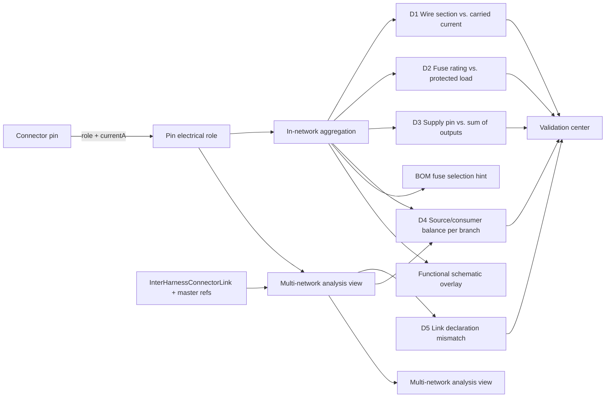

## req_133_pin_level_source_consumer_currents_and_harness_dimensioning_diagnostics - Pin-level Source/Consumer Currents and Harness Dimensioning Diagnostics

> From version: 1.15.3
> Schema version: 1.0
> Status: In progress
> Understanding: 100%
> Confidence: 99%
> Complexity: Large
> Theme: Electrical analysis / Diagnostics
> Reminder: Update status/understanding/confidence and linked backlog/task references when you edit this doc.

# Needs
- Introduce a first-class **electrical role** model at the pin (cavity) level: a connector pin can be declared as **source**, **consumer**, **passive** (default), or **bidirectional**, with a non-negative expected maximum continuous current in Amps. Roles are static — a given pin does not oscillate between source and consumer.
- Allow a single device (connector) to combine roles on different pins. Typical example: an ECU with low-side outputs that **emit** 2.5 A on several output pins while **absorbing** up to 40 A on its supply pin(s); a fuse-box pair that re-injects the upstream feed on the protected side; a relay coil pin vs. relay contact pin.
- Model a **single worst-case continuous current** per pin. No mode toggling (no KL15 / KL30 / sleep profile), no duty cycle, no RMS derivation. The release targets 12 V harness dimensioning; 5 V signal lines (e.g. accelerator pedal) are out of scope.
- Use this pin-level current model to drive a richer diagnostic pass on the harness: wire section vs. carried current, fuse rating vs. downstream worst-case load, balance between supply pins and the sum of declared output currents on the same device, conflicts (two sources facing each other, no source on a fed branch), and per-branch totals.
- Provide a dedicated **multi-network functional analysis view** where the user picks a scope (a single network, or several networks of the active `HarnessAssembly`) and the engine propagates currents across `InterHarnessConnectorLink`s and shared master connector references inside that scope. By contrast, the in-network validation center and inspector aggregate the **current network only**.
- Keep the feature **permissive**: every field is optional, partial data must still produce useful diagnostics, and unknown / undeclared pins must never block validation. Diagnostics degrade gracefully from `error` to `warning` to `info` based on data completeness.
- Make the model **propitious to downstream analyses**: the same pin-current data feeds the validation center, the BOM (fuse choice), the functional schematic overlay, and the new multi-network functional analysis view.

# Context
The app currently models electrical quantities at the **wire** level (`Wire.currentA`, `Wire.sectionMm2`, `Wire.material`, `wireSizing.ts`) and protection at the **wire** level (`Wire.protection` of kind `fuse` referencing a catalog fuse). Fuse-box pairs are described at the **connector** level (`Connector.fusePairRatings`, `Connector.fusePairOverrides`, `FuseBoxConfig`) and rendered explicitly by the functional schematic.

There is no representation of:
- which pin of a connector **drives** current versus which pin **absorbs** it;
- the expected worst-case continuous current value at the pin (independent of the wire that happens to be connected today);
- the asymmetric topology of a device, e.g. an ECU whose `BAT+` pin must sustain the sum of all its low-side output currents;
- a way to dimension across linked networks of the same harness assembly.

As a result, today's diagnostics can flag an undersized wire only when the user has manually set `Wire.currentA`. They cannot:
- check that a fuse rating is coherent with the **sum** of the downstream consumers it protects;
- check that the supply pin of an ECU is dimensioned for the cumulative output it drives;
- detect a branch with no declared source, or with conflicting sources;
- propagate a consumer declared in network B into the fuse / wire / supply check of network A across a harness link.

The release introduces a pin-level electrical role model, a dimensioning diagnostic engine bound to the current network, and a separate multi-network functional analysis view that explicitly opts into cross-network aggregation.

# Functional Scope

## A. Pin electrical role model
- New optional structure on `Connector`: `pinElectricalRoles?: Record<number, PinElectricalRole>` keyed by 1-based cavity index.
- `PinElectricalRole` fields:
  - `role`: `"source" | "consumer" | "passive" | "bidirectional"`. Default when omitted is `passive`.
  - `currentA?`: non-negative number, the **maximum continuous expected current** in Amps. Omitted means "unknown magnitude". A pin role is static — the same pin does not oscillate between source and consumer.
  - `label?`: free-form short label (e.g. `BAT+`, `LS_OUT_3`, `KL15`).
  - `notes?`: free-form long description.
- Catalog-level defaults: `CatalogItem.connectorDefaults.pinElectricalRoles?` can seed pin roles for every connector instance that uses the catalog item. Per-connector entries override the catalog defaults pin by pin.
- Persistence is optional. Networks without `pinElectricalRoles` keep working unchanged.

## B. Current model
- Continuous worst-case only. No mode toggle, no duty cycle, no RMS derivation, no inrush modeling. `currentA` is the value used for every check.
- 12 V harnesses only for the dimensioning checks. 5 V signal lines (e.g. accelerator-pedal signal) are explicitly out of scope and should be declared `passive` (or left undeclared).
- Ampacity reference table is derived from automotive copper conductor standards (ISO 6722-style, single conductor in free air at 85 °C ambient). Default values shipped with the release, per `STANDARD_WIRE_SECTION_MM2_VALUES` (mm² → max continuous A): `0.5 → 11`, `0.75 → 15`, `1 → 19`, `1.5 → 24`, `2.5 → 32`, `4 → 42`, `6 → 54`, `10 → 73`, `16 → 98`, `25 → 129`, `35 → 158`, `50 → 198`, `70 → 245`, `95 → 292`, `120 → 344`. Aluminum gets the same curve scaled by the existing material-resistivity ratio in `wireSizing.ts`. The table is exposed in Settings → Electrical so a user can override values per project; overrides are persisted with the network.

## C. Aggregation engine
- New pure module `src/core/pinElectricalLoad.ts` (or equivalent) that, given a network **and a scope descriptor**, returns:
  - `pinLoadByConnectorPin`: per `(connectorId, cavityIndex)` the resolved `PinElectricalRole` after catalog merge.
  - `branchLoadByWire`: per wire, the carried continuous current derived from the source/consumer pair at its endpoints, propagated across splices and fuse-box pairs (and across inter-network bridges when the scope includes them).
  - `deviceBalance`: per connector, the total declared source currents and total declared consumer currents.
  - `fuseProtectedLoad`: per fuse (wire `protection.kind = "fuse"` and per fuse-box pair), the sum of downstream continuous currents.
- Two scopes:
  - **`scope = "currentNetwork"`** (used by the validation center, connector inspector, BOM, and functional schematic overlay): aggregation is bounded to the active network. `InterHarnessConnectorLink`s and master connector references are **not** traversed. A linked pin contributes nothing to the local aggregate.
  - **`scope = { kind: "assembly", networkIds: [...] }`** (used by the multi-network functional analysis view): aggregation runs on the union graph of the selected member networks of the active `HarnessAssembly`. Inter-network bridges are traversed. The user picks a single network or several; outside-assembly networks are never included.
- Propagation rules:
  - A splice transmits current; the sum entering equals the sum leaving (Kirchhoff). The engine does not invent currents; it reports incoming and outgoing aggregates and flags mismatches.
  - A fuse-box pair behaves as a pass-through for current propagation, with the fuse rating compared to the downstream sum on the protected side.
  - Bidirectional pins contribute to both source and consumer aggregates but are excluded from "no source on branch" detection.
  - When the scope traverses inter-network bridges: an `InterHarnessConnectorLink` and a shared master connector reference are both modeled as current-conserving pass-through nodes between the linked pins.
  - Cycle-safe: each connector pin is visited at most once per aggregation pass. A non-convergent loop emits a single warning and aborts that branch's aggregation without crashing.

## D. Diagnostic surfacing
- New `category` in the validation center: **Electrical dimensioning**.
- All D-issues are computed against the **current network** scope (so opening the validation center never silently aggregates a sibling network).
- Issue families:
  - **D1 Wire section vs. carried current**: the engine-derived continuous current exceeds the current-carrying capacity of the wire section (severity: `error` when ratio > 1.0, `warning` when ratio > 0.9, `info` when between 0.8 and 0.9). Already partially covered for manual `Wire.currentA`; the new path uses the aggregated branch current when manual is absent.
  - **D2 Fuse rating vs. protected load**:
    - downstream load exceeds the fuse rating → `error`;
    - downstream load between 80% and 100% of fuse rating → `warning`;
    - fuse rating is missing while protected load is non-zero → `warning`.
  - **D3 Device supply vs. output sum**: for a device that has both a `consumer` supply pin (e.g. `BAT+`) and one or more `source` output pins, the supply pin's declared `currentA` must be ≥ the sum of source-pin `currentA` — otherwise `warning` (non-blocking). The issue quotes the required vs. declared values.
  - **D4 Branch source/consumer coherence**: a branch with no declared source pin but at least one declared consumer pin emits an `info` (data incomplete) — never an `error`. Two declared sources facing each other on the same branch emit a `warning` (potential conflict) but never block.
- Multi-network analysis view (scope = assembly) emits a fifth family, surfaced inside the analysis view itself, **not** in the validation center:
  - **L1 Link declaration mismatch**: the two pins of an `InterHarnessConnectorLink` (or the master connector reference on both sides) declare **incompatible** roles or currents — for example `source 10 A` on one side and `source 8 A` on the other, or `source` facing `source`, or differing currents on a `source ↔ consumer` link. Severity: `warning`. The aggregation continues by taking the maximum declared `currentA` for cable / fuse checks and listing the mismatch in the view.
- Every D-issue exposes a `Go to` action: connector + pin for D1/D3, wire for D1/D2, branch entry point (first source or first consumer) for D4.

## E. Editing surfaces
- **Connector inspector**: new collapsible **Pin electrical roles** section, listing pins 1..N with per-pin role, currentA, label. Inline catalog-vs-override badge. Bulk actions: "Apply role X to selected pins", "Reset to catalog default".
- **Catalog item editor**: same table when editing a `CatalogItem.connectorDefaults`.
- **Cross-connector mass edit view** (new, accessible from Modeling): a tabular view listing every pin of every connector of the current network with editable role / currentA / label, search and filter (by connector, role, "declared / not declared", over-loaded), bulk apply by selection, and a CSV-style copy/paste for engineers used to filling pin tables in a spreadsheet. Saves are recorded as a single history entry per bulk operation.
- **Functional schematic overlay**: prints the declared current next to each pin (source pins prefixed with `→`, consumer pins with `←`), and the propagated current next to each wire. **On by default** once the feature ships; a canvas toggle can turn it off.
- **Multi-network functional analysis view** (new top-level view): the user picks a scope — one network or several networks of the active `HarnessAssembly`. The view renders the union functional schematic, draws inter-network bridges explicitly, runs the aggregation in `assembly` scope, and lists D1–D4 plus L1 findings for the selected scope. The view is read-only with respect to network data.
- **BOM export**: a new optional column "Computed downstream load (A)" on fuse rows; off by default to keep the existing BOM stable.
- **No overlay on the 2D modeling canvas**; the modeling canvas is not changed by this release.
- **No AI Agent integration** in this release. The model, engine, and views ship without an agent permission or context extension.

## F. Permissiveness contract
- All new fields are optional.
- Missing data never raises `error`-level issues. Only contradictions in **declared** data do, and only at `warning` level (D3, D4, L1).
- Existing networks load with empty `pinElectricalRoles` and no new diagnostic issues.
- Disabling the **Electrical dimensioning** category from the validation center hides every D-issue. Closing the multi-network analysis view hides L1.

# Acceptance Criteria
- AC1: A connector pin can be declared `source` / `consumer` / `passive` / `bidirectional` with optional `currentA`, `label`, `notes`. Default role is `passive`. `currentA` is a non-negative max continuous value; no mode, duty-cycle, or peak field exists.
- AC2: Catalog-level pin roles defined under `CatalogItem.connectorDefaults.pinElectricalRoles` seed every connector instance referencing the catalog item; per-connector entries override per pin without touching the catalog.
- AC3: A network without any `pinElectricalRoles` loads, renders, validates, and exports identically to today (no new errors or warnings on existing fixtures).
- AC4: For an ECU connector declaring a `consumer` supply pin at 40 A and three `source` output pins at 2.5 A each, the device balance reports a 32.5 A headroom on the supply pin and no D3 issue.
- AC5: For the same ECU, if the supply pin is declared at 5 A and the three outputs at 2.5 A each, D3 emits a `warning` "Supply pin under-rated vs. declared output sum (7.5 A required, 5 A declared)".
- AC6: A wire carrying a derived 12 A continuous current with a 1.0 mm² copper section emits a D1 `error` against the shipped ampacity table. The same wire with a derived 5 A continuous current emits no issue.
- AC7: A fuse rated 10 A protecting a downstream sum of 12 A emits a D2 `error`. The same fuse protecting 8.5 A emits a D2 `warning` (between 80% and 100%). A wire with `protection.kind = "fuse"` and a non-zero downstream sum but no fuse rating set emits a D2 `warning`.
- AC8: A branch where every connected pin is `passive` (no source, no consumer declared) emits no issue — diagnostics degrade silently.
- AC9: A branch with at least one `consumer` pin and no `source` pin emits a single D4 `info` per branch entry; never an `error`.
- AC10: Two `source` pins facing each other on the same branch emit a single D4 `warning`; the network still saves, exports, and renders.
- AC11: The validation center groups all new issues under the **Electrical dimensioning** category. Disabling the category hides every D-issue.
- AC12: The validation center, the connector inspector, the BOM, and the functional schematic overlay all use `scope = "currentNetwork"`. Inter-network bridges are not traversed and a linked consumer in another network contributes nothing to D1/D2/D3/D4.
- AC13: The functional schematic overlay prints declared pin currents and propagated wire currents and is **on by default** once the feature ships. A canvas toggle can disable it.
- AC14: The 2D modeling canvas is unchanged by this release.
- AC15: Bulk "Apply role X to selected pins" on the connector inspector and on the cross-connector mass edit view updates only the selected pins and records a single history entry per bulk operation.
- AC16: The cross-connector mass edit view lists every pin of every connector of the current network with editable role / currentA / label, supports filtering by role and by declared / not declared / over-loaded, and supports CSV-style paste of a `(connector, pin, role, currentA, label)` block.
- AC17: The multi-network functional analysis view lets the user pick a single network or several networks of the active `HarnessAssembly`. The view runs aggregation in `assembly` scope on the selected union, renders inter-network bridges explicitly, and lists D1–D4 + L1 findings for the selected scope.
- AC18: With two networks A and B in the active assembly, linked by an `InterHarnessConnectorLink` between `CA.pin3` and `CB.pin1`, a `consumer` declared on `CB.pin1` at 8 A is folded into the branch aggregate of A in the multi-network view and used by its D1 and D2 on the A-side wire reaching `CA.pin3`.
- AC19: A master connector referenced by two member networks of the same `HarnessAssembly` behaves as a bridge in the multi-network view with the same semantics as `InterHarnessConnectorLink`.
- AC20: In the multi-network view, a branch fed by a `source` in A and consumed in B through a bridge does not emit a D4 issue.
- AC21: Networks outside the active `HarnessAssembly` are never aggregated by the multi-network view, even if they declare a link. When the user picks "single network" or when no assembly is active, the view aggregates only the chosen network.
- AC22: A loop in the linked-networks graph does not crash the multi-network view; the engine emits a single `warning` "Inter-network aggregation did not converge" with the loop participants listed.
- AC23: L1 — two pins of the same `InterHarnessConnectorLink` declaring incompatible roles or currents (e.g. `source 10 A` ↔ `source 8 A`, `source` ↔ `source`, or `source 10 A` ↔ `consumer 8 A`) emit a single L1 `warning` in the multi-network view. Aggregation continues by taking the maximum declared `currentA` for cable / fuse checks.
- AC24: The shipped ampacity table is overridable per project under Settings → Electrical and the override is persisted with the network. Without an override, the shipped defaults are used.
- AC25: The release ships with no AI Agent integration. No new agent permission, no new agent context section, no new agent operation. Future agent integration is explicitly deferred.
- AC26: Test coverage adds: pin-role normalization unit tests, aggregation engine unit tests for both scopes (linear chain, splice fan-out, fuse-box pair, ECU asymmetric device, two-network link, three-network harness assembly, loop), D1–D4 issue emission tests, L1 mismatch test, multi-network view component tests, cross-connector mass edit view test (including CSV paste), schematic overlay snapshot test (on by default), and ampacity-override persistence test.

# Out of Scope
- Persistence schema migrations beyond additive optional fields.
- Frequency / harmonic analysis, inrush modeling, duty-cycle modeling, RMS derivation. The release ships with continuous worst-case only.
- 5 V signal lines (e.g. accelerator-pedal signal). Pins on signal lines should be declared `passive` or left undeclared.
- Voltage drop revisions beyond what `wireSizing.ts` already supports (voltage drop stays a separate concern fed by the existing network voltage).
- Thermal derating curves per conductor bundling. The release uses a single ampacity table per section / material; bundling derating is a follow-up.
- Catalog-drift diagnostics. Catalog defaults are still merged with per-connector overrides, but the engine does not flag the divergence.
- Aggregation across networks that are not members of the **active** `HarnessAssembly`. Inter-network propagation is bounded to the active assembly's union graph and only available inside the multi-network analysis view.
- AI Agent integration (context extension, permissions, mutating operations). Explicitly deferred.
- Any change to the 2D modeling canvas.
- Backend, cloud sync, or import/export file format changes beyond the additive optional fields.
- Release version bump, changelog, or Logics workflow updates.

# Definition of Ready (DoR)
- [x] Problem statement is explicit.
- [x] Pin-role data model and merge precedence (catalog vs. per-connector) are spelled out.
- [x] Continuous-only current model is explicit; no mode / duty / RMS.
- [x] Ampacity reference table is shipped with the release, overridable per project.
- [x] Aggregation engine has two explicit scopes: `currentNetwork` for validation / inspector / BOM / overlay, `assembly` for the multi-network analysis view.
- [x] Issue families (D1–D4) and severity ladders are explicit and testable. L1 link-mismatch warning is scoped to the multi-network view.
- [x] Inter-network propagation boundary (active `HarnessAssembly`, links + master refs, loop safety) is explicit and only available in the multi-network view.
- [x] D3 severity is `warning` (non-blocking) for permissiveness.
- [x] Permissiveness contract is called out so partial data never blocks the user.
- [x] No AI Agent integration in this release.

# Companion Docs
- Product brief: `docs/pin-level-source-consumer-currents-product-brief.md`.
- Related catalog & fuse material: `docs/fuse-box-functional-schematic-product-brief.md`, `src/core/wireSizing.ts`, `src/core/functionalSchematic.ts`.

# References
- `src/core/entities.ts` (`Connector`, `CatalogItem.connectorDefaults`, `Wire`, `FuseBoxConfig`)
- `src/core/wireSizing.ts`
- `src/core/functionalSchematic.ts`
- `src/core/harnessAssembly.ts` (inter-network link + master connector references)
- `src/app/hook-impl/validation/buildValidationIssues.ts`
- `src/store/selectors.ts`
- `src/app/components/ToastViewport.tsx` (for diagnostic surfacing parity)

# AI Context
- Summary: Add a pin-level electrical role model (source / consumer / passive / bidirectional) with a single continuous worst-case current per pin. An aggregation engine with two scopes — `currentNetwork` for in-network validation and `assembly` for a new multi-network functional analysis view — feeds a new "Electrical dimensioning" validation category (D1 wire section, D2 fuse rating, D3 supply vs. outputs, D4 branch source/consumer coherence) and an L1 link-mismatch warning. Ships with a default automotive copper ampacity table (overridable). No AI Agent integration in this release.
- Keywords: pin role, source, consumer, current, ampacity, fuse rating, continuous, aggregation, dimensioning, diagnostics, validation, low-side, ECU, inter-network, harness assembly, connector link, master connector, mass edit, analysis view
- Use when: Planning or implementing changes around pin-level current declarations, per-device electrical balance, or harness dimensioning diagnostics.
- Skip when: The change targets routing, layout, AI experimental mode, import/export plumbing, or unrelated UX work.

# Backlog
- `item_608_pin_electrical_role_data_model_and_catalog_defaults`
- `item_609_automotive_ampacity_reference_table_and_project_override`
- `item_610_in_network_pin_load_aggregation_engine`
- `item_611_electrical_dimensioning_validation_category`
- `item_612_pin_role_inspector_and_cross_connector_mass_edit_view`
- `item_613_functional_schematic_electrical_overlay`
- `item_614_multi_network_functional_analysis_view_and_assembly_scope`
- `item_615_pin_role_release_validation_and_permissiveness_gate`

# Delivery Status
- Partially delivered in 1.14.0, with additional validation coverage and the full multi-network analysis view delivered after 1.15.0.
- Delivered and still evidenced in code: pin electrical role data model, catalog defaults, ampacity overrides, current-network aggregation engine, assembly aggregation core, D1-D4 validation category, connector inspector pin-role editor, catalog pin-role editor, bulk inspector apply/reset, cross-connector mass-edit view with filters and CSV paste, optional BOM computed downstream-load export, sample-network silence gate, export/import preservation, onboarding step, AI Agent context non-expansion, partial-declaration permissiveness gate, 2D canvas unchanged snapshot for pin-role/ampacity-only edits, pin-role Playwright full-flow coverage for the available mass-edit + multi-network path, in-network and multi-network analysis performance budgets, release-gate CI wiring, and read-only Analysis panel surfacing current-network D1-D4 plus active-assembly/custom-scope L1, skipped-bridge, loop, union graph summary, assembly-grade D1-D4, and `Go to` findings. Full schematic rendering stays in the Harness assembly functional schematic view.
- Still incomplete: functional schematic electrical overlay/toggle.
- Relevance assessment: the remaining work is still valid but no longer all equally blocking. The mass-edit view remains useful for large harnesses but the inspector/catalog editors provide a workable manual path. The functional schematic overlay is a useful read/review improvement, not a prerequisite for the shipped validation center or the completed multi-network analysis view. Full Playwright/performance gates should wait until the remaining UI surfaces are closer to final.
- Source evidence: `changelogs/CHANGELOGS_1_14_0.md`, `src/core/pinElectricalLoad*.ts`, `src/app/lib/multiNetworkFunctionalAnalysis.ts`, `src/app/components/workspace/MultiNetworkFunctionalAnalysisPanel.tsx`, `src/app/components/workspace/PinRoleMassEditPanel.tsx`, `src/app/hook-impl/validation/appendElectricalDimensioningIssues.ts`, `src/app/components/workspace/PinElectricalRolesEditor.tsx`, `src/app/lib/onboarding.ts`, `scripts/quality/check-pin-role-release-gate.mjs`, `tests/e2e/pin-roles-full-flow.spec.ts`, `src/tests/pin-role-release-gate.spec.ts`, `src/tests/core.pin-electrical-load*.spec.ts`, `src/tests/app.lib.multi-network-functional-analysis.spec.ts`, `src/tests/app.ui.multi-network-functional-analysis.spec.tsx`, `src/tests/app.validation.electrical-dimensioning.spec.ts`, `src/tests/app.ui.inspector-pin-roles.spec.tsx`, `src/tests/app.ui.catalog-pin-roles.spec.tsx`, `src/tests/app.ui.mass-edit-pin-roles.spec.tsx`, `src/tests/portability.network-file.spec.ts`, and `src/tests/ai-agent-context.spec.ts`.
