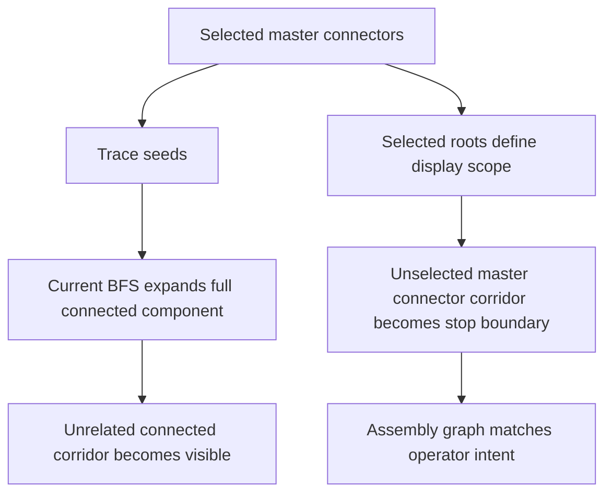

## req_134_harness_assembly_functional_trace_scope_boundaries_for_selected_master_connectors - Harness Assembly Functional Trace Scope Boundaries For Selected Master Connectors
> From version: 1.14.0
> Schema version: 1.0
> Status: Draft
> Understanding: 88%
> Confidence: 91%
> Complexity: Medium
> Theme: Functional schematic / Harness assembly
> Reminder: Update status/understanding/confidence and linked backlog/task references when you edit this doc.

# Needs
- Prevent the harness assembly functional schematic from displaying unrelated connected branches when the operator intentionally selected only a subset of master connectors as trace roots.
- Make the selected master connectors act as an explicit visualization scope boundary, not only as traversal seeds.
- Preserve the existing ability to cross valid inter-harness links and continue through the intended trace, while suppressing branches that are only reachable through another unselected master-connector corridor.

# Context
The current assembly functional trace builder (`buildHarnessAssemblyFunctionalSchematicGraph`) seeds traversal from `assembly.masterConnectorRefs`, then breadth-first expands through every connected wire, splice, and interconnector until continuity ends or a connector marked `isTerminalConnector` is reached.

That implementation matches the original req_122 / item_593 contract, but it creates an operator-visible mismatch in real assemblies with several major trunks:

- the operator selects only master connectors associated with BCM / PCU intent;
- the view still shows wires that belong to another connected corridor;
- these extra wires are not disconnected garbage: they are topologically reachable from the selected roots, so the current algorithm keeps them;
- in practice this makes the filtered assembly graph too broad and visually misleading.

Observed field case:

- workspace: `electrical-workspace-principal-principal-2026-06-03_08-14-56.epe.json`;
- selected master connectors: only `CT8 A` and `CT8 B`;
- unexpected visible branch: wires starting from the lateral interconnector and the battery wake chain from PCU toward the batteries;
- expected operator result: only the trace intended by the selected BCM / PCU roots should remain visible.

Code-level diagnosis:

- [functionalSchematic.ts](/home/pmondou/ai-workspaces/electrical-plan-editor/src/core/functionalSchematic.ts:998) seeds `seedWireIds` from every cavity of the selected root connectors;
- [functionalSchematic.ts](/home/pmondou/ai-workspaces/electrical-plan-editor/src/core/functionalSchematic.ts:1023) then expands `includedQualifiedWireIds` through all connected endpoints;
- [functionalSchematic.ts](/home/pmondou/ai-workspaces/electrical-plan-editor/src/core/functionalSchematic.ts:1038) only stops at connectors flagged `isTerminalConnector`;
- unselected master connectors do not currently create a stop condition, so they cannot act as scope boundaries.

# Functional Scope
## A. Traversal semantics
- When one or more master connectors are selected for an assembly graph, they remain the only authorized trace roots.
- Traversal may continue through ordinary connectors, splices, wires, and valid inter-harness interconnectors exactly as today.
- Traversal must stop when it reaches a connector corridor that is identified as a master connector root in the assembly but is not part of the current selected root set.
- This stop rule applies before unrelated downstream wires from that unselected master-connector corridor are added to the visible graph.

## B. Boundary behavior
- A selected master connector does not block itself; it remains a valid seed and traversable origin.
- An unselected master connector acts as a scope boundary, not as a new seed.
- The boundary should suppress further expansion beyond that connector corridor, while preserving any already-valid upstream path from the selected root to the boundary node.
- Interconnector crossing remains allowed only when the crossing is still on a path authorized by the selected roots and does not require expanding through an unselected master-connector corridor.

## C. UX / operator expectation
- The harness assembly functional schematic subtitle and behavior should stay aligned: "Filtered trace" must correspond to the operator-selected roots, not the whole connected component.
- Root selection should become predictable in assemblies containing several large connected trunks.
- The current-network functional tab is out of scope; this change applies to the saved harness assembly graph only.

## D. Diagnostics and fallback
- If the new boundary rule removes all downstream wires from a selected-root path, the graph should still render the reachable partial trace without crashing.
- If no wire remains reachable from the selected roots after boundary rules are applied, keep the existing disconnected-trace warning style with wording updated only if needed.

# Clarification Questions With Proposed Defaults
- Q1: Should an unselected master connector hide the connector node itself, or only stop traversal beyond it?
  - Proposed answer: stop traversal beyond it, while keeping the reached boundary node visible when it is part of the retained upstream path.
- Q2: If two selected roots legitimately meet in the same corridor, should traversal merge their paths?
  - Proposed answer: yes. Selected roots may converge into one visible shared trace.
- Q3: Should the boundary rule rely only on `assembly.masterConnectorRefs`, or also on `connector.isMainHarnessConnector` fallback when no explicit roots are saved?
  - Proposed answer: explicit saved `assembly.masterConnectorRefs` first; preserve the current `isMainHarnessConnector` fallback only when the assembly has no saved roots.

# Acceptance Criteria
- AC1: In an assembly with multiple saved master connectors, selecting only a subset no longer displays branches that are reachable solely by traversing through another unselected master-connector corridor.
- AC2: A selected master connector still seeds the trace exactly as before.
- AC3: An unselected master connector acts as a traversal boundary for the assembly graph and does not become a secondary seed.
- AC4: Cross-harness traversal through valid interconnector links still works when the resulting path remains inside the selected-root scope.
- AC5: Existing terminal-connector stop behavior remains intact and composes correctly with the new unselected-master boundary rule.
- AC6: Assemblies with only one selected root behave the same as before unless the previous graph relied on leaking through another unselected saved root.
- AC7: The current-network functional tab remains unchanged.
- AC8: Automated tests cover:
  - selected-root trace retained;
  - leakage through an unselected master connector prevented;
  - converging traces from two selected roots preserved;
  - interconnector crossing preserved inside scope;
  - terminal connector stop still respected.
- AC9: The field scenario using `CT8 A` and `CT8 B` no longer shows the unrelated lateral-interconnector / battery-wake branch when that branch is outside the selected-root scope.

# Out of Scope
- Reworking the harness assembly data model.
- Changing symmetric pin continuity semantics.
- Adding per-root ad hoc temporary selection UI beyond the saved master connector configuration.
- Altering single-network functional schematic derivation.
- Introducing logical continuity declarations on inter-harness links.

# Definition of Ready (DoR)
- [x] The operator-visible mismatch is explicit.
- [x] The current code path causing the leakage is identified.
- [x] The desired rule is testable: selected master connectors define scope boundaries, not only seeds.
- [x] The interaction with terminal connectors and inter-harness links is called out.
- [x] The current-network functional tab is explicitly excluded.

# Implementation Notes
- Primary area to change: [functionalSchematic.ts](/home/pmondou/ai-workspaces/electrical-plan-editor/src/core/functionalSchematic.ts:922)
- Candidate approach:
  - compute the saved root-connector set for the displayed assembly;
  - during assembly BFS expansion, when an endpoint key belongs to a connector present in the saved root set but not in the currently selected root subset, treat that endpoint as a traversal boundary;
  - allow node rendering for the boundary connector/interconnector already reached from upstream, but do not enqueue downstream wires from that boundary as expansion candidates.
- Regression coverage should extend the existing assembly functional schematic tests in [core.functional-schematic.spec.ts](/home/pmondou/ai-workspaces/electrical-plan-editor/src/tests/core.functional-schematic.spec.ts:651).

# References
- Request baseline: `logics/request/req_122_multi_harness_super_category_and_cross_harness_functional_schematic.md`
- UI selection behavior: `logics/request/req_126_explicit_harness_assembly_display_selection_and_current_network_functional_tab.md`
- Core implementation: `src/core/functionalSchematic.ts`

# AI Context
- Summary: Tighten harness assembly functional trace derivation so selected master connectors define the visible scope boundary and unselected saved roots no longer leak unrelated connected corridors into the graph.
- Keywords: harness assembly, functional schematic, master connector, trace root, traversal boundary, leakage, interconnector, BCM, PCU
- Use when: Diagnosing or implementing assembly functional graph scope bugs caused by over-expansion from selected roots.
- Skip when: The work only affects current-network functional graphs, connector-link persistence, or electrical load aggregation.

# Backlog
- TBD on promotion
- `item_623_harness_assembly_functional_trace_scope_boundaries_for_selected_master_connectors`

# Tasks
- TBD on promotion
