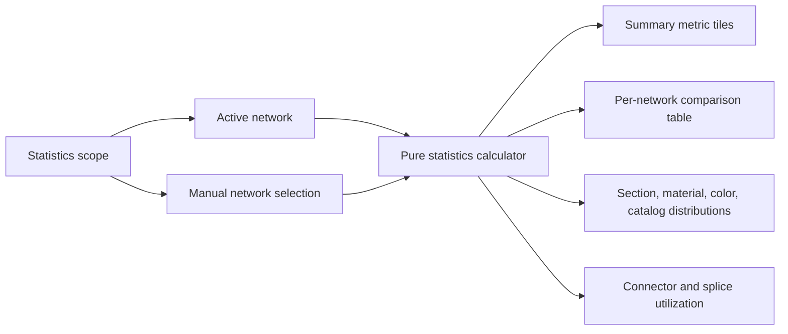

## req_135_network_statistics_dashboard_for_one_or_multiple_networks - Network Statistics Dashboard For One Or Multiple Networks

> From version: 1.14.3
> Schema version: 1.0
> Status: Done
> Understanding: 86%
> Confidence: 82%
> Complexity: Medium
> Theme: Statistics / Reporting
> Reminder: Update status/understanding/confidence and linked backlog/task references when you edit this doc.

# Needs
- Add a dedicated **Statistics** workspace tab, positioned between **Modeling** and **Validation**, so users can inspect quantitative metrics for the active network without exporting data manually.
- Support statistics over one network or several manually selected networks.
- Show core engineering counts: connectors, splices, routing nodes, segments, wires, and catalog items.
- Show wire length statistics for physical/routed wires: total length, average, min/max/median, route-lock coverage, and longest wires.
- Ignore wires with no physical route or explicit physical length in length metrics instead of treating them as `0 m`.
- Show additional useful engineering indicators: wire section/material/color distributions, fuse-protected wire count, connector way occupancy, splice port occupancy, and catalog-linked vs. unlinked entities.
- Keep the feature read-only, deterministic, and derived from existing store state.

# Context
The app already has rich modeling, analysis, BOM export, validation, and harness assembly workflows. However, it does not offer a consolidated statistical view of a network.

Today, a user who wants to know how many connectors, splices, wires, or total routed wire length exist in a network must manually inspect entity tables, use exports, or calculate externally. This slows down practical tasks such as quoting, design review, comparing network variants, and identifying incomplete networks.

The required data already exists in the store:

- `connectors`, `splices`, `nodes`, `segments`, `wires`, and `catalogItems` for the active network;
- `networkStates` for non-active networks;
- wire route metadata and segment lengths for route-derived length fallback;
- occupancy maps for connector ways and splice ports;
- catalog references for linked/unlinked component coverage.

The request introduces a read-only statistics surface and a pure statistics calculator that can be tested independently from the UI.

# Functional Scope
## A. Statistics navigation
- Add a top-level **Statistics** tab to the existing workspace navigation.
- Position **Statistics** between **Modeling** and **Validation**.
- Use the English UI label **Statistics**, consistent with the rest of the app.
- The tab opens on the active network by default.
- The tab remains available when there is no active network, but displays an empty state prompting the user to create or select a network.
- The Statistics tab is read-only. It must not dispatch domain mutation actions.

## B. Scope selection
- Supported scopes:
  - active network;
  - manual network selection.
- Manual selection lets the user include one or more networks from the workspace.
- No dedicated all-networks shortcut and no dedicated harness-assembly shortcut are required in the first release.
- Multi-network scopes display:
  - an aggregated total;
  - a per-network comparison table.

## C. Core statistics
- Entity counts:
  - connectors;
  - splices;
  - routing nodes, split by connector, splice, and intermediate nodes;
  - segments;
  - wires;
  - catalog items.
- Wire length metrics:
  - total wire length in meters;
  - average wire length;
  - minimum wire length;
  - maximum wire length;
  - median wire length;
  - top 10 longest wires;
  - routed wire count included in length calculations;
  - route-locked wire count and percentage.
- Length resolution:
  - prefer `Wire.lengthMm` when it is finite and positive;
  - otherwise fall back to the sum of `Segment.lengthMm` for `Wire.routeSegmentIds`;
  - if neither is available, ignore the wire for length metrics because it is not physically routed.

## D. Distribution and coverage statistics
- Wire section distribution:
  - count per `sectionMm2`;
  - total length per section.
- Wire material distribution:
  - copper;
  - aluminum;
  - unspecified.
- Wire color distribution:
  - primary/secondary color combination where structured colors exist;
  - free color label where present;
  - unspecified.
- Electrical metadata coverage:
  - count of wires with `currentA`;
  - maximum declared `currentA`;
  - fuse-protected wire count.
- Pin electrical role coverage when available:
  - declared connector pins by role (`source`, `consumer`, `passive`, `bidirectional`);
  - connectors with at least one declared pin role.

## E. Connector and splice utilization
- Connector utilization:
  - total connector way capacity;
  - occupied connector ways;
  - occupancy percentage;
  - top 10 connectors by unused way count.
- Splice utilization:
  - finite splice port capacity for bounded and directional splices;
  - occupied finite splice ports;
  - finite occupancy percentage;
  - unbounded splice count;
  - directional splice count.

## F. Catalog indicators
- Catalog-linked connector count and unlinked connector count.
- Catalog-linked splice count and unlinked splice count.
- Catalog manufacturer reference distribution.

## G. Presentation
- Use compact summary metric tiles for the highest-level metrics.
- Use tables for per-network comparison, distributions, utilization, and top longest wires.
- Do not add charts in the first release.
- Use existing app styling and responsive layout conventions.
- Values must never render as `NaN`, `Infinity`, or misleading blank numbers.
- Empty states should explain unavailable metrics, for example "No routed wire length available".
- Lengths are displayed in meters; underlying calculations preserve millimeter precision.

# Acceptance Criteria
- AC1: The workspace navigation contains a **Statistics** tab.
- AC2: The **Statistics** tab is positioned between **Modeling** and **Validation**.
- AC3: Opening the Statistics tab with an active network selected shows active-network statistics by default.
- AC4: Opening the Statistics tab with no active network shows a non-crashing empty state.
- AC5: The user can switch scope between active network and manual network selection.
- AC6: Manual network selection supports one or more workspace networks.
- AC7: Multi-network scopes display both aggregate totals and a per-network comparison table.
- AC8: Core counts include connectors, splices, routing nodes by kind, segments, wires, and catalog items.
- AC9: Wire length metrics include total, average, min, max, median, routed wire count included in length calculations, route-lock count/percentage, and top 10 longest wires.
- AC10: Wire length calculation prefers finite positive `Wire.lengthMm`, falls back to summed route segment length, and otherwise ignores the wire for length metrics.
- AC11: Wires ignored by length metrics are never counted as `0 m`.
- AC12: Wire section distribution shows count and total length per section.
- AC13: Wire material and color distributions include explicit unspecified buckets.
- AC14: Electrical metadata coverage shows count of wires with `currentA`, maximum declared current, and fuse-protected wire count.
- AC15: Pin-role coverage appears when connector or catalog pin roles exist and groups declared pins by role.
- AC16: Connector utilization shows total way capacity, occupied ways, occupancy percentage, and top unused-way connectors.
- AC17: Splice utilization counts bounded/directional finite capacity separately from unbounded splices and reports directional splice count.
- AC18: Catalog indicators show linked vs. unlinked connectors/splices and manufacturer reference distribution.
- AC19: The Statistics tab is read-only and does not dispatch domain mutation actions.
- AC20: Empty and incomplete networks render clear empty states and never render `NaN`, `Infinity`, or misleading totals.
- AC21: The first release does not add statistics CSV export, pricing rollup, charts, or new persistence fields.
- AC22: Existing BOM CSV, wire CSV, SVG, PNG, and network import/export schemas remain unchanged.
- AC23: Unit tests cover the statistics calculator for active-network, manual multi-network, route-length fallback, ignored-unrouted-wire, occupancy, distribution, and catalog-linkage cases.
- AC24: UI tests cover tab navigation, scope switching, multi-network comparison, and empty state.

# Out of Scope
- Editing network entities from the Statistics tab.
- New persistence schema fields or migrations.
- New charting libraries or third-party visualization dependencies.
- Charts in the first release.
- Statistics CSV export in the first release.
- Pricing rollups or cost statistics in the first release.
- PDF report generation.
- Telemetry, cloud analytics, or server-side reporting.
- Changes to existing BOM, wire, network-file, SVG, or PNG export schemas.
- AI Agent context, permissions, or operations.
- Release version bump, changelog, or Logics workflow updates.

# Definition of Ready (DoR)
- [x] The user problem is explicit: statistics are currently scattered across tables and exports.
- [x] Statistics scope is bounded to active network and manual network selection.
- [x] Required metrics are testable and derived from existing store state.
- [x] Multi-network behavior requires both aggregate totals and per-network comparison.
- [x] The first release is read-only and avoids schema migrations.
- [x] CSV export, pricing, and charts are explicitly deferred.

# Companion Docs
- Product brief: `docs/network-statistics-dashboard-product-brief.md`.
- Source discussion: user request on 2026-06-03 asking for a statistics tab covering one or several networks, including connector, splice, wire, and wire-length counts.

# Delivery Notes
- Implemented on 2026-06-03 through `item_616_network_statistics_dashboard_for_one_or_multiple_networks`, `task_124_network_statistics_calculator_and_scope_contract`, and `task_125_statistics_workspace_tab_ui_design_and_validation`.
- Delivered as a read-only **Statistics** tab between **Modeling** and **Validation**.
- First release remains scoped to active-network and manual network selection, with no charts, CSV export, pricing, persistence fields, or AI Agent changes.
- Validation passed: lint, typecheck, focused calculator/UI tests, UI segmentation contract, UI/store/hooks modularization, UI timeout governance, and ExcelJS boundary.

# Implementation Notes
- Candidate pure module: `src/core/networkStatistics.ts` or `src/app/lib/networkStatistics.ts`.
- Candidate UI module: `src/app/components/workspace/StatisticsWorkspaceContent.tsx`.
- Candidate controller integration points:
  - `src/app/hooks/useWorkspaceNavigation.ts`;
  - `src/app/AppController.tsx`;
- `src/app/components/WorkspaceNavigation.tsx`;
- `src/app/components/appUiModules.tsx`.
- Reuse existing store invariants: root-level slices represent the active network; non-active networks must be read from `state.networkStates`.
- No CSV or pricing integration is required in the first implementation slice.

# References
- `src/store/types.ts`
- `src/store/networking.ts`
- `src/app/hooks/useWorkspaceNavigation.ts`
- `src/app/components/WorkspaceNavigation.tsx`
# AI Context
- Summary: Add a read-only Statistics tab between Modeling and Validation for one or multiple manually selected networks with scoped entity counts, physical wire length metrics, distributions, connector/splice utilization, catalog indicators, and per-network comparison.
- Keywords: statistics, dashboard, network metrics, manual multi-network, wire length, connector count, splice count, route length, occupancy, catalog usage
- Use when: Planning or implementing the Statistics tab, statistics calculator, or manual multi-network metric aggregation.
- Skip when: The change targets validation diagnostics, BOM export schema changes, AI Agent workflows, or mutating network entities.

# Backlog
- `item_616_network_statistics_dashboard_for_one_or_multiple_networks`

# Tasks
- `task_124_network_statistics_calculator_and_scope_contract`
- `task_125_statistics_workspace_tab_ui_design_and_validation`
