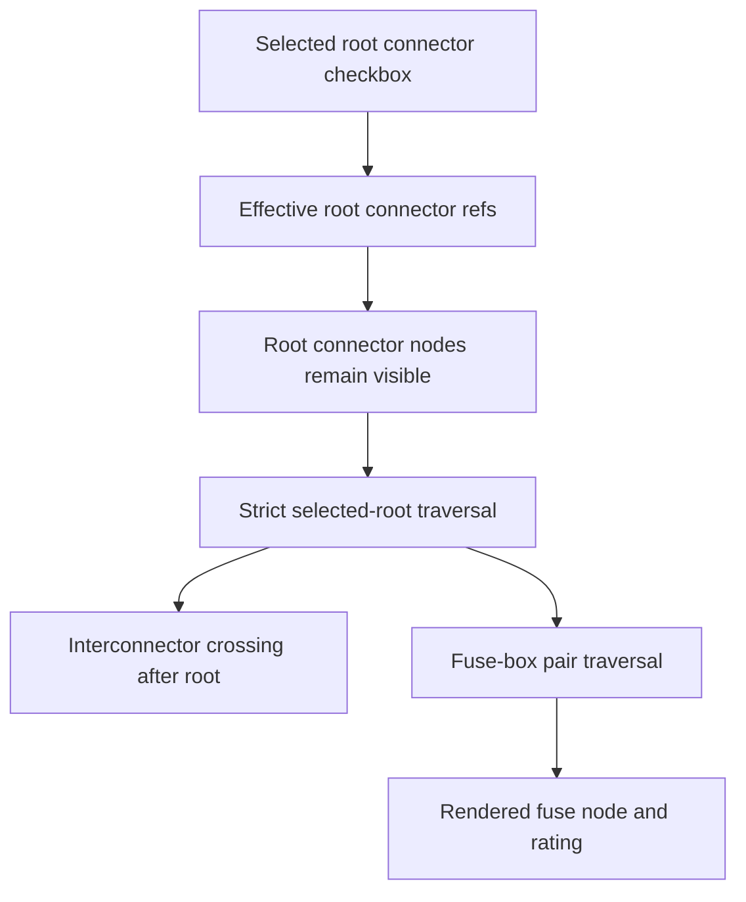

## req_136_harness_assembly_functional_schematic_root_fidelity_fuse_box_and_strict_scope - Harness Assembly Functional Schematic Root Fidelity Fuse Box And Strict Scope
> From version: 1.14.0
> Schema version: 1.0
> Status: Done
> Understanding: 86%
> Confidence: 88%
> Complexity: High
> Theme: Functional schematic / Harness assembly
> Product brief: `prod_006_trustworthy_functional_schematic_review`
> Related request: `req_134_harness_assembly_functional_trace_scope_boundaries_for_selected_master_connectors`
> Reminder: Update status/understanding/confidence and linked backlog/task references when you edit this doc.

# Needs
- Always display selected master connectors as the top/root elements of the harness assembly functional schematic.
- Prevent wires unrelated to the effective selected root connector(s) from appearing in filtered assembly graphs.
- Traverse assembly fuse-box pair metadata and render fuse nodes/ratings instead of stopping at fuse-box connector pins.
- Keep the current saved-assembly root selection contract for now while making the rendered graph clearly match the saved checked roots.

# Context
The current assembly functional graph derives traces from `rootConnectorRefs`, crosses physical interconnector links, and renders interconnector endpoints as dedicated nodes.

Observed field case:

- workspace: `C:\Users\Pmondou\OneDrive - Circle SAS\Documents\Faisceau\envoi AMIPI\principal build\Workspace save\electrical-workspace-debug.epe.json`;
- assembly: `Vehicule Main Interconnections`;
- intended operator selection: only `CT8.B BCM 40V`, filtered to `Signal`;
- unexpected visible branch: `Reveil batterie` through `CT11.A` / `Interco lateral A`, which does not originate from `CT8.B`;
- unexpected visible branch: `Capteur vitre D`, which originates from `CT8.A`, not `CT8.B`;
- intended 12V case: selecting `CT8.A` should show fuse-box continuity, but wires stop at `CT4 Fuse Box` pins.

Code-level diagnosis:

- Assembly root node generation substitutes root connector pins with interconnector nodes when the root connector is part of a connector link.
- Assembly graph traversal uses the effective `rootConnectorRefs`; if persisted roots still include interconnector roots, those roots can pull in branches the operator does not expect.
- The single-network graph builds `fuseBoxCavityInfo`, expands through fuse-box pairs, and renders fuse nodes.
- The assembly graph builder does not currently apply equivalent fuse-box traversal/rendering.

# Functional Scope
## A. Root visual fidelity
- Selected master connector roots must render as connector root nodes at the top of the schematic.
- If a selected root connector pin is also part of an interconnector link, the root connector node remains visible and the interconnector is rendered as the next crossing point.
- Root node identity must preserve network ID, connector ID, connector technical ID, connector name, and pin/cavity index.
- Interconnector blocks must remain visible for cross-harness transitions, but they must not replace selected root connector nodes.
- The first visual row of the graph must contain only selected root connector nodes.
- Root connectors remain represented as one node per connected pin, not as one aggregate connector block.

## B. Effective root selection contract
- The graph continues to use saved assembly roots for now.
- Root checkbox changes do not need to update the graph live before `Save assembly`.
- Because this save-before-render contract is not always intuitive, the UI should make the graph's source explicit when root checkbox edits are unsaved.
- The graph subtitle should list or summarize the saved root connectors used for the rendered graph.

## C. Strict selected-root trace scope
- When only `CT8.B BCM 40V` is selected and the `Signal` filter is active, traces originating only from `CT11.A`, `CT8.A`, or other unselected roots must not appear.
- Traversal may continue through ordinary connectors, splices, fuse-box pairs, local wires, and valid interconnector links only when reached from the selected root's electrical continuity.
- When a selected root pin crosses an interconnector, the expected visible chain is `selected connector pin -> local wire -> interconnector -> distant wire -> next element`, not `selected connector pin -> interconnector` with the local wire hidden.
- Unselected root corridors should act as boundaries and must not become secondary seeds.
- Existing terminal-connector stop behavior remains valid.

## D. Fuse-box traversal in assembly graphs
- Assembly graph derivation must reuse or share the single-network fuse-box pair logic.
- If a wire endpoint touches a connector cavity mapped to a fuse-box pair, the graph should render a fuse node for that pair.
- Traversal should continue from one side of the fuse pair to the other when matching wires exist and filters allow the resulting wires.
- Fuse rating labels should use connector `fusePairRatings` when available and show a missing-rating marker otherwise.
- Fuse-box node IDs must be network-qualified to avoid collisions across harnesses.

## E. Filters and warnings
- Domain filters still apply to visible wires.
- Fuse nodes should remain visible when they connect included visible wires.
- If a filter removes one side of a fuse traversal, the graph should not crash; it may render the retained partial path with a warning if useful.
- Warnings should distinguish no root-connected wires from filter-removed wires.

# Clarification Questions With Proposed Defaults
- Q1: Should checkbox changes update the graph immediately before saving?
  - Answer: no for now; keep the current saved-assembly behavior.
- Q2: Should root connectors render as one compact connector block or one block per connected pin?
  - Answer: one node per connected pin, and those selected root pin nodes must always be placed at the top of the schematic.
- Q3: If a selected root pin crosses an interconnector immediately, should the edge be `root connector -> interconnector -> remote wire`?
  - Answer: no; the intended chain is `root connector pin -> local wire -> interconnector -> distant wire -> other interconnector/wire as needed`.
- Q4: Should an unselected root connector reached downstream be visible as a boundary node?
  - Answer: needs a clearer implementation decision; the key requirement is that unselected roots must not seed or pull unrelated branches into the graph.
- Q5: Should fuse-box traversal cross only configured pairs or infer pairs from adjacent pin numbers when no fuse-box config exists?
  - Answer: only configured catalog pairs; missing config must not invent fuse continuity.
- Q6: Should fuse-box traversal be domain-filtered before or after electrical expansion?
  - Answer: expand electrically first, then apply domain filter to wires, while keeping required fuse nodes for retained wires.
- Q7: Should the `Current network functional` tab change in this request?
  - Proposed answer: no; this request targets harness assembly graphs only.

# Acceptance Criteria
- AC1: Selected master connector roots render in the top/root layer as connector nodes, even when their pins are linked to interconnectors.
- AC2: Interconnector nodes render after selected root connector nodes and no longer replace those selected roots.
- AC3: The first visual row of the graph contains only selected saved root connector pin nodes.
- AC4: The graph clearly communicates that saved assembly roots are used for rendering, and unsaved root checkbox changes are not reflected until save.
- AC5: In the debug workspace, `CT8.B BCM 40V` with `Signal` does not include `Reveil batterie` branches that originate through `CT11.A` / `Interco lateral A`.
- AC6: In the debug workspace, `CT8.B BCM 40V` with `Signal` does not include `Capteur vitre D` when that trace originates from `CT8.A`.
- AC7: In the debug workspace, `CT8.A BCM 81V` with `12V power` shows fuse-box pair traversal for `CT4 Fuse Box` where configured pair data and matching wires exist.
- AC8: Fuse nodes in assembly graphs display fuse ratings from `fusePairRatings` where available.
- AC9: Assembly graph node and edge IDs remain network-qualified and collision-safe across harnesses.
- AC10: Existing cross-harness interconnector traversal still works for traces legitimately reached from selected roots.
- AC11: Existing single-network functional schematic behavior remains unchanged except for shared helper extraction with equivalent behavior.
- AC12: Automated tests cover root connector visual retention, interconnector-after-root ordering, strict selected-root scoping, assembly fuse-box traversal, rating display, and the debug workspace regressions where feasible.

# Out of Scope
- Editable functional schematics.
- Non-symmetric interconnector pin mappings.
- Logical signal declarations on interconnector links.
- PDF export or bulk export packaging.
- Full redesign of the functional schematic layout engine beyond the root-layer changes needed here.

# Definition of Ready (DoR)
- [x] The user-visible mismatch is known and reproducible from the debug workspace.
- [x] The three required changes are separable: root rendering, strict scoping, fuse-box traversal.
- [x] The expected behavior for `CT8.B` Signal and `CT8.A` 12V cases is stated.
- [x] Open questions on save behavior, root grouping, and fuse filtering are answered.
- [x] A backlog item and task are created after clarification.

# Implementation Notes
- Primary core area: `src/core/functionalSchematic.ts`.
- Primary UI area: `src/app/components/network-summary/FunctionalSchematicPanel.tsx`.
- The assembly graph builder should likely share fuse-box helpers with the single-network builder instead of duplicating divergent logic.
- The assembly graph may need explicit connector-root virtual nodes when a root endpoint also maps to an interconnector endpoint.
- The controller does not need live draft root rendering in this request; keep the saved assembly graph contract and improve unsaved-state communication if needed.
- Regression coverage should extend `src/tests/core.functional-schematic.spec.ts` and `src/tests/app.ui.network-summary-workflow-polish.spec.tsx`.

# References
- Product brief: `logics/product/prod_006_trustworthy_functional_schematic_review.md`
- Existing scope request: `logics/request/req_134_harness_assembly_functional_trace_scope_boundaries_for_selected_master_connectors.md`
- Baseline assembly request: `logics/request/req_122_multi_harness_super_category_and_cross_harness_functional_schematic.md`
- Current network functional tab request: `logics/request/req_126_explicit_harness_assembly_display_selection_and_current_network_functional_tab.md`
- Core: `src/core/functionalSchematic.ts`
- UI: `src/app/components/network-summary/FunctionalSchematicPanel.tsx`

# AI Context
- Summary: Make harness assembly functional schematics match selected root intent by keeping root connectors visible, preventing stale or unrelated root branches, and traversing fuse-box pairs in assembly graphs.
- Keywords: harness assembly, functional schematic, selected root connector, CT8, interconnector, fuse box, fusePairRatings, strict scope, draft roots
- Use when: Implementing or reviewing fixes for assembly functional schematic root display, trace leakage, and fuse-box traversal.
- Skip when: Work only affects PDF export, 2D physical canvas exports, current-network functional tab behavior, or non-symmetric interconnector mapping.

# Backlog
- `logics/backlog/item_617_harness_assembly_functional_root_connector_visual_fidelity.md`
- `logics/backlog/item_618_harness_assembly_functional_strict_saved_root_scope.md`
- `logics/backlog/item_619_harness_assembly_functional_fuse_box_pair_traversal.md`

# Tasks
- TBD on promotion
