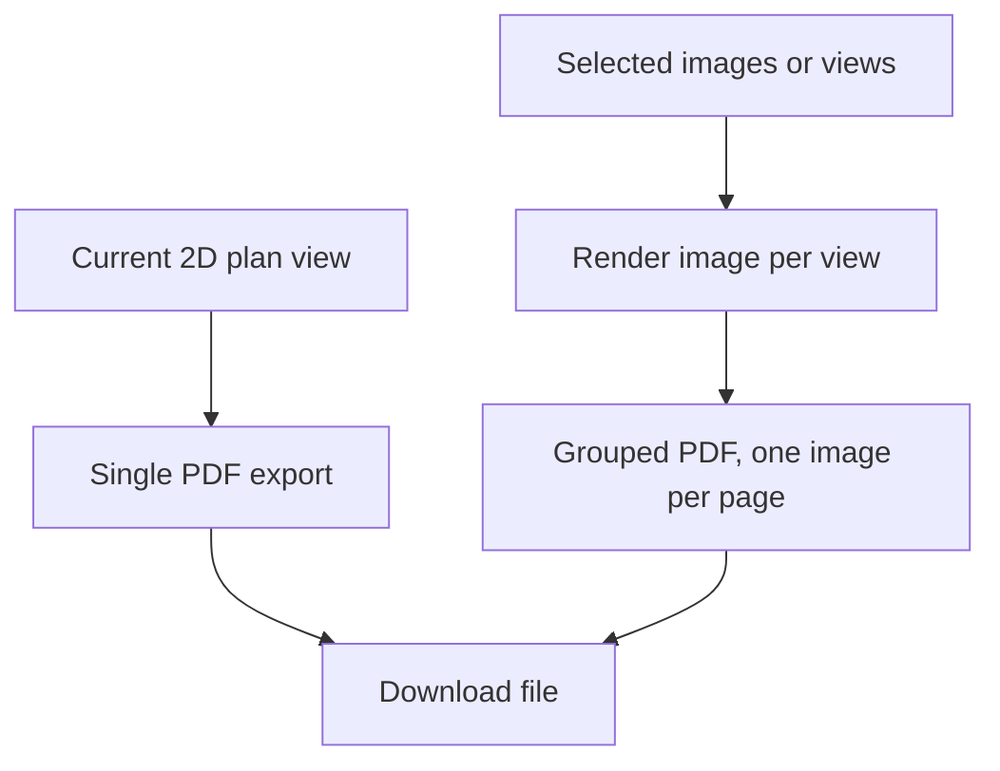

## req_137_pdf_export_for_2d_plans_and_grouped_image_pdf_export - PDF Export For 2D Plans And Grouped Image PDF Export
> From version: 1.14.0
> Schema version: 1.0
> Status: Done
> Understanding: 72%
> Confidence: 78%
> Complexity: Medium
> Theme: Export / Documentation
> Reminder: Update status/understanding/confidence and linked backlog/task references when you edit this doc.

# Needs
- Add PDF export for 2D plan views.
- Add a grouped image-to-PDF export action that creates one PDF with one exported image per page.
- Preserve existing SVG and PNG export behavior.
- Match the current Network Summary 2D SVG/PNG visual output, delivered as PDF.
- Provide a practical documentation/export workflow for sharing multiple rendered plans in one file.

# Context
The application already supports SVG and PNG exports for network summary and functional schematic surfaces. Operators also need PDF output for communication, review packets, and archival workflows.

Two related but distinct needs are requested:

- direct PDF export for a currently rendered 2D plan;
- grouped PDF export where several exported images are assembled into one PDF, one image per page.

# Functional Scope
## A. Single 2D plan PDF export
- Add `PDF` as an export option for the Network Summary 2D plan surface.
- The PDF should preserve the same visual content as the corresponding Network Summary SVG/PNG export options as closely as possible.
- Existing export frame/cartouche/background options should apply consistently unless explicitly unsupported.
- The output file name should follow existing export naming conventions with a `.pdf` extension.

## B. Grouped image PDF export
- Add an export action that creates a single PDF containing multiple rendered images.
- Each image must occupy one PDF page.
- The initial scope should use internally rendered Network Summary 2D plan images, not arbitrary external image upload.
- The order of pages should be deterministic and visible to the operator before export.

## C. Eligible views
- Eligible single-plan view:
  - current Network Summary 2D plan only.
- Eligible grouped views:
  - selected networks' Network Summary 2D plans only.
- Functional schematics are out of scope for this PDF request.

## D. Layout and page settings
- Support free-size PDFs so large plans can be exported as large PDF pages instead of being forced into A4/A3.
- The PDF page size may be derived from the rendered export dimensions.
- The PDF should not crop content unless the operator explicitly chooses a crop mode.
- Page background should follow the export background option.

## E. Technical and safety constraints
- Prefer a browser-side PDF generation approach compatible with the existing local-first app.
- Avoid sending plan data to a remote service.
- Keep export generation responsive with loading feedback for multi-page exports.
- Preserve current SVG/PNG export security hardening for embedded images/logos.

# Clarification Questions With Proposed Defaults
- Q1: Which 2D views must support direct PDF first?
  - Answer: Network Summary 2D plan only.
- Q2: Should grouped PDF export include only 2D physical plans, or also functional schematics?
  - Answer: only 2D physical plans.
- Q3: How should the operator choose pages for grouped export?
  - Answer: from network selection, one page per selected network's 2D plan.
- Q4: Should grouped export use current viewport state or fit each plan to content?
  - Proposed answer: fit each page to content for documentation consistency.
- Q5: Required page formats?
  - Answer: free-size PDF pages; allow very large PDFs rather than forcing a standard paper format.
- Q6: Should the PDF pages contain the existing frame/cartouche?
  - Answer: yes, reuse current frame/cartouche export options.
- Q7: Should external image files be importable and grouped into a PDF?
  - Answer: no; grouped image means app-rendered Network Summary 2D plan images.
- Q8: Should the grouped PDF include a cover page or table of contents?
  - Proposed answer: no for MVP.
- Q9: Should PDF export be available offline/PWA?
  - Proposed answer: yes, browser-side generation only.

# Acceptance Criteria
- AC1: The Network Summary 2D export menu exposes a PDF export option.
- AC2: A single exported PDF contains the same rendered plan content as the corresponding PNG/SVG export, with preserved aspect ratio.
- AC3: PDF export supports the existing export background, frame, and cartouche options where enabled.
- AC4: PDF generation shows loading feedback and does not leave the UI in a stuck loading state on failure.
- AC5: A grouped PDF export action can generate one PDF with one selected app-rendered image/page per PDF page.
- AC6: Grouped PDF page order is deterministic and visible before final export.
- AC7: Multi-page export creates free-size pages from each rendered Network Summary 2D plan without cropping by default.
- AC8: The implementation does not require any remote service.
- AC9: Existing SVG and PNG export behavior remains unchanged.
- AC10: Automated tests cover export option availability, filename extension, grouped page count behavior at the abstraction level available in tests, and failure handling.

# Out of Scope
- Arbitrary external image upload to PDF.
- Functional schematic PDF export.
- Full print-layout editor.
- PDF/A compliance.
- Server-side export services.

# Definition of Ready (DoR)
- [x] Eligible first-release views are confirmed.
- [x] Page format/orientation defaults are confirmed.
- [x] Grouped export selection source is confirmed.
- [x] Decision made on raster PDF vs vector PDF expectations.
- [x] Backlog item and task are created.

# Implementation Notes
- Inspect current export pipeline under `src/app/components/network-summary/export`.
- A pragmatic MVP may render existing SVG/canvas export to image data and place it on PDF pages.
- Candidate libraries should be reviewed for bundle size, browser compatibility, and offline operation before adoption.
- Large multi-page exports should include async progress or at least a non-blocking loading dialog.

# References
- Export baseline: `logics/request/req_088_network_summary_export_quality_with_svg_default_and_png_switch_in_canvas_tools.md`
- Export frame/cartouche: `logics/request/req_102_export_frame_and_network_identity_cartouche_for_svg_png.md`
- Export hardening: `logics/request/req_103_export_security_reliability_and_post_release_review_hardening.md`
- Current export code: `src/app/components/network-summary/export/useNetworkSummaryExportActions.ts`

# AI Context
- Summary: Add PDF export for 2D plan views and grouped app-rendered image PDF export with one page per image.
- Keywords: PDF export, 2D plan, network summary, grouped export, multi-page PDF, image per page, cartouche, frame, offline
- Use when: Grooming or implementing PDF export capabilities for app-rendered plans.
- Skip when: Work targets harness assembly functional schematic traversal or BOM/CSV/XLSX exports.

# Backlog
- `logics/backlog/item_620_network_summary_2d_single_pdf_export.md`
- `logics/backlog/item_621_network_summary_2d_grouped_selected_networks_pdf_export.md`

# Tasks
- TBD on promotion
