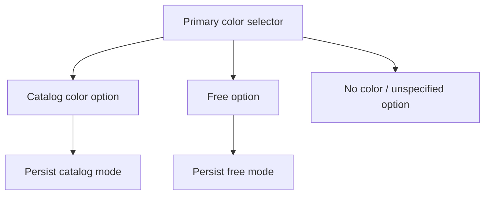

## req_138_wire_color_primary_selector_catalog_with_free_option - Wire Color Primary Selector Catalog With Free Option
> From version: 1.14.0
> Schema version: 1.0
> Status: Done
> Understanding: 84%
> Confidence: 86%
> Complexity: Low
> Theme: Modeling UX / Wire color
> Related request: `req_039_wire_color_catalog_two_character_codes_and_bicolor_primary_secondary_support`
> Related request: `req_045_wire_cable_free_color_label_support_beyond_catalog_and_no_color_states`
> Related request: `req_046_wire_free_color_mode_without_label_as_deliberate_unspecified_color_placeholder`
> Reminder: Update status/understanding/confidence and linked backlog/task references when you edit this doc.

# Needs
- Restore fast access to the catalog color list from the first/primary wire color selector.
- Keep `Free` available as an option inside that primary color menu.
- Avoid forcing the operator to first choose a color mode before accessing catalog colors.
- Preserve existing `No color`, `Free color`, catalog mono-color, and catalog bi-color data semantics.

# Context
Earlier wire color UX allowed direct access to the catalog from the first color selector.
The current form introduces a separate color mode choice between unspecified/no color, free color, and catalog color. This is semantically explicit but slower for the common case where the operator wants to pick a catalog color directly.

The desired correction is UX-level: the first color selector should again show catalog colors directly, with `Free` added as an option. Choosing a catalog color sets catalog mode. Choosing `Free` sets free mode and shows/allows the free color label input according to existing `req_045` / `req_046` semantics.

# Functional Scope
## A. Primary color selector behavior
- The first/primary color control in the wire create/edit form must list catalog colors directly.
- The same menu must include a `Free` option.
- The same menu should retain a clear no-color/unspecified option if needed for existing `colorMode: "none"` semantics.
- Selecting a catalog color sets `colorMode: "catalog"` and stores `primaryColorId`.
- Selecting `Free` sets `colorMode: "free"` and clears catalog color IDs.
- Selecting no-color/unspecified sets `colorMode: "none"` and clears catalog/free fields according to existing normalization.

## B. Secondary color behavior
- Secondary color remains available only when the primary selection is a catalog color.
- Secondary color must not be available in `Free` or no-color states.
- Existing bi-color catalog behavior remains unchanged.

## C. Free color label behavior
- When `Free` is selected, the free color label input remains available.
- Empty free color remains valid if current `req_046` behavior is implemented.
- Free labels continue to display consistently in tables, exports, and read-only surfaces already covered by existing requests.

## D. Compatibility and data model
- This request should not introduce a new wire color data model.
- Existing saves/imports using `colorMode`, `primaryColorId`, `secondaryColorId`, and `freeColorLabel` remain valid.
- Reducer/import normalization continues to enforce catalog/free/no-color exclusivity.

# Acceptance Criteria
- AC1: Wire create/edit form primary color selector shows catalog colors directly without first selecting a separate catalog mode.
- AC2: The primary color selector includes a `Free` option.
- AC3: Selecting `Free` switches the wire to free color mode and clears catalog color IDs.
- AC4: Selecting a catalog color switches the wire to catalog mode and clears free color label semantics as currently required.
- AC5: Selecting no-color/unspecified remains possible and preserves existing no-color behavior.
- AC6: Secondary color is available only for catalog primary colors.
- AC7: Existing persisted wire color states load into the corrected controls without losing data.
- AC8: Automated UI coverage verifies catalog direct selection, Free option selection, no-color selection, and edit-mode hydration.

# Out of Scope
- Changing wire color persistence shape.
- Adding custom user-defined catalog colors.
- Adding a color picker or custom hex swatch.
- Reworking read-only color display beyond regressions caused by the selector change.

# Definition of Ready (DoR)
- [x] Desired UX is explicit: catalog colors directly in the first selector, with `Free` added.
- [x] Data-model semantics are inherited from existing color requests.
- [x] Backlog item and task are created.

# Implementation Notes
- Primary UI area: `src/app/components/workspace/ModelingWireFormPanel.tsx`.
- Current UI copy includes a separate catalog/free/no-color selector near the wire color controls.
- Prefer simplifying the form while keeping reducer and persistence normalization unchanged.
- Regression tests should extend existing wire color mode UI tests where available.

# References
- Catalog color baseline: `logics/request/req_039_wire_color_catalog_two_character_codes_and_bicolor_primary_secondary_support.md`
- Free color support: `logics/request/req_045_wire_cable_free_color_label_support_beyond_catalog_and_no_color_states.md`
- Free unspecified semantics: `logics/request/req_046_wire_free_color_mode_without_label_as_deliberate_unspecified_color_placeholder.md`
- UI: `src/app/components/workspace/ModelingWireFormPanel.tsx`

# AI Context
- Summary: Correct wire color form UX so the primary selector directly lists catalog colors and includes Free as an option, preserving existing colorMode semantics.
- Keywords: wire color, primary selector, catalog color, Free color, no color, colorMode, modeling form
- Use when: Implementing or reviewing wire color form UX after free/no-color/catalog mode changes.
- Skip when: Work targets functional schematic coloring, harness colors, or export rendering.

# Backlog
- `logics/backlog/item_622_wire_color_primary_selector_catalog_with_free_option.md`

# Tasks
- TBD on promotion
