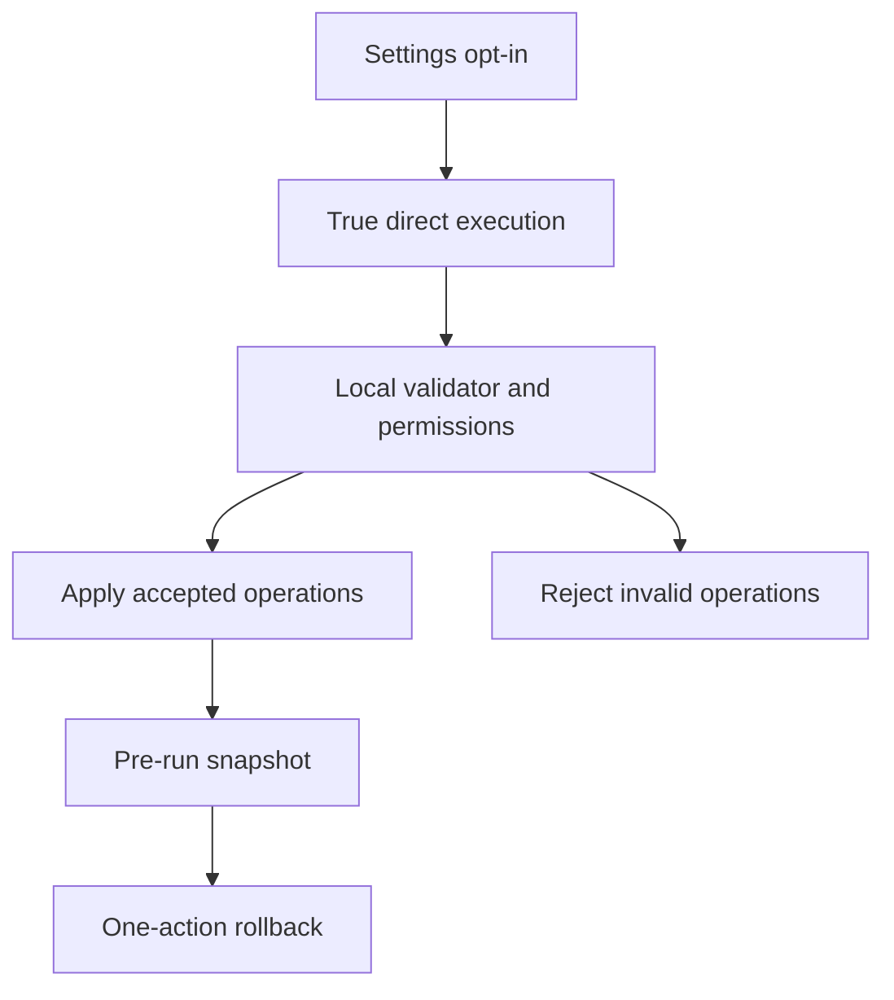

## req_139_ai_agent_true_direct_execution_follow_up - AI Agent True Direct Execution Follow-up
> From version: 1.11.0
> Schema version: 1.0
> Status: In progress
> Understanding: 96%
> Confidence: 91%
> Complexity: Medium
> Theme: AI
> Reminder: Update status/understanding/confidence and linked backlog/task references when you edit this doc.

# Needs
- Finish the post-1.11.0 AI Agent direct-execution path that was intentionally split out of the delivered `req_128` Modeling AI Agent workspace.
- Let explicitly opted-in advanced users run locally validated AI operations without the assisted proposal review/apply step.
- Preserve the same safety floor as assisted mode: bounded operation contract, local validation, delete permission gate, pre-run snapshot, visible result summary, and one-action rollback.

# Context
- `req_128_ai_agent_modeling_workspace` shipped in 1.11.0 with provider settings, Modeling AI Agent entry, assisted proposals, validated apply/reject, grouped history, snapshots, and rollback.
- 1.11.0 deliberately kept all mutation behind the reviewable proposal/apply flow, even when the experimental mode affordance was enabled.
- The remaining work is narrower: true direct execution for users who explicitly opt in, still through the same local validator and executor.
- This request owns the open `item_603` / `task_133` chain so `req_128` can stay closed as the delivered first release.

# Acceptance criteria
- AC1: Experimental direct execution remains unavailable until the global AI settings opt-in is enabled.
- AC2: The Modeling AI Agent UI clearly marks direct execution as experimental and higher-risk than assisted mode.
- AC3: In direct mode, locally valid operations can be applied without the separate assisted proposal review/apply step.
- AC4: Direct execution uses the same bounded operation validator and executor as assisted mode.
- AC5: Invalid, unsupported, or out-of-permission operations are rejected without mutation and shown in the result summary.
- AC6: Delete operations remain blocked unless delete permission is explicitly enabled for the run.
- AC7: A pre-run snapshot is created before mutation and one-action rollback restores the exact pre-run modeling state.
- AC8: The completed session summarizes applied, rejected, skipped, failed, routed, added, moved, updated, and deleted operations.
- AC9: Tests cover opt-in gating, direct apply, snapshot creation, rejected operations, delete gating, validated execution, summary output, and rollback.

# Definition of Ready (DoR)
- [x] Problem statement is explicit and user impact is clear.
- [x] Scope boundaries (in/out) are explicit.
- [x] Acceptance criteria are testable.
- [x] Dependencies and known risks are listed.

# Scope
- In: true no-confirmation direct execution after explicit opt-in, bounded operation validation, permission gates, snapshot, result summary, and rollback.
- Out: unbounded raw store mutation, autonomous background execution, provider tools that bypass local validation, and changes to provider setup delivered in 1.11.0.

# Dependencies and risks
- Depends on the 1.11.0 AI Agent provider settings, operation contract, validator/executor, history grouping, and rollback snapshot infrastructure.
- Main risk: users may over-trust direct execution; the UI must keep the experimental framing visible and preserve explicit destructive permissions.

# Companion docs
- Product brief(s): (none yet)
- Architecture decision(s): (none yet)

# References
- `logics/request/req_128_ai_agent_modeling_workspace.md`
- `logics/backlog/item_603_ai_agent_experimental_direct_execution_and_rollback.md`
- `logics/tasks/task_133_ai_agent_experimental_direct_execution_and_rollback.md`
- `logics/tasks/task_112_ai_agent_modeling_workspace_release_validation.md`

# AI Context
- Summary: Post-1.11.0 follow-up for true AI Agent direct execution: opt-in, no assisted review/apply step, same local validation, snapshots, permissions, summaries, and rollback.
- Keywords: AI Agent, direct execution, no-confirmation execution, experimental mode, validated operations, snapshot, rollback, permissions
- Use when: Planning or implementing the remaining direct-execution follow-up after the delivered `req_128` AI Agent workspace.
- Skip when: The work targets provider settings, assisted proposal review, instruction history, or general AI Agent persistence polish.

# Backlog
- `logics/backlog/item_603_ai_agent_experimental_direct_execution_and_rollback.md`

# Tasks
- `logics/tasks/task_133_ai_agent_experimental_direct_execution_and_rollback.md`
