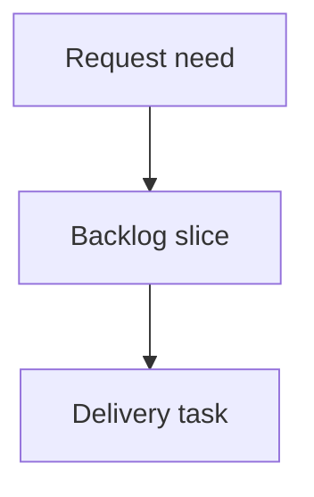

## req_140_connector_rear_backshell_helper_node_segment_sheath_metadata_and_mounting_labels - Connector Rear Backshell Helper Node, Segment Sheath Metadata, and Mounting Labels
> From version: 1.15.0
> Schema version: 1.0
> Status: Done
> Understanding: 96%
> Confidence: 92%
> Complexity: High
> Theme: Routing topology, segment metadata, and assembly differentiation
> Reminder: Update status/understanding/confidence and linked backlog/task references when you edit this doc.

# Needs
- Add an optional connector rear-backshell helper node driven by connector catalog data, with possible per-connector override.
- Ensure connectors using that option force incoming segment topology and wire routing to traverse the helper node before the connector node.
- Allow each segment to carry sheath-related business metadata and display it in a compact on-plan segment callout.
- Add mounting-label objects that are attached to a segment as physical plan objects used to differentiate connectors during assembly.

# Context
The current app already has several adjacent capabilities:
- connector catalog defaults and connector instance overrides,
- automatic linked connector/splice node creation during create flows,
- deterministic shortest-path wire routing on the graph,
- connector/splice callouts in the 2D network summary,
- persisted callout positions on connector and splice entities,
- segment labels limited to segment ID and segment length in the 2D plan.

However, the current model does not support:
- a second connector-adjacent helper node with explicit topology semantics,
- catalog-driven migration of existing connectors when a connector reference gains such behavior,
- segment-level sheath metadata,
- segment-specific compact callouts independent from connector/splice callouts,
- physical mounting-label objects attached to segments.

The user clarified the target behavior:
- the rear-backshell node must be created automatically,
- the option lives in the catalog with a possible per-connector override,
- existing connectors using the catalog item must be migrated,
- the helper node is freely movable after creation,
- direct segment attachment to the connector node must be forbidden and auto-corrected,
- sheath-related fields are free text where requested,
- route text in the segment callout must use technical IDs,
- mounting labels are not callouts; they are physical plan objects used in assembly/mounting workflows.

# Objective
- Add a connector rear-backshell topology feature that is explicit in the data model and enforced by validation and routing behavior.
- Extend segment modeling with sheath metadata suitable for manufacturing/assembly documentation.
- Add compact segment callouts that summarize route and sheath data directly on the 2D plan.
- Add physical mounting-label objects anchored to segments for connector differentiation during assembly.

# Functional scope
## A. Connector rear-backshell helper node contract (high priority)
- Extend connector catalog data so a connector catalog item can define an optional rear-backshell behavior.
- The catalog option must include:
  - an enable/disable flag,
  - a connector-to-helper nominal length in `mm`.
- Add possible per-connector override behavior so an instance can diverge from the catalog default.
- The override scope must support:
  - activation/deactivation relative to the catalog default,
  - a connector-specific backshell length override.

## B. Auto-created topology for new connectors (high priority)
- When a connector is created from a catalog item whose rear-backshell option is effectively enabled:
  - create the regular connector node,
  - create one additional helper node dedicated to rear-backshell dimensioning,
  - create one dedicated segment linking the helper node to the connector node,
  - set that dedicated segment length from the effective backshell length.
- This creation flow must be atomic from the operator perspective as far as the current architecture allows.
- The helper node must remain a first-class editable/movable object on the canvas.
- The helper node must not be represented as an undocumented generic intermediate-node convention only; the topology meaning must be explicit and maintainable.

## C. Migration of existing connectors when catalog behavior changes (high priority)
- When a catalog item gains or enables rear-backshell behavior, existing connectors linked to that catalog item must be migrated.
- Migration requirements:
  - create missing helper nodes and dedicated helper segments,
  - preserve existing connector nodes and existing connector identity,
  - detect and reconcile direct external segments that currently terminate on the connector node,
  - move those direct external segments to the helper node automatically where safe,
  - surface explicit feedback when an unsafe or ambiguous correction cannot be completed automatically.
- Backward compatibility is required for saved projects that predate the feature.

## D. Topology enforcement and auto-correction (high priority)
- For connectors with effective rear-backshell behavior enabled:
  - external segments must connect to the helper node, not directly to the connector node,
  - the only allowed direct segment touching the connector node is the dedicated backshell link segment.
- Validation must flag invalid topologies where direct external segment connections still touch the connector node.
- The system should auto-correct direct external segment attachment to the helper node whenever the correction is deterministic and safe.
- If auto-correction is not safe, the app must surface a clear blocking validation or migration issue instead of silently keeping an invalid topology.

## E. Wire routing semantics for backshell-enabled connectors (high priority)
- For wires whose endpoint maps to a backshell-enabled connector:
  - automatic shortest-path routing must traverse the helper node before the connector node,
  - existing locked routes must remain valid only if they also traverse the helper-node segment correctly,
  - route recomputation after migration or topology edits must preserve the connector-side helper traversal rule.
- The feature must not rely on visual convention only; the routing graph itself must make the traversal behavior explicit.

## F. Segment sheath metadata (high priority)
- Extend the segment entity/model so each segment can store sheath-related metadata.
- V1 fields:
  - `sheathType`: free text,
  - `insulation`: free text,
  - `lineStyle`: free text business attribute,
  - `internalPartReference`: free text.
- Quantity must not be an independently editable stored field in V1:
  - quantity displayed for the segment callout is derived from the effective segment length,
  - changing the segment length updates the displayed quantity automatically.
- The create/edit segment workflow must expose these fields.

## G. Segment mini callout (high priority)
- Add a compact segment-specific callout/annotation in the 2D plan.
- The segment callout must be able to display:
  - route text based on endpoint technical IDs, for example `CT5 -> N10`,
  - insulation,
  - line style,
  - internal part reference,
  - quantity equal to the segment length.
- The route text must use technical IDs, not display names.
- The segment callout is distinct from connector/splice cable callouts and should be designed for compact manufacturing information.
- The feature must integrate with current network-summary rendering.
- The segment mini callout must appear in network-summary exports, including the existing export surfaces driven from that rendering.

## H. Mounting-label objects attached to segments (high priority)
- Add mounting-label objects as explicit plan entities.
- A mounting label:
  - is not a callout,
  - is a physical object used to differentiate connectors during assembly/mounting,
  - is attached to a segment,
  - has editable text,
  - has configurable position along or relative to the segment.
- These labels are sparse objects at network level, not segment-default metadata.
- Typical expected usage is low volume, for example one or two per network.
- A segment may therefore have zero, one, or more attached mounting labels unless V1 is intentionally constrained later.
- Mounting labels must appear in the network summary and in exports derived from that view.

## I. Persistence, import/export, and migration boundaries (medium-high priority)
- New backshell, segment-sheath, and mounting-label data must survive:
  - local persistence,
  - network export/import,
  - schema migrations from older saved projects.
- Legacy projects without these fields must continue to load.
- Import normalization must avoid generating broken helper-node topology or dangling segment-label attachments.

## J. Editing and interaction behavior (medium priority)
- Rear-backshell helper nodes must be draggable like other nodes after creation.
- Segment sheath metadata must be editable from the existing segment create/edit workflow rather than requiring a separate screen in V1.
- Mounting labels must be positionable on the plan in a way that is stable and operator-controlled.
- If a target segment is deleted, attached mounting labels must either:
  - be deleted with explicit feedback,
  - or be blocked until the label dependency is resolved.
- The chosen delete behavior must be explicit and test-covered.

## K. Validation and regression coverage (high priority)
- Add regression coverage for:
  - catalog-driven backshell creation on new connectors,
  - migration of existing connectors when the catalog gains backshell behavior,
  - routing enforcement through the helper-node segment,
  - validation and/or auto-correction of direct external segments attached to the connector node,
  - segment sheath metadata persistence and edit flows,
  - segment mini callout rendering,
  - mounting-label persistence and rendering,
  - import/export and migration compatibility.

# Non-functional requirements
- Keep the rear-backshell topology explicit in the domain model rather than hidden in incidental naming or ad hoc intermediate-node conventions.
- Preserve deterministic routing and validation behavior.
- Avoid silent topology rewrites when a safe correction cannot be proven.
- Keep V1 segment sheath fields simple and free-text where requested, without prematurely introducing a full sheath catalog.
- Keep mounting labels lightweight because the expected usage volume is low.

# Validation and regression safety
- Run targeted coverage across store, persistence, routing, and network-summary rendering layers.
- Validate compatibility with existing connector auto-node behavior, catalog defaults, and wire route-lock behavior.
- Run repository validation after implementation:
  - `python3 -m logics_manager lint --require-status`
  - `python3 -m logics_manager audit --legacy-cutoff-version 1.1.0 --group-by-doc`
  - `npm run lint`
  - `npm run typecheck`
  - `npm run test:ci:segmentation:check`
  - `npm run test:ci:fast -- --coverage`
  - `npm run test:ci:ui`
  - `npm run test:e2e`
  - `npm run build:vite`

# Acceptance criteria
- AC1: A connector catalog item can enable rear-backshell helper-node behavior and define the connector-to-helper nominal length.
- AC2: A connector instance can override the effective rear-backshell behavior relative to the catalog default, including both enabled/disabled state and connector-specific backshell length.
- AC3: Creating a connector with effective rear-backshell behavior enabled automatically creates the connector node, the helper node, and the dedicated helper-to-connector segment.
- AC4: Existing connectors linked to a catalog item that gains rear-backshell behavior are migrated so the helper node and dedicated helper segment exist.
- AC5: For backshell-enabled connectors, direct external segment attachment to the connector node is forbidden; the system auto-corrects deterministic cases and surfaces explicit feedback for unresolved cases.
- AC6: Automatic and locked wire routes for backshell-enabled connectors traverse the helper node before the connector node.
- AC7: Each segment can store free-text sheath metadata including sheath type, insulation, line style, and internal part reference.
- AC8: A compact segment callout can display endpoint technical-ID route text, insulation, line style, internal part reference, and quantity derived from segment length.
- AC9: Mounting labels exist as explicit physical plan objects attached to segments, with editable text and configurable position.
- AC10: Segment mini callouts and mounting labels appear in the network summary and are included in exports derived from that rendering.
- AC11: New data survives persistence, import/export, and migration from legacy projects without breaking existing networks.

# Definition of Ready (DoR)
- [x] Problem statement is explicit and user impact is clear.
- [x] Scope boundaries are explicit.
- [x] Acceptance criteria are testable.
- [x] Dependencies and known risks are listed.
- [x] Final export behavior for segment mini callouts and mounting labels is confirmed.
- [x] Exact per-connector override scope for backshell length versus enabled/disabled state is confirmed.

# Clarifications
- The rear-backshell helper node is created automatically.
- The behavior is catalog-driven, with a possible per-connector override.
- The per-connector override covers both effective activation and connector-specific backshell length.
- Existing connectors using the catalog item must be migrated when the catalog gains the feature.
- The helper node is freely movable after creation.
- Direct external segments on the connector node are forbidden; deterministic auto-correction is expected.
- `sheathType`, `insulation`, and `lineStyle` are business/manufacturing fields, not purely visual styling controls.
- Segment route text in the mini callout uses technical IDs.
- Mounting labels are physical objects for assembly differentiation, not connector/splice callouts and not ordinary segment-name labels.
- Both segment mini callouts and mounting labels must appear in the network summary and in exports derived from it.

# Scope boundaries
- In scope: connector catalog defaults and connector-instance overrides for rear-backshell behavior.
- In scope: explicit helper-node topology, migration of existing linked connectors, validation, and routing enforcement.
- In scope: segment sheath metadata fields and compact segment callout rendering.
- In scope: mounting-label objects attached to segments with text, position, network-summary rendering, and export presence.
- In scope: persistence/import/export/schema migration for the new data.
- Out of scope: a full sheath catalog or material master for V1.
- Out of scope: redesigning the whole routing engine beyond what is required to enforce helper-node traversal.
- Out of scope: high-volume labeling workflows or bulk label authoring unless later required.
- Out of scope: treating mounting labels as ordinary callouts or as generic segment-name replacements.

# Risks and constraints
- Migrating existing connectors may require moving existing segments off the connector node, which can be unsafe in some edge cases if the graph is already irregular.
- Helper-node routing enforcement can invalidate previously locked routes and must therefore be explicit and visible.
- Introducing connector-specific topology semantics through only generic intermediate nodes would increase long-term ambiguity and maintenance cost.
- Segment callout density could reduce readability in dense plans if visibility/placement rules are not bounded.
- Mounted-label rendering may require separate export and hit-testing rules because these labels are physical objects rather than informational callouts.
- Export parity must be maintained so on-screen network-summary content and exported content remain aligned for both segment mini callouts and mounting labels.

# Companion docs
- Product brief(s): (none yet)
- Architecture decision(s): recommended if the helper-node topology requires a new explicit node/segment role or non-trivial migration contract

# References
- `src/core/entities.ts`
- `src/core/pathfinding.ts`
- `src/store/reducer/wireReducer.ts`
- `src/store/reducer/helpers/wireTransitions.ts`
- `src/store/reducer/nodeReducer.ts`
- `src/store/reducer/segmentReducer.ts`
- `src/app/hooks/useConnectorHandlers.ts`
- `src/app/components/workspace/ModelingConnectorFormPanel.tsx`
- `src/app/components/workspace/ModelingCatalogFormPanel.tsx`
- `src/app/components/workspace/ModelingSegmentFormPanel.tsx`
- `src/app/components/network-summary/graph/NetworkSummaryGraphLayers.tsx`
- `src/app/components/network-summary/callouts/calloutLayout.ts`
- `logics/request/req_031_network_summary_2d_connector_and_splice_cable_info_frames_with_draggable_callouts.md`
- `logics/request/req_034_creation_form_auto_technical_id_suggestions_and_connector_splice_auto_node_creation.md`
- `logics/request/req_101_network_summary_zoom_invariant_segments_and_callout_leader_lines.md`
- `logics/request/req_125_connector_catalog_terminal_seal_and_plug_defaults.md`

# AI Context
- Summary: Add a catalog-driven rear-backshell helper-node topology for connectors, enforce connector-side traversal in routing, extend segments with sheath metadata and compact segment callouts, and add sparse physical mounting-label objects attached to segments.
- Keywords: backshell, connector helper node, connector override, topology migration, forced traversal, segment sheath metadata, insulation, line style, internal part reference, mounting label, assembly differentiation
- Use when: Grooming or implementing connector-adjacent topology semantics, segment manufacturing metadata, and assembly-oriented plan objects.
- Skip when: The work only changes generic node placement, connector/splice cable callout cosmetics, or unrelated export formatting.

# Backlog
- none
- `item_625_connector_rear_backshell_helper_node_segment_sheath_metadata_and_mounting_labels`
