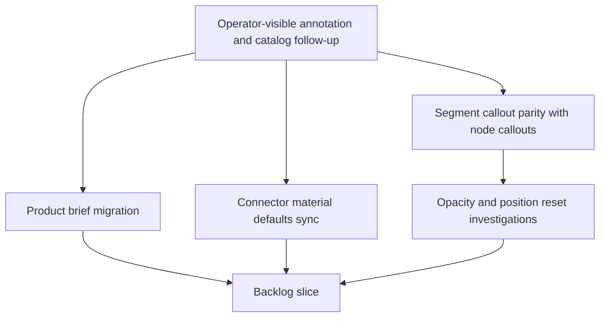

## req_141_segment_callout_layering_docs_product_brief_migration_and_connector_material_default_sync - Segment Callout Layering, Product Brief Migration, and Connector Material Default Sync
> From version: 1.15.2
> Schema version: 1.0
> Status: Done
> Understanding: 100%
> Confidence: 100%
> Complexity: High
> Theme: Network summary callouts, product docs, and catalog defaults
> Reminder: Update status/understanding/confidence and linked backlog/task references when you edit this doc.

# Needs
- Align segment callout visual hierarchy and leader-line behavior with node callouts so moved segment callouts remain visible, readable, and export-safe.
- Convert the existing product-facing content under `docs/` into managed Logics Product Briefs, then remove the legacy `docs/` folder.
- Fix the Connector material defaults catalog synchronization path so changing only the Rear backshell helper still updates the corresponding Edit catalog item defaults.
- Investigate whether faded segment callouts and segment callout position reset behavior are intentional; if either is a bug, include the fix in this delivery scope.

# Context
- `req_140` delivered rear-backshell helpers, segment sheath metadata, and compact segment callouts after `1.15.0`.
- Segment callouts now exist in the network summary, but their layering and leader-line behavior does not yet match the more mature node callout behavior.
- Operators report that segment callouts can render behind other plan elements, and that their dotted leader lines can disappear when crossing another callout or overlay.
- Segment callout dotted leader lines also appear visually different from node callout dotted leader lines, creating inconsistent plan annotation semantics.
- Product-facing docs currently live under `docs/` even though the Logics workflow now expects product framing to live in `logics/product`.
- Connector material defaults include a Rear backshell helper path. Updating only that helper inside the Connector material defaults panel does not appear to synchronize the matching Connector material defaults option in Edit catalog item.
- Segment callouts sometimes appear faded or semi-transparent, unlike node callouts.
- Segment callout positions sometimes reset after a user moves them, which may indicate a persistence, keying, or layout-reconciliation bug.

# Objective
- Make segment callouts behave as first-class plan annotations with the same visibility, leader-line styling, and layering expectations as node callouts.
- Move product-facing documentation into the managed Logics product corpus and eliminate the unmanaged `docs/` folder.
- Ensure connector material defaults synchronize consistently across the defaults panel and Edit catalog item surface.
- Decide whether observed faded segment callouts and position resets are intended; fix them when they are not intentional.

# Functional scope
## A. Segment callout layering and hierarchy
- Segment callouts must use the same Z-depth and hierarchy logic as node callouts.
- A moved segment callout must not render behind segments, nodes, other callouts, overlays, or annotation content in a way that hides or de-prioritizes it incorrectly.
- The implementation should reuse or align with the node callout layering model instead of introducing a separate segment-only ordering rule.
- On-screen rendering and exports derived from the network-summary rendering must preserve the same hierarchy.

## B. Segment callout dotted leader-line crossing behavior
- Segment callout dotted leader lines must remain visible when crossing another callout, object, overlay, segment, node, or annotation.
- Leader-line visibility must not depend on whether the line passes through another rendered element.
- The line should behave like node callout leader lines in stacking, clipping, pointer-event, and masking behavior unless a documented product reason requires otherwise.

## C. Segment and node dotted leader-line style parity
- Segment callout dotted leader lines must match node callout dotted leader line styling.
- The parity scope includes dash pattern, stroke color, opacity, stroke width, line caps/joins if relevant, and theme-specific variants.
- Any shared styling constants or rendering helpers should be reused when practical so future node and segment callout changes do not drift.

## D. Product Brief migration from `docs/`
- Each relevant document currently under `docs/` must be transformed into an individual managed Product Brief under `logics/product`.
- The migrated Product Briefs must preserve the product intent and user-facing capability framing from the original docs.
- Existing Logics references that point to `docs/...` must be updated to the new Product Brief refs or paths.
- After migration, the `docs/` folder must be removed from the repository.
- The migrated Product Briefs must satisfy Logics lint and audit expectations for product documents.

## E. Connector material defaults sync bug
- Updating only Rear backshell helper inside the Connector material defaults panel must synchronize the corresponding Connector material defaults option in Edit catalog item.
- The synchronization must work even when no other material default field changes in the same edit.
- The fix must cover both the stored catalog item state and visible Edit catalog item form state.
- Regression coverage should demonstrate that a Rear backshell helper-only change is not dropped.

## F. Segment callout faded or semi-transparent rendering investigation
- Investigate why segment callouts sometimes appear faded or semi-transparent while node callouts do not.
- Decide whether the faded state is intentional, for example tied to filtering, selection, inactive subnetwork emphasis, or export/readability behavior.
- If intentional, document the product reason and expected trigger.
- If not intentional, fix the rendering so segment callout opacity matches node callout expectations.

## G. Segment callout position reset investigation
- Investigate why a moved segment callout sometimes returns to its initial position.
- Decide whether reset behavior is intentional, for example tied to explicit reset actions, network changes, segment identity changes, or layout regeneration.
- If intentional, document the expected behavior and trigger.
- If not intentional, fix position persistence and reconciliation so user-moved segment callouts remain stable.

# Non-functional requirements
- Preserve local-first persistence and explicit user-controlled movement behavior.
- Keep network-summary rendering deterministic.
- Avoid special-case segment callout rendering that drifts from existing node callout primitives.
- Keep migrated product briefs user-facing; avoid commit-log narration.
- Keep the catalog sync fix narrowly scoped to defaults synchronization unless investigation reveals shared default-propagation defects.

# Validation and regression safety
- Add focused UI or rendering tests for segment callout Z-order and leader-line style parity where practical.
- Add a regression test for leader-line visibility when a segment callout leader crosses another rendered plan element.
- Add a catalog/defaults regression test for Rear backshell helper-only synchronization.
- Run Logics validation after product brief migration:
  - `logics-manager lint --require-status`
  - `logics-manager audit --legacy-cutoff-version 1.1.0 --group-by-doc --skip-ac-traceability`
- Run repository validation appropriate to changed surfaces:
  - `npm run -s lint`
  - `npm run -s typecheck`
  - focused Vitest/UI coverage for callouts and catalog defaults
  - `npm run -s test:ci:ui` if network-summary UI surfaces are touched broadly
  - `npm run -s ci:blocking` before closure or release.

# Acceptance criteria
- AC1: Segment callouts use the same Z-depth and hierarchy logic as node callouts, and no longer render behind other plan elements in a way that hides them incorrectly.
- AC2: Segment callout dotted leader lines remain visible when they cross other callouts, objects, overlays, segments, nodes, or annotations.
- AC3: Segment callout dotted leader lines match node callout dotted leader line styling across normal and theme-specific rendering.
- AC4: Every relevant file currently under `docs/` is migrated into an individual managed Product Brief under `logics/product`.
- AC5: References from workflow docs, backlog items, tasks, or requests that pointed to `docs/...` are updated to the migrated Product Brief refs or paths.
- AC6: The legacy `docs/` folder is removed after Product Brief migration.
- AC7: Changing only Rear backshell helper in Connector material defaults synchronizes the corresponding Connector material defaults option in Edit catalog item.
- AC8: The Rear backshell helper-only catalog sync path is covered by regression tests.
- AC9: The faded or semi-transparent segment callout behavior is investigated and classified as intentional or a bug.
- AC10: If faded segment callouts are a bug, their opacity behavior is fixed to match node callout expectations; if intentional, the expected trigger and product reason are documented.
- AC11: The segment callout position reset behavior is investigated and classified as intentional or a bug.
- AC12: If segment callout position reset is a bug, moved segment callout positions remain stable across rerenders, relevant state updates, persistence, and export workflows; if intentional, the expected trigger and product reason are documented.

# Definition of Ready (DoR)
- [x] Problem statement is explicit and user impact is clear.
- [x] Scope boundaries are explicit.
- [x] Acceptance criteria are testable.
- [x] Dependencies and known risks are listed.
- [x] Investigation outcomes are explicitly tied to fix-or-document acceptance criteria.

# Scope boundaries
- In scope: segment callout layering, leader-line crossing, leader-line style parity, opacity investigation, and position-reset investigation.
- In scope: migration of existing `docs/` content into managed Product Briefs and removal of the legacy folder.
- In scope: updating Logics references that point to migrated docs.
- In scope: Connector material defaults synchronization for Rear backshell helper-only edits.
- Out of scope: redesigning all network-summary annotation placement.
- Out of scope: changing node callout behavior except where shared helpers need to support segment parity without regression.
- Out of scope: creating new product narratives unrelated to the existing `docs/` content.
- Out of scope: broad catalog editor redesign beyond the sync defect.

# Dependencies and risks
- Depends on the segment callout model and rendering delivered by `req_140`.
- Depends on existing node callout layering and leader-line behavior as the parity reference.
- Product Brief migration may require updating older backlog/task references that still point to `docs/...`.
- Changing callout layering can affect export snapshots and dense-plan readability.
- Fixing position reset may require understanding how segment callout positions are keyed, persisted, and reconciled when segment endpoints or network summary layout changes.
- The Rear backshell helper sync bug may share code paths with other catalog material defaults; the implementation should verify no related defaults regress.

# Companion docs
- Product brief(s): `prod_007_segment_callout_parity_and_product_brief_migration`, `prod_008_fuse_box_functional_schematic`, `prod_009_network_import_conflict_resolution`, `prod_010_network_statistics_dashboard`, `prod_011_pin_level_current_dimensioning`
- Architecture decision(s): not added; the implementation aligned segment callouts with the existing node callout class/layering contract and did not introduce a new architecture-level rendering contract.

# References
- `logics/product/prod_007_segment_callout_parity_and_product_brief_migration.md`
- `logics/request/req_140_connector_rear_backshell_helper_node_segment_sheath_metadata_and_mounting_labels.md`
- `logics/backlog/item_625_connector_rear_backshell_helper_node_segment_sheath_metadata_and_mounting_labels.md`
- `logics/tasks/task_135_connector_rear_backshell_helper_node_segment_sheath_metadata_and_mounting_labels.md`
- `logics/request/req_101_network_summary_zoom_invariant_segments_and_callout_leader_lines.md`
- `src/app/components/network-summary/graph/NetworkSummaryGraphLayers.tsx`
- `src/app/components/network-summary/callouts/calloutLayout.ts`
- `src/app/components/workspace/ModelingCatalogFormPanel.tsx`
- `logics/product/prod_008_fuse_box_functional_schematic.md`
- `logics/product/prod_009_network_import_conflict_resolution.md`
- `logics/product/prod_010_network_statistics_dashboard.md`
- `logics/product/prod_011_pin_level_current_dimensioning.md`

# Delivery status
- Done.
- Segment callouts were moved into a dedicated top-level callout layer that renders after graph node layers, which aligns their Z-depth with node callouts and prevents segment group hierarchy from hiding them.
- Segment callout leader clipping against callout obstacles was removed, so dotted leaders remain visible when crossing other plan content.
- Segment callout dotted leaders and frames now share node callout styling classes while retaining segment-specific classes for targeting and export assertions.
- Faded segment callouts were classified as a bug caused by inherited entity-group deemphasis opacity; the dedicated callout layer fixes that behavior.
- Segment callout position reset was classified as a bug risk and covered with a drag/rerender regression for stable moved callout positions.
- Rear backshell helper-only Connector material defaults synchronization now works because `rearBackshell` participates in material defaults detection, and regression coverage verifies store and Edit catalog item state.
- Legacy product-facing docs were migrated into managed Product Briefs `prod_008` through `prod_011`, references were updated, and `docs/` was removed.

# Acceptance evidence
- AC1: Segment callouts render in `network-graph-layer-segment-callouts` after nodes.
- AC2: Segment callout leader obstacle clipping was removed.
- AC3: Segment leaders and frames use shared node callout classes including `network-callout-leader-line` and `network-callout-frame`.
- AC4: The four legacy docs were migrated into individual managed Product Briefs.
- AC5: Legacy `docs/...` references were updated to Product Brief refs or paths.
- AC6: The repository no longer has a `docs/` folder.
- AC7: Rear backshell helper-only defaults now keep Connector material defaults enabled in Edit catalog item.
- AC8: Rear backshell helper-only sync has focused UI regression coverage.
- AC9: Faded segment callouts were investigated and classified as a bug.
- AC10: The unintended opacity inheritance was fixed by moving segment callouts out of deemphasized entity groups.
- AC11: Segment callout position reset was investigated and treated as a persistence/reconciliation bug risk.
- AC12: Moved segment callout stability is covered across rerender via the network summary callout viewport regression.

# Validation evidence
- `npm run -s test -- src/tests/app.ui.network-summary-layering.spec.tsx src/tests/app.ui.network-summary-callouts-viewport.spec.tsx src/tests/network-summary-graph-model.spec.ts` passed.
- `npm run -s test -- src/tests/app.ui.catalog-rear-backshell-defaults.spec.tsx` passed.
- `npm run -s test -- src/tests/app.ui.navigation-canvas.spec.tsx -u` passed.
- `npm run -s test -- src/tests/app.ui.network-summary-svg-export.spec.tsx` passed.
- `npm run -s lint` passed.
- `npm run -s typecheck` passed.
- `logics-manager lint --require-status` passed.
- `logics-manager audit --legacy-cutoff-version 1.1.0 --group-by-doc --skip-ac-traceability` passed.
- `npm run -s ci:blocking` passed.

# AI Context
- Summary: Follow-up after segment callouts and rear-backshell defaults shipped: align segment callout layering and dotted leaders with node callouts, migrate legacy docs into Logics Product Briefs, and fix Rear backshell helper-only catalog material default synchronization.
- Keywords: segment callout, node callout parity, Z-depth, hierarchy, dotted leader line, leader crossing, opacity, callout position reset, product brief migration, docs removal, rear backshell helper, connector material defaults, catalog sync
- Use when: Planning or implementing network-summary segment callout visual parity, Logics product brief migration from `docs/`, or connector material defaults synchronization defects.
- Skip when: The work only changes unrelated node labels, unrelated catalog fields, or release packaging.

# Backlog
- none
- `item_627_segment_callout_layering_product_brief_migration_and_connector_material_default_sync`
