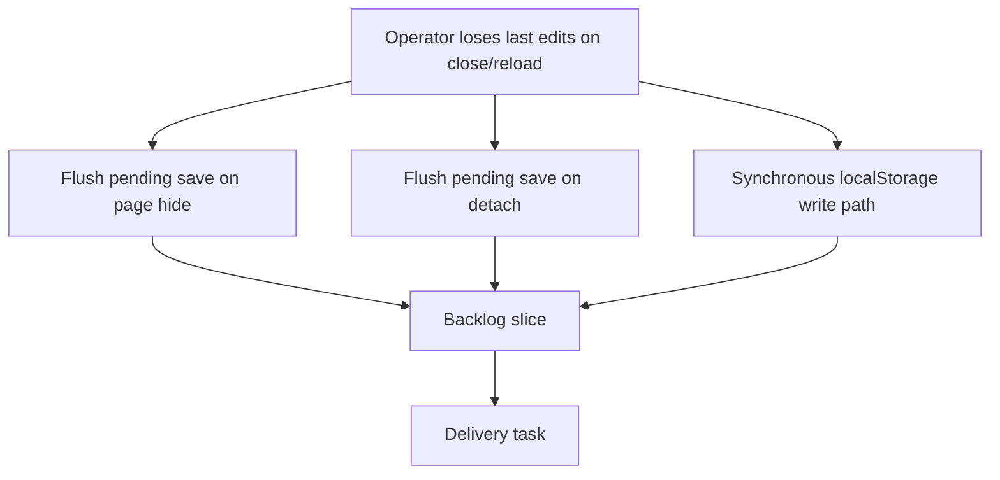

## req_142_debounced_persistence_durability_flush_on_unload - Debounced persistence loses unsaved edits on tab close or unmount

> From version: 1.15.3
> Schema version: 1.0
> Status: Done
> Understanding: 100%
> Confidence: 95%
> Complexity: Medium
> Theme: Local-first persistence durability
> Reminder: Update status/understanding/confidence and linked backlog/task references when you edit this doc.

# Needs
- Restore durable local-first persistence so edits made shortly before a tab close, reload, navigation, or app unmount are not silently lost after the `1.15.0` debounce change.
- Add an explicit flush path so any pending debounced save is written before the page is hidden or the persistence subscription is detached.
- Provide a synchronous save path that completes the localStorage write inside an unload handler, because the current `saveState` awaits storage estimation before writing.

# Context
- `1.15.0` made persistence sync debounced: `attachPersistenceSync` in `src/app/store.ts` now schedules a single trailing `saveState` 200 ms after the last dispatch (`DEFAULT_PERSISTENCE_DEBOUNCE_MS = 200`). Before `1.15.0`, every dispatch saved synchronously, so the latest state was always on disk when the tab closed.
- There is no flush on `pagehide`, `visibilitychange`, or `beforeunload` anywhere in `src/` (verified by search). Any edit made within ~200 ms of the user closing the tab, reloading, or navigating away is dropped: the trailing timer never fires.
- The detach handle returned by `attachPersistenceSync` (`src/app/store.ts:117-123`) clears the pending timer **without flushing it**, so a React unmount or an explicit unsubscribe also discards the most recent pending save.
- The actual write is not synchronous. `saveState` in `src/adapters/persistence/localStorage.ts:373-395` does `const warning = await estimateStoragePressure(serializedSnapshot)` (line 385) **before** `storage.setItem(...)` (line 388). `estimateStoragePressure` awaits `navigator.storage.estimate()`. So even if a flush were triggered from an unload handler, the `setItem` runs in a microtask after the page has begun tearing down and the write is lost. A correct fix needs a write path that performs `setItem` synchronously before any `await`.
- This is a local-first product app where, per `LOGICS.md`, "Local-first persistence is a product guarantee." The `1.15.0` changelog claims "Existing recovery, quota, and write-failure feedback paths are preserved," but write durability across page hide/unmount was not preserved. This is a regression introduced in the `1.15.0` -> `1.15.3` window.
- Operator impact: a user who edits a network and immediately closes or refreshes the tab can lose their last action(s) with no warning, contradicting the reversible, user-controlled persistence contract.

# Objective
- Guarantee that the most recent committed state is durably persisted when the page is hidden/unloaded or when the persistence subscription is detached, while keeping the `1.15.0` debounce performance benefit for normal in-session editing.

# Functional scope
## A. Flush pending save on page lifecycle transitions
- `attachPersistenceSync` must register a flush on the page being hidden/unloaded so a pending debounced save is written immediately.
- Prefer `visibilitychange` (state `hidden`) and `pagehide` over `beforeunload` for back/forward-cache compatibility; only use `beforeunload` if a hidden-state listener is insufficient.
- The flush must run the same save logic and clear the pending timer so the save is not duplicated when the timer would otherwise fire.

## B. Flush on detach/unmount
- The detach handle must flush any pending save before clearing the timer and unsubscribing, instead of silently discarding it.
- This must not change behavior when there is no pending save (e.g. `debounceMs: 0`, where saves are synchronous and no timer is queued), so existing save-count assertions still hold.

## C. Synchronous write path for unload
- Provide a save path that performs the localStorage `setItem` synchronously (before any awaited storage-pressure estimation), so flushes triggered from page-hide/unload handlers complete the write before teardown.
- The asynchronous quota/pressure feedback may still run, but it must not gate the durable write.
- Quota-exceeded and write-failed handling must remain correct; on a synchronous failure the existing error-feedback contract should still apply when feasible.

## D. Preserve existing in-session behavior
- Normal editing keeps the 200 ms trailing debounce so a burst of dispatches still collapses to a single write.
- Recovery, quota-warning, and write-failure feedback paths from `1.15.0` remain intact.

# Non-functional requirements
- Keep persistence deterministic and user-controlled; do not introduce silent background polling beyond what is needed to flush on lifecycle events.
- Avoid leaking event listeners: detach must remove any lifecycle listeners it added.
- Keep the change scoped to the persistence sync and save adapter; do not alter reducer or action timestamp behavior.

# Validation and regression safety
- Add a regression test that dispatches a mutating action and then simulates page hide/unload within the debounce window, asserting the latest state is written via the synchronous save path.
- Add a regression test that detach flushes a pending save, and a test that detach with `debounceMs: 0` performs no extra save.
- Add coverage that the synchronous write path calls `setItem` before awaiting storage estimation.
- Run repository validation appropriate to changed surfaces:
  - `npm run -s lint`
  - `npm run -s typecheck`
  - focused Vitest coverage for `src/tests/store.create-store.spec.ts`, `src/tests/app.ui.persistence-feedback.spec.tsx`, and the new durability test
  - `npm run -s test:ci:fast -- --coverage` since the store/persistence surface is shared
  - `npm run -s ci:blocking` before closure or release.
- Run Logics validation:
  - `logics-manager lint --require-status`
  - `logics-manager audit --legacy-cutoff-version 1.1.0 --group-by-doc --skip-ac-traceability`

# Acceptance criteria
- AC1: A pending debounced save is flushed to localStorage when the page is hidden/unloaded, so edits made within the debounce window before close/reload/navigation are persisted.
- AC2: The flush uses a synchronous write that completes `setItem` before any awaited storage-pressure estimation, so the write survives page teardown.
- AC3: The detach handle flushes any pending save before clearing the timer and unsubscribing.
- AC4: Detach with `debounceMs: 0` performs no additional save (no behavior change for synchronous mode), preserving existing save-count assertions.
- AC5: Normal in-session editing still coalesces bursts of dispatches into a single trailing debounced write.
- AC6: Recovery, quota-exceeded, storage-near-quota, and write-failure feedback paths remain functional.
- AC7: Any lifecycle event listeners added by `attachPersistenceSync` are removed on detach with no listener leak.
- AC8: Regression tests cover dispatch-then-unload persistence, detach flush, and synchronous-write ordering.

# Definition of Ready (DoR)
- [x] Problem statement is explicit and user impact is clear.
- [x] Scope boundaries (in/out) are explicit.
- [x] Acceptance criteria are testable.
- [x] Dependencies and known risks are listed.

# Scope boundaries
- In scope: flush-on-page-hide, flush-on-detach, a synchronous localStorage write path, and regression coverage for durability.
- In scope: minimal listener wiring inside `attachPersistenceSync` and a synchronous save variant in the persistence adapter.
- Out of scope: changing the 200 ms debounce default or the in-session debounce strategy.
- Out of scope: reducer/action `nowIso` timestamp behavior introduced in `1.15.0`.
- Out of scope: multi-tab storage synchronization or `storage` event handling.
- Out of scope: migrating persistence away from localStorage.

# Dependencies and risks
- Depends on the `1.15.0` debounced persistence implementation in `src/app/store.ts` and the `saveState` adapter in `src/adapters/persistence/localStorage.ts`.
- Risk: adding a flush-on-detach could change save call counts in tests that use the default debounce; the synchronous-mode no-op clause (AC4) and scoped flush-only-when-pending behavior mitigate this.
- Risk: `navigator.storage.estimate()` is async; the synchronous write path must not depend on its result for durability, only for the deferred quota warning.
- Risk: `beforeunload` can break bfcache; prefer `visibilitychange`/`pagehide`.
- Risk: test environments (jsdom) may not dispatch real lifecycle events; tests should invoke the flush path directly or simulate the events explicitly.

# Delivery status
- Done. The fix is implemented via `task_138` and validated locally; all acceptance criteria are met.
- Delivered: synchronous `saveStateSync` write path, `pagehide`/`visibilitychange` and detach flushes in `attachPersistenceSync`, listener cleanup, and regression coverage in `store.persistence-durability.spec.ts`.
- Release mechanics remaining (outside this request's scope): commit the working-tree change and ship it with a `1.15.4` (or next) changelog entry describing the restored persistence durability. Run Playwright E2E in CI before release (skipped locally due to the known Chromium host limitation).

# Acceptance evidence
- AC1: `pagehide` / `visibilitychange` (hidden) handlers flush a pending debounced save; covered by `store.persistence-durability.spec.ts`.
- AC2: `saveStateSync` calls `setItem` before any awaited storage estimation; covered by the synchronous-write-ordering test.
- AC3: detach flushes a pending save before clearing the timer and unsubscribing; covered by the detach-flush test.
- AC4: detach with `debounceMs: 0` performs no extra save; covered by the synchronous-mode no-op test.
- AC5: the 200 ms trailing debounce is unchanged; existing debounce/feedback specs still pass.
- AC6: quota/recovery/write-failure feedback preserved; `app.ui.persistence-feedback.spec.tsx` and the localStorage quota tests pass.
- AC7: lifecycle listeners removed on detach; covered by the listener-cleanup test.
- AC8: regression specs cover dispatch-then-unload, detach flush, and synchronous-write ordering.

# Companion docs
- Product brief(s): (none yet)
- Architecture decision(s): `adr_011_local_first_persistence_durability_lifecycle_flush_and_synchronous_write`

# References
- `src/app/store.ts`
- `src/adapters/persistence/localStorage.ts`
- `src/adapters/persistence/index.ts`
- `src/tests/store.create-store.spec.ts`
- `src/tests/app.ui.persistence-feedback.spec.tsx`
- `changelogs/CHANGELOGS_1_15_0.md`
- `LOGICS.md`

# AI Context
- Summary: The `1.15.0` debounced persistence change can silently drop the last edits when a tab closes, reloads, or unmounts within the 200 ms window, because there is no flush on page hide/detach and `saveState` awaits storage estimation before writing. Restore durability with a page-hide flush, a detach flush, and a synchronous write path.
- Keywords: persistence durability, debounce, attachPersistenceSync, flush, pagehide, visibilitychange, beforeunload, localStorage, saveState, synchronous write, data loss, local-first
- Use when: Planning or implementing the persistence durability fix for debounced saves, or reviewing localStorage write ordering and page-lifecycle handling.
- Skip when: The work only changes reducer timestamps, UI callouts, catalog defaults, or unrelated store slices.

# Backlog
- none
- `item_628_debounced_persistence_loses_unsaved_edits_on_tab_close_or_unmount`
