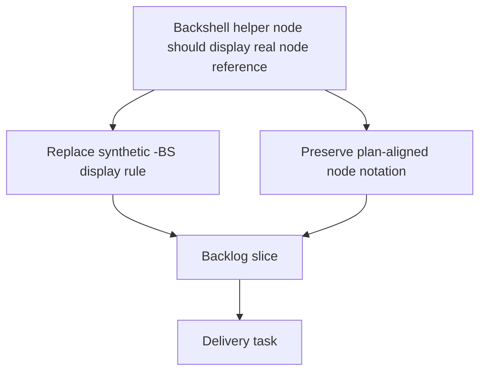

## req_143_network_summary_backshell_nodes_must_display_node_reference_not_connector_suffix - Network summary backshell nodes must display node reference instead of connector technical ID suffix

> From version: 1.15.3
> Schema version: 1.0
> Status: Done
> Understanding: 100%
> Confidence: 100%
> Complexity: Low
> Theme: Network summary node labeling fidelity
> Reminder: Update status/understanding/confidence and linked backlog/task references when you edit this doc.

# Needs
- Make `Network summary` display rear-backshell helper nodes using the node business reference (`label`, then `id` fallback) instead of reconstructing a synthetic `connector technicalId + "-BS"` string.
- Preserve AMIPI-aligned or user-curated node references such as `AR-N21`, `AV-N42`, or `LAT-N10.1` when a backshell helper node is used to model a real named routing point.
- Keep connector nodes and splice nodes on their current business-reference behavior while correcting only the backshell helper labeling contract.

# Context
- The app now supports rear-backshell helper nodes (`kind === "connectorBackshellHelper"`) for connector topology modeling.
- In imported or curated workspaces, operators may intentionally rename backshell helper nodes to real plan references such as AMIPI node IDs (`N11`, `N21`, `N42`, etc.) so the rendered network summary matches the supplier PDF or production drawing.
- The current network-summary graph model ignores the backshell helper node `label` and `id` for visible text. In `src/app/components/network-summary/graph/networkSummaryGraphModel.ts`, the node label is hard-coded as:
  - ```${connectorMap.get(node.connectorId)?.technicalId ?? node.connectorId}-BS``` for `connectorBackshellHelper`
- Because of that rule, a node that is actually stored as:
  - `id = "AR-N21"`
  - `label = "AR-N21"`
  still renders in the network summary as `AR-CT2G-BS` if its parent connector technical ID is `AR-CT2G`.
- This breaks drawing fidelity for workspaces that use real backshell node references and makes the network summary diverge from the intended plan notation even though the JSON state is already correct.
- The problem is presentation-only: the stored node objects, segment references, and topology remain valid. The issue is the visible string chosen by the network-summary renderer.



# Objective
- Ensure `Network summary` renders backshell helper nodes using the same business-facing reference hierarchy expected by operators: prefer explicit node reference data already present in the model over a synthetic connector-derived suffix.

# Functional scope
## A. Backshell helper visible label contract
- For `connectorBackshellHelper` nodes, the visible label in `Network summary` must prefer `node.label` when present and non-empty.
- If `node.label` is absent or empty, the renderer should fall back to a deterministic node reference, preferably `node.id`.
- The synthetic fallback `${connector technicalId}-BS` may remain only as a last-resort fallback when no explicit node-facing reference exists.

## B. Keep current connector/splice behavior unless needed for consistency
- Connector nodes may continue to display connector technical IDs.
- Splice nodes may continue to display splice technical IDs.
- This request does not require changing the connector-node or splice-node display contract unless a minimal shared helper refactor is needed.

## C. Accessibility and tooltip parity
- The same corrected display reference used for the visible node label should also be used for relevant SVG title text and accessibility labels in `Network summary`, so screen-reader and hover text do not drift from the visible node notation.

# Non-functional requirements
- Keep the change presentation-scoped; do not mutate persisted node data, connector data, or topology.
- Preserve deterministic rendering and avoid introducing ambiguous fallback order.
- Keep the implementation narrow to the network-summary node label resolution path unless a shared label helper is clearly preferable.

# Validation and regression safety
- Add focused regression coverage for network-summary node label resolution with a `connectorBackshellHelper` node that has an explicit `label`.
- Add coverage for fallback behavior when a backshell helper node has no `label` but does have an `id`.
- Verify connector and splice node rendering remains unchanged unless intentionally refactored.
- Run repository validation appropriate to changed surfaces:
  - `npm run -s lint`
  - `npm run -s typecheck`
  - focused Vitest coverage for network summary graph model and rendering
- Run Logics validation:
  - `logics-manager lint --require-status`
  - `logics-manager audit --legacy-cutoff-version 1.1.0 --group-by-doc --skip-ac-traceability`

# Acceptance criteria
- AC1: `Network summary` renders a backshell helper node with a non-empty `label` using that `label` as its visible node text.
- AC2: If a backshell helper node has no `label` but has an `id`, `Network summary` uses the node `id` rather than forcing `${connector technicalId}-BS`.
- AC3: The synthetic `${connector technicalId}-BS` text is used only as a final fallback when no explicit node-facing reference is available.
- AC4: Tooltip/title and accessibility text for backshell helper nodes follow the same display-reference rule as the visible node label.
- AC5: Connector-node and splice-node display behavior does not regress.

# Definition of Ready (DoR)
- [x] Problem statement is explicit and user impact is clear.
- [x] Scope boundaries are explicit.
- [x] Acceptance criteria are testable.
- [x] Current implementation location is identified.

# Scope boundaries
- In scope: network-summary visible label, tooltip/title text, and accessibility text for `connectorBackshellHelper` nodes.
- In scope: fallback-order clarification for backshell helper node references.
- Out of scope: changing persisted workspace JSON structure.
- Out of scope: changing connector technical IDs, splice technical IDs, or topology generation.
- Out of scope: redesigning all node label rules across the app.

# Dependencies and risks
- Depends on the current node label resolution in `src/app/components/network-summary/graph/networkSummaryGraphModel.ts`.
- Risk: if the renderer currently assumes backshell helper labels must always be derived from connector technical IDs, a small shared helper refactor may be needed to preserve consistency across title/accessibility text.
- Risk: some legacy workspaces may rely on the old synthetic `-BS` text as a fallback, so the fallback order must remain deterministic and documented.

# Companion docs
- Product brief(s): none
- Architecture decision(s): none

# References
- `src/app/components/network-summary/graph/networkSummaryGraphModel.ts`
- `src/app/components/network-summary/graph/NetworkSummaryGraphLayers.tsx`
- `src/core/rearBackshell.ts`
- `logics/request/req_140_connector_rear_backshell_helper_node_segment_sheath_metadata_and_mounting_labels.md`

# AI Context
- Summary: The network-summary renderer currently ignores explicit backshell helper node references and displays `${connector technicalId}-BS`. Operators need backshell helper nodes to display their real node references, such as AMIPI `Nxx` labels, when those references are present in the workspace.
- Keywords: network summary, backshell helper, connectorBackshellHelper, node label, AMIPI, N21, N42, title, accessibility, display reference
- Use when: Planning or implementing backshell helper node display fidelity in `Network summary`.
- Skip when: The work only changes connector technical IDs, topology generation, or unrelated node kinds.

# Backlog
- `logics/backlog/item_629_network_summary_backshell_nodes_must_display_node_reference_instead_of_connector_technical_id_suffix.md`

# Delivery
- `Network summary` now resolves backshell helper labels from explicit node-facing references before falling back to connector-derived synthetic text.
- `connectorBackshellHelper` now supports an optional persisted `label` so imported or curated workspaces can preserve real references such as `AR-N21`.
- Visible node text and descriptive text (`<title>` / `aria-label`) now follow the same backshell helper reference rule.

# Validation
- `npm run -s test -- src/tests/network-summary-graph-model.spec.ts src/tests/use-node-descriptions.spec.ts`
- `npm run -s typecheck`
- `item_629_network_summary_backshell_nodes_must_display_node_reference_instead_of_connector_technical_id_suffix`
