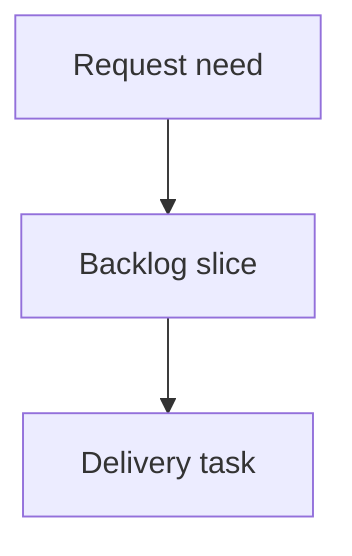

## req_144_floating_splice_placements_decoupled_from_network_topology - Floating splice placements decoupled from network topology
> From version: 1.15.6 (ADR companion linked on 2026-06-10)
> Schema version: 1.0
> Status: Ready
> Understanding: 97% (request refined with explicit ADR link and segment-offset architecture)
> Confidence: 91% (architecture companion records the routing, migration, rendering, and validation contract)
> Complexity: High
> Theme: Architecture
> Reminder: Update status/understanding/confidence and linked backlog/task references when you edit this doc.

# Needs
- Represent the physical reality of the harness: an electrical splice is a contact point for several cables, not a structural routing node that defines network topology.
- Decouple electrical splices from the structural routing topology so network structure remains defined by connectors, structural nodes, and segments.
- Make every connectable splice placement segment-based: a splice must be located on a segment at a measured offset in millimeters from one segment endpoint before any wire can connect to it.
- Automatically migrate existing workspaces that use `NetworkNode.kind === "splice"` into the new placement model at load time.
- Keep floating splices visible, selectable, and callout-capable in Network Summary with the same visual style as current splice nodes.

# Context
- Current data model couples splices to the routing graph: `Splice` is an electrical entity, `WireEndpoint.kind === "splicePort"` references splice ports, and `NetworkNode.kind === "splice"` gives the splice a routing node.
- Current route computation maps wire endpoints to graph nodes before finding shortest routes. Floating splices require a derived routing graph that can insert virtual splice points inside a segment without rewriting persisted segments.
- Current Network Summary renders splice visibility through rendered nodes. If splice nodes are removed without a replacement overlay, floating splices disappear from the visual network.
- The desired model treats the persisted structural topology as nodes, connectors, and segments. Splices become placed electrical components whose position is resolved from segment placement metadata.
- Existing workspaces and network export files may contain splice nodes. They must be migrated automatically on load, and newly exported files should use the new placement model only.
- Canvas geometry is not proportional to real physical length. Placement editing therefore starts in forms using `segmentId`, `fromNodeId`, and `offsetMm`; dragging on the canvas is out of scope for the first implementation.




# Acceptance criteria
- AC1: `Splice` supports a canonical segment placement model using `segmentId`, `fromNodeId`, and `offsetMm`; `0 mm` and `lengthMm` offsets are allowed and must be displayed explicitly.
- AC2: A central resolver can resolve splice placement from new placement metadata or migrated legacy splice nodes, and returns enough information for routing, validation, and rendering.
- AC3: Wire routing supports endpoints connected to floating splice ports by using a derived routing graph with virtual splice points and correct partial segment lengths.
- AC4: Route length calculation accounts for partial segment traversal when a wire starts or ends at a floating splice.
- AC5: `Wire.routeSegmentIds` remains the primary public route summary, with additional route detail only where a start or end endpoint lies part-way through a segment.
- AC6: Network Summary renders floating splices without requiring `NetworkNode.kind === "splice"`, including selection, focus/activation behavior, selected-state styling, and the same splice visual treatment as today.
- AC7: Splice callouts remain available for every placed splice and can anchor to resolved splice positions instead of requiring a node position.
- AC8: Legacy workspaces with splice nodes migrate automatically on load and continue to behave correctly after migration.
- AC9: Network import/export persists the new splice placement metadata and continues to accept older files that lack it; newly exported files should not emit legacy splice nodes.
- AC10: Validation and UI feedback prevent invalid connected splices: a splice must be placed before it can be connected to a wire, and unplaced splices are not visible or connectable.
- AC11: Host segment deletion is blocked while a splice is placed on that segment, with user-facing feedback that the splice must be moved or deleted first.
- AC12: Segment length edits preserve the splice `offsetMm` when possible, show user-facing warning feedback when the relative position changes, and clamp/report when the offset would become out of range.
- AC13: Segment placements cannot target `rearBackshellLink` segments.
- AC14: Directional splice L/R inference remains aligned with current behavior, including manual side locking, while adapting the physical side inference to the resolved floating placement.
- AC15: Multiple splices may share the same segment offset; no explicit ordering between same-segment splices is required.
- AC16: Degree-2 legacy splice nodes migrate by fusing adjacent segments and placing the splice on the fused segment while preserving segment IDs where possible.
- AC17: Degree-greater-than-2 legacy splice nodes migrate by replacing the splice node with a structural intermediate node and placing the splice on an adjacent segment at `0 mm` from that intermediate node where possible.
- AC18: Connector-to-floating-splice and connector-to-floating-splice-to-connector routes remain deterministic using the current segment-ID tie-break behavior.
- AC19: Analysis views and splice tables expose host segment, distance from node, and partial length information needed to understand routed wires.
- AC20: Local persisted workspaces and network export files are supported at equal priority.

# Definition of Ready (DoR)
- [x] Problem statement is explicit and user impact is clear.
- [x] Scope boundaries (in/out) are explicit.
- [x] Acceptance criteria are testable.
- [x] Dependencies and known risks are listed.

# Proposed model
- Introduce a canonical placement shape similar to:

```ts
type SplicePlacement = {
  kind: "segmentOffset";
  segmentId: SegmentId;
  fromNodeId: NodeId;
  offsetMm: number;
};
```

- Persist `segmentId + fromNodeId + offsetMm` so the distance remains stable even when the UI describes it as "X mm from connector C1".
- Do not make `nodeAnchor` a canonical saved placement. When legacy branch topology requires a structural junction, create or keep an intermediate node and place the splice on an adjacent segment at `0 mm` from that node.
- Do not allow connected unplaced splices. A splice without placement may exist only as a draft or invalid migration-recovery state; it is not visible in Network Summary and cannot be selected as a wire endpoint.
- Keep `NetworkNode.kind === "splice"` as a legacy-compatible import/load input only until migration rewrites it.
- Add a central helper such as `resolveSplicePlacement(state, spliceId)` that hides the distinction between canonical placements and legacy migration input from callers.

# Scope boundaries
- In scope: core entities, placement resolver, derived routing graph, wire length computation, validation, Network Summary rendering, callout anchoring, local persistence migration, network file import/export compatibility, and targeted tests.
- In scope: automatic legacy migration for existing splice-node workspaces at load time.
- In scope: form-based splice placement editing, including segment selection, reference node selection, and offset in millimeters.
- In scope: conversion actions from legacy/node-style splice behavior to floating placement and from floating placement back to a structural intermediate-node-backed representation when needed.
- Out of scope: drag-to-place or drag-to-move splice placement on the canvas.
- Out of scope: redesigning connector, segment, or node editing workflows beyond the minimum needed to place and inspect floating splices.
- Out of scope: changing the electrical semantics of splice ports, port occupancy, bounded/unbounded/directional splice modes, or pin-load propagation except where routing position is required.

# Implementation notes
- Build a derived routing graph that inserts virtual nodes for floating splices at their resolved placement points. Persisted `Segment` records should remain unchanged except during explicit legacy migration.
- Preserve `Wire.routeSegmentIds` as the public/display summary and add route detail for partial first/last segment traversal where a wire endpoint is a floating splice.
- Connector-to-splice length uses only the covered portion of the host segment. Connector-to-splice-to-connector display may still show complete segment IDs while length calculation uses endpoint portions.
- Keep branch topology explicit. A legacy splice node with more than two connected segments should become a structural intermediate node; the splice itself is then placed on one adjacent segment at `0 mm` from that intermediate node.
- Directional splice side inference currently depends on an adjacent splice node and route segments. Floating placements need equivalent inference from the route direction at the resolved splice point, while preserving manual L/R side locks.
- Network Summary should add a dedicated floating-splice overlay model, for example `renderedFloatingSplices`, rather than forcing floating splices into `renderedNodes`.
- Floating splice markers should visually match current splice nodes.
- Floating splice callouts should use resolved anchor positions and should not require a `nodeId`.
- Segment deletion should consult splice placements and block deletion when any splice is hosted on the segment.
- Segment length edits should preserve absolute `offsetMm`; if the relative position changes from one percentage to another, show feedback. If the edit makes the offset invalid, clamp and report the adjustment.
- Multiple splices at the same host segment offset are valid.

# Migration strategy
- Run migration on load for local storage and network file import.
- Degree-2 legacy splice node: merge the two adjacent structural segments into a single host segment when safe, then set the splice placement to `segmentOffset` using the previous adjacent length as the offset. Preserve existing segment IDs where possible.
- Degree greater than 2 legacy splice node: replace the splice node with a structural intermediate node, preserve all branch segments against that intermediate node, and place the splice on a deterministic adjacent segment at `0 mm` from the intermediate node.
- Missing or ambiguous legacy topology: keep the workspace loadable, prevent wire connections to unresolved splices, and emit validation diagnostics.
- Locked routes: convert automatically to the new route representation where possible; otherwise keep the route loadable and report a clear route-lock validation issue.
- Import/export: bump the relevant workspace and network file schema versions only when the canonical payload shape changes.

# Test expectations
- Floating splice placement resolver returns valid geometry for a splice on a segment.
- Resolver reports invalid state for missing segment, missing `fromNodeId`, out-of-range offset, `rearBackshellLink` host segment, and unresolved referenced splices.
- Wire routing works for connector to floating splice.
- Wire routing works for connector to floating splice to connector.
- Wire length includes partial segment distances for routes that start or end at a floating splice.
- `Wire.routeSegmentIds` remains available as the primary route summary while partial endpoint segment details are available for accurate length.
- Network Summary displays and selects a floating splice without a `NetworkNode.kind === "splice"` and with the same splice styling as the current node rendering.
- Floating splice callout anchors to resolved placement geometry.
- Legacy splice-node workspace fixtures still load.
- Degree-2 legacy splice node migration preserves route lengths.
- Degree-greater-than-2 legacy splice migration creates a structural intermediate node and does not silently collapse branches.
- Segment deletion is blocked while hosting a splice.
- Segment length edit preserves `offsetMm`, reports relative percentage change, and clamps/reports when the offset would exceed the new length.
- Form-based placement editing can set segment, reference node, and offset.
- Analysis/table views expose host segment, distance from node, and relevant partial length information.

# Companion docs
- Product brief(s): (none yet)
- Architecture decision(s): `logics/architecture/adr_012_floating_splice_placement_architecture.md`

# References
- `src/core/entities.ts`
- `src/core/graph.ts`
- `src/core/pathfinding.ts`
- `src/store/reducer/helpers/wireTransitions.ts`
- `src/app/lib/app-utils-networking.ts`
- `src/app/hook-impl/validation/buildValidationIssues.ts`
- `src/app/components/network-summary/graph/networkSummaryGraphModel.ts`
- `src/app/components/network-summary/graph/NetworkSummaryGraphLayers.tsx`
- `src/app/components/network-summary/callouts/calloutModel.ts`
- `src/adapters/persistence/migrations.ts`
- `src/adapters/portability/networkFile.ts`

# AI Context
- Summary: Decouple splices from structural network nodes by making placed splices segment-offset electrical contact points, adding derived routing support for virtual splice points, rendering them in Network Summary, and migrating legacy splice-node workspaces on load.
- Keywords: floating splice, splice placement, segment offset, virtual routing node, derived graph, Network Summary overlay, splice callout, persistence migration, network file compatibility, partial segment route
- Use when: Planning or implementing the transition from splice-as-node topology to splices as placed electrical components.
- Skip when: The work only changes splice catalog metadata, port occupancy semantics, or unrelated connector/node/segment UI behavior.

# Backlog
- none
