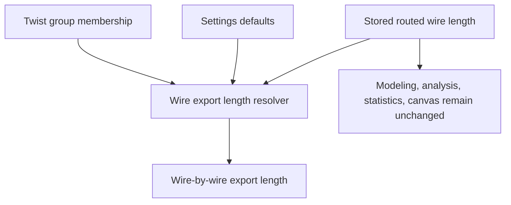

## req_145_wire_list_export_stripping_allowance_and_twisted_pair_length_coefficient - Wire list export stripping allowance and twisted-pair length coefficient
> From version: 1.16.0
> Schema version: 1.0
> Status: Ready
> Understanding: 95%
> Confidence: 92%
> Complexity: Medium
> Theme: Export / Settings / Wire length
> Reminder: Update status/understanding/confidence and linked backlog/task references when you edit this doc.

# Needs
- Operators need the wire-by-wire export to output the cut/preparation length, not only the routed length displayed inside the application.
- Add a configurable stripping/crimping allowance in Settings. The allowance is expressed in millimeters, defaults to `20 mm`, and is applied twice for every exported wire: once at each end.
- Add a twisted-pair length coefficient for wires belonging to a twisted group. The coefficient defaults to `1.075` and is multiplicative.
- Keep these export-only adjustments invisible in normal modeling, analysis, statistics, canvas, callouts, route computation, persistence, and validation surfaces.
- Show the adjusted final length only in the wire-by-wire export output.

# Context
- Current wire entities persist and display `wire.lengthMm`, which is the deterministic routed length derived from segments and route locks.
- The central grouped wire-list export uses `src/app/lib/wireListExport.ts`; `buildWireListSheet` currently writes `wire.lengthMm` directly into the `Length (mm)` column.
- The wire analysis panel also builds an inline wire export sheet in `src/app/components/workspace/AnalysisWireWorkspacePanels.tsx` and writes `wire.lengthMm` directly.
- Wire twist groups already exist via `wire.twistGroupLabel`; request `req_122_wire_twist_groups_and_left_right_splice_pin_mode` delivered this field and existing exports expose the label.
- UI preferences are persisted through `src/app/hooks/uiPreferencesStorage.ts` with explicit schema version migrations. Any new Settings values need a migration/default path and must keep older local preferences loadable.
- Settings already contains import/export actions and persisted export preferences in `src/app/components/workspace/SettingsWorkspaceContent.tsx`.
- The requested behavior is export presentation/calculation only. It must not mutate wire data or change the physical route length seen elsewhere in the app.

Expected export-length formula for V1:

```text
twistAdjustedLengthMm = baseRouteLengthMm * (isInTwistedGroup ? twistedPairLengthCoefficient : 1)
finalWireExportLengthMm = round(twistAdjustedLengthMm + (2 * strippingAllowanceMm))
```

- `baseRouteLengthMm` is the existing `wire.lengthMm`.
- `isInTwistedGroup` should be true when the exported network/sheet contains at least two wires with the same non-empty normalized `twistGroupLabel`.
- The coefficient applies to the routed portion of the wire; the stripping allowance is then added once per endpoint.
- Rounding should be deterministic and documented in the helper that computes export lengths.




# Acceptance criteria
- AC1: Settings exposes a numeric wire stripping/crimping allowance in millimeters, defaulting to `20`, with clear validation for finite non-negative values.
- AC2: Settings exposes or otherwise centrally configures the twisted-pair length coefficient, defaulting to `1.075`, with clear validation for finite positive values.
- AC3: Existing saved UI preferences migrate to the new defaults without rejecting older preference payloads or resetting unrelated preferences.
- AC4: Wire-by-wire exports compute final length from existing `wire.lengthMm` without mutating `wire.lengthMm`, route data, segments, or persisted network files.
- AC5: Every exported wire receives the stripping allowance twice, once for endpoint A and once for endpoint B.
- AC6: Wires in a twisted group receive the `1.075` coefficient by default when at least two exported wires share the same non-empty normalized `twistGroupLabel`.
- AC7: Wires with no twist group, an empty twist group, or a single unmatched twist-group label in the exported sheet do not receive the twisted-pair coefficient.
- AC8: The wire-by-wire export `Length (mm)` value is the final export/cut length, using deterministic rounding.
- AC9: Normal in-app length displays remain unchanged, including modeling wire tables, analysis wire tables, Network Summary labels/callouts, statistics, validation, and route preview surfaces.
- AC10: Grouped selected-network wire-list export and single-network/analysis wire export paths use the same export-length helper so CSV/XLSX behavior is consistent.
- AC11: Automated coverage verifies the default formula with a non-twisted wire, a twisted pair, and custom settings values.
- AC12: Automated coverage verifies that app-visible `wire.lengthMm` remains unchanged after export-length calculation.

# Definition of Ready (DoR)
- [x] Problem statement is explicit and user impact is clear.
- [x] Scope boundaries (in/out) are explicit.
- [x] Acceptance criteria are testable.
- [x] Dependencies and known risks are listed.

# Scope boundaries
- In scope: Settings defaults and persistence, wire export length helper, grouped wire-list export, analysis/single-network wire export, CSV/XLSX parity, and targeted tests.
- In scope: applying the stripping allowance to every exported wire endpoint regardless of connector/splice endpoint kind.
- In scope: deriving twisted-pair membership from existing `twistGroupLabel` values within each exported sheet/network.
- Out of scope: changing wire routing, segment lengths, physical canvas rendering, validation thresholds, BOM pricing/quantities, statistics, route optimization, or persisted `Wire.lengthMm`.
- Out of scope: adding per-wire stripping overrides or per-twist-group coefficients unless a later request asks for that.
- Out of scope: redefining twist-group modeling beyond the existing label-based model delivered by `req_122`.

# Implementation notes
- Prefer a small pure helper near `wireListExport.ts`, for example `resolveWireExportLengthMm(wire, twistGroupCounts, preferences)`, so export paths do not duplicate formula logic.
- If `tabularExportFormat` can produce both CSV and XLSX for the same sheet, compute the adjusted value before sheet construction rather than inside the download function.
- Consider naming the setting copy as `Wire stripping allowance (mm)` and `Twisted-pair length coefficient`; French UI translation may be needed if app-wide i18n labels are touched.
- Keep the existing export column stable unless a backlog decision explicitly renames it. The current expectation is that `Length (mm)` contains the final wire-by-wire export length.
- Validation should reject `NaN`, infinities, negative allowance values, and non-positive coefficients before persisting preferences; default back to `20` and `1.075` for legacy or invalid stored payloads.
- Rounding must be explicit. Recommended V1 behavior is nearest integer millimeter via `Math.round`.

# Test expectations
- Unit test: `1000 mm` untwisted wire with default settings exports as `1040 mm`.
- Unit test: two wires in the same twist group with `1000 mm` base length and default settings export as `1115 mm` each (`round(1000 * 1.075 + 40)`).
- Unit test: a single wire with a unique twist label exports without coefficient but still receives the two stripping allowances.
- Unit test: custom settings, for example `25 mm` allowance and `1.08` coefficient, change only export length values.
- Regression test: visible analysis/modeling length remains the stored `wire.lengthMm`.
- Regression test: grouped selected-network export and analysis export use identical adjusted length calculation for the same wire data.

# Risks and decisions
- Twist groups are labels, not a typed pair entity. V1 should treat matching non-empty labels within the exported sheet as the pair/group signal.
- If a twist label is accidentally left on a single wire, applying no coefficient avoids surprising one-off length inflation.
- If future work introduces true pair entities or twist pitch metadata, this export helper should become the compatibility boundary.
- Export consumers may already expect the `Length (mm)` column to be routed length. This request intentionally changes that export value to the operator cut/preparation length while preserving all in-app displayed lengths.

# Companion docs
- Product brief(s): (none yet)
- Architecture decision(s): (none yet)

# References
- `logics/request/req_122_wire_twist_groups_and_left_right_splice_pin_mode.md`
- `src/core/entities.ts`
- `src/app/lib/wireListExport.ts`
- `src/app/components/workspace/AnalysisWireWorkspacePanels.tsx`
- `src/app/components/workspace/SettingsWorkspaceContent.tsx`
- `src/app/hooks/uiPreferencesStorage.ts`
- `src/app/types/app-controller.ts`

# AI Context
- Summary: Add export-only wire cut length calculation using a configurable per-end stripping allowance and a twisted-pair length coefficient derived from existing twist group labels.
- Keywords: wire list export, fil a fil, stripping allowance, crimping allowance, cut length, twisted pair, twistGroupLabel, export length, Settings, UI preferences
- Use when: Implementing or reviewing wire-by-wire CSV/XLSX exports, Settings export preferences, or length semantics for twisted wires.
- Skip when: Work changes route computation, segment length modeling, canvas labels, statistics, validation, or BOM quantity/pricing behavior.

# Backlog
- `item_631_wire_list_export_stripping_allowance_and_twisted_pair_length_coefficient`
