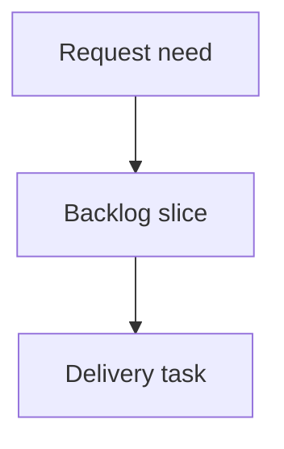

## req_146_floating_splice_export_connection_reference_uniformity - Export uniformity for floating splice connection references

> From version: 1.16.0
> Schema version: 1.0
> Status: Done
> Understanding: 95%
> Confidence: 90%
> Complexity: Medium
> Theme: Export
> Reminder: Update status/understanding/confidence and linked backlog/task references when you edit this doc.

# Needs
- The wire list export (CSV / XLSX and the in-app wire export preview) prints a hardcoded `"Preden 13mm"` connection reference for every wire end that lands on a splice port, regardless of the splice's real catalog material, and it silently discards any operator-set endpoint connection reference/name on a splice end.
- This breaks export uniformity for the floating-splice deliverable: the BOM (`By connector` / `Wire terminations`) reports each splice's true `manufacturerReference` from its catalog item, while the wire list reports the same magic string for all splices. The two sheets of the same export cannot be reconciled, and the value shown does not match the modeled splice.
- The non-blocking warning channel introduced for floating-splice placement feedback (`withWarning`) does not clear a pre-existing blocking `lastError`, so a stale error and a new warning can surface simultaneously, against the intended "distinct channels" contract (task_139 AC30).

# Context
- Surfaced during the 1.16.0 export/floating-splice audit, cross-checked against a real workspace saved after floating-splice conversion (`electrical-workspace-2026-06-14_21-09-19.epe.json`, 9 networks, 40 placed splices, 340 wires). In that file every splice carries a real `placement` and most carry a `manufacturerReference` (e.g. `Manchon épissure`) and a `catalogItemId`, none of which reaches the wire list connection column.
- Confirmed locations:
  - `src/app/lib/wireListExport.ts:59-61` — `resolveEndpointConnectionMaterial` returns `{ reference: "Preden 13mm" }` for any `splicePort` endpoint, short-circuiting before the manual-reference check at line 63 and before any catalog lookup.
  - `src/app/lib/wireListExport.ts:118-138` — `resolveWireExportEndpointMaterials` has no access to the splice map, so the wire list (`buildWireListSheet`) and both UI callers (`ModelingSecondaryTables.tsx:984-995`, `AnalysisWireWorkspacePanels.tsx`) cannot resolve splice material.
  - `src/store/reducer/shared.ts:74-82` — `withWarning` sets `lastWarning` but leaves `lastError` untouched.
- The BOM already resolves splice material from the catalog item (`src/app/lib/networkSummaryBomCsv.ts:395-407`, keyed on `splice.catalogItemId` -> `catalogItem.manufacturerReference`). Aligning the wire list to the same source restores cross-sheet uniformity without changing the BOM.
- Local-first persistence and the floating-splice placement model are unchanged by this request; this is presentation/serialization of export material only.

# Out of scope / deferred follow-ups (audit findings recorded, not delivered here)
- `portCount` serialization parity between the network-export serializer (strips `portCount` for `unbounded` splices) and the workspace save serializer (writes it verbatim). Benign at runtime (both load paths re-derive via `normalizeUnboundedPortCountFallback`); deferred.
- Unresolved-placement floating splices are dropped from DOM-cloned plan exports (SVG/PNG/PDF) with no marker. In practice placement guards (host-segment delete blocking, offset clamping) prevent a placed splice from becoming unresolvable, and AC10 requires unplaced splices to stay invisible; deferred pending product decision on an "unresolved placement" diagnostic.
- Segment re-point that orphans a hosted splice `fromNodeId` is currently caught by the wire-recompute error path (blocking), not the warning channel; no silent data loss. Deferred.

# Acceptance criteria
- AC1: For a wire end connected to a splice port, the wire list connection reference column resolves, in priority order: (1) the operator-set endpoint connection reference/name, then (2) the splice catalog item's `manufacturerReference` (and name) via `splice.catalogItemId`, then (3) `splice.manufacturerReference`, and is empty when none exist. The hardcoded `"Preden 13mm"` literal is removed.
- AC2: The resolved splice connection reference is identical across the wire list CSV, the XLSX export, and the in-app wire export preview tables (single shared resolver), and matches the splice material reported by the BOM for the same splice.
- AC3: Splice seal reference behavior is unchanged (splice ends have no seal material), and connector endpoint connection/seal resolution is unchanged.
- AC4: `withWarning` surfaces a warning while clearing any pre-existing blocking `lastError`, so the warning and error channels are mutually exclusive by construction (task_139 AC30), without clearing a freshly-set warning.
- AC5: Targeted unit/UI tests cover splice-end connection resolution (manual ref, catalog ref, bare `manufacturerReference`, none) and the warning/error channel exclusivity; existing export, persistence, and reducer tests stay green.

# Definition of Ready (DoR)
- [x] Problem statement is explicit and user impact is clear.
- [x] Scope boundaries (in/out) are explicit.
- [x] Acceptance criteria are testable.
- [x] Dependencies and known risks are listed.

# Companion docs
- Product brief(s): (none yet)
- Architecture decision(s): (none yet)

# References
- `src/app/lib/wireListExport.ts`
- `src/app/lib/networkSummaryBomCsv.ts`
- `src/store/reducer/shared.ts`
- `src/app/components/workspace/ModelingSecondaryTables.tsx`
- `src/app/components/workspace/AnalysisWireWorkspacePanels.tsx`

# AI Context
- Summary: Restore wire-list/BOM export uniformity for floating splice connection references and make the non-blocking warning channel mutually exclusive with blocking errors.
- Keywords: floating splice, export uniformity, wire list, connection reference, manufacturerReference, BOM, warning channel, Preden 13mm
- Use when: Implementing or reviewing the export connection-reference uniformity fix for floating splices.
- Skip when: The work concerns splice placement geometry, routing math, or migration rather than export presentation.

# Backlog
- `item_632_export_uniformity_for_floating_splice_connection_references`
