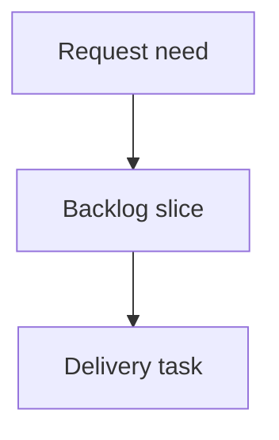

## req_147_floating_splice_placement_and_wire_export_names - Tune floating splice visual placement and wire export naming
> From version: 1.16.2
> Schema version: 1.0
> Status: Done
> Understanding: 95%
> Confidence: 90%
> Complexity: Medium
> Theme: Operator workflow
> Reminder: Update status/understanding/confidence and linked backlog/task references when you edit this doc.

# Needs
- Floating splice markers in Network Summary are currently too strongly correlated with the exact percentage distance between the splice offset and the two segment endpoints. When a splice is close to an endpoint, the visual marker can drift too close to the node, making the diagram harder to read and causing segment length labels to sit under node/splice icons.
- The visual placement should remain generally near the center of the segment, with only a slight bias toward the side/end from which the splice is physically closer. The persisted physical offset and route length semantics must not change; this is a rendering/layout adjustment only.
- Wire-to-wire export filenames should include the selected network name so exported files are identifiable outside the app.
- Grouped exports that include multiple selected harnesses/networks should include each selected harness/network name in generated filenames for all relevant output formats (PDF, XLSX, CSV, and equivalent export artifacts).
- Grouped BOM export should include the wire list in the grouped output, so the operator receives a complete grouped package without running a separate wire-list export.
- In Network Summary, clicking a splice should open the splice edit flow directly, matching the existing connector click/edit behavior.

# Context
- Floating splice placement was introduced as a segment-offset physical model. The visual rendering layer still needs a readability guard so the marker can communicate orientation without visually colliding with endpoint nodes or hiding length callouts.
- Operators use exported filenames outside the application context. A generic export filename is ambiguous once several networks/harnesses are exported in sequence or bundled together.
- The BOM and wire-list outputs are operationally linked during harness review; grouped BOM export should carry the wire list alongside the BOM content.
- Network Summary already opens connector editing from connector interaction. Splices should use the same direct edit affordance to avoid requiring a secondary navigation step.

# Scope boundaries
- In scope: Network Summary floating-splice render positioning, anti-overlap/readability constraints for splice icons and length labels, direct splice edit activation from Network Summary, export filename generation for wire-to-wire and grouped exports, and grouped BOM export composition.
- In scope: deterministic filename sanitization/truncation rules if multiple selected names produce long filenames.
- In scope: targeted unit/UI tests for placement mapping, export filenames, grouped BOM content, and splice edit activation.
- Out of scope: changing persisted splice `offsetMm`, segment length calculation, routing semantics, BOM row semantics outside adding the grouped wire-list companion, and redesigning the broader export UI.
- Out of scope: drag-to-place or drag-to-move splice placement.

# Acceptance criteria
- AC1: Floating splice marker rendering in Network Summary uses a bounded visual interpolation: the marker stays generally near the segment center while showing only a slight directional bias toward the endpoint from which the physical splice offset is closer.
- AC2: The rendering guard prevents splice icons from being placed too close to endpoint node icons under normal segment lengths, and preserves readability of segment length labels. Length labels must not disappear under connector/node/splice icons as a result of the splice visual placement.
- AC3: The visual bias is render-only. Persisted placement (`segmentId`, `fromNodeId`, `offsetMm`), routing, wire lengths, validation, export data, and edit form values continue to use the real physical offset.
- AC4: Edge cases remain deterministic and readable: very short segments, zero-offset splices, end-offset splices, multiple splices on the same segment, and existing anti-superposition offsets must not produce hidden or stacked unreadable markers.
- AC5: Wire-to-wire export filenames include the selected network name using the same user-visible network label shown in the app, with filename-safe sanitization.
- AC6: Grouped exports for multiple selected harnesses/networks include every selected harness/network name in the generated filename for PDF, XLSX, CSV, and any equivalent grouped export artifacts. The order is deterministic and follows the selected/exported order or a documented stable fallback.
- AC7: Grouped BOM export includes the wire list in the grouped export output, without requiring the operator to run a separate wire-list export. Existing single-network BOM export behavior is unchanged except where explicitly extended by filename naming.
- AC8: In Network Summary, clicking a splice opens the splice edit workflow directly, matching the connector edit behavior for focus, selection, and edit panel/modal activation.
- AC9: Targeted tests cover the bounded visual placement behavior, filename generation for single and grouped exports, grouped BOM inclusion of wire list content, and direct splice edit activation from Network Summary.

# Definition of Ready (DoR)
- [x] Problem statement is explicit and user impact is clear.
- [x] Scope boundaries (in/out) are explicit.
- [x] Acceptance criteria are testable.
- [x] Dependencies and known risks are listed.

# Dependencies and risks
- The splice visual-placement change must coordinate with the existing floating-splice anti-superposition logic from `req_144` so the new center-biased mapping does not undo collision avoidance.
- Export filename composition must handle long network/harness names, duplicate names, unsupported filesystem characters, and grouped selections with many names.
- Grouped BOM export composition must avoid duplicating wire-list rows or mixing names across selected networks/harnesses.
- Direct splice edit activation should reuse the connector interaction pattern where possible, so selection/focus behavior remains consistent.

# Companion docs
- Product brief(s): (none yet)
- Architecture decision(s): (none yet)

# References
- `logics/request/req_144_floating_splice_placements_decoupled_from_network_topology.md`
- `logics/request/req_145_wire_list_export_stripping_allowance_and_twisted_pair_length_coefficient.md`
- `logics/request/req_146_floating_splice_export_connection_reference_uniformity.md`
- `src/app/lib/`
- `src/app/components/`
- `src/store/`

# AI Context
- Summary: Improve Network Summary readability for floating splice markers, make wire/grouped export filenames include selected network or harness names, include wire list in grouped BOM export, and open splice edit directly from Network Summary.
- Keywords: floating splice, Network Summary, visual placement, center bias, export filename, wire-to-wire export, grouped export, grouped BOM, wire list, splice edit
- Use when: Implementing or reviewing floating-splice visual readability or export naming/grouped BOM workflow changes.
- Skip when: The work concerns the persisted splice placement model, routing graph semantics, or import/export schema migration.

# Backlog
- none
- `item_633_tune_floating_splice_visual_placement_and_wire_export_naming`
