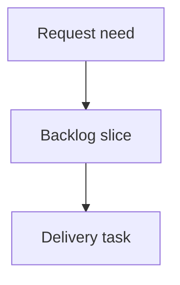

## req_148_directional_splice_side_resolution_must_support_vertical_and_near_vertical_carrier_segments - Directional splice side resolution must support vertical and near-vertical carrier segments
> From version: 1.16.6
> Schema version: 1.0
> Status: Done
> Understanding: 90%
> Confidence: 85%
> Complexity: Medium
> Theme: Operator workflow
> Reminder: Update status/understanding/confidence and linked backlog/task references when you edit this doc.

# Needs
- For directional splices placed on a vertical (or near-vertical) carrier segment, all wires are assigned to the same port/side, so the Network Summary splice callout draws every wire on one side even when the wires physically branch in two opposite directions along the segment.
- The splice side resolution must derive each wire's side from the wire's actual exit direction along the carrier segment axis, not from a hardcoded horizontal (x-only) comparison. Wires leaving toward one end of the carrier segment must land on one port/side; wires leaving toward the other end must land on the other.
- The fix must be geometric and automatic so it corrects existing affected splices on load/recompute and prevents the defect for any future splice on a vertical, horizontal, or diagonal carrier segment, without requiring the operator to manually lock each wire's side.
- The splice callout/port grouping and the Network Summary route highlighting must agree on direction for the same wire, removing the current inconsistency where the route shows two directions but the splice symbol shows one.

# Context
- Reported by the operator on the main harness for splices `PRI-S-06`, `PRI-S-07`, and `PRI-S-16`: every wire renders on a single side of the splice, yet selecting individual wires in the Network Summary clearly shows two different physical directions.
- Diagnosis from the affected workspace (`electrical-workspace-2026-06-22`): these three are the only directional splices whose carrier segment is perfectly vertical (`PRI-AI-SEG-09` at x=620 and `PRI-SEG-22` at x=1520). Every other directional splice sits on a horizontal or diagonal segment and is correctly split across ports 1 and 2.
- Root cause: `resolveDirectionalSpliceEndpointSide` in `src/store/reducer/helpers/directionalSpliceSide.ts` infers Left/Right only from the x coordinate of the exit node versus the splice (`exitPosition.x < splicePosition.x ? "L" : "R"`, lines ~250 and ~278). On a vertical carrier segment both branch directions share the splice's x, so the per-wire comparison is skipped and the code falls back to a per-splice connector count (`countConnectorNodesAroundPosition` -> `counts.right <= counts.left ? "R" : "L"`), which returns one constant side for every wire regardless of its real direction.
- The resolved side is then frozen into the wire data through `normalizeDirectionalSpliceEndpoint` (`src/core/directionalSplice.ts`), which sets `portIndex = side === "L" ? 1 : 2` and `spliceSideOverride`. This is why all affected wires share one `portIndex` (S-06/S-07 all port 1/L, S-16 all port 2/R).
- The Network Summary splice callout groups wires strictly by stored `portIndex` (`src/app/components/network-summary/callouts/calloutModel.ts`), so it faithfully renders the wrong, collapsed data. The route highlight uses each wire's real `routeSegmentIds`, which is why it correctly shows two directions. The two views diverge because they read different sources.

# Scope boundaries
- In scope: making directional splice side resolution axis-aware in `resolveDirectionalSpliceEndpointSide` so Left/Right is derived from the exit node's position projected onto the carrier segment axis (or the perpendicular split), covering vertical, near-vertical, horizontal, and diagonal carrier segments.
- In scope: ensuring both the `placed` (segment-offset / floating) branch and the `legacyNode` branch of the resolver use the axis-aware logic, and that `sideInverted` is still honored.
- In scope: re-deriving and correcting the stored `portIndex` / `spliceSideOverride` for affected wires through the existing normalization path on recompute/reroute, without requiring manual per-wire side locking.
- In scope: respecting an explicit operator choice when `spliceSideLocked === true` (locked sides must not be overwritten by the geometric resolver).
- In scope: targeted unit tests covering vertical, near-vertical, horizontal, and diagonal carrier segments, two-direction branching, and the `sideInverted` and `spliceSideLocked` cases, plus a regression fixture reproducing `PRI-S-06`/`PRI-S-07`/`PRI-S-16`.
- Out of scope: changing persisted splice placement (`segmentId`, `fromNodeId`, `offsetMm`), routing/shortest-path semantics, wire length calculation, or the splice port-mode model.
- Out of scope: redesigning the splice callout layout or adding drag-to-assign side interactions.
- Out of scope: changing how non-directional (bounded/unbounded) splices assign ports.

# Acceptance criteria
- AC1: For a directional splice on a vertical carrier segment, a wire whose route exits toward one segment endpoint resolves to one side, and a wire exiting toward the opposite endpoint resolves to the other side; the splice callout then shows wires on both ports matching their real physical directions.
- AC2: The resolution is axis-aware: side is determined by the exit node's position relative to the splice along the carrier segment direction (handling vertical and near-vertical segments), not by an x-only comparison. Horizontal and diagonal carrier segments keep their current correct behavior.
- AC3: Loading the reported workspace and recomputing yields `PRI-S-06`, `PRI-S-07`, and `PRI-S-16` with wires split across both ports according to their routes (up/toward-trunk vs down/toward-connector), and the Network Summary splice callout matches the per-wire route direction highlight.
- AC4: When `spliceSideLocked === true` with a defined `spliceSideOverride`, the operator's locked side is preserved and never overwritten by the geometric resolver.
- AC5: `sideInverted === true` still mirrors the resolved side as it does today, for all carrier-segment orientations.
- AC6: Edge cases remain deterministic: zero-length or degenerate carrier vectors, wires whose only route segment is the carrier segment (terminating directly at a segment endpoint connector), splices with all wires genuinely on one side, and multiple splices on the same segment.
- AC7: Targeted tests cover vertical, near-vertical, horizontal, and diagonal carrier segments, the two-direction split, `sideInverted`, `spliceSideLocked`, and a regression fixture reproducing the `PRI-S-06`/`PRI-S-07`/`PRI-S-16` defect; tests fail on the current x-only logic and pass after the fix.

# Definition of Ready (DoR)
- [x] Problem statement is explicit and user impact is clear.
- [x] Scope boundaries (in/out) are explicit.
- [x] Acceptance criteria are testable.
- [x] Dependencies and known risks are listed.

# Dependencies and risks
- The change touches `resolveDirectionalSpliceEndpointSide`, used by `wireTransitions.ts`, `wireReducer.ts`, and `spliceDirectionalConversion.ts`; the new geometry must not regress the currently correct horizontal/diagonal splices (`PRI-S-01`..`PRI-S-19`, `S-001`..`S-003`).
- Re-deriving sides on load will mutate stored `portIndex` / `spliceSideOverride` for affected wires; this should be treated as a corrective recompute and must interoperate with persistence/migration and undo/redo without spurious change noise.
- Projecting onto the carrier segment axis requires a robust definition of the segment direction for floating (segment-offset) placements and a safe fallback when positions are missing or coincide (degenerate vector), to avoid oscillating side assignments.
- The callout reads `portIndex` directly; the fix must keep `portIndex` and `spliceSideOverride` mutually consistent through `normalizeDirectionalSpliceEndpoint` so the callout and the route highlight stay in agreement.

# Companion docs
- Product brief(s): (none yet)
- Architecture decision(s): (none yet)

# References
- `src/store/reducer/helpers/directionalSpliceSide.ts`
- `src/store/reducer/helpers/wireTransitions.ts`
- `src/store/reducer/wireReducer.ts`
- `src/store/reducer/helpers/spliceDirectionalConversion.ts`
- `src/core/directionalSplice.ts`
- `src/app/components/network-summary/callouts/calloutModel.ts`
- `logics/request/req_144_floating_splice_placements_decoupled_from_network_topology.md`
- `logics/request/req_122_wire_twist_groups_and_left_right_splice_pin_mode.md`
- `logics/architecture/adr_012_floating_splice_placement_architecture.md`

# AI Context
- Summary: Make directional splice side resolution axis-aware so wires on vertical/near-vertical carrier segments split across both ports by their real exit direction, fixing the Network Summary callout vs route-highlight inconsistency seen on PRI-S-06/PRI-S-07/PRI-S-16.
- Keywords: directional splice, splice side, L/R resolution, vertical carrier segment, exit direction, portIndex, spliceSideOverride, spliceSideLocked, sideInverted, Network Summary callout, floating splice
- Use when: Implementing or reviewing directional splice side/port assignment geometry or the splice callout vs route direction consistency.
- Skip when: The work concerns persisted splice placement offsets, routing graph semantics, non-directional port modes, or import/export schema migration.

# Backlog
- none
- `item_634_directional_splice_side_resolution_must_support_vertical_and_near_vertical_carrier_segments`
