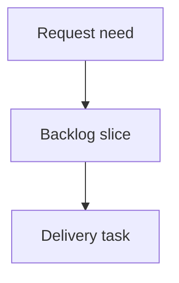

## req_149_network_scope_manual_recompute_action_with_scrollable_change_report - Network scope manual recompute action with scrollable change report
> From version: 1.16.6
> Schema version: 1.0
> Status: Done
> Understanding: 90%
> Confidence: 85%
> Complexity: Medium
> Theme: Operator workflow
> Reminder: Update status/understanding/confidence and linked backlog/task references when you edit this doc.

# Needs
- The operator needs an explicit action to recompute all wire routes and directional splice sides for an entire network on demand, instead of relying on incidental recomputes that only fire when a wire, splice, or segment is edited. This is the operator-facing complement to the geometric splice-side fix (`req_148`): already-saved workspaces only correct their stored `portIndex` / `spliceSideOverride` on the next recompute, and there is currently no way to trigger that for the whole harness.
- The action must be a button placed next to the Cancel button in the network edit form (network scope), shown when a network is being edited.
- After the recompute, a popup must list the changes that were found (routes rewritten, lengths changed, directional splice sides re-inferred), so the operator can see what the recompute did rather than having it happen silently.
- The popup must be reliably scrollable: when many changes are found the list must scroll inside the dialog instead of overflowing off-screen. This explicitly fixes the readability defect seen on the existing splice "floating" migration report popup, which was not scrollable.
- When no changes are found, the popup must clearly say so (empty/no-change state) rather than appearing broken or empty.

# Context
- The recompute machinery already exists: `recomputeAllWiresForNetwork` (`src/store/reducer/helpers/wireTransitions.ts`) recomputes routes and directional endpoints for every wire, and `recomputeWireRouteAndDirectionalEndpoints` does it per wire. Today it is only invoked as a side effect of segment edits (`src/store/reducer/segmentReducer.ts`) and delete-impact analysis (`src/store/deleteImpact.ts`); there is no dedicated "recompute this network" action and no change-report accumulation for the general path.
- A precedent for the change report exists in the persistence layer: `migrateLegacySpliceNodes` (`src/adapters/persistence/spliceNodeMigration.ts`) accumulates `SpliceMigrationReportEntry { kind, message }` items (including a `sideChange` kind built by comparing `describeEndpointSide` before/after). The manual recompute should produce an equivalent before/after diff per wire (route changed, length changed, splice side A/B re-inferred).
- The network edit form lives in `src/app/components/workspace/NetworkScopeWorkspaceContent.tsx`; the Cancel button sits in the `row-actions` button row (alongside Save / Set active / Delete in edit mode). The new button belongs in that same row, next to Cancel, and only in edit mode.
- The existing migration report popup is rendered by `FileFeedbackDialog` (`src/app/components/dialogs/FileFeedbackDialog.tsx`) and shows `items: string[]` inside `<ul className="confirm-dialog-feedback-list">`. That class has no `overflow`/`max-height` rule in `src/app/styles/confirm-dialog.css`, so a long list overflows the viewport — this is the non-scrollable defect to avoid. Scrollable dialog precedents exist (e.g. `BomExportPreviewDialog` with `min-height: 0; overflow: auto` on a `minmax(0, 1fr)` grid row).
- Button labels follow the app's DOM-translation i18n pattern: render a plain English string and add the French mapping to `FR_TEXT_BY_EN_TEXT` in `src/app/lib/i18n.ts`.

# Scope boundaries
- In scope: a manual "recompute network" action button next to Cancel in the network edit form (network scope, edit mode only), wired to recompute all wire routes and directional splice sides for the focused network.
- In scope: a store action / controller path that runs the full-network recompute and returns a structured change report (per wire: route change, length change, directional splice side A/B change) with before/after values.
- In scope: a scrollable result popup that lists the changes with a clear empty/no-change state; the dialog body must scroll (bounded `max-height` + `overflow: auto` on the scrolling region) on small viewports and long lists.
- In scope: fixing the scrollability of the shared feedback list styling so the existing splice "floating" migration report popup also scrolls (shared `confirm-dialog-feedback-list` / dialog body fix), since it is the same defect.
- In scope: i18n labels for the new button and popup strings, and targeted tests for the recompute-report builder, the empty-state, and the button visibility (edit mode only).
- Out of scope: changing the recompute/routing algorithm itself or the directional splice side geometry (delivered by `req_148`).
- Out of scope: automatic recompute on every workspace load, batch recompute across multiple networks at once, or persistence schema changes.
- Out of scope: undo/redo redesign (the recompute result should integrate with the existing history mechanism but no new history model is introduced).

# Acceptance criteria
- AC1: In network scope, while editing a network, a recompute action button is shown next to the Cancel button (edit mode only; not shown in create mode). It uses the app icon/button conventions and is keyboard and screen-reader accessible.
- AC2: Activating the button recomputes all wire routes and directional splice sides for the focused network and persists the corrected wires (same result the incidental recompute path produces), with corrected `portIndex` / `spliceSideOverride` for affected directional splices.
- AC3: After recompute, a popup lists every change found, grouped or labeled by kind (route rewritten, length changed, directional splice side A/B re-inferred), each entry naming the wire technical ID and showing before/after values where applicable.
- AC4: The popup is scrollable — with many entries the list scrolls within a bounded dialog height and never pushes content off-screen or beyond the viewport, including on small/mobile viewports. The header and close action remain visible while the list scrolls.
- AC5: When the recompute finds no changes, the popup shows an explicit no-change message instead of an empty or broken-looking dialog.
- AC6: If the recompute fails for any wire (e.g. an invalid locked route), the operator is shown a clear error message and no partial/inconsistent state is committed.
- AC7: The existing splice "floating" migration report popup becomes scrollable through the same shared styling fix (regression-checked), so long migration reports are also readable.
- AC8: Targeted tests cover the change-report builder (before/after diff for route, length, and side changes), the no-change empty state, the edit-mode-only button visibility, and the dialog scroll-region styling/markup.

# Definition of Ready (DoR)
- [x] Problem statement is explicit and user impact is clear.
- [x] Scope boundaries (in/out) are explicit.
- [x] Acceptance criteria are testable.
- [x] Dependencies and known risks are listed.

# Dependencies and risks
- Builds on `req_148` (geometric directional splice side resolution); the manual recompute is the primary way already-saved workspaces will pick up the corrected sides.
- The full-network recompute must reuse `recomputeAllWiresForNetwork` semantics exactly so the manual action and the incidental edit-triggered path stay consistent; divergence would produce confusing different results.
- The change report must compute a before/after snapshot diff; care is needed to avoid reporting spurious changes (e.g. stable routes) and to keep wire ordering deterministic for readable, stable output.
- The scrollability fix touches shared dialog styling (`confirm-dialog-feedback-list` / dialog body); it must fix the migration report popup without regressing other dialogs that reuse the same classes.
- Locked-route wires and wires that cannot be routed must be handled gracefully (surface as errors / report entries) rather than throwing or committing partial state.

# Companion docs
- Product brief(s): (none yet)
- Architecture decision(s): (none yet)

# References
- `req_148_directional_splice_side_resolution_must_support_vertical_and_near_vertical_carrier_segments`
- `src/store/reducer/helpers/wireTransitions.ts`
- `src/store/reducer/segmentReducer.ts`
- `src/adapters/persistence/spliceNodeMigration.ts`
- `src/app/components/workspace/NetworkScopeWorkspaceContent.tsx`
- `src/app/components/dialogs/FileFeedbackDialog.tsx`
- `src/app/components/dialogs/BomExportPreviewDialog.tsx`
- `src/app/styles/confirm-dialog.css`
- `src/app/lib/i18n.ts`

# AI Context
- Summary: Add a network-scope manual "recompute all wire routes and directional splice sides" button next to Cancel, showing a scrollable popup of the changes found, and fix the non-scrollable splice migration report popup through the shared dialog styling.
- Keywords: recompute network, wire routes, directional splice side, change report, scrollable dialog, FileFeedbackDialog, NetworkScopeWorkspaceContent, confirm-dialog-feedback-list, recomputeAllWiresForNetwork, network scope edit
- Use when: Implementing or reviewing the manual full-network recompute action, its change-report popup, or the dialog scrollability fix.
- Skip when: The work concerns the splice side geometry itself (req_148), the routing algorithm, persistence schema, or automatic load-time recompute.

# Backlog
- none
- `item_635_network_scope_manual_recompute_action_with_scrollable_change_report`
