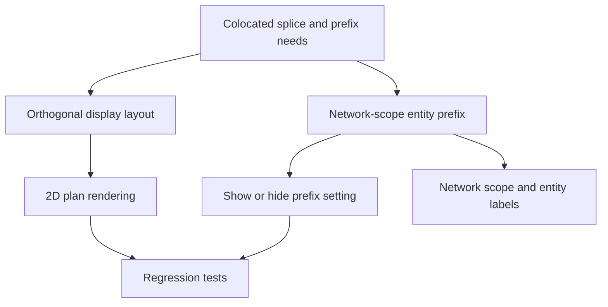

## req_150_colocated_splice_rendering_and_network_scope_entity_prefix_display - Colocated splice rendering and network-scope entity prefix display
> From version: 1.16.7
> Schema version: 1.0
> Status: Done
> Understanding: 93%
> Confidence: 86%
> Complexity: Medium
> Theme: Modeling and display
> Reminder: Update status/understanding/confidence and linked backlog/task references when you edit this doc.

# Needs
- When two or more floating splices are placed at the same position on the same segment, the 2D plan currently risks drawing them on top of each other. Operators need the plan to show that the splices share the same physical location without hiding one splice behind another.
- Example workspace provided by the operator: `C:\Users\Pmondou\OneDrive - Circle SAS\Documents\Faisceau\envoi AMIPI\principal build\Workspace save\electrical-workspace-2026-06-23_09-43-58.epe.json`. In that file, EP 2 and EP 3 on the lateral harness are placed at the same segment position.
- The expected visual behavior is to render colocated splices side by side along the direction orthogonal to the carrier segment, so both splice symbols remain visible while their shared placement remains clear.
- A short linking line between the displaced splice symbols should be shown by default, so the drawing communicates that the splices are physically colocated rather than independently placed at different offsets. Operators should be able to hide this cue from settings.
- This behavior likely existed before the floating-splice release and regressed when splices became segment-offset placements instead of legacy graph nodes.
- Operators also need a network-level prefix model. The shared workspace uses repeated prefixes such as `LAT-` and `PRI-` across connector, node, splice, segment, and wire IDs. The prefix should become an explicit property of the network scope, remain anchored in stored entity IDs for uniqueness, and be displayable or hideable from settings.

# Context
- Floating splices are now stored with `Splice.placement` as a segment-offset reference (`segmentId`, `fromNodeId`, `offsetMm`) in `src/core/entities.ts` and resolved through `src/core/splicePlacement.ts`.
- Prior requests around floating splice placement and directional side resolution are relevant:
  - `req_144_floating_splice_placements_decoupled_from_network_topology`
  - `req_148_directional_splice_side_resolution_must_support_vertical_and_near_vertical_carrier_segments`
  - `req_149_network_scope_manual_recompute_action_with_scrollable_change_report`
- Rendering should preserve the canonical persisted placement. The orthogonal offset is a display layout offset only; it must not alter `Splice.placement.offsetMm`, wire routing, route length, splice side inference, or export geometry unless a future export-specific decision says otherwise.
- Network scope already stores `Network.name`, `Network.technicalId`, and other metadata, but no explicit entity-prefix field currently exists in `Network`.
- The visible prefix requirement spans forms, primary/analysis tables, network summary callouts, quick navigation, inspector, exports, and validation messages. AI-agent JSON must continue exposing canonical full IDs regardless of the UI display toggle.

# Functional scope
## A. Colocated floating splice rendering
- Detect groups of placed splices whose placement resolves to the same carrier segment and same effective offset from the same physical point.
- Treat reverse `fromNodeId` representations consistently: two placements that describe the same point on a segment from opposite nodes should be grouped together.
- For a group with two or more colocated splices, compute a stable display-only offset along the segment normal so the symbols are side by side and do not overlap.
- The group should remain visually centered on the true segment point. For two splices, one must be offset on each side of the segment centerline, symmetrically along the normal.
- Spacing between colocated splice symbols should be derived from the rendered splice symbol size, so the layout remains readable if the symbol size changes.
- Render a short connector/link line between colocated splice symbols by default. Add a settings option to show/hide this link, defaulting to shown.
- Labels and callouts for colocated splices should follow the displaced symbol positions rather than the true physical center point.
- Preserve existing behavior for a single placed splice and for splices placed at distinct offsets on the same segment.

## B. Network-scope entity prefix model
- Add an explicit network-level prefix field, tentatively `entityPrefix`, editable in Network scope.
- Support the entity kinds called out by the operator: connectors, nodes, splices, segments, and wires.
- The prefix applies to IDs / `technicalId` values only, not entity `name` values.
- Define a display resolver that can return either the full stored ID (`LAT-EP 2`) or the ID without the network prefix (`EP 2`) depending on settings.
- Add a workspace setting to show or hide the network entity prefix in UI labels. The setting should be persistent and should default to showing the prefix for backward-compatible readability unless clarified otherwise.
- Prefix hiding must be display-only: stored `technicalId`, import/export payloads, references, uniqueness checks, and relationship joins must remain stable and unambiguous.
- New entity creation in a network with a prefix must anchor the prefix in the stored entity ID, so generated/stored IDs remain as globally unique as possible and avoid ambiguous repeated values such as `N-01` or `CT1` across networks.
- Existing workspaces should auto-detect obvious network prefixes during load/import/migration when entity IDs consistently share a prefix such as `LAT-` or `PRI-`.
- If prefix hiding creates visually identical bare IDs across networks, add a disambiguation hint only in harness assembly / multi-network contexts, not in ordinary single-network views.

# Scope boundaries
- In scope: 2D plan/canvas rendering for colocated floating splices on the same segment point.
- In scope: visual overlap avoidance using orthogonal offsets computed from the carrier segment geometry.
- In scope: colocated-splice link line/cue, shown by default and hideable from settings.
- In scope: network-scope prefix field, settings toggle, and shared display helper for labels in core UI surfaces.
- In scope: migration/normalization that auto-detects a candidate prefix from existing network entity IDs when safe, or leaves it blank when ambiguous.
- Out of scope: changing the physical route model or wire lengths because several splices share one placement.
- Out of scope: converting same-location splices into a merged splice entity.
- Out of scope: changing canonical IDs in saved files as part of the display toggle.
- Out of scope: enforcing one global prefix across all networks; prefixes are network-scoped.
- Out of scope: a destructive bulk rename unless explicitly requested as a separate migration/action.
- Out of scope: applying network prefix display hiding to AI-agent JSON; agent JSON keeps canonical full IDs.

# Acceptance criteria
- AC1: Colocated floating splices on the same segment point are both visible in the 2D plan and no longer draw directly on top of each other.
- AC2: The visual separation direction is orthogonal to the carrier segment and remains stable when the viewport is zoomed, panned, exported, or re-rendered.
- AC3: A colocated group with two splices is arranged symmetrically around the true placement point, with one splice on each side of the carrier segment; groups with more than two splices use a deterministic ordering and spacing that avoids overlap.
- AC4: A short linking line is rendered for colocated groups by default, can be hidden from settings, and does not obscure wires, labels, or callouts.
- AC5: The stored splice placement is unchanged after rendering: same `segmentId`, same physical offset, same wire routes, and same route lengths before and after display.
- AC6: Placements expressed from opposite segment nodes but describing the same physical location are detected as colocated.
- AC7: Network scope exposes an editable entity prefix field, and the value persists in workspace save/load and network import/export.
- AC8: Settings expose a persistent show/hide toggle for network entity prefixes.
- AC9: When prefix display is hidden, connector, node, splice, segment, and wire ID labels in UI surfaces and human-readable exports omit the active network prefix, while AI-agent JSON continues to expose canonical full IDs.
- AC10: When prefix display is shown, existing labels remain backward-compatible and continue to include the stored prefix.
- AC11: Prefix hiding does not break selection, navigation, sorting, filtering, validation, exports, imports, AI-agent operations, or uniqueness checks because those continue to use canonical IDs internally.
- AC12: New entity creation in a prefixed network stores IDs with the network prefix anchored in the entity `technicalId`, preventing repeated bare IDs such as `N-01` or `CT1` across networks.
- AC13: Existing workspaces auto-detect obvious network prefixes during load/import/migration, populate the network prefix field when safe, and avoid double-prefix display.
- AC14: Colocated splice spacing is derived from rendered symbol size, and colocated splice labels/callouts follow the displaced symbol positions.
- AC15: If hidden prefixes create duplicate-looking bare IDs across networks, a disambiguation hint is shown only in harness assembly / multi-network contexts.
- AC16: Targeted tests cover colocated splice grouping, reverse-from-node equivalence, orthogonal display offsets, symbol-size-derived spacing, displaced callout/label anchoring, single-splice non-regression, link-line settings behavior, prefix auto-detection, prefix persistence, the settings toggle, prefixed new-ID creation, harness-assembly-only disambiguation, and at least one table/callout/inspector/export label path plus AI-agent JSON canonical-ID preservation.

# Definition of Ready (DoR)
- [x] Problem statement is explicit and user impact is clear.
- [x] Scope boundaries are explicit.
- [x] Acceptance criteria are testable.
- [x] Product decisions below are answered.
- [x] The provided AMIPI workspace is available to the implementer or a reduced fixture is extracted from it.

# Product decisions
- Colocated splice placement: two colocated splice symbols are displayed on opposite sides of the carrier segment, symmetrically along the orthogonal direction.
- Colocated splice link line: shown by default, with a settings option to hide it.
- Prefix target: IDs / `technicalId` only, not entity names.
- Prefix display hiding scope: all UI and human-readable export surfaces should honor the setting; AI-agent JSON must keep canonical full IDs.
- New entity creation: generated/stored IDs in a prefixed network include the network prefix, keeping IDs maximally unique and avoiding repeated bare values such as `N-01` or `CT1`.
- Existing workspaces: auto-detect obvious prefixes during load/import/migration.
- Colocated splice spacing: derive spacing from rendered symbol size.
- Colocated splice labels/callouts: anchor to the displaced symbol position.
- Hidden-prefix disambiguation: if duplicate-looking bare IDs occur, show the disambiguation hint only in harness assembly / multi-network contexts.

# Dependencies and risks
- Colocated splice rendering must be integrated with the existing network summary graph layout without creating layout jitter or changing persisted placement.
- Display-only prefix removal can be risky if applied ad hoc. A shared label resolver is preferred so canonical IDs remain stable and UI/export surfaces hide the prefix consistently while AI-agent JSON does not.
- Existing workspaces already bake prefixes into stored `technicalId`; introducing `Network.entityPrefix` requires a careful migration/import strategy to avoid duplicate prefix display such as `LAT-LAT-EP 2`.
- Export and AI-agent surfaces may need canonical full IDs for traceability. Hiding prefixes in human UI should not silently alter machine-readable outputs unless explicitly accepted.

# Companion docs
- Product brief(s): (none yet)
- Architecture decision(s): (none yet)

# References
- `logics/request/req_144_floating_splice_placements_decoupled_from_network_topology.md`
- `logics/request/req_148_directional_splice_side_resolution_must_support_vertical_and_near_vertical_carrier_segments.md`
- `logics/request/req_149_network_scope_manual_recompute_action_with_scrollable_change_report.md`
- `src/core/entities.ts`
- `src/core/splicePlacement.ts`
- `src/app/components/network-summary/graph/NetworkSummaryGraphLayers.tsx`
- `src/app/components/network-summary/callouts/NetworkSummaryCalloutsLayer.tsx`
- `src/app/components/workspace/NetworkScopeWorkspaceContent.tsx`
- `src/app/components/workspace/SettingsWorkspaceContent.tsx`
- `src/app/components/workspace/ModelingPrimaryTables.tsx`
- `src/app/components/workspace/AnalysisNodeSegmentWorkspacePanels.tsx`
- `src/app/components/workspace/AnalysisSpliceWorkspacePanels.tsx`
- `src/app/components/InspectorContextPanel.tsx`

# AI Context
- Summary: Restore readable 2D rendering when multiple floating splices share one segment position by offsetting them symmetrically on both sides of the carrier segment, with a default visible link line, and add an explicit network-scope ID prefix that can be shown or hidden in UI/human exports while canonical full IDs remain stored and exposed to AI-agent JSON.
- Keywords: colocated splices, floating splice, segment offset, orthogonal layout, splice link line, entity prefix, network scope, technical ID, display-only prefix, settings toggle, LAT, PRI
- Use when: Grooming or implementing colocated floating-splice rendering, network-level entity prefix fields, or show/hide prefix display behavior.
- Skip when: The work concerns directional splice side inference, wire routing algorithm changes, destructive bulk renames, or export schema changes unrelated to visible labels.

# Backlog
- `item_636_colocated_splice_rendering_and_network_scope_entity_prefix_display`
