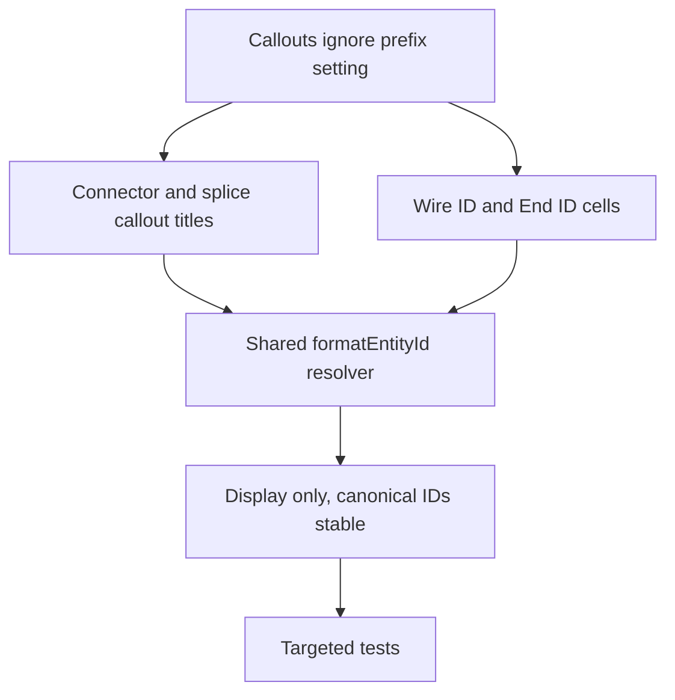

## req_151_network_summary_callouts_honor_network_entity_prefix_display_setting - Network Summary callouts honor the network entity prefix display setting
> From version: 1.16.8
> Schema version: 1.0
> Status: Draft
> Understanding: 95%
> Confidence: 90%
> Complexity: Low
> Theme: Modeling and display
> Reminder: Update status/understanding/confidence and linked backlog/task references when you edit this doc.

# Needs
- The network entity prefix display setting (`canvasShowNetworkEntityPrefix`, added in `req_150`) lets operators hide a network's shared ID prefix such as `LAT-` or `PRI-` for readability. It currently hides the prefix in the 2D canvas node/splice labels and the human-readable wire-list and BOM exports, but the Network Summary connector and splice callouts still show full canonical IDs with the prefix.
- Operators read the callouts as the primary on-plan documentation surface (connector/splice title plus per-cavity wire detail rows). When they hide the prefix to declutter the plan, the callouts stay inconsistent with the rest of the canvas: the connector/splice title, the wire `Wire ID` cell, and the far-end `End ID` cell all keep the `LAT-`/`PRI-` prefix.
- The expected behavior is that callouts follow the same show/hide setting as the rest of the Network Summary canvas, so a plan with the prefix hidden reads uniformly (`EP 2` everywhere, not `EP 2` on the symbol and `LAT-EP 2` in the callout).
- This is the explicit follow-up flagged in the `task_145` scope note: the prefix-aware display seam (`formatEntityIdForDisplay` / `formatEntityId`) was deliberately not yet wired into the callout surface and can adopt the same helper.

# Context
- The prefix display resolver lives in `src/core/networkEntityPrefix.ts` (`formatEntityIdForDisplay`). `NetworkSummaryPanel.tsx` already builds a memoized `formatEntityId` from `activeNetwork.entityPrefix` and `showNetworkEntityPrefix` and passes it to `buildRenderedNodes` and `buildRenderedFloatingSplices`.
- The callout view models are built in `src/app/components/network-summary/callouts/calloutModel.ts` and laid out in `calloutLayout.ts`; `buildConnectorCalloutGroupsById`, `buildSpliceCalloutGroupsById`, and `buildCableCalloutViewModels` do not currently receive `formatEntityId`.
- The prefixed strings shown by callouts are: the callout title/subtitle built from `connector.technicalId` / `splice.technicalId` via `buildCalloutHeaderDisplay`, the wire-row `Wire ID` column (`entry.technicalId`), and the wire-row `End ID` column (`targetId`, the far-endpoint connector/splice `technicalId` from `describeWireEndpointForCallout`).
- Hiding must stay display-only and consistent with `req_150` AC11: callout selection (`onSelectConnectorFromCallout` / `onSelectSpliceFromCallout`), drag-position persistence keys, sorting, and grouping already use canonical entity IDs (`connector.id` / `splice.id`) and must remain unchanged.
- SVG/PNG/PDF network-plan exports snapshot the live callout DOM, so they should inherit the formatted callout text automatically, the same way `req_150` colocated-splice link lines and canvas labels do.
- AI-agent JSON and machine-readable identifiers are out of scope and must keep canonical full IDs.

# Functional scope
- Pass the existing per-network `formatEntityId` resolver into the Network Summary callout model so callout text honors `canvasShowNetworkEntityPrefix`.
- Apply the resolver to the connector/splice callout title (and prefixed subtitle fallback), the wire-row `Wire ID` cell, and the wire-row `End ID` cell.
- Keep prefix hiding display-only: selection, drag-position persistence keys, sorting, grouping, and exports must continue to rely on canonical entity IDs.
- Ensure SVG/PNG/PDF network-plan exports reflect the on-screen prefix visibility through the existing live-DOM snapshot path.

# Scope boundaries
- In scope: Network Summary connector and splice callouts (title, subtitle fallback, `Wire ID` cell, `End ID` cell) honoring the existing prefix display setting.
- In scope: reusing the existing `formatEntityIdForDisplay` / `formatEntityId` seam and the active network prefix.
- Out of scope: any new setting; this reuses `canvasShowNetworkEntityPrefix`.
- Out of scope: changing canonical stored `technicalId` values, callout drag/selection keys, sorting, or grouping behavior.
- Out of scope: AI-agent JSON or other machine-readable identifiers, which keep canonical full IDs.
- Out of scope: modeling tables, inspector, and analysis panels (separate remaining surfaces from the `task_145` scope note).

# Acceptance criteria
- AC1: When `canvasShowNetworkEntityPrefix` is off, connector and splice callout titles in the Network Summary 2D plan omit the active network prefix (e.g. `LAT-EP 2` renders as `EP 2`).
- AC2: When the setting is off, callout wire-detail rows omit the active network prefix in both the `Wire ID` column (the wire's own `technicalId`) and the `End ID` column (the far-endpoint connector/splice `technicalId`).
- AC3: When the setting is on, callout titles and wire-detail ID cells remain backward-compatible and continue to include the stored prefix.
- AC4: Prefix hiding in callouts is display-only: callout selection, drag-position persistence keys, sorting, and grouping continue to use canonical entity IDs and behave identically whether the prefix is shown or hidden.
- AC5: SVG/PNG/PDF network-plan exports that snapshot the live callouts reflect the same prefix visibility as the on-screen callouts.
- AC6: AI-agent JSON and machine-readable identifiers are unaffected and continue to expose canonical full IDs.
- AC7: Targeted tests cover callout title prefix hiding, wire-row `Wire ID` and `End ID` prefix hiding, the prefix-shown backward-compatible path, and a non-regression check that callout selection/keys use canonical IDs.

# Definition of Ready (DoR)
- [x] Problem statement is explicit and user impact is clear.
- [x] Scope boundaries are explicit.
- [x] Acceptance criteria are testable.
- [x] Product decisions below are answered.
- [x] The implementation seam (`formatEntityId`) and target functions are identified.

# Product decisions
- Reuse the existing `canvasShowNetworkEntityPrefix` setting; do not add a callout-specific toggle.
- Apply the prefix resolver to callout title, prefixed subtitle fallback, `Wire ID`, and `End ID` cells.
- Keep prefix hiding display-only; canonical IDs continue to drive selection, persistence keys, sorting, grouping, exports, and AI-agent JSON.
- Exports inherit callout text through the existing live-DOM snapshot rather than a separate formatting path.

# Dependencies and risks
- Builds directly on `req_150` (`Network.entityPrefix`, `formatEntityIdForDisplay`, `canvasShowNetworkEntityPrefix`).
- Low risk: the resolver is already available in the panel; the change is plumbing it into three display strings in the callout model.
- Risk to avoid: formatting any value used as a callout key, selection target, sort key, or persistence key, which would break drag persistence or selection. Only emitted display cells should be formatted.

# Companion docs
- Product brief(s): (none)
- Architecture decision(s): (none)

# References
- `logics/request/req_150_colocated_splice_rendering_and_network_scope_entity_prefix_display.md`
- `src/core/networkEntityPrefix.ts`
- `src/app/components/NetworkSummaryPanel.tsx`
- `src/app/components/network-summary/callouts/calloutModel.ts`
- `src/app/components/network-summary/callouts/calloutLayout.ts`
- `src/app/components/network-summary/callouts/NetworkSummaryCalloutsLayer.tsx`
- `src/app/components/network-summary/export/networkSummaryExport.ts`

# AI Context
- Summary: Extend the existing network entity prefix display setting to the Network Summary connector/splice callouts so callout titles and the wire-row `Wire ID` and `End ID` cells hide the active network prefix when the setting is off, reusing the shared `formatEntityId` resolver while keeping canonical IDs for selection, persistence, sorting, exports, and AI-agent JSON.
- Keywords: network summary callout, entity prefix, formatEntityId, formatEntityIdForDisplay, canvasShowNetworkEntityPrefix, Wire ID, End ID, callout title, display-only prefix, LAT, PRI
- Use when: Grooming or implementing prefix-aware callout label display in the Network Summary.
- Skip when: The work concerns colocated splice geometry, new prefix settings, AI-agent JSON identifiers, or modeling/inspector/analysis label surfaces.

# Backlog
- `item_637_network_summary_callouts_honor_network_entity_prefix_display_setting`
