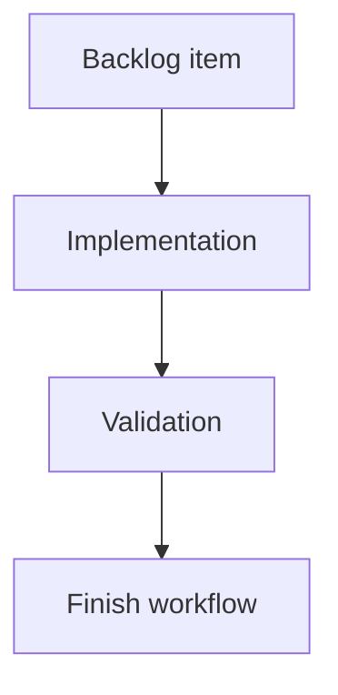

## task_004_network_import_export_orchestration_and_delivery_control - Network Import Export Orchestration and Delivery Control
> From version: 0.1.0
> Status: Done
> Understanding: 99%
> Confidence: 97%
> Progress: 100%
> Complexity: High
> Theme: Data Portability Delivery
> Reminder: Update Understanding/Confidence/Progress and dependencies/references when you edit this doc.

> Maintenance edit: strict Logics corpus repair formalized gates, traceability, and workflow overview metadata.
# Definition of Done (DoD)
- [x] Linked acceptance criteria were delivered or explicitly closed in the task report.
- [x] Validation evidence is recorded in the task report or validation section.
- [x] Related request/backlog/task traceability is documented for the historical delivery chain.

# Context
Orchestration task for network import/export workflows introduced by `req_004`. This task coordinates sequencing, dependency control, validation cadence, and risk tracking for safe file-based portability.

Backlog scope covered:
- `item_025_network_export_schema_and_serializer.md`
- `item_026_network_import_parser_validation_and_migration.md`
- `item_027_import_conflict_resolution_and_id_deduplication.md`
- `item_028_import_export_ui_flow_and_user_feedback.md`
- `item_029_import_export_test_matrix_and_regression_coverage.md`

# Plan
- [x] 1. Freeze file payload contract and deterministic serialization rules (`item_025`)
- [x] 2. Deliver Wave 1 (`item_026`, `item_027`) and validate parser/migration/conflict integrity
- [x] 3. Deliver Wave 2 (`item_028`) and validate end-user import/export UX and feedback paths
- [x] 4. Deliver Wave 3 (`item_029`) with AC traceability and full regression coverage
- [x] 5. Publish import/export readiness report (status, blockers, residual risks)
- [x] FINAL: Update related Logics docs

# Validation
- `python3 logics/skills/logics-doc-linter/scripts/logics_lint.py`
- `npm run lint`
- `npm run typecheck`
- `npm run test:ci`
- `npm run test:e2e`

# Report
- Wave status:
  - Wave 1 delivered: deterministic export payload + parser validation + schema `0` to `1` migration + conflict deduplication.
  - Wave 2 delivered: settings import/export UX with active/selected/all export scopes and import status reporting.
  - Wave 3 delivered: portability regression coverage + AC traceability (`logics/specs/req_004_network_import_export_traceability.md`).
- Current blockers: none.
- Main risks to track:
  - Future schema evolution may require additional migration layers beyond v0/v1.
  - Large-file UX may need progress indicators and chunked processing if dataset size increases.
- Mitigation strategy:
  - Keep parser/migration/conflict logic centralized in `src/adapters/portability/networkFile.ts`.
  - Preserve deterministic suffix tests and malformed payload tests in CI.
  - Keep UI failure path non-destructive with explicit status messaging.

