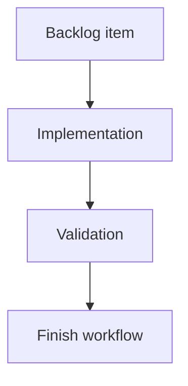

## task_054_req_057_catalog_and_bom_pricing_settings_orchestration_and_delivery_control - req_057 catalog and BOM pricing settings orchestration and delivery control
> From version: 0.9.6
> Status: Done
> Understanding: 97% (scope decisions locked: EUR default, 20% TVA default, workspace scope, optional tax with greyed rate field)
> Confidence: 91% (delivery can be sequenced cleanly on top of req_051/req_056 surfaces)
> Progress: 100%
> Complexity: High
> Theme: Orchestration for req_057 settings + catalog pricing UI + conditional BOM TTC export
> Reminder: Update Understanding/Confidence/Progress and dependencies/references when you edit this doc.

> Maintenance edit: strict Logics corpus repair formalized gates, traceability, and workflow overview metadata.
# Definition of Done (DoD)
- [x] Linked acceptance criteria were delivered or explicitly closed in the task report.
- [x] Validation evidence is recorded in the task report or validation section.
- [x] Related request/backlog/task traceability is documented for the historical delivery chain.

# Context
`req_057` extends the catalog/BOM pricing model with workspace-level pricing context:
- configurable currency (`EUR` default),
- optional tax/VAT toggle (`enabled` by default),
- tax rate (`20%` default, French TVA baseline),
- catalog UI static currency display beside excl-tax prices,
- BOM CSV TTC column/total only when tax is enabled.

The implementation spans shared surfaces:
- `Settings` persistence/UI,
- Catalog list/form price rendering,
- BOM CSV export generation and metadata.

This should be delivered in a controlled sequence to avoid regressions in existing `req_051` catalog CRUD and `req_056` BOM export behavior.

# Objective
- Deliver `req_057` in coordinated increments with clear separation between settings foundation, catalog UI display, and BOM TTC export behavior.
- Preserve backward compatibility for existing saves and current HT pricing semantics.
- Finish with a full validation pass and synchronized `logics` docs (request/backlog/task progress updates).

# Scope
- In:
  - Orchestrate delivery of `item_333`, `item_334`, `item_335`
  - Sequence shared-state changes before UI/export consumers
  - Run targeted and final validation gates
  - Keep `logics` artifacts synchronized during progress and closure
- Out:
  - New pricing features beyond `req_057` (currency conversion, per-network pricing settings, advanced tax rules)
  - Broader accounting/invoicing exports beyond BOM CSV

# Backlog scope covered
- `logics/backlog/item_333_settings_catalog_and_bom_pricing_setup_with_workspace_currency_and_optional_tax_persistence.md`
- `logics/backlog/item_334_bom_csv_ttc_column_and_total_with_tax_enabled_conditional_export_behavior.md`
- `logics/backlog/item_335_catalog_price_ui_currency_display_beside_excl_tax_unit_prices.md`

# Plan
- [x] 1. Implement settings foundation (`item_333`): workspace pricing settings state/persistence, defaults, normalization, and disabled tax-rate field UX
- [x] 2. Implement catalog UI currency display (`item_335`) using req_057 symbol/code display rules without changing HT storage semantics
- [x] 3. Implement BOM TTC conditional export (`item_334`): preserve HT outputs, add TTC column/total only when tax is enabled, add pricing metadata context
- [x] 4. Run targeted regression suites for settings/catalog/BOM and fix discovered issues
- [x] 5. Run final validation matrix (lint/typecheck/quality/build/tests/e2e)
- [x] FINAL: Update related Logics docs

# Validation
- `python3 logics/skills/logics-doc-linter/scripts/logics_lint.py`
- `npm run -s lint`
- `npm run -s typecheck`
- `npm run -s quality:ui-modularization`
- `npm run -s quality:store-modularization`
- `npm run -s build`
- `npm run -s quality:pwa`
- `npm run -s test:ci`
- `npm run -s test:e2e`

# Targeted validation guidance (recommended during implementation)
- `npx vitest run src/tests/app.ui.settings.spec.tsx`
- `npx vitest run src/tests/app.ui.catalog.spec.tsx`
- `npx vitest run src/tests/network-summary-bom-csv.spec.ts src/tests/app.ui.network-summary-bom-export.spec.tsx`
- `npx vitest run src/tests/persistence.localStorage.spec.ts`

# Report
- Current blockers: none.
- Risks to track:
  - Shared settings persistence changes may regress unrelated settings defaults or migration behavior.
  - BOM CSV schema changes may break existing HT-only tests if TTC columns are inserted without deterministic ordering/versioned expectations.
  - Catalog UI display updates may create inconsistent symbol/code formatting across list vs form.
- Delivery notes:
  - Implemented `item_333`, `item_334`, and `item_335` in code (workspace currency + tax settings, catalog currency surfacing, BOM HT/TTC conditional export with pricing context rows).
  - Chosen BOM export contract: pricing context is appended as CSV rows (`PRICING CONTEXT`) and TTC columns/totals are emitted only when tax is enabled.
  - Targeted validation executed and passing: `app.ui.settings`, `app.ui.settings-pricing`, `app.ui.catalog`, `network-summary-bom-csv`, `app.ui.network-summary-bom-export`.
  - Full validation matrix executed and passing in this implementation pass: `logics_lint`, `lint`, `typecheck`, `quality:ui-modularization`, `quality:store-modularization`, `build`, `quality:pwa`, `test:ci`, `test:e2e`.
  - To satisfy `quality:ui-modularization`, pricing-specific settings tests were split into `src/tests/app.ui.settings-pricing.spec.tsx`, keeping `src/tests/app.ui.settings.spec.tsx` under the 500-line gate.

# References
- `logics/request/req_057_catalog_and_bom_settings_currency_and_tax_defaults.md`
- `logics/backlog/item_333_settings_catalog_and_bom_pricing_setup_with_workspace_currency_and_optional_tax_persistence.md`
- `logics/backlog/item_334_bom_csv_ttc_column_and_total_with_tax_enabled_conditional_export_behavior.md`
- `logics/backlog/item_335_catalog_price_ui_currency_display_beside_excl_tax_unit_prices.md`
- `src/app/components/workspace/SettingsWorkspaceContent.tsx`
- `src/app/components/workspace/ModelingCatalogListPanel.tsx`
- `src/app/components/workspace/ModelingCatalogFormPanel.tsx`
- `src/app/lib/networkSummaryBomCsv.ts`

# AC Traceability
- request-AC1 -> This task. Evidence needed: `Settings` includes a dedicated section for catalog/BOM pricing setup with configurable `Currency` and `Tax rate (%)`.
- request-AC2 -> This task. Evidence needed: Currency, tax enabled state, and tax rate settings are persisted and restored across app reloads.
- request-AC3 -> This task. Evidence needed: Catalog UI displays the selected currency statically next to `Unit price (excl. tax)` while catalog item prices remain stored as excl-tax numeric amounts; value-adjacent displays prefer the currency symbol and labels/metadata may use the code.
- request-AC4 -> This task. Evidence needed: BOM workflows/export use the configured currency/tax values as explicit pricing context, preserve HT outputs, and include a TTC line column plus a `Total TTC` summary only when tax is enabled.
- request-AC5 -> This task. Evidence needed: Missing or malformed persisted currency/tax settings fall back to deterministic safe defaults without breaking load.
- request-AC6 -> This task. Evidence needed: Existing catalog CRUD and BOM export behaviors remain functional under default and customized settings values.
- request-AC1 -> This task. Proof: Historical delivery is recorded in the linked backlog/task report and validation sections; this corpus repair formalizes strict audit traceability without changing shipped scope. Source: `logics corpus strict audit repair`
- request-AC2 -> This task. Proof: Historical delivery is recorded in the linked backlog/task report and validation sections; this corpus repair formalizes strict audit traceability without changing shipped scope. Source: `logics corpus strict audit repair`
- request-AC3 -> This task. Proof: Historical delivery is recorded in the linked backlog/task report and validation sections; this corpus repair formalizes strict audit traceability without changing shipped scope. Source: `logics corpus strict audit repair`
- request-AC4 -> This task. Proof: Historical delivery is recorded in the linked backlog/task report and validation sections; this corpus repair formalizes strict audit traceability without changing shipped scope. Source: `logics corpus strict audit repair`
- request-AC5 -> This task. Proof: Historical delivery is recorded in the linked backlog/task report and validation sections; this corpus repair formalizes strict audit traceability without changing shipped scope. Source: `logics corpus strict audit repair`
- request-AC6 -> This task. Proof: Historical delivery is recorded in the linked backlog/task report and validation sections; this corpus repair formalizes strict audit traceability without changing shipped scope. Source: `logics corpus strict audit repair`
- request-AC1A -> This task. Proof: Historical delivery or planned chain is recorded in the linked Logics report and validation sections; this corpus repair formalizes strict audit traceability without changing shipped scope. Source: `logics corpus strict audit repair`
- request-AC1B -> This task. Proof: Historical delivery or planned chain is recorded in the linked Logics report and validation sections; this corpus repair formalizes strict audit traceability without changing shipped scope. Source: `logics corpus strict audit repair`
- request-AC2A -> This task. Proof: Historical delivery or planned chain is recorded in the linked Logics report and validation sections; this corpus repair formalizes strict audit traceability without changing shipped scope. Source: `logics corpus strict audit repair`
- request-AC4A -> This task. Proof: Historical delivery or planned chain is recorded in the linked Logics report and validation sections; this corpus repair formalizes strict audit traceability without changing shipped scope. Source: `logics corpus strict audit repair`

