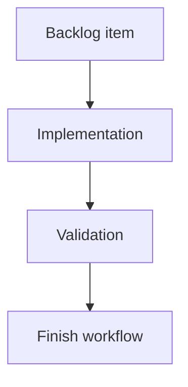

## task_056_req_059_catalog_item_validation_hardening_and_sample_coverage_orchestration_and_delivery_control - req_059 catalog item validation hardening and sample coverage orchestration and delivery control
> From version: 0.9.6
> Status: Done
> Understanding: 99% (delivered as a req_053 follow-up across validation rules, reproducible samples, and Validation UI regression paths)
> Confidence: 96% (implementation is stable and covered by targeted Validation tests plus the final validation matrix)
> Progress: 100%
> Complexity: Medium
> Theme: Orchestration for req_059 validation hardening on catalog-item issues and sample coverage
> Reminder: Update Understanding/Confidence/Progress and dependencies/references when you edit this doc.

> Maintenance edit: strict Logics corpus repair formalized gates, traceability, and workflow overview metadata.
# Definition of Done (DoD)
- [x] Linked acceptance criteria were delivered or explicitly closed in the task report.
- [x] Validation evidence is recorded in the task report or validation section.
- [x] Related request/backlog/task traceability is documented for the historical delivery chain.

# Context
`req_059` is a validation hardening follow-up driven by user feedback that catalog-item errors appear unsupported in the Validation workflow.

`req_053` already defined catalog integrity validation contracts, but this request focuses on practical reliability:
- verify/close gaps in catalog-item error detection/surfacing,
- add a dedicated invalid sample/fixture for reproducibility,
- harden Validation UI surfacing/filter/go-to behavior with regression coverage.

These changes touch the validation pipeline, sample/fixture builders, and Validation UI tests, so sequencing matters to avoid noisy failures and unclear responsibilities.

# Objective
- Deliver `req_059` as a focused follow-up to `req_053` with reproducible catalog-item validation error coverage.
- Preserve valid sample/demo flows while adding targeted invalid sample/fixture coverage.
- Finish with synchronized `logics` docs and a clean validation pass.

# Scope
- In:
  - Orchestrate `item_339`, `item_340`, `item_341`
  - Sequence validation-rule audit before fixture/UI hardening
  - Run targeted and final validation gates
  - Update request/backlog/task progress and closure notes
- Out:
  - New validation domains beyond catalog-item integrity follow-up
  - Catalog business-rule expansion unrelated to integrity/error surfacing

# Backlog scope covered
- `logics/backlog/item_339_validation_catalog_item_integrity_audit_and_issue_surfacing_gap_closure.md`
- `logics/backlog/item_340_dedicated_sample_fixture_for_catalog_item_validation_error_reproduction_and_regression_coverage.md`
- `logics/backlog/item_341_validation_ui_catalog_item_category_filters_and_go_to_regression_hardening.md`

# Plan
- [x] 1. Audit and close validation rule/surfacing gaps for intrinsic catalog-item errors (`item_339`)
- [x] 2. Add deterministic invalid sample/fixture coverage for catalog-item validation error reproduction (`item_340`)
- [x] 3. Harden Validation UI category/filter/go-to behavior and regression tests using the new coverage (`item_341`)
- [x] 4. Run targeted validation suites and fix regressions
- [x] 5. Run final validation matrix
- [x] FINAL: Update related Logics docs

# Validation
- `python3 logics/skills/logics-doc-linter/scripts/logics_lint.py`
- `npm run -s lint`
- `npm run -s typecheck`
- `npm run -s test:ci`
- `npm run -s test:e2e`

# Targeted validation guidance (recommended during implementation)
- `npx vitest run src/tests/app.ui.validation.spec.tsx`
- `npx vitest run src/tests/persistence.localStorage.spec.ts`
- `npx vitest run src/tests/portability.network-file.spec.ts`
- `npx vitest run src/tests/sample-network.fixture.spec.ts`

# Report
- Current blockers: none.
- Risks to track:
  - Overloading shared sample fixtures with invalid catalog states could regress happy-path tests.
  - Validation UI assertions may become brittle if tied to exact wording instead of stable category/behavior contracts.
  - Rule duplication risk with `req_053` if gap closure reimplements already-delivered logic without auditing first.
- Delivery notes:
  - Intrinsic catalog-item validation issue generation/surfacing is implemented in `buildValidationIssues` under the `Catalog integrity` category (trimmed manufacturer reference, invalid connection count, invalid URL, duplicate manufacturer reference).
  - Dedicated sample/fixture regression coverage was added without invalidating default happy-path demos.
  - Validation UI regression coverage includes catalog-item issue category filtering and `Go to` navigation to Catalog item editing.
  - Final validation matrix re-run and passing in current workspace state: `logics_lint`, `lint`, `typecheck`, `build`, `quality:ui-modularization`, `quality:store-modularization`, `quality:pwa`, `test:ci`, `test:e2e`.

# References
- `logics/request/req_059_validation_support_for_catalog_item_errors_with_dedicated_sample_coverage.md`
- `logics/request/req_053_validation_catalog_integrity_issues_and_catalog_go_to_navigation_support.md`
- `logics/backlog/item_339_validation_catalog_item_integrity_audit_and_issue_surfacing_gap_closure.md`
- `logics/backlog/item_340_dedicated_sample_fixture_for_catalog_item_validation_error_reproduction_and_regression_coverage.md`
- `logics/backlog/item_341_validation_ui_catalog_item_category_filters_and_go_to_regression_hardening.md`
- `src/app/hooks/validation/buildValidationIssues.ts`
- `src/tests/sample-network.fixture.spec.ts`
- `src/tests/portability.network-file.spec.ts`
- `src/tests/app.ui.validation.spec.tsx`

# AC Traceability
- request-AC1 -> This task. Evidence needed: Validation pipeline inspects `catalogItems` and emits catalog integrity issues for invalid catalog records.
- request-AC2 -> This task. Evidence needed: Validation pipeline emits connector/splice catalog-link integrity issues (missing/broken/mismatched links).
- request-AC3 -> This task. Evidence needed: Validation UI exposes catalog-related issues in a clear category/filterable group without regressing existing validation groups.
- request-AC4 -> This task. Evidence needed: Validation `Go to` supports catalog-targeted issues by navigating to the `Catalog` screen and selecting the catalog item.
- request-AC5 -> This task. Evidence needed: Existing connector/splice/node/segment/wire validation behavior and navigation remain functional.
- request-AC6 -> This task. Evidence needed: Validation remains compatible with legacy/imported datasets that may include unresolved catalog links.
- request-AC7 -> This task. Evidence needed: Sample/demo datasets and test fixtures used by validation/import regression suites are updated (or extended with variants) to cover catalog-related validation without regressing the default valid sample flows.
- request-AC8 -> This task. Evidence needed: Duplicate catalog `manufacturerReference` validation emits one issue per offending catalog item (deterministic ordering), each with a usable `Go to` target.
- request-AC1 -> This task. Evidence needed: Validation reliably surfaces catalog-item record errors (not only connector/splice catalog-link errors) in the Validation workflow.
- request-AC2 -> This task. Evidence needed: Catalog-item validation issues appear in the expected Validation category/grouping without regressing existing filters/counts behavior.
- request-AC3 -> This task. Evidence needed: A dedicated sample/fixture scenario exists to reproduce catalog-item validation errors for testing.
- request-AC4 -> This task. Evidence needed: Automated regression coverage verifies catalog-item validation issue surfacing and the dedicated sample/fixture path.
- request-AC5 -> This task. Evidence needed: Existing valid sample/demo flows remain valid and usable after adding the catalog-item error sample/fixture coverage.
- request-AC1 -> This task. Proof: Historical delivery is recorded in the linked backlog/task report and validation sections; this corpus repair formalizes strict audit traceability without changing shipped scope. Source: `logics corpus strict audit repair`
- request-AC2 -> This task. Proof: Historical delivery is recorded in the linked backlog/task report and validation sections; this corpus repair formalizes strict audit traceability without changing shipped scope. Source: `logics corpus strict audit repair`
- request-AC3 -> This task. Proof: Historical delivery is recorded in the linked backlog/task report and validation sections; this corpus repair formalizes strict audit traceability without changing shipped scope. Source: `logics corpus strict audit repair`
- request-AC4 -> This task. Proof: Historical delivery is recorded in the linked backlog/task report and validation sections; this corpus repair formalizes strict audit traceability without changing shipped scope. Source: `logics corpus strict audit repair`
- request-AC5 -> This task. Proof: Historical delivery is recorded in the linked backlog/task report and validation sections; this corpus repair formalizes strict audit traceability without changing shipped scope. Source: `logics corpus strict audit repair`
- request-AC6 -> This task. Proof: Historical delivery is recorded in the linked backlog/task report and validation sections; this corpus repair formalizes strict audit traceability without changing shipped scope. Source: `logics corpus strict audit repair`
- request-AC7 -> This task. Proof: Historical delivery is recorded in the linked backlog/task report and validation sections; this corpus repair formalizes strict audit traceability without changing shipped scope. Source: `logics corpus strict audit repair`
- request-AC8 -> This task. Proof: Historical delivery is recorded in the linked backlog/task report and validation sections; this corpus repair formalizes strict audit traceability without changing shipped scope. Source: `logics corpus strict audit repair`

