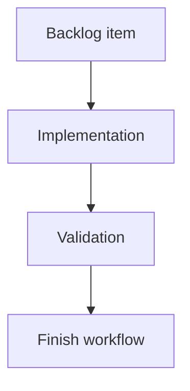

## task_057_req_060_accessibility_hardening_for_network_summary_modal_and_semantics_orchestration_and_delivery_control - req_060 accessibility hardening for network summary, modal, and semantics orchestration and delivery control
> From version: 0.9.6
> Status: Done
> Understanding: 99% (all six req_060 accessibility fixes are covered across SVG semantics, modal focus, tables, Validation rows, and issue counters)
> Confidence: 96% (changes are stable and validated by focused UI tests plus the full CI/e2e matrix)
> Progress: 100%
> Complexity: Medium-High
> Theme: Orchestration for req_060 accessibility hardening and regression safety
> Reminder: Update Understanding/Confidence/Progress and dependencies/references when you edit this doc.

> Maintenance edit: strict Logics corpus repair formalized gates, traceability, and workflow overview metadata.
# Definition of Done (DoD)
- [x] Linked acceptance criteria were delivered or explicitly closed in the task report.
- [x] Validation evidence is recorded in the task report or validation section.
- [x] Related request/backlog/task traceability is documented for the historical delivery chain.

# Context
`req_060` formalizes a targeted accessibility audit into 6 actionable fixes:
- interactive SVG semantics for `Network summary`,
- keyboard parity for selectable segments in the 2D diagram,
- onboarding modal focus management hardening,
- sortable table `aria-sort`,
- Validation row keyboard selection parity,
- assistive-tech exposure of issue counters in navigation/header controls.

The app already has good accessibility building blocks in parts of the shell and some tables, so this work should focus on consistency and explicit semantics without regressing established workflows.

# Objective
- Deliver the `req_060` accessibility hardening scope in a controlled sequence with regression coverage.
- Preserve current UX behavior while improving keyboard and screen-reader usability in key app surfaces.
- Finish with synchronized `logics` docs and a clean validation pass.

# Scope
- In:
  - Orchestrate `item_342`, `item_343`, `item_344`
  - Sequence interactive SVG and modal focus changes before broad semantics/test hardening
  - Run targeted a11y-relevant UI tests and final validation gates
  - Update request/backlog/task progress and closure notes
- Out:
  - Full app-wide accessibility certification or exhaustive theme contrast audit
  - Unrelated UI redesign work

# Backlog scope covered
- `logics/backlog/item_342_network_summary_2d_accessibility_semantics_and_segment_keyboard_activation_parity.md`
- `logics/backlog/item_343_onboarding_modal_focus_management_trap_escape_and_focus_return_hardening.md`
- `logics/backlog/item_344_sortable_table_aria_sort_validation_row_keyboard_selection_and_issue_counter_accessible_names.md`

# Plan
- [x] 1. Fix `Network summary` interactive SVG semantics and add keyboard parity for selectable segments (`item_342`)
- [x] 2. Harden onboarding modal focus management (`initial focus`, trap/containment, `Escape`, focus return) with tests (`item_343`)
- [x] 3. Add table/navigation semantics hardening (`aria-sort`, Validation row keyboard selection, issue counter accessible names) and regression coverage (`item_344`)
- [x] 4. Run targeted UI/a11y regression suites and fix failures
- [x] 5. Run final validation matrix
- [x] FINAL: Update related Logics docs

# Validation
- `python3 logics/skills/logics-doc-linter/scripts/logics_lint.py`
- `npm run -s lint`
- `npm run -s typecheck`
- `npm run -s test:ci`
- `npm run -s test:e2e`

# Targeted validation guidance (recommended during implementation)
- `npx vitest run src/tests/app.ui.navigation-canvas.spec.tsx`
- `npx vitest run src/tests/app.ui.navigation-canvas-validation-bridge.spec.tsx`
- `npx vitest run src/tests/app.ui.onboarding.spec.tsx`
- `npx vitest run src/tests/app.ui.validation.spec.tsx`
- `npx vitest run src/tests/app.ui.workspace-shell-regression.spec.tsx`

# Report
- Current blockers: none.
- Risks to track:
  - Changing interactive SVG semantics may affect test assumptions or assistive-tech exposure of descendants if implemented as an overly broad role change.
  - Segment keyboard activation can interfere with pan/zoom interactions if focus/hitbox behavior is not kept intentional.
  - Modal focus-trap tests can be brittle if tied to implementation details instead of user-observable focus behavior.
  - `aria-sort` rollout across many tables may drift if not implemented with a reusable pattern/helper.
- Delivery notes:
  - `Network summary` interactive SVG semantics were hardened and segment hitboxes gained keyboard activation parity (`role="button"`, focusability, accessible labels, `Enter`/`Space` activation).
  - Onboarding modal focus behavior was hardened (initial focus, focus containment in normal tab flow, `Escape` dismissal, focus return) with regression tests.
  - Sortable tables now expose `aria-sort`, Validation rows support keyboard selection parity, and issue counters in navigation/header are exposed via accessible names/text.
  - Final validation matrix re-run and passing in current workspace state: `logics_lint`, `lint`, `typecheck`, `build`, `quality:ui-modularization`, `quality:store-modularization`, `quality:pwa`, `test:ci`, `test:e2e`.

# References
- `logics/request/req_060_accessibility_hardening_for_interactive_network_summary_modal_focus_sortable_tables_and_validation_navigation.md`
- `logics/backlog/item_342_network_summary_2d_accessibility_semantics_and_segment_keyboard_activation_parity.md`
- `logics/backlog/item_343_onboarding_modal_focus_management_trap_escape_and_focus_return_hardening.md`
- `logics/backlog/item_344_sortable_table_aria_sort_validation_row_keyboard_selection_and_issue_counter_accessible_names.md`
- `src/app/components/NetworkSummaryPanel.tsx`
- `src/app/components/onboarding/OnboardingModal.tsx`
- `src/app/components/workspace/ValidationWorkspaceContent.tsx`
- `src/app/components/WorkspaceNavigation.tsx`
- `src/app/components/workspace/AppHeaderAndStats.tsx`
- `src/tests/app.ui.navigation-canvas.spec.tsx`
- `src/tests/app.ui.onboarding.spec.tsx`
- `src/tests/app.ui.validation.spec.tsx`
- `src/tests/app.ui.workspace-shell-regression.spec.tsx`

# AC Traceability
- request-AC1 -> This task. Evidence needed: The `Network summary` 2D SVG accessibility semantics no longer misrepresent an interactive surface as a static image, while preserving a meaningful accessible label/description.
- request-AC2 -> This task. Evidence needed: Selectable segments in the `Network summary` 2D diagram are keyboard focusable and activatable with accessible labels/roles.
- request-AC3 -> This task. Evidence needed: The onboarding modal has reliable focus management (initial focus, keyboard dismissal via `Escape`, and focus return on close; focus containment while open in normal usage).
- request-AC4 -> This task. Evidence needed: Sortable tables expose current sort state via `aria-sort` on the relevant headers without regressing visual sort indicators.
- request-AC5 -> This task. Evidence needed: Validation row selection is keyboard accessible and remains compatible with row-level `Go to` actions.
- request-AC6 -> This task. Evidence needed: Validation/ops issue counters shown in primary navigation/header are exposed to assistive technologies (accessible names/text include count information or equivalent).
- request-AC1 -> This task. Proof: Historical delivery is recorded in the linked backlog/task report and validation sections; this corpus repair formalizes strict audit traceability without changing shipped scope. Source: `logics corpus strict audit repair`
- request-AC2 -> This task. Proof: Historical delivery is recorded in the linked backlog/task report and validation sections; this corpus repair formalizes strict audit traceability without changing shipped scope. Source: `logics corpus strict audit repair`
- request-AC3 -> This task. Proof: Historical delivery is recorded in the linked backlog/task report and validation sections; this corpus repair formalizes strict audit traceability without changing shipped scope. Source: `logics corpus strict audit repair`
- request-AC4 -> This task. Proof: Historical delivery is recorded in the linked backlog/task report and validation sections; this corpus repair formalizes strict audit traceability without changing shipped scope. Source: `logics corpus strict audit repair`
- request-AC5 -> This task. Proof: Historical delivery is recorded in the linked backlog/task report and validation sections; this corpus repair formalizes strict audit traceability without changing shipped scope. Source: `logics corpus strict audit repair`
- request-AC6 -> This task. Proof: Historical delivery is recorded in the linked backlog/task report and validation sections; this corpus repair formalizes strict audit traceability without changing shipped scope. Source: `logics corpus strict audit repair`

