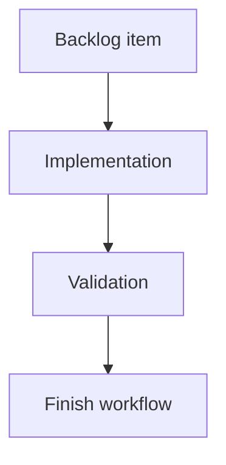

## task_062_req_065_segment_analysis_endpoint_column_split_orchestration_and_delivery_control - req_065 Segment analysis endpoint column split orchestration and delivery control
> From version: 0.9.8
> Status: Done
> Understanding: 100% (scope is locked: split `Endpoints` into ordered `Endpoint A` then `Endpoint B` columns in `Segments > Segment analysis`, with individually sortable split fields and no legacy `Endpoints` header fallback)
> Confidence: 99% (localized table/sort change delivered and validated with targeted suites plus full matrix)
> Progress: 100%
> Complexity: Medium
> Theme: Orchestration for segment-analysis traversing-wires endpoint column split delivery
> Reminder: Update Understanding/Confidence/Progress and dependencies/references when you edit this doc.

> Maintenance edit: strict Logics corpus repair formalized gates, traceability, and workflow overview metadata.
# Definition of Done (DoD)
- [x] Linked acceptance criteria were delivered or explicitly closed in the task report.
- [x] Validation evidence is recorded in the task report or validation section.
- [x] Related request/backlog/task traceability is documented for the historical delivery chain.

# Context
`req_065` improves readability in `Segments` > `Segment analysis` by replacing the combined `Endpoints` column in the traversing-wires table with two explicit columns:
- `Endpoint A`
- `Endpoint B`

This change affects:
- table header layout,
- endpoint cell rendering,
- sort contract and `aria-sort` semantics,
- regression coverage for segment-analysis table behavior.

# Objective
- Deliver the endpoint-column split in the segment-analysis traversing-wires table with deterministic sorting and non-regressed table semantics.
- Preserve endpoint-side formatting semantics already used by `describeWireEndpoint(...)`.
- Use lexicographic sorting on endpoint-side displayed text (or semantically equivalent normalized values) for `Endpoint A` and `Endpoint B`.
- Synchronize `logics` docs after delivery.

# Scope
- In:
  - Orchestrate `item_358`..`item_360`
  - Sequence UI column split before sort-contract updates and regression hardening
  - Run targeted and final validation gates
  - Update request/backlog/task progress and delivery notes
- Out:
  - Changes to other tables outside `Segments > Segment analysis`
  - Endpoint formatting redesign beyond splitting the column

# Backlog scope covered
- `logics/backlog/item_358_segment_analysis_traversing_wires_table_split_endpoints_into_endpoint_a_and_endpoint_b_columns.md`
- `logics/backlog/item_359_segment_analysis_traversing_wires_sort_contract_update_for_endpoint_a_and_endpoint_b_columns.md`
- `logics/backlog/item_360_regression_coverage_for_segment_analysis_endpoint_column_split_and_sort_semantics.md`

# Plan
- [x] 1. Split segment-analysis traversing-wires `Endpoints` column into `Endpoint A` and `Endpoint B` while preserving endpoint-side rendering semantics (`item_358`)
- [x] 2. Update traversing-wires sort contract, header wiring, and `aria-sort` semantics for split endpoint columns (`item_359`)
- [x] 3. Add regression coverage for header split, endpoint placement, and endpoint-column sorting semantics (`item_360`)
- [x] 4. Run targeted segment-analysis validation suites and fix regressions
- [x] 5. Run final validation matrix
- [x] FINAL: Update related `logics` docs (request/backlog/task progress + delivery summary)

# Validation
- `python3 logics/skills/logics-doc-linter/scripts/logics_lint.py`
- `npm run -s lint`
- `npm run -s typecheck`
- `npm run -s quality:ui-modularization`
- `npm run -s quality:store-modularization`
- `npm run -s quality:pwa`
- `npm run -s build`
- `npm run -s test:ci`
- `npm run -s test:e2e`

# Targeted validation guidance (recommended during implementation)
- `npx vitest run src/tests/app.ui.navigation-canvas.spec.tsx`
- `npx vitest run src/tests/app.ui.list-ergonomics.spec.tsx`
- `npx vitest run src/tests/app.ui.segment-analysis.spec.tsx`

# Report
- Current blockers: none.
- Validation snapshot (delivery):
  - `npx vitest run src/tests/app.ui.list-ergonomics.spec.tsx` ✅
  - `npx vitest run src/tests/app.ui.navigation-canvas.spec.tsx` ✅
  - `python3 logics/skills/logics-doc-linter/scripts/logics_lint.py` ✅
  - `npm run -s lint` ✅
  - `npm run -s typecheck` ✅
  - `npm run -s quality:ui-modularization` ✅
  - `npm run -s quality:store-modularization` ✅
  - `npm run -s build` ✅
  - `npm run -s quality:pwa` ✅
  - `npm run -s test:ci` ✅ (`44` files / `279` tests)
  - `npm run -s test:e2e` ✅ (`2` tests)
- Risks to track:
  - Endpoint split updates headers/cells but leaves stale `endpoints` sort field references in state or comparators.
  - `aria-sort` regresses due to mismatched header sort keys after introducing `endpointA`/`endpointB`.
  - Added column width degrades readability/wrapping for adjacent columns on common desktop widths.
  - Tests assert old `Endpoints` header text and fail outside the intended segment-analysis table scope.
- Delivery notes:
  - Prefer minimal churn localized to the segment-analysis traversing-wires table.
  - Keep endpoint cell text semantics identical to current `describeWireEndpoint(...)` output for each side.
  - Lock column order as `Endpoint A` then `Endpoint B`; remove the combined `Endpoints` header entirely in the target table.
  - If the table width becomes crowded, adjust column wrapping/width behavior without changing data semantics.
  - Add dedicated assertions for absence of the combined `Endpoints` header in the target table to lock the UX change.
  - Delivered the split in `Segment analysis` traversing-wires table: separate `Endpoint A` and `Endpoint B` columns replace the legacy combined `Endpoints` column.
  - Updated sort wiring and `aria-sort` semantics to use independent `endpointA` / `endpointB` sort fields with lexicographic comparison of displayed endpoint text.
  - Added integration regression coverage in `app.ui.list-ergonomics.spec.tsx` verifying header split, legacy-header removal, and sortable behavior for both split endpoint columns.

# References
- `logics/request/req_065_segment_analysis_split_endpoints_column_into_endpoint_a_and_endpoint_b.md`
- `logics/backlog/item_358_segment_analysis_traversing_wires_table_split_endpoints_into_endpoint_a_and_endpoint_b_columns.md`
- `logics/backlog/item_359_segment_analysis_traversing_wires_sort_contract_update_for_endpoint_a_and_endpoint_b_columns.md`
- `logics/backlog/item_360_regression_coverage_for_segment_analysis_endpoint_column_split_and_sort_semantics.md`
- `src/app/components/workspace/AnalysisNodeSegmentWorkspacePanels.tsx`
- `src/app/lib/tableSort.ts`
- `src/tests/app.ui.navigation-canvas.spec.tsx`
- `src/tests/app.ui.list-ergonomics.spec.tsx`

# AC Traceability
- request-AC1 -> This task. Evidence needed: In `Segments` > `Segment analysis`, the traversing-wires table replaces `Endpoints` with `Endpoint A` and `Endpoint B`.
- request-AC2 -> This task. Evidence needed: The split columns preserve the endpoint-side information previously shown in the combined `Endpoints` cell.
- request-AC3 -> This task. Evidence needed: Sorting and `aria-sort` semantics work for the new endpoint columns.
- request-AC4 -> This task. Evidence needed: Existing `Segment analysis` table behavior and readability remain non-regressed.
- request-AC1 -> This task. Proof: Historical delivery is recorded in the linked backlog/task report and validation sections; this corpus repair formalizes strict audit traceability without changing shipped scope. Source: `logics corpus strict audit repair`
- request-AC2 -> This task. Proof: Historical delivery is recorded in the linked backlog/task report and validation sections; this corpus repair formalizes strict audit traceability without changing shipped scope. Source: `logics corpus strict audit repair`
- request-AC3 -> This task. Proof: Historical delivery is recorded in the linked backlog/task report and validation sections; this corpus repair formalizes strict audit traceability without changing shipped scope. Source: `logics corpus strict audit repair`
- request-AC4 -> This task. Proof: Historical delivery is recorded in the linked backlog/task report and validation sections; this corpus repair formalizes strict audit traceability without changing shipped scope. Source: `logics corpus strict audit repair`
- request-AC1A -> This task. Proof: Historical delivery or planned chain is recorded in the linked Logics report and validation sections; this corpus repair formalizes strict audit traceability without changing shipped scope. Source: `logics corpus strict audit repair`

