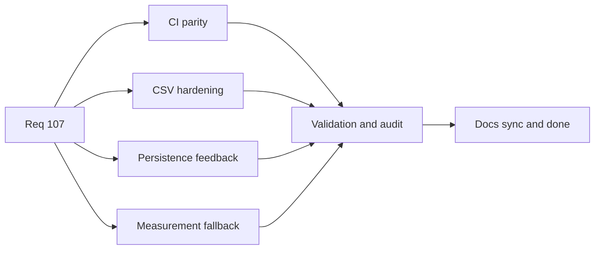

## task_086_req_107_post_release_ci_csv_persistence_and_export_test_signal_hardening_orchestration_and_delivery_control - Req 107 post release CI CSV persistence and export test signal hardening orchestration and delivery control
> From version: 1.4.0
> Status: Ready
> Understanding: 98%
> Confidence: 96%
> Progress: 0%
> Complexity: High
> Theme: General
> Reminder: Update status/understanding/confidence/progress and dependencies/references when you edit this doc.

# Context
- Request: `req_107_post_release_ci_csv_persistence_and_export_test_signal_hardening`.
- Backlog anchors:
  - `item_525_local_and_github_blocking_ci_command_parity_and_shared_orchestration`
  - `item_526_csv_formula_neutralization_hardening_for_whitespace_and_control_prefixed_inputs`
  - `item_527_persistence_write_failure_runtime_feedback_without_reducer_instability`
  - `item_528_export_and_callout_measurement_fallback_signal_hardening_for_jsdom_canvas_gaps`
  - `item_529_req_107_validation_matrix_and_traceability_closure`

# Plan
- [ ] 1. Align the canonical local blocking CI command with GitHub blocking CI gates
- [ ] 2. Harden CSV formula neutralization for whitespace and control prefixed dangerous inputs
- [ ] 3. Add visible persistence write failure feedback without destabilizing reducer or runtime flow
- [ ] 4. Harden export and callout measurement fallback behavior for unsupported jsdom canvas environments
- [ ] 5. Add targeted regression coverage and run req_107 validation matrix
- [ ] FINAL: Update related Logics docs and synchronize statuses

# AC Traceability
- AC1 Proof: item `525`.
- AC2 Proof: item `525`.
- AC3 Proof: item `526`.
- AC4 Proof: item `526`.
- AC5 Proof: item `526`.
- AC6 Proof: item `527`.
- AC7 Proof: item `527`.
- AC8 Proof: item `528`.
- AC9 Proof: item `528`.
- AC10 Proof: item `529`.

# Links
- Backlog item: `item_525_local_and_github_blocking_ci_command_parity_and_shared_orchestration`
- Backlog item: `item_526_csv_formula_neutralization_hardening_for_whitespace_and_control_prefixed_inputs`
- Backlog item: `item_527_persistence_write_failure_runtime_feedback_without_reducer_instability`
- Backlog item: `item_528_export_and_callout_measurement_fallback_signal_hardening_for_jsdom_canvas_gaps`
- Backlog item: `item_529_req_107_validation_matrix_and_traceability_closure`
- Request(s): `req_107_post_release_ci_csv_persistence_and_export_test_signal_hardening`

# Validation
- `python3 logics/skills/logics-doc-linter/scripts/logics_lint.py`
- `python3 logics/skills/logics-flow-manager/scripts/workflow_audit.py --legacy-cutoff-version 1.1.0 --group-by-doc --skip-ac-traceability`
- canonical local blocking CI command after alignment
- targeted regression suites for CSV export, persistence failure reporting, and export/callout fallback behavior

# Definition of Done (DoD)
- [ ] Scope implemented and acceptance criteria covered.
- [ ] Validation commands executed and results captured.
- [ ] Linked request/backlog/task docs updated.
- [ ] Status is `Done` and progress is `100%`.

# Report
- To complete at delivery:
  - final CI parity command/reporting outcome;
  - CSV hardening summary and proof;
  - persistence feedback behavior summary;
  - export/callout test-signal hardening proof;
  - final validation matrix and doc closure references.

