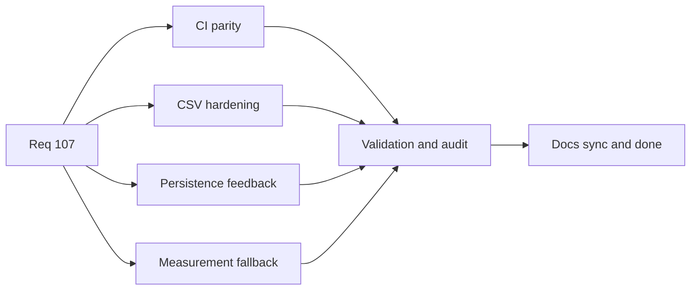

## task_086_req_107_post_release_ci_csv_persistence_and_export_test_signal_hardening_orchestration_and_delivery_control - Req 107 post release CI CSV persistence and export test signal hardening orchestration and delivery control
> From version: 1.4.0
> Status: Done
> Understanding: 100%
> Confidence: 98%
> Progress: 100%
> Complexity: High
> Theme: General
> Reminder: Update status/understanding/confidence/progress and dependencies/references when you edit this doc.

# Context
- Request: `req_107_post_release_ci_csv_persistence_and_export_test_signal_hardening`.
- Backlog anchors:
  - `item_525_local_and_github_blocking_ci_command_parity_and_shared_orchestration`
  - `item_526_csv_formula_neutralization_hardening_for_whitespace_and_control_prefixed_inputs`
  - `item_527_persistence_write_failure_runtime_feedback_without_reducer_instability`
  - `item_528_export_and_callout_measurement_fallback_signal_hardening_for_jsdom_canvas_gaps`
  - `item_529_req_107_validation_matrix_and_traceability_closure`

# Plan
- [x] 1. Align the canonical local blocking CI command with GitHub blocking CI gates
- [x] 2. Harden CSV formula neutralization for whitespace and control prefixed dangerous inputs
- [x] 3. Add visible persistence write failure feedback without destabilizing reducer or runtime flow
- [x] 4. Harden export and callout measurement fallback behavior for unsupported jsdom canvas environments
- [x] 5. Update `README.md` for the shared blocking CI pipeline and delivered persistence behavior
- [x] 6. Generate a changelog entry in `changelogs/` using the project version current at task completion time
- [x] 7. Add targeted regression coverage and run req_107 validation matrix
- [x] FINAL: Update related Logics docs and synchronize statuses

# AC Traceability
- AC1 Proof: item `525`.
- AC2 Proof: item `525`.
- AC3 Proof: item `526`.
- AC4 Proof: item `526`.
- AC5 Proof: item `526`.
- AC6 Proof: item `527`.
- AC7 Proof: item `527`.
- AC8 Proof: item `528`.
- AC9 Proof: item `528`.
- AC10 Proof: item `529`.

# Links
- Backlog item: `item_525_local_and_github_blocking_ci_command_parity_and_shared_orchestration`
- Backlog item: `item_526_csv_formula_neutralization_hardening_for_whitespace_and_control_prefixed_inputs`
- Backlog item: `item_527_persistence_write_failure_runtime_feedback_without_reducer_instability`
- Backlog item: `item_528_export_and_callout_measurement_fallback_signal_hardening_for_jsdom_canvas_gaps`
- Backlog item: `item_529_req_107_validation_matrix_and_traceability_closure`
- Request(s): `req_107_post_release_ci_csv_persistence_and_export_test_signal_hardening`

# Validation
- `python3 logics/skills/logics-doc-linter/scripts/logics_lint.py`
- `python3 logics/skills/logics-flow-manager/scripts/workflow_audit.py --legacy-cutoff-version 1.1.0 --group-by-doc --skip-ac-traceability`
- `npm test -- --run src/tests/csv.export.spec.ts src/tests/store.create-store.spec.ts src/tests/app.ui.persistence-feedback.spec.tsx src/tests/app.ui.network-summary-bom-export.spec.tsx src/tests/app.ui.network-summary-workflow-polish.spec.tsx`
- `npm run -s test:ci:segmentation:check`
- `npm run -s quality:ui-modularization`
- `npm run -s ci:blocking`

# Definition of Done (DoD)
- [x] Scope implemented and acceptance criteria covered.
- [x] `README.md` reflects the canonical shared blocking CI path and runtime persistence warning behavior.
- [x] A changelog file is generated in `changelogs/` using the project version current when the task is finished.
- [x] Validation commands executed and results captured.
- [x] Linked request/backlog/task docs updated.
- [x] Status is `Done` and progress is `100%`.

# Report
- Delivered:
  - `ci:blocking` now acts as the single shared blocking CI command for local validation and GitHub Actions, with `ci:local` reduced to an alias.
  - CSV export neutralization now treats leading whitespace/control-prefixed formula payloads as dangerous while preserving existing numeric/text behavior.
  - Persistence writes now return explicit save outcomes and surface a visible runtime warning that clears once storage saves recover.
  - Export/cartouche, callout, and PNG helper paths now share unsupported-canvas detection that avoids repeated jsdom `getContext` noise during successful tests.
  - README and changelog updates were generated for version `1.4.1`.
- Validation executed:
  - `python3 logics/skills/logics-doc-linter/scripts/logics_lint.py`
  - `python3 logics/skills/logics-flow-manager/scripts/workflow_audit.py --legacy-cutoff-version 1.1.0 --group-by-doc --skip-ac-traceability`
  - `npm test -- --run src/tests/csv.export.spec.ts src/tests/store.create-store.spec.ts src/tests/app.ui.persistence-feedback.spec.tsx src/tests/app.ui.network-summary-bom-export.spec.tsx src/tests/app.ui.network-summary-workflow-polish.spec.tsx`
  - `npm run -s test:ci:segmentation:check`
  - `npm run -s quality:ui-modularization`
  - `npm run -s ci:blocking`
