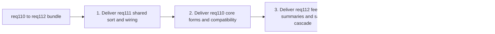

## task_090_super_orchestration_delivery_execution_for_req_110_to_req_112_with_validation_gates_and_staged_checkpoints - Super orchestration delivery execution for req 110 to req 112 with validation gates and staged checkpoints
> From version: 1.4.3
> Schema version: 1.0
> Status: Done
> Understanding: 97%
> Confidence: 95%
> Progress: 100%
> Complexity: High
> Theme: Cross-request delivery coordination for req_110 to req_112
> Reminder: Update status/understanding/confidence/progress and dependencies/references when you edit this doc.

> Maintenance edit: strict Logics corpus repair formalized gates, traceability, and workflow overview metadata.
# Context
This orchestration task coordinates a three-request delivery bundle:
- `req_110`: assisted wire sizing from current, material, network voltage, and wire length
- `req_111`: alphabetical ordering for dynamic dropdown menus in `Modeling`
- `req_112`: explicit blocked-delete feedback and conservative dependency-aware cascade delete support

The bundle intentionally mixes risk levels:
- `req_111` is a localized, low-risk modeling UX improvement;
- `req_110` introduces new model fields, form UX, and compatibility work;
- `req_112` changes destructive-action UX and may introduce bounded cascade deletion.

This task does not replace the backlog items. It defines the delivery order, validation discipline, and integration checkpoints across items `542` to `552`.

# Objective
- Deliver items `542` to `552` in a controlled order with clear regression gates.
- Land smaller, lower-risk form-ordering work before model and destructive-action changes.
- Keep one shared report for blockers, execution order, validation snapshots, and closure readiness.

# Scope
- In:
  - define execution order and validation gates for items `542` to `552`;
  - track collisions across modeling forms, persistence, and delete-modal flows;
  - require request/backlog/task documentation updates as slices complete;
  - run and record final bundle-level validation before closure.
- Out:
  - replacing the detailed scope inside each backlog item;
  - adding new product scope beyond `req_110`, `req_111`, and `req_112`;
  - git history rewriting strategy.

# Attention points
- Validation gate after every completed step.
- Keep `req_112` last among the major features because destructive-action changes are the riskiest.
- Do not offer cascade delete unless the exact impact summary is available and documented.
- Leave each completed wave in a coherent, commit-ready state.

# Plan
- [x] 1. Deliver `item_546` shared alphabetical sorting contract for modeling dynamic dropdown options.
- [x] 2. Deliver `item_547` modeling form dropdown wiring for alphabetical ordering and missing fallback pinning.
- [x] 3. Deliver `item_542` wire sizing metadata and recommendation core contract.
- [x] 4. Deliver `item_543` wire and network forms for assisted sizing with helper text and explicit `Apply`.
- [x] 5. Deliver `item_544` wire sizing persistence compatibility and standard section normalization.
- [x] 6. Deliver `item_549` dedicated blocked delete feedback modal and delete guard explanation orchestration.
- [x] 7. Deliver `item_550` delete dependency summary contract and representative impacted reference visibility.
- [x] 8. Deliver `item_551` safe connector and splice cascade delete confirmation and execution contract, only if the exact impact set is provably bounded.
- [x] 9. Close req-specific validation and traceability items `545`, `548`, and `552`.
- [x] FINAL: Run final integration validation, update request/backlog/task docs, and record closure notes.

# Delivery checkpoints
- Each completed wave should leave the repository in a coherent, commit-ready state.
- Update linked Logics docs during the wave that changes the behavior, not only at final closure.
- Prefer reviewed checkpoints after each meaningful wave instead of accumulating undocumented partial states.

# AC Traceability
- Req_111 AC1 to AC6 -> covered by steps 1, 2, and closure item `548`.
- Req_110 AC1 to AC10 -> covered by steps 3, 4, 5, and closure item `545`.
- Req_112 AC1 to AC9 -> covered by steps 6, 7, 8, and closure item `552`.
- request-AC1 -> This task. Evidence needed: Each delete action in UI opens a styled confirmation modal before dispatching delete mutation.
- request-AC2 -> This task. Evidence needed: Cancel always leaves state unchanged for delete operations.
- request-AC3 -> This task. Evidence needed: Confirm executes existing delete mutation flow and preserves current guard/error semantics.
- request-AC4 -> This task. Evidence needed: Delete confirmation modal content is explicit and entity-specific.
- request-AC5 -> This task. Evidence needed: No `window.confirm` remains in delete-action paths.
- request-AC1 -> This task. Evidence needed: When a wire has valid current input, valid material input or default copper behavior, valid computed length, and the active network has valid voltage, the app can produce a recommended wire section.
- request-AC2 -> This task. Evidence needed: The recommended result is normalized to one of the standard supported wire sections used by the product.
- request-AC3 -> This task. Evidence needed: In the wire create/edit form, the recommendation is shown directly below `Section (mm²)` as helper text with an explicit `Apply` action.
- request-AC4 -> This task. Evidence needed: `sectionMm2` remains user-editable and the recommendation does not remove manual override capability.
- request-AC5 -> This task. Evidence needed: The recommendation is recalculated live from the current draft/context inputs and is not applied automatically.
- request-AC6 -> This task. Evidence needed: Network voltage is editable and persisted at network scope without regressing existing network workflows.
- request-AC7 -> This task. Evidence needed: Wire current and material are editable and persisted at wire scope without regressing existing wire workflows.
- request-AC8 -> This task. Evidence needed: When required inputs are missing or invalid, the app does not fabricate a recommendation and existing manual section behavior still works.
- request-AC9 -> This task. Evidence needed: Existing persisted/imported networks and wires that lack the new voltage/current/material fields remain loadable and editable.
- request-AC10 -> This task. Evidence needed: Regression tests cover recommendation logic, default copper behavior, form semantics, and compatibility paths.
- request-AC1 -> This task. Evidence needed: Dynamic dropdowns in the `Modeling` screens that list current entities or catalog items are displayed in alphabetical order by user-visible label.
- request-AC2 -> This task. Evidence needed: Static semantic dropdowns in `Modeling` keep their deliberate non-alphabetical order.
- request-AC3 -> This task. Evidence needed: Alphabetical sorting is case-insensitive and based on trimmed visible option labels.
- request-AC4 -> This task. Evidence needed: Existing create/edit/save behavior remains unchanged apart from option ordering.
- request-AC5 -> This task. Evidence needed: Missing selected fallback options, when present for compatibility reasons, remain visible, usable, and pinned above the normal sorted options.
- request-AC6 -> This task. Evidence needed: Regression tests cover representative connector, splice, wire, node, and segment modeling dropdown ordering behavior.
- request-AC1 -> This task. Evidence needed: A delete action blocked by existing dependencies gives immediate explicit feedback and no longer feels like a silent no-op.
- request-AC2 -> This task. Evidence needed: The blocked-delete feedback identifies the reason category for the failure, not just that the delete did not occur.
- request-AC3 -> This task. Evidence needed: Blocked delete feedback is shown in a dedicated modal/dialog tied to the delete attempt and does not depend on the top-level error banner alone.
- request-AC4 -> This task. Evidence needed: For any entity types that support cascade deletion in V1, the user receives a dedicated impact summary and must explicitly confirm removal of the target plus its listed dependents.
- request-AC5 -> This task. Evidence needed: Canceling a blocked-delete explanation or cascade-delete confirmation leaves state unchanged.
- request-AC6 -> This task. Evidence needed: Existing delete confirmation behavior from `req_074` remains non-regressed for normal deletions.
- request-AC7 -> This task. Evidence needed: Integrity guards remain enforced for unsupported or unsafe cascade cases.
- request-AC8 -> This task. Evidence needed: By default, `node`, `segment`, `catalog item`, and `network` blocked deletions remain explanation-only in V1 unless a later explicit expansion is documented.
- request-AC9 -> This task. Evidence needed: Regression tests cover representative connector, splice, node, and catalog blocked-delete flows, plus any supported cascade cases.
- request-AC1 -> This task. Proof: Historical delivery is recorded in the linked backlog/task report and validation sections; this corpus repair formalizes strict audit traceability without changing shipped scope. Source: `logics corpus strict audit repair`
- request-AC2 -> This task. Proof: Historical delivery is recorded in the linked backlog/task report and validation sections; this corpus repair formalizes strict audit traceability without changing shipped scope. Source: `logics corpus strict audit repair`
- request-AC3 -> This task. Proof: Historical delivery is recorded in the linked backlog/task report and validation sections; this corpus repair formalizes strict audit traceability without changing shipped scope. Source: `logics corpus strict audit repair`
- request-AC4 -> This task. Proof: Historical delivery is recorded in the linked backlog/task report and validation sections; this corpus repair formalizes strict audit traceability without changing shipped scope. Source: `logics corpus strict audit repair`
- request-AC5 -> This task. Proof: Historical delivery is recorded in the linked backlog/task report and validation sections; this corpus repair formalizes strict audit traceability without changing shipped scope. Source: `logics corpus strict audit repair`

# Decision framing
- Product framing: Not needed
- Product signals: (none detected)
- Product follow-up: No product brief follow-up is expected based on current signals.
- Architecture framing: Not needed
- Architecture signals: (none detected)
- Architecture follow-up: No architecture decision follow-up is expected based on current signals.

# Links
- Product brief(s): (none yet)
- Architecture decision(s): (none yet)
- Backlog item: `logics/backlog/item_542_wire_sizing_metadata_and_recommendation_core_contract.md` through `logics/backlog/item_552_req_112_validation_matrix_and_blocked_delete_closure_traceability.md`
- Request(s):
  - `logics/request/req_110_automatic_recommended_wire_section_from_current_material_network_voltage_and_wire_length.md`
  - `logics/request/req_111_alphabetically_sorted_dropdown_menus_in_modeling_screens.md`
  - `logics/request/req_112_explicit_blocked_delete_feedback_and_dependency_aware_cascade_delete_confirmation.md`

# AI Context
- Summary: Orchestrate delivery of req_110 to req_112 by sequencing modeling dropdown ordering first, assisted wire sizing second, and blocked-delete UX plus safe cascade last.
- Keywords: req110, req111, req112, orchestration, validation gates, checkpoints, modeling, delete modal
- Use when: Use when executing or reviewing the delivery order for the current request bundle.
- Skip when: Skip when working on an unrelated backlog slice outside items `542` to `552`.

# Validation
## Minimum step gate
- `python3 logics/skills/logics-doc-linter/scripts/logics_lint.py` when Logics docs change in the step
- `npm run -s typecheck`
- targeted tests for the touched surface
- run broader checks when shared UI, persistence, or destructive-action flows are touched:
  - `npm run -s build`
  - `npm test -- --run <relevant targeted specs>`

## Final integration gate
- `python3 logics/skills/logics-doc-linter/scripts/logics_lint.py`
- `npm run -s lint`
- `npm run -s typecheck`
- `npm run -s build`
- `npm run -s test:ci`

# Definition of Done (DoD)
- [x] Scope implemented and acceptance criteria covered.
- [x] Validation commands executed and results captured.
- [x] Linked request/backlog/task docs updated during completed waves and at closure.
- [x] Each completed wave left a commit-ready checkpoint or an explicit exception is documented.
- [x] Status is `Done` and progress is `100%`.

# Report
- Current blockers: none.
- Execution rationale:
  - `req_111` first because it is the most localized and de-risks form option handling with minimal architectural churn.
  - `req_110` second because it adds new contracts and compatibility work but remains less risky than destructive-action workflow changes.
  - `req_112` last because delete UX and cascade behavior have the highest regression and integrity risk.
- Completed waves:
  - `req_111` shared modeling dropdown ordering is delivered, including the reusable comparator helper, form wiring across the in-scope selects, missing fallback pinning, and targeted regression coverage.
  - `req_110` assisted wire sizing is delivered, including new network/wire sizing metadata, centralized recommendation logic, helper-text plus explicit `Apply` UX, and persistence/import-export compatibility coverage.
  - `req_112` blocked delete UX is delivered, including a dedicated delete-impact modal, structured dependency summaries for representative guarded delete flows, conservative connector/splice cascade delete support, and undo/redo-safe cascade actions.
- Latest validation snapshot:
  - `npm run -s lint`
  - `npm run -s typecheck`
  - `npm test -- --run src/tests/app.ui.delete-confirmations.spec.tsx`
  - `npm test -- --run src/tests/wire-sizing.spec.ts src/tests/store.reducer.networks.spec.ts src/tests/store.reducer.wires.spec.ts src/tests/portability.network-file.spec.ts src/tests/persistence.localStorage.spec.ts src/tests/app.ui.wire-sizing-recommendation.spec.tsx`
  - `npm test -- --run src/tests/modeling-select-options.spec.ts src/tests/app.ui.modeling-dropdown-ordering.spec.tsx src/tests/app.ui.creation-flow-ergonomics.spec.tsx src/tests/app.ui.creation-flow-wire-endpoint-refs.spec.tsx`
  - `npm run -s build`
  - `python3 logics/skills/logics-doc-linter/scripts/logics_lint.py`

# Strict Audit Backlog Links
- `logics/backlog/item_546_shared_alphabetical_sorting_contract_for_modeling_dynamic_dropdown_options.md`
- `logics/backlog/item_547_modeling_form_dropdown_wiring_for_alphabetical_option_ordering_and_missing_fallback_pinning.md`
- `logics/backlog/item_548_req_111_validation_matrix_and_modeling_dropdown_ordering_closure_traceability.md`

