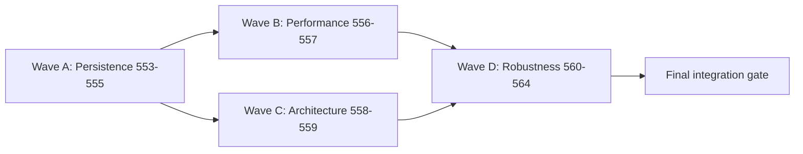

## task_091_orchestration_delivery_execution_for_req_113_technical_debt_hardening - Orchestration delivery execution for req_113 technical debt hardening
> From version: 1.4.4
> Schema version: 1.0
> Status: In Progress
> Understanding: 96%
> Confidence: 93%
> Progress: 75%
> Complexity: High
> Theme: Technical hardening / orchestration across persistence, performance, architecture, and robustness
> Reminder: Update status/understanding/confidence/progress and dependencies/references when you edit this doc.

# Context
This orchestration task coordinates the delivery of `req_113`, a single-wave technical hardening request covering 12 audit issues identified at v1.4.4. The wave is organized into four categories delivered in priority order:

- **Wave A — Persistence safety (critical):** items `553`, `554`, `555`
- **Wave B — Performance (high):** items `556`, `557`
- **Wave C — Architecture quality (high):** items `558`, `559`
- **Wave D — Robustness and testing (medium):** items `560`, `561`, `562`, `563`, `564`

The delivery order reflects risk and dependency:
- Wave A must be delivered first because it protects existing user data; `item_554` depends on `item_553`.
- Wave B can be delivered in parallel with Wave A but should be validated independently.
- Wave C items are independent of each other and of Waves A–B but carry higher regression risk; each increment must be validated before the next.
- Wave D items are mostly independent and can be interleaved with Wave C, except `item_561` which depends on `item_553` and `item_554`.

This task does not replace the detailed scope inside each backlog item. It defines the delivery order, validation discipline, and integration checkpoints.

# Objective
- Deliver all 12 hardening items in a controlled, regression-safe order.
- Land persistence fixes before performance and architecture changes, since data safety is highest priority.
- Keep each wave in a commit-ready state after its validation gate passes.
- Maintain one shared report for blockers, execution order, validation snapshots, and closure readiness.

# Scope
- In:
  - define execution order and validation gates for items `553` to `564`;
  - track dependencies and potential collisions across the four waves;
  - require request/backlog/task documentation updates as each wave completes;
  - run and record final bundle-level validation before closure.
- Out:
  - replacing the detailed scope inside each backlog item;
  - adding new product features beyond `req_113`;
  - delivering the long-term state consolidation (C2 follow-up ADR, out of scope per the request).

# Attention points
- `item_554` (migration rollback) must be delivered after `item_553` (safe parse wrapper) because the rollback path relies on the safe wrapper.
- `item_561` (migration spec) must be delivered after `item_553` and `item_554` to validate the full recovery contract.
- `item_558` (AppController decomposition) carries the highest regression risk; run all `app.ui.*.spec.tsx` after each increment before proceeding.
- `item_563` (canvas viewport in store) is the most architecturally invasive item in Wave D; deliver it last within the wave.
- Validation gate after every completed wave; never start the next wave with a red CI.

# Plan

## Wave A — Persistence safety (critical)
- [x] 1. Deliver `item_553`: safe `parseJsonSafe<T>()` wrapper and boot recovery UI.
- [x] 2. Deliver `item_554`: migration backup, rollback on failure, and explicit user feedback.
- [x] 3. Deliver `item_555`: localStorage quota awareness and `QuotaExceededError` surfacing.
- [x] A-GATE: Run `npm run -s lint && npm run -s typecheck && npm test -- --run src/tests/persistence && npm run -s build`. All green before proceeding.

## Wave B — Performance
- [x] 4. Deliver `item_556`: replace `queue.sort()` with `MinHeap` in pathfinding.
- [x] 5. Deliver `item_557`: memoize `selectRoutingGraphIndex` with structural `createSelector`.
- [x] B-GATE: Run `npm run -s typecheck && npm test -- --run src/tests/core.pathfinding.spec.ts src/tests/core.graph.spec.ts && npm run -s build`. All green before proceeding.

## Wave C — Architecture quality
- [x] 6. Deliver `item_558`: AppController Context providers, `useMemo` on derived state objects, and `ModelingController` extraction. Validate after each increment.
- [x] 7. Deliver `item_559`: audit all domain reducers for missing sync calls, add missing calls, and introduce enforcement wrapper.
- [x] C-GATE: Run `npm run -s lint && npm run -s typecheck && npm test -- --run src/tests/app.ui src/tests/store.reducer && npm run -s build`. All green before proceeding.

## Wave D — Robustness and testing
- [ ] 8. Deliver `item_560`: unit tests for the five controller hooks in isolation.
- [ ] 9. Deliver `item_561`: dedicated migration spec with version fixtures and corrupt-input coverage.
- [ ] 10. Deliver `item_562`: universal occupancy index validation before all occupancy map writes.
- [ ] 11. Deliver `item_564`: structured `AppError` type replacing raw `lastError` string.
- [ ] 12. Deliver `item_563`: canvas viewport state in store and undo/redo history integration. (Deliver last — highest architectural impact within Wave D.)
- [ ] D-GATE: Run `npm run -s typecheck && npm run -s test:ci && npm run -s build`. All green before final gate.

## Final integration
- [ ] FINAL: Run full integration gate (see Validation section below). Update all linked request/backlog/task docs. Record closure notes.

# Delivery checkpoints
- Each completed wave must leave the repository in a coherent, commit-ready state.
- Update linked Logics docs (request, backlog items) during the wave that changes the behavior, not only at final closure.
- Prefer reviewed checkpoints after each wave instead of accumulating undocumented partial states.

# AC Traceability
- Req_113 AC1 → `item_553` (safe JSON.parse, boot recovery UI)
- Req_113 AC2 → `item_554` (migration backup and rollback)
- Req_113 AC3 → `item_555` (quota awareness and QuotaExceededError)
- Req_113 AC4 → `item_556` (min-heap pathfinding)
- Req_113 AC5 → `item_557` (graph selector memoization)
- Req_113 AC6, AC6b → `item_558` (AppController Context providers and useMemo)
- Req_113 AC7 → `item_559` (sync invariant audit and enforcement)
- Req_113 AC8 → `item_560` (hook unit tests)
- Req_113 AC9 → `item_561` (migration spec)
- Req_113 AC10 → `item_562` (occupancy index validation)
- Req_113 AC11 → `item_563` (canvas viewport in undo/redo)
- Req_113 AC12 → `item_564` (structured AppError)

# Decision framing
- Product framing: Not needed (this is a purely technical hardening wave).
- Architecture framing: `item_559` (C2 long-term consolidation) and `item_563` (canvas state in store) may each warrant a follow-up ADR; record the need in the task report if confirmed during delivery.

# Links
- Product brief(s): (none)
- Architecture decision(s): (none yet — follow-up ADRs may be triggered by `item_559` and `item_563`)
- Request: `logics/request/req_113_technical_debt_hardening_persistence_safety_performance_and_architecture_quality.md`
- Backlog items:
  - `logics/backlog/item_553_safe_json_parse_wrapper_and_boot_recovery_ui_for_corrupted_localstorage.md`
  - `logics/backlog/item_554_migration_backup_and_rollback_on_failure_with_explicit_user_feedback.md`
  - `logics/backlog/item_555_localstorage_quota_awareness_and_write_failure_surfacing.md`
  - `logics/backlog/item_556_replace_pathfinding_queue_sort_with_min_heap_priority_queue.md`
  - `logics/backlog/item_557_memoize_routing_graph_construction_in_selector.md`
  - `logics/backlog/item_558_appcontroller_decomposition_context_providers_and_derived_state_memoization.md`
  - `logics/backlog/item_559_audit_and_enforce_sync_invariant_between_global_and_network_scoped_state.md`
  - `logics/backlog/item_560_unit_tests_for_controller_hooks_in_isolation.md`
  - `logics/backlog/item_561_dedicated_migration_spec_with_version_fixtures_and_corrupt_input_coverage.md`
  - `logics/backlog/item_562_universal_occupancy_index_validation_before_map_writes.md`
  - `logics/backlog/item_563_canvas_viewport_state_in_store_and_undo_redo_history_integration.md`
  - `logics/backlog/item_564_structured_app_error_type_replacing_monolithic_last_error_string.md`

# AI Context
- Summary: Orchestrate the delivery of req_113 across four waves (persistence safety, performance, architecture, robustness) in a risk-ordered sequence with explicit validation gates between each wave.
- Keywords: req113, orchestration, persistence, pathfinding, AppController, memoization, migrations, occupancy, undo/redo, AppError, validation gates
- Use when: Executing or reviewing the delivery order and validation discipline for the req_113 hardening wave.
- Skip when: Working on unrelated backlog items outside items `553` to `564`.

# Validation
## Minimum step gate (after each individual item)
- `python3 logics/skills/logics-doc-linter/scripts/logics_lint.py` when Logics docs change
- `npm run -s typecheck`
- targeted tests for the touched surface

## Wave gate (after each wave)
- `npm run -s lint`
- `npm run -s typecheck`
- targeted tests for all items in the wave
- `npm run -s build`

## Final integration gate
- `python3 logics/skills/logics-doc-linter/scripts/logics_lint.py`
- `npm run -s lint`
- `npm run -s typecheck`
- `npm run -s test:ci`
- `npm run -s build`
- `npx playwright test`

# Definition of Done (DoD)
- [ ] All 12 backlog items implemented and acceptance criteria covered.
- [ ] Final integration gate executed and results captured.
- [ ] Linked request and backlog docs updated at each wave closure.
- [ ] Each completed wave left a commit-ready checkpoint or an explicit exception is documented.
- [ ] Status is `Done` and progress is `100%`.

# Report
- Current blockers: none.
- Execution rationale:
  - Wave A first because it protects existing user data from silent loss; no other wave can be safely delivered over a broken persistence layer.
  - Wave B second because performance regressions are measurable and test-provable; pathfinding and graph fixes are independent of each other.
  - Wave C third because architecture changes carry the highest regression surface; each increment is validated before the next.
  - Wave D last because these items raise the robustness floor without blocking other waves, except `item_561` which depends on Wave A.
- Completed waves:
  - Wave A (`item_553` `item_554` `item_555`) delivered:
    - persistence deserialization now goes through `parseJsonSafe()` and corrupted boot payloads surface an explicit recovery UI instead of silently overwriting storage;
    - migration attempts now create dated pre-migration backup keys, preserve the original payload on failure, and expose rollback feedback through the recovery surface;
    - local persistence writes now estimate storage pressure, surface near-quota warnings, and distinguish `QuotaExceededError` failures from generic write failures.
  - Wave B (`item_556` `item_557`) delivered:
    - Dijkstra route selection now uses a generic `MinHeap` priority queue instead of sorting the whole candidate list on every iteration, while preserving the existing deterministic tie-break comparator;
    - `selectRoutingGraphIndex()` now memoizes its derived `nodes` and `segments` collections by entity-slice identity and returns the cached graph on unrelated UI-only state changes.
  - Wave C (`item_558` `item_559`) delivered:
    - modeling surfaces now run under explicit contexts for dispatch plus connector, segment, and wire handlers; deeply nested modeling form panels consume those handler namespaces directly instead of relying only on prop drilling;
    - `forms`, `canvas`, and `selectionEntities` now expose memoized derived objects, and persistence health handling moved into a dedicated hook so `AppController.tsx` dropped from 1120 lines to 1110 lines;
    - scoped domain mutations now all flow through an explicit `runScopedDomainReducer()` wrapper with an invariant comment block in `reducer.ts`, and a dedicated reducer test asserts root/scoped-state alignment after representative mutations.
- Latest validation snapshot:
  - `npm run -s lint`
  - `npm run -s typecheck`
  - `npm test -- --run $(rg --files src/tests | rg '(^src/tests/app\\.ui.*\\.spec\\.tsx$)|(^src/tests/store\\.reducer.*\\.spec\\.ts$)|(^src/tests/store\\.reducer.*\\.spec\\.tsx$)' | tr '\n' ' ')`
  - `npm run -s build`
