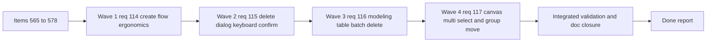

## task_092_super_orchestration_delivery_execution_for_req_114_to_req_117_with_validation_gates_and_staged_checkpoints - Super orchestration delivery execution for req 114 to req 117 with validation gates and staged checkpoints
> From version: 1.4.4
> Schema version: 1.0
> Status: Ready
> Understanding: 95%
> Confidence: 98% (scope, backlog breakdown, companion docs, and orchestration links are now coherent across the full delivery bundle)
> Progress: 0%
> Complexity: High
> Theme: Modeling productivity / destructive-action ergonomics / canvas interaction
> Reminder: Update status/understanding/confidence/progress and dependencies/references when you edit this doc.

# Context
This orchestration task executes the full delivery bundle spanning `req_114` to `req_117`:
- modeling create-flow ergonomics;
- destructive dialog keyboard confirmation;
- explicit modeling table batch delete mode;
- canvas multi-selection and grouped movement.

The bundle is intentionally cross-cutting but coherent:
- all requests target repeated-action productivity in Modeling;
- each request introduces a new local interaction contract that must remain explicit and non-overlapping;
- the delivery already has a shared product brief and two companion ADRs to keep product and architecture decisions aligned while implementation progresses.

The main execution constraint is interaction coherence:
- create-form acceleration must not blur edit-mode semantics;
- destructive keyboard acceleration must not leak into unrelated dialogs;
- table batch mode must not conflict with single-item editing;
- canvas multi-selection must not conflict with panning and single-selection behavior.

# Plan
- [ ] 1. Confirm scope, companion docs, and acceptance-criteria dependencies across `req_114` to `req_117` and items `565` to `578`.
- [ ] 2. Deliver Wave 1 for `req_114`:
  - `item_565`
  - `item_566`
  - `item_567`
- [ ] 3. Deliver Wave 2 for `req_115`:
  - `item_568`
  - `item_569`
  - `item_570`
- [ ] 4. Deliver Wave 3 for `req_116`:
  - `item_571`
  - `item_572`
  - `item_573`
  - `item_574`
- [ ] 5. Deliver Wave 4 for `req_117`:
  - `item_575`
  - `item_576`
  - `item_577`
  - `item_578`
- [ ] 6. Checkpoint each completed wave in a commit-ready state, validate it, and update the linked Logics docs.
- [ ] CHECKPOINT: leave the current wave commit-ready and update the linked Logics docs before continuing.
- [ ] FINAL: Update related Logics docs

# Delivery checkpoints
- Each completed wave should leave the repository in a coherent, commit-ready state.
- Update the linked Logics docs during the wave that changes the behavior, not only at final closure.
- Prefer a reviewed commit checkpoint at the end of each meaningful wave instead of accumulating several undocumented partial states.
- Preserve companion-doc alignment:
  - `prod_000_modeling_productivity_and_repeated_action_ergonomics`
  - `adr_002_destructive_interaction_contracts_for_keyboard_confirmation_and_modeling_batch_delete`
  - `adr_003_modeling_create_flow_reset_and_canvas_group_movement_interaction_contracts`
- Use this task as the single orchestration wrapper for items `565` to `578`.

# AC Traceability
- `req_114` AC1-AC8 -> `item_565`, `item_566`, `item_567`. Proof: create-form label and bottom-`New` implementation plus targeted create-form regression coverage.
- `req_115` AC1-AC7 -> `item_568`, `item_569`, `item_570`. Proof: destructive dialog keyboard-confirm contract, scoped wiring, and delete-confirmation regression coverage.
- `req_116` AC1-AC10 -> `item_571`, `item_572`, `item_573`, `item_574`. Proof: explicit batch mode state, checkbox/panel UI, preflight-confirm execution, and batch delete regression coverage.
- `req_117` AC1-AC10 -> `item_575`, `item_576`, `item_577`, `item_578`. Proof: canvas shift-click selection state, grouped drag persistence, inspector compatibility, and canvas regression coverage.

# Decision framing
- Product framing: Linked
- Product signals: operator throughput, repeated action ergonomics, discoverability, mode clarity
- Product follow-up: Keep `prod_000` aligned with any scope drift discovered during delivery; no additional product brief is needed for this bundle at this stage.
- Architecture framing: Linked
- Architecture signals: state and sync, contracts and integration, destructive-action boundaries, grouped movement persistence
- Architecture follow-up: Keep `adr_002` and `adr_003` aligned with any contract changes discovered during implementation; no additional ADR is needed unless the bundle expands beyond the current local interaction contracts.

# Links
- Product brief(s): `logics/product/prod_000_modeling_productivity_and_repeated_action_ergonomics.md`
- Architecture decision(s): `logics/architecture/adr_002_destructive_interaction_contracts_for_keyboard_confirmation_and_modeling_batch_delete.md`, `logics/architecture/adr_003_modeling_create_flow_reset_and_canvas_group_movement_interaction_contracts.md`
- Backlog item(s): `logics/backlog/item_565_connector_and_splice_catalog_selector_labels_include_catalog_names_and_safe_fallback_formatting.md` through `logics/backlog/item_578_regression_coverage_and_closure_for_canvas_multi_selection_and_grouped_move_behavior.md`
- Request(s): `logics/request/req_114_connector_and_splice_catalog_labels_show_names_and_create_forms_support_chained_new_action.md`, `logics/request/req_115_keyboard_confirmation_shortcut_for_delete_modals_with_explicit_safety_policy.md`, `logics/request/req_116_batch_delete_mode_for_modeling_tables_with_explicit_multi_selection_and_mixed_impact_handling.md`, `logics/request/req_117_shift_click_multi_selection_and_grouped_move_on_the_2d_modeling_canvas.md`

# AI Context
- Summary: Orchestrate the full delivery bundle for req 114 to req 117, covering create-flow productivity, destructive dialog keyboard confirmation, modeling table batch delete, and canvas multi-selection/grouped movement with linked companion docs and staged validation.
- Keywords: orchestration, req 114, req 115, req 116, req 117, modeling, create flow, delete confirm, batch delete, canvas multi select
- Use when: Use when executing the integrated delivery plan for backlog items 565 to 578.
- Skip when: Skip when implementing an unrelated request or when working on only one isolated backlog item outside this bundle.

# Validation
- `npm run -s lint`
- `npm run -s typecheck`
- `npm test -- --run src/tests/app.ui.modeling-dropdown-ordering.spec.tsx src/tests/app.ui.creation-flow-ergonomics.spec.tsx src/tests/app.ui.catalog.spec.tsx`
- `npm test -- --run src/tests/app.ui.delete-confirmations.spec.tsx src/tests/app.ui.list-ergonomics.spec.tsx`
- `npm test -- --run src/tests/app.ui.navigation-canvas.spec.tsx src/tests/app.ui.navigation-canvas-selection-gating.spec.tsx`
- run narrower targeted subsets during each wave before re-running the broader integrated matrix
- confirm each completed wave leaves the repository in a commit-ready state

# Definition of Done (DoD)
- [ ] Scope implemented and acceptance criteria covered.
- [ ] Validation commands executed and results captured.
- [ ] Linked request/backlog/task docs updated during completed waves and at closure.
- [ ] Product brief and ADR links remain synchronized with the delivered scope.
- [ ] Each completed wave left a commit-ready checkpoint or an explicit exception is documented.
- [ ] Status is `Done` and progress is `100%`.

# Report
