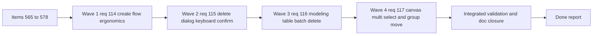

## task_092_super_orchestration_delivery_execution_for_req_114_to_req_117_with_validation_gates_and_staged_checkpoints - Super orchestration delivery execution for req 114 to req 117 with validation gates and staged checkpoints
> From version: 1.4.4 (delivery closed and propagated on 2026-04-02)
> Schema version: 1.0
> Status: Done
> Understanding: 99% (the full req_114 to req_117 bundle is implemented, validated, and now synchronized across task, backlog, and request docs)
> Confidence: 99% (validation passed and the closure chain is now coherent across all linked workflow docs)
> Progress: 100% (implementation complete, validation captured, linked backlog items and requests closed)
> Complexity: High
> Theme: Modeling productivity / destructive-action ergonomics / canvas interaction
> Reminder: Update status/understanding/confidence/progress and dependencies/references when you edit this doc.

# Context
This orchestration task executes the full delivery bundle spanning `req_114` to `req_117`:
- modeling create-flow ergonomics;
- destructive dialog keyboard confirmation;
- explicit modeling table batch delete mode;
- canvas multi-selection and grouped movement.

The bundle is intentionally cross-cutting but coherent:
- all requests target repeated-action productivity in Modeling;
- each request introduces a new local interaction contract that must remain explicit and non-overlapping;
- the delivery already has a shared product brief and two companion ADRs to keep product and architecture decisions aligned while implementation progresses.

The main execution constraint is interaction coherence:
- create-form acceleration must not blur edit-mode semantics;
- destructive keyboard acceleration must not leak into unrelated dialogs;
- table batch mode must not conflict with single-item editing;
- canvas multi-selection must not conflict with panning and single-selection behavior.

# Plan
- [x] 1. Confirm scope, companion docs, and acceptance-criteria dependencies across `req_114` to `req_117` and items `565` to `578`.
- [x] 2. Deliver Wave 1 for `req_114`:
  - `item_565`
  - `item_566`
  - `item_567`
- [x] 3. Deliver Wave 2 for `req_115`:
  - `item_568`
  - `item_569`
  - `item_570`
- [x] 4. Deliver Wave 3 for `req_116`:
  - `item_571`
  - `item_572`
  - `item_573`
  - `item_574`
- [x] 5. Deliver Wave 4 for `req_117`:
  - `item_575`
  - `item_576`
  - `item_577`
  - `item_578`
- [x] 6. Checkpoint each completed wave in a commit-ready state, validate it, and update the linked Logics docs.
- [x] CHECKPOINT: leave the current wave commit-ready and update the linked Logics docs before continuing.
- [x] FINAL: Update related Logics docs

# Delivery checkpoints
- Each completed wave should leave the repository in a coherent, commit-ready state.
- Update the linked Logics docs during the wave that changes the behavior, not only at final closure.
- Prefer a reviewed commit checkpoint at the end of each meaningful wave instead of accumulating several undocumented partial states.
- Preserve companion-doc alignment:
  - `prod_000_modeling_productivity_and_repeated_action_ergonomics`
  - `adr_002_destructive_interaction_contracts_for_keyboard_confirmation_and_modeling_batch_delete`
  - `adr_003_modeling_create_flow_reset_and_canvas_group_movement_interaction_contracts`
- Use this task as the single orchestration wrapper for items `565` to `578`.

# AC Traceability
- `req_114` AC1-AC8 -> `item_565`, `item_566`, `item_567`. Proof: create-form label and bottom-`New` implementation plus targeted create-form regression coverage.
- `req_115` AC1-AC7 -> `item_568`, `item_569`, `item_570`. Proof: destructive dialog keyboard-confirm contract, scoped wiring, and delete-confirmation regression coverage.
- `req_116` AC1-AC10 -> `item_571`, `item_572`, `item_573`, `item_574`. Proof: explicit batch mode state, checkbox/panel UI, preflight-confirm execution, and batch delete regression coverage.
- `req_117` AC1-AC10 -> `item_575`, `item_576`, `item_577`, `item_578`. Proof: canvas shift-click selection state, grouped drag persistence, inspector compatibility, and canvas regression coverage.
- request-AC2 -> This task. Evidence needed: The `Catalog` nav entry is positioned before `Connectors` / `Splices` / other entity sub-screen entries.
- request-AC3 -> This task. Evidence needed: The `Catalog` workspace screen reuses the expected modeling look-and-feel and includes `Network summary`, `Route preview`, `Catalog`, and `Edit catalog item` panels.
- request-AC4 -> This task. Evidence needed: The catalog screen does not render the analysis panel/column.
- request-AC5 -> This task. Evidence needed: `Manufacturer reference` is mandatory to save a catalog item.
- request-AC6 -> This task. Evidence needed: `Connection count` is mandatory to save a catalog item.
- request-AC9 -> This task. Evidence needed: Connector/Splice forms use a catalog-backed manufacturer selector instead of free-text manufacturer reference.
- request-AC11 -> This task. Evidence needed: New connector/splice creation follows a `catalog-first` workflow (catalog item created/selected first), with legacy entities still supported via fallback resolution.
- request-AC12 -> This task. Evidence needed: Onboarding includes a new `Catalog` step in 2nd position (before the connectors/splices library step) with contextual target action(s) consistent with existing onboarding behavior.
- request-AC13 -> This task. Evidence needed: Catalog item deletion is blocked while referenced by a connector/splice.
- request-AC14 -> This task. Evidence needed: Catalog item `connectionCount` reduction is blocked when it would invalidate linked connector/splice way/port usage.
- request-AC15 -> This task. Evidence needed: Legacy fallback bootstrap behavior is applied consistently on both persisted load and import of older data.
- request-AC16 -> This task. Evidence needed: (Recommended V1) Catalog supports default sort by `manufacturerReference` and basic filtering on `manufacturerReference`/`name`.
- request-AC17 -> This task. Evidence needed: (Recommended V1) Catalog can open connector/splice creation flows prefilled from the selected catalog item.
- request-AC18 -> This task. Evidence needed: When no catalog item exists, connector/splice creation UI provides a clear blocking message and CTA to open/create catalog items.
- request-AC19 -> This task. Evidence needed: Regression tests cover navigation access/order, required-field validation, legacy fallback bootstrap, connector/splice catalog integration behavior, and onboarding step/order integration.

# Decision framing
- Product framing: Linked
- Product signals: operator throughput, repeated action ergonomics, discoverability, mode clarity
- Product follow-up: Keep `prod_000` aligned with any scope drift discovered during delivery; no additional product brief is needed for this bundle at this stage.
- Architecture framing: Linked
- Architecture signals: state and sync, contracts and integration, destructive-action boundaries, grouped movement persistence
- Architecture follow-up: Keep `adr_002` and `adr_003` aligned with any contract changes discovered during implementation; no additional ADR is needed unless the bundle expands beyond the current local interaction contracts.

# Links
- Product brief(s): `logics/product/prod_000_modeling_productivity_and_repeated_action_ergonomics.md`
- Architecture decision(s): `logics/architecture/adr_002_destructive_interaction_contracts_for_keyboard_confirmation_and_modeling_batch_delete.md`, `logics/architecture/adr_003_modeling_create_flow_reset_and_canvas_group_movement_interaction_contracts.md`
- Backlog item(s): `logics/backlog/item_565_connector_and_splice_catalog_selector_labels_include_catalog_names_and_safe_fallback_formatting.md` through `logics/backlog/item_578_regression_coverage_and_closure_for_canvas_multi_selection_and_grouped_move_behavior.md`
- Request(s): `logics/request/req_114_connector_and_splice_catalog_labels_show_names_and_create_forms_support_chained_new_action.md`, `logics/request/req_115_keyboard_confirmation_shortcut_for_delete_modals_with_explicit_safety_policy.md`, `logics/request/req_116_batch_delete_mode_for_modeling_tables_with_explicit_multi_selection_and_mixed_impact_handling.md`, `logics/request/req_117_shift_click_multi_selection_and_grouped_move_on_the_2d_modeling_canvas.md`

# AI Context
- Summary: Orchestrate the full delivery bundle for req 114 to req 117, covering create-flow productivity, destructive dialog keyboard confirmation, modeling table batch delete, and canvas multi-selection/grouped movement with linked companion docs and staged validation.
- Keywords: orchestration, req 114, req 115, req 116, req 117, modeling, create flow, delete confirm, batch delete, canvas multi select
- Use when: Use when executing the integrated delivery plan for backlog items 565 to 578.
- Skip when: Skip when implementing an unrelated request or when working on only one isolated backlog item outside this bundle.

# Validation
- `npm run -s lint`
- `npm run -s typecheck`
- `npm test -- --run src/tests/app.ui.modeling-dropdown-ordering.spec.tsx src/tests/app.ui.creation-flow-ergonomics.spec.tsx src/tests/app.ui.catalog.spec.tsx`
- `npm test -- --run src/tests/app.ui.delete-confirmations.spec.tsx src/tests/app.ui.list-ergonomics.spec.tsx`
- `npm test -- --run src/tests/app.ui.navigation-canvas.spec.tsx src/tests/app.ui.navigation-canvas-selection-gating.spec.tsx`
- run narrower targeted subsets during each wave before re-running the broader integrated matrix
- confirm each completed wave leaves the repository in a commit-ready state
- Finish workflow executed on 2026-04-02.
- Linked backlog/request close verification passed.

# Definition of Done (DoD)
- [x] Scope implemented and acceptance criteria covered.
- [x] Validation commands executed and results captured.
- [x] Linked request/backlog/task docs updated during completed waves and at closure.
- [x] Product brief and ADR links remain synchronized with the delivered scope.
- [x] Each completed wave left a commit-ready checkpoint or an explicit exception is documented.
- [x] Status is `Done` and progress is `100%`.

# Report
- Current blockers: none.
- Completed waves:
  - Wave 1 (`req_114`) delivered:
    - connector/splice catalog labels now include catalog names with safe fallback behavior;
    - all Modeling create forms now expose a bottom `New` action in create mode only;
    - targeted regression coverage updated for dropdown labels and chained create resets.
  - Wave 2 (`req_115`) delivered:
    - direct delete dialogs now support explicit dialog-level `Enter` confirmation without moving visible focus away from `Cancel`;
    - cascade delete dialogs now also keep `Cancel` focused while supporting `Enter` confirmation;
    - targeted delete-confirmation regression coverage now includes keyboard `Enter` and `Escape` behavior.
  - Wave 3 (`req_116`) delivered:
    - Modeling tables now expose an explicit `Select multiple` mode with checkbox-based selection, `select all visible`, and dedicated batch actions;
    - the right-side edit column now switches to a batch context panel while multi-selection is active, keeping single-item editing out of scope for the mode;
    - batch delete now runs a preflight summary, blocks mixed selections when any entry is blocked, and commits safe multi-delete operations as one undoable history step.
  - Wave 4 (`req_117`) delivered:
    - the 2D Modeling canvas now supports node-only `Shift+click` multi-selection with explicit floating feedback and a clear-selection action;
    - dragging any selected node now moves the full selected group while preserving relative offsets and keeping `Shift+drag` on empty canvas reserved for pan;
    - grouped canvas movement now persists as a multi-node layout update, while single-node drag and existing callout interactions remain intact.
- Latest validation snapshot:
  - `npm run -s typecheck`
  - `npm run -s lint`
  - `npm test -- --run src/tests/app.ui.modeling-dropdown-ordering.spec.tsx src/tests/app.ui.creation-flow-ergonomics.spec.tsx src/tests/app.ui.catalog.spec.tsx`
  - `npm test -- --run src/tests/app.ui.delete-confirmations.spec.tsx src/tests/app.ui.list-ergonomics.spec.tsx`
  - `npm test -- --run src/tests/app.ui.navigation-canvas.spec.tsx src/tests/app.ui.navigation-canvas-selection-gating.spec.tsx`
  - `npm test -- --run src/tests/app.ui.network-summary-workflow-polish.spec.tsx`
  - `python3 logics/skills/logics-doc-linter/scripts/logics_lint.py`
- Finished on 2026-04-02.
- Linked backlog item(s): `item_565_connector_and_splice_catalog_selector_labels_include_catalog_names_and_safe_fallback_formatting`, `item_578_regression_coverage_and_closure_for_canvas_multi_selection_and_grouped_move_behavior`
- Related request(s): `req_051_catalog_screen_with_catalog_item_crud_navigation_integration_and_required_manufacturer_reference_connection_count`, `req_109_new_and_edit_actions_scroll_to_corresponding_form_panel`, `req_111_alphabetically_sorted_dropdown_menus_in_modeling_screens`, `req_114_connector_and_splice_catalog_labels_show_names_and_create_forms_support_chained_new_action`, `req_116_batch_delete_mode_for_modeling_tables_with_explicit_multi_selection_and_mixed_impact_handling`, `req_117_shift_click_multi_selection_and_grouped_move_on_the_2d_modeling_canvas`

# Strict Audit Backlog Links
- `logics/backlog/item_568_delete_and_cascade_delete_dialog_enter_shortcut_contract_with_cancel_focused_safety.md`
- `logics/backlog/item_569_keyboard_enter_confirmation_wiring_scoped_to_destructive_delete_dialogs_only.md`
- `logics/backlog/item_570_regression_coverage_and_closure_for_destructive_dialog_enter_confirmation_behavior.md`
- `logics/backlog/item_571_modeling_table_batch_mode_state_selection_contract_and_explicit_entry_exit_behavior.md`
- `logics/backlog/item_572_modeling_table_checkbox_ui_and_batch_context_panel_wiring.md`
- `logics/backlog/item_573_batch_delete_preflight_confirmation_and_one_operation_execution_for_modeling_tables.md`
- `logics/backlog/item_574_regression_coverage_and_closure_for_modeling_table_batch_delete_flows.md`

