## task_097_post_release_ux_and_grouped_move_corrections_after_req_114_to_req_117 - Orchestration delivery execution for req 118 post-release UX and grouped-move corrections
> From version: 1.4.4
> Schema version: 1.0
> Status: In progress
> Understanding: 97%
> Confidence: 95%
> Progress: 25%
> Complexity: High
> Theme: Modeling post-release corrections
> Reminder: Update status/understanding/confidence/progress and dependencies/references when you edit this doc.

# Context
This orchestration task executes the full corrective bundle opened by `req_118` after the delivery of `req_114` to `req_117`.

The work is intentionally split into four coherent backlog slices:
- `item_580` for the post-create edit-state `New` correction
- `item_581` for the `Select multiple` action-row placement and icon alignment
- `item_582` for canvas grouped-drag generate isolation and localized move persistence
- `item_583` for regression coverage and workflow-doc closure

The main execution constraint is correction without scope drift:
- the create-flow repair must restore the intended chained-creation point without making `New` global to all edit states;
- the Modeling action-bar repair must improve discoverability without changing the batch-delete contract;
- the canvas repair must stop unrelated plan mutations during grouped drag without redefining the broader generation model;
- regression and closure work must prove the repaired contracts and keep the Logics chain synchronized.

```mermaid
%% logics-kind: task
%% logics-signature: task|orchestration-delivery-execution-for-req|item-579-post-release-ux-and-grouped-mov|1-confirm-scope-acceptance-criteria-mapp|npm-run-s-lint
flowchart LR
    Backlog[Items 580 to 583] --> Wave1[Wave 1 post create New correction]
    Wave1 --> Wave2[Wave 2 Select multiple action row correction]
    Wave2 --> Wave3[Wave 3 grouped drag canvas correction]
    Wave3 --> Wave4[Wave 4 regression coverage and closure]
    Wave4 --> Validation[Integrated validation and doc closure]
    Validation --> Report[Done report]
```

# Plan
- [x] 1. Confirm scope, acceptance-criteria mapping, and linked backlog/request dependencies across `item_580` to `item_583`.
- [x] 2. Deliver Wave 1 for `item_580`: post-create edit-state `New` correction for Modeling forms.
- [ ] 3. Deliver Wave 2 for `item_581`: `Select multiple` action-row placement and icon alignment across Modeling tables.
- [ ] 4. Deliver Wave 3 for `item_582`: grouped-drag generate isolation and localized move persistence correction on the canvas.
- [ ] 5. Deliver Wave 4 for `item_583`: regression coverage, integrated validation, and workflow-doc closure.
- [ ] 6. Checkpoint each completed wave in a commit-ready state, validate it, and update the linked Logics docs.
- [ ] CHECKPOINT: leave the current wave commit-ready and update the linked Logics docs before continuing.
- [ ] FINAL: Update related Logics docs

# Delivery checkpoints
- Each completed wave should leave the repository in a coherent, commit-ready state.
- Update the linked Logics docs during the wave that changes the behavior, not only at final closure.
- Prefer a reviewed commit checkpoint at the end of each meaningful wave instead of accumulating several undocumented partial states.
- Use this task as the single orchestration wrapper for items `580` to `583`.

# AC Traceability
- `req_118` AC1 -> `item_580`. Proof: post-create edit-state `New` correction plus targeted create-flow coverage.
- `req_118` AC2 -> `item_581`. Proof: Modeling action-row alignment and icon affordance updates plus table UX coverage.
- `req_118` AC3 -> `item_582`. Proof: grouped-drag no-generate correction and localized-move persistence coverage.
- `req_118` AC4 -> `item_583`. Proof: integrated regression coverage and coherent closure across request, backlog, and task docs.

# Decision framing
- Product framing: Consider
- Product signals: pricing and packaging
- Product follow-up: Review whether a product brief is needed before scope becomes harder to change.
- Architecture framing: Required
- Architecture signals: data model and persistence, contracts and integration
- Architecture follow-up: Create or link an architecture decision before irreversible implementation work starts.

# Links
- Product brief(s): (none yet)
- Architecture decision(s): (none yet)
- Backlog item(s): `item_579_post_release_ux_and_grouped_move_corrections_after_req_114_to_req_117`, `item_580_post_create_edit_state_new_action_correction_for_modeling_forms`, `item_581_select_multiple_action_row_placement_and_icon_alignment_across_modeling_tables`, `item_582_canvas_grouped_drag_generate_isolation_and_localized_move_persistence_correction`, `item_583_regression_coverage_and_closure_for_post_release_ux_and_grouped_move_corrections`
- Request(s): `req_118_post_release_ux_and_grouped_move_corrections_after_req_114_to_req_117`

# AI Context
- Summary: Post-release UX and grouped-move corrections after req 114 to req 117
- Keywords: post-release, and, grouped-move, corrections, req
- Use when: Use when framing scope, context, and acceptance checks for Post-release UX and grouped-move corrections after req 114 to req 117.
- Skip when: Skip when the work targets another feature, repository, or workflow stage.

# References
- `logics/skills/logics-ui-steering/SKILL.md`

# Validation
- `npm run -s lint`
- `npm run -s typecheck`
- `npm test -- --run src/tests/app.ui.creation-flow-ergonomics.spec.tsx src/tests/app.ui.list-ergonomics.spec.tsx`
- `npm test -- --run src/tests/app.ui.navigation-canvas.spec.tsx src/tests/app.ui.navigation-canvas-selection-gating.spec.tsx`
- run narrower targeted subsets during each wave before re-running the broader integrated matrix
- `python3 logics/skills/logics-doc-linter/scripts/logics_lint.py`
- confirm each completed wave leaves the repository in a commit-ready state

# Definition of Done (DoD)
- [ ] Scope implemented and acceptance criteria covered.
- [ ] Validation commands executed and results captured.
- [ ] Linked request/backlog/task docs updated during completed waves and at closure.
- [ ] Each completed wave left a commit-ready checkpoint or an explicit exception is documented.
- [ ] Status is `Done` and progress is `100%`.

# Report
- Current wave status:
  - Wave 1 delivered the post-create edit-state `New` correction for Modeling forms.
- Validation snapshot:
  - `npm run -s typecheck`
  - `npm test -- --run src/tests/app.ui.creation-flow-ergonomics.spec.tsx`
