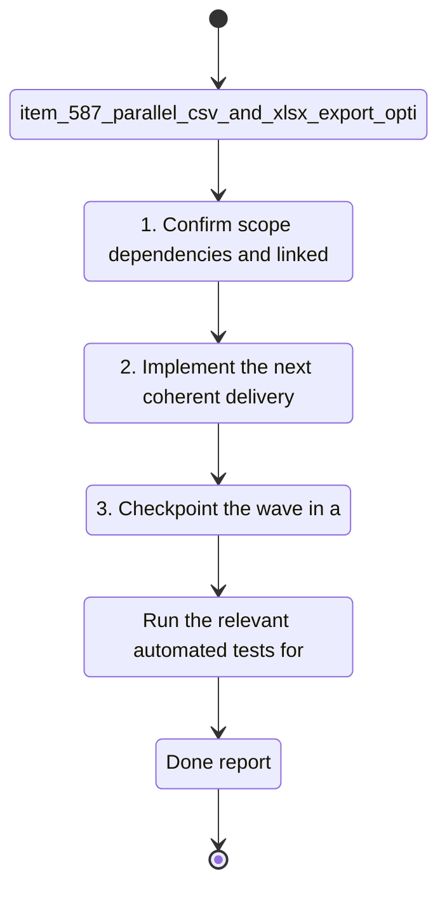

## task_098_parallel_csv_and_xlsx_export_options - Parallel CSV and XLSX Export Options
> From version: 1.4.4
> Schema version: 1.0
> Status: Done
> Understanding: 100%
> Confidence: 100%
> Progress: 100%
> Complexity: High
> Theme: Export
> Non-semantic edit: linked adr_005_bom_and_export_contracts_for_csv_xlsx_and_reference_naming
> Reminder: Update status/understanding/confidence/progress and linked request/backlog references when you edit this doc.

# Context
- Derived from backlog item `item_587_parallel_csv_and_xlsx_export_options`.
- Source file: `logics\backlog\item_587_parallel_csv_and_xlsx_export_options.md`.
- Related request(s): `req_119_bom_and_catalog_export_enhancements`.
Users want BOM and wire-by-wire exports in Excel format, but the app currently only exposes CSV export paths.

# Plan
- [x] 1. Add or select the XLSX export dependency and wire the workbook writer into the export layer.
- [x] 2. Add a user-facing format choice so BOM and wire-by-wire exports can be emitted as CSV or XLSX.
- [x] 3. Keep the existing CSV path unchanged and make XLSX an opt-in parallel path.
- [x] 4. Update tests for both export formats and for the format selection behavior.
- [x] 5. Validate the build and update linked Logics docs before closing the wave.

# Delivery checkpoints
- Each completed wave should leave the repository in a coherent, commit-ready state.
- Update the linked Logics docs during the wave that changes the behavior, not only at final closure.
- Prefer a reviewed commit checkpoint at the end of each meaningful wave instead of accumulating several undocumented partial states.
- If the shared AI runtime is active and healthy, use `python logics/skills/logics.py flow assist commit-all` to prepare the commit checkpoint for each meaningful step, item, or wave.
- Do not mark a wave or step complete until the relevant automated tests and quality checks have been run successfully.

# AC Traceability
- AC1 -> Scope: The user can explicitly choose CSV or XLSX for BOM export and wire-by-wire export.. Proof: capture validation evidence in this doc.
- AC2 -> Scope: CSV export remains available and behaves the same when selected.. Proof: capture validation evidence in this doc.
- AC3 -> Scope: XLSX export is available without forcing a CSV workflow change.. Proof: capture validation evidence in this doc.

# Decision framing
- Product framing: Not needed
- Product signals: (none detected)
- Product follow-up: No product brief follow-up is expected based on current signals.
- Architecture framing: Required
- Architecture signals: data model and persistence, contracts and integration
- Architecture follow-up: Create or link an architecture decision before irreversible implementation work starts.

# Links
- Product brief(s): (none yet)
- Architecture decision(s): `adr_005_bom_and_export_contracts_for_csv_xlsx_and_reference_naming`
- Backlog item: `item_587_parallel_csv_and_xlsx_export_options`
- Request(s): `req_119_bom_and_catalog_export_enhancements`

# AI Context
- Summary: Users want BOM and wire-by-wire exports in Excel format, but the app currently only exposes CSV export paths.
- Keywords: parallel, csv, and, xlsx, export, options, users, want
- Use when: Use when executing the current implementation wave for Parallel CSV and XLSX Export Options.
- Skip when: Skip when the work belongs to another backlog item or a different execution wave.
# Validation
- `npm run lint`
- `npm run typecheck`
- `npm run test:ci:fast`
- `npm run build`
- Confirm CSV remains available and XLSX exports open as valid workbook files.

# Definition of Done (DoD)
- [x] Scope implemented and acceptance criteria covered.
- [x] Validation commands executed and results captured.
- [x] No wave or step was closed before the relevant automated tests and quality checks passed.
- [x] Linked request/backlog/task docs updated during completed waves and at closure.
- [x] Each completed wave left a commit-ready checkpoint or an explicit exception is documented.
- [x] Status is `Done` and progress is `100%`.

# Report
