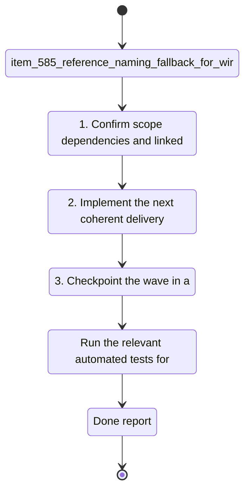

## task_099_reference_naming_fallback_for_wire_terminations - Reference Naming Fallback for Wire Terminations
> From version: 1.4.4
> Schema version: 1.0
> Status: Done
> Understanding: 100%
> Confidence: 100%
> Progress: 100%
> Complexity: High
> Theme: Data Model
> Non-semantic edit: closed DoD checklist after delivery
> Reminder: Update status/understanding/confidence/progress and linked request/backlog references when you edit this doc.

# Context
- Derived from backlog item `item_585_reference_naming_fallback_for_wire_terminations`.
- Source file: `logics\backlog\item_585_reference_naming_fallback_for_wire_terminations.md`.
- Related request(s): `req_119_bom_and_catalog_export_enhancements`.
Seal and connection references need an optional friendly name, and the app should remember a previously entered name for a reference when that reference is used again.

# Plan
- [x] 1. Identify where wire termination references are stored, edited, and serialized.
- [x] 2. Add optional display-name support for seal and connection references in the data model and forms.
- [x] 3. Implement fallback lookup so re-entering a known reference suggests or reuses its last known name.
- [x] 4. Preserve blank names when no label is known or entered.
- [x] 5. Update tests around persistence, form behavior, and the fallback lookup path.
- [x] 6. Validate the change set and update linked Logics docs before closing the wave.

# Delivery checkpoints
- Each completed wave should leave the repository in a coherent, commit-ready state.
- Update the linked Logics docs during the wave that changes the behavior, not only at final closure.
- Prefer a reviewed commit checkpoint at the end of each meaningful wave instead of accumulating several undocumented partial states.
- If the shared AI runtime is active and healthy, use `python logics/skills/logics.py flow assist commit-all` to prepare the commit checkpoint for each meaningful step, item, or wave.
- Do not mark a wave or step complete until the relevant automated tests and quality checks have been run successfully.

# AC Traceability
- AC1 -> Scope: Seal and connection references can each store an optional name.. Proof: capture validation evidence in this doc.
- AC2 -> Scope: When the same reference is entered again, the previous name is suggested or reused as a fallback.. Proof: capture validation evidence in this doc.
- AC3 -> Scope: If the name is still empty, the saved value remains blank.. Proof: capture validation evidence in this doc.

# Decision framing
- Product framing: Not needed
- Product signals: (none detected)
- Product follow-up: No product brief follow-up is expected based on current signals.
- Architecture framing: Consider
- Architecture signals: data model and persistence
- Architecture follow-up: Review whether an architecture decision is needed before implementation becomes harder to reverse.

# Links
- Product brief(s): (none yet)
- Architecture decision(s): (none yet)
- Backlog item: `item_585_reference_naming_fallback_for_wire_terminations`
- Request(s): `req_119_bom_and_catalog_export_enhancements`

# AI Context
- Summary: Seal and connection references need an optional friendly name, and the app should remember a previously entered name...
- Keywords: reference, naming, fallback, for, wire, terminations, seal, and
- Use when: Use when executing the current implementation wave for Reference Naming Fallback for Wire Terminations.
- Skip when: Skip when the work belongs to another backlog item or a different execution wave.
# References
- `logics/skills/logics-ui-steering/SKILL.md`

# Validation
- `npm run lint`
- `npm run typecheck`
- `npm run test:ci:fast`
- `npm run build`
- Confirm wire termination forms save blank names, reuse known names, and keep existing references intact.

# Definition of Done (DoD)
- [x] Scope implemented and acceptance criteria covered.
- [x] Validation commands executed and results captured.
- [x] No wave or step was closed before the relevant automated tests and quality checks passed.
- [x] Linked request/backlog/task docs updated during completed waves and at closure.
- [x] Each completed wave left a commit-ready checkpoint or an explicit exception is documented.
- [x] Status is `Done` and progress is `100%`.

# Report
