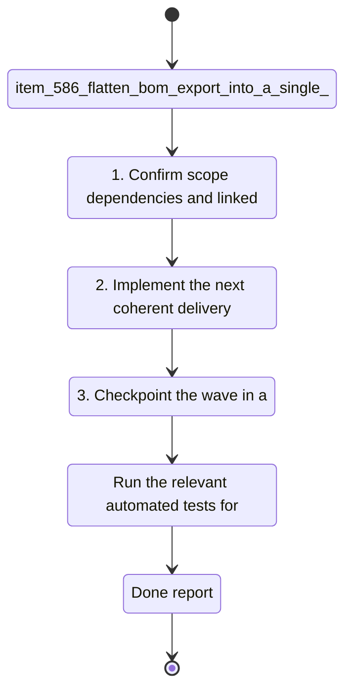

## task_100_flatten_bom_export_into_a_single_plane - Flatten BOM Export Into a Single Plane
> From version: 1.4.4
> Schema version: 1.0
> Status: Done
> Understanding: 100%
> Confidence: 100%
> Progress: 100%
> Complexity: High
> Theme: Export
> Non-semantic edit: linked adr_005_bom_and_export_contracts_for_csv_xlsx_and_reference_naming
> Reminder: Update status/understanding/confidence/progress and linked request/backlog references when you edit this doc.

# Context
- Derived from backlog item `item_586_flatten_bom_export_into_a_single_plane`.
- Source file: `logics\backlog\item_586_flatten_bom_export_into_a_single_plane.md`.
- Related request(s): `req_119_bom_and_catalog_export_enhancements`.
The current BOM output uses a separate wire termination block. The export needs one flat BOM structure so connectors, seals, and connection references are represented with the same column layout.

# Plan
- [x] 1. Inspect the current BOM row builder and isolate the wire termination block logic.
- [x] 2. Replace the split structure with a single normalized BOM row model.
- [x] 3. Keep ordering deterministic so the unified export is readable and stable.
- [x] 4. Update any callers or tests that still expect the old separate termination section.
- [x] 5. Validate the export output and update linked Logics docs before closing the wave.

# Delivery checkpoints
- Each completed wave should leave the repository in a coherent, commit-ready state.
- Update the linked Logics docs during the wave that changes the behavior, not only at final closure.
- Prefer a reviewed commit checkpoint at the end of each meaningful wave instead of accumulating several undocumented partial states.
- If the shared AI runtime is active and healthy, use `python logics/skills/logics.py flow assist commit-all` to prepare the commit checkpoint for each meaningful step, item, or wave.
- Do not mark a wave or step complete until the relevant automated tests and quality checks have been run successfully.

# AC Traceability
- AC1 -> Scope: BOM export uses one common row structure for connector, seal, and connection reference data.. Proof: capture validation evidence in this doc.
- AC2 -> Scope: The old separate wire termination section no longer appears in the exported BOM.. Proof: capture validation evidence in this doc.
- AC3 -> Scope: The unified export keeps a stable and readable row order.. Proof: capture validation evidence in this doc.
- request-AC4 -> This task. Evidence needed: BOM export and wire-by-wire export can be produced as CSV or XLSX in parallel, with XLSX chosen through an explicit option.
- request-AC5 -> This task. Evidence needed: The BOM XLSX export contains two sheets, one global summary sheet and one connector-grouped sheet with merged connector ID and name cells, correct quantities, and connector-order grouping.

# Decision framing
- Product framing: Not needed
- Product signals: (none detected)
- Product follow-up: No product brief follow-up is expected based on current signals.
- Architecture framing: Required
- Architecture signals: data model and persistence, contracts and integration
- Architecture follow-up: Create or link an architecture decision before irreversible implementation work starts.

# Links
- Product brief(s): (none yet)
- Architecture decision(s): `adr_005_bom_and_export_contracts_for_csv_xlsx_and_reference_naming`
- Backlog item: `item_586_flatten_bom_export_into_a_single_plane`
- Request(s): `req_119_bom_and_catalog_export_enhancements`

# AI Context
- Summary: The current BOM output uses a separate wire termination block. The export needs one flat BOM structure so...
- Keywords: flatten, bom, export, single, plane, the, current, output
- Use when: Use when executing the current implementation wave for Flatten BOM Export Into a Single Plane.
- Skip when: Skip when the work belongs to another backlog item or a different execution wave.
# References
- `logics/skills/logics-ui-steering/SKILL.md`

# Validation
- `npm run lint`
- `npm run typecheck`
- `npm run test:ci:fast`
- `npm run build`
- Confirm the exported BOM now contains one unified structure and no longer emits a separate wire termination section.

# Definition of Done (DoD)
- [x] Scope implemented and acceptance criteria covered.
- [x] Validation commands executed and results captured.
- [x] No wave or step was closed before the relevant automated tests and quality checks passed.
- [x] Linked request/backlog/task docs updated during completed waves and at closure.
- [x] Each completed wave left a commit-ready checkpoint or an explicit exception is documented.
- [x] Status is `Done` and progress is `100%`.

# Report
