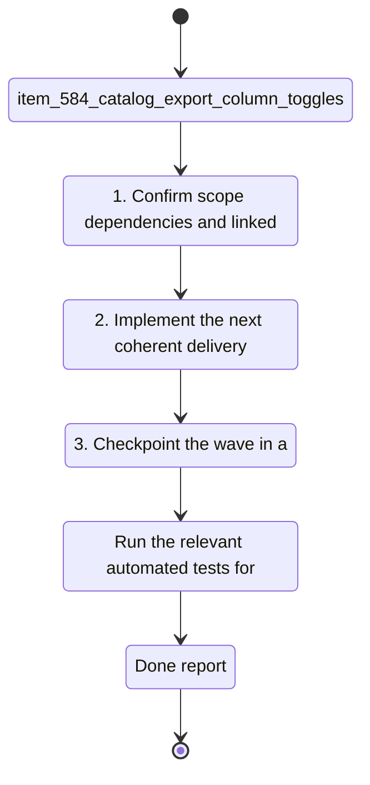

## task_101_catalog_export_column_toggles - Catalog Export Column Toggles
> From version: 1.4.4
> Schema version: 1.0
> Status: Done
> Understanding: 100%
> Confidence: 100%
> Progress: 100%
> Complexity: Medium
> Theme: UI
> Non-semantic edit: closed DoD checklist after delivery
> Reminder: Update status/understanding/confidence/progress and linked request/backlog references when you edit this doc.

# Context
- Derived from backlog item `item_584_catalog_export_column_toggles`.
- Source file: `logics\backlog\item_584_catalog_export_column_toggles.md`.
- Related request(s): `req_119_bom_and_catalog_export_enhancements`.
Users want to hide some catalog columns only in exported files, without changing the catalog table visible in the app.

# Plan
- [x] 1. Locate the catalog export path and the state source that controls export column selection.
- [x] 2. Add export-only column toggles and thread the selected columns into the catalog export builder.
- [x] 3. Keep the on-screen catalog table unchanged and preserve the default export output when no toggle is enabled.
- [x] 4. Add or update tests for export column inclusion and exclusion.
- [x] 5. Validate the change set and update linked Logics docs before closing the wave.

# Delivery checkpoints
- Each completed wave should leave the repository in a coherent, commit-ready state.
- Update the linked Logics docs during the wave that changes the behavior, not only at final closure.
- Prefer a reviewed commit checkpoint at the end of each meaningful wave instead of accumulating several undocumented partial states.
- If the shared AI runtime is active and healthy, use `python logics/skills/logics.py flow assist commit-all` to prepare the commit checkpoint for each meaningful step, item, or wave.
- Do not mark a wave or step complete until the relevant automated tests and quality checks have been run successfully.

# AC Traceability
- AC1 -> Scope: The export flow can omit selected catalog columns, but the catalog screen still shows the full catalog table.. Proof: capture validation evidence in this doc.
- AC2 -> Scope: The default catalog export remains compatible with the existing column order and content unless a column toggle is enabled.. Proof: capture validation evidence in this doc.
- request-AC3 -> This task. Evidence needed: BOM export no longer splits connector, seal, and connection reference data into separate sections; they appear on one common structure with consistent columns.
- request-AC4 -> This task. Evidence needed: BOM export and wire-by-wire export can be produced as CSV or XLSX in parallel, with XLSX chosen through an explicit option.
- request-AC5 -> This task. Evidence needed: The BOM XLSX export contains two sheets, one global summary sheet and one connector-grouped sheet with merged connector ID and name cells, correct quantities, and connector-order grouping.

# Decision framing
- Product framing: Not needed
- Product signals: (none detected)
- Product follow-up: No product brief follow-up is expected based on current signals.
- Architecture framing: Consider
- Architecture signals: data model and persistence
- Architecture follow-up: Review whether an architecture decision is needed before implementation becomes harder to reverse.

# Links
- Product brief(s): (none yet)
- Architecture decision(s): (none yet)
- Backlog item: `item_584_catalog_export_column_toggles`
- Request(s): `req_119_bom_and_catalog_export_enhancements`

# AI Context
- Summary: Users want to hide some catalog columns only in exported files, without changing the catalog table visible in...
- Keywords: catalog, export, column, toggles, users, want, hide, some
- Use when: Use when executing the current implementation wave for Catalog Export Column Toggles.
- Skip when: Skip when the work belongs to another backlog item or a different execution wave.
# References
- `logics/skills/logics-ui-steering/SKILL.md`

# Validation
- `npm run lint`
- `npm run typecheck`
- `npm run test:ci:fast`
- `npm run build`
- Confirm the exported catalog still renders unchanged in the app and the hidden columns are absent only from the export output.

# Definition of Done (DoD)
- [x] Scope implemented and acceptance criteria covered.
- [x] Validation commands executed and results captured.
- [x] No wave or step was closed before the relevant automated tests and quality checks passed.
- [x] Linked request/backlog/task docs updated during completed waves and at closure.
- [x] Each completed wave left a commit-ready checkpoint or an explicit exception is documented.
- [x] Status is `Done` and progress is `100%`.

# Report
