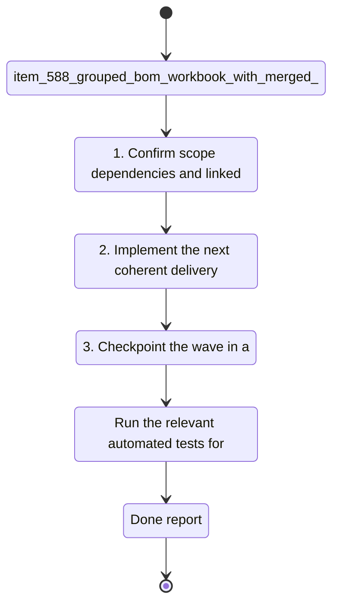

## task_102_grouped_bom_workbook_with_merged_connector_rows - Grouped BOM Workbook With Merged Connector Rows
> From version: 1.4.4
> Schema version: 1.0
> Status: Ready
> Understanding: 95%
> Confidence: 86%
> Progress: 0%
> Complexity: High
> Theme: Export
> Reminder: Update status/understanding/confidence/progress and linked request/backlog references when you edit this doc.

# Context
- Derived from backlog item `item_588_grouped_bom_workbook_with_merged_connector_rows`.
- Source file: `logics\backlog\item_588_grouped_bom_workbook_with_merged_connector_rows.md`.
- Related request(s): `req_119_bom_and_catalog_export_enhancements`.
The BOM XLSX export needs a second sheet grouped by connector, with merged connector identity cells and correct connector-level quantities.

# Plan
- [ ] 1. Build the workbook model for the two-sheet BOM export.
- [ ] 2. Keep the current summary sheet intact and add a connector-grouped sheet.
- [ ] 3. Merge the connector ID and name cells across each grouped block.
- [ ] 4. Verify the grouped rows stay under the right connector and totals remain correct.
- [ ] 5. Update export tests and workbook checks for both sheets.
- [ ] 6. Validate the workbook output and update linked Logics docs before closing the wave.

# Delivery checkpoints
- Each completed wave should leave the repository in a coherent, commit-ready state.
- Update the linked Logics docs during the wave that changes the behavior, not only at final closure.
- Prefer a reviewed commit checkpoint at the end of each meaningful wave instead of accumulating several undocumented partial states.
- If the shared AI runtime is active and healthy, use `python logics/skills/logics.py flow assist commit-all` to prepare the commit checkpoint for each meaningful step, item, or wave.
- Do not mark a wave or step complete until the relevant automated tests and quality checks have been run successfully.

# AC Traceability
- AC1 -> Scope: The BOM XLSX export contains a global summary sheet and a connector-grouped sheet.. Proof: capture validation evidence in this doc.
- AC2 -> Scope: The grouped sheet merges the connector ID and connector name cells across the rows in each connector group.. Proof: capture validation evidence in this doc.
- AC3 -> Scope: The grouped sheet keeps connector-related rows under the right connector and preserves a stable order.. Proof: capture validation evidence in this doc.
- AC4 -> Scope: Quantity totals are correct in both sheets.. Proof: capture validation evidence in this doc.

# Decision framing
- Product framing: Not needed
- Product signals: (none detected)
- Product follow-up: No product brief follow-up is expected based on current signals.
- Architecture framing: Required
- Architecture signals: data model and persistence, contracts and integration
- Architecture follow-up: Create or link an architecture decision before irreversible implementation work starts.

# Links
- Product brief(s): (none yet)
- Architecture decision(s): (none yet)
- Backlog item: `item_588_grouped_bom_workbook_with_merged_connector_rows`
- Request(s): `req_119_bom_and_catalog_export_enhancements`

# AI Context
- Summary: The BOM XLSX export needs a second sheet grouped by connector, with merged connector identity cells and correct...
- Keywords: grouped, bom, workbook, merged, connector, rows, the, xlsx
- Use when: Use when executing the current implementation wave for Grouped BOM Workbook With Merged Connector Rows.
- Skip when: Skip when the work belongs to another backlog item or a different execution wave.
# References
- `logics/skills/logics-ui-steering/SKILL.md`

# Validation
- `npm run lint`
- `npm run typecheck`
- `npm run test:ci:fast`
- `npm run build`
- Confirm the generated workbook contains both sheets, merged connector identity cells, and stable grouped rows.

# Definition of Done (DoD)
- [ ] Scope implemented and acceptance criteria covered.
- [ ] Validation commands executed and results captured.
- [ ] No wave or step was closed before the relevant automated tests and quality checks passed.
- [ ] Linked request/backlog/task docs updated during completed waves and at closure.
- [ ] Each completed wave left a commit-ready checkpoint or an explicit exception is documented.
- [ ] Status is `Done` and progress is `100%`.

# Report
