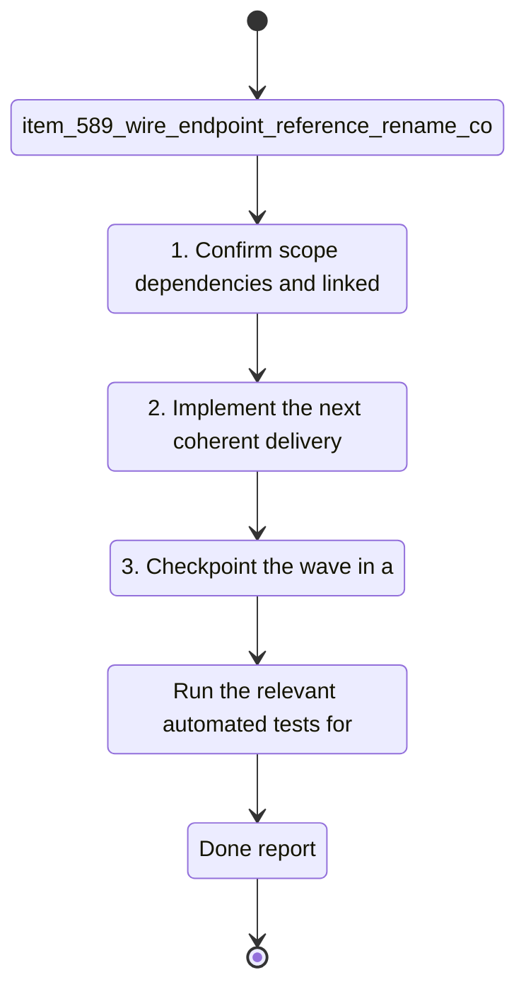

## task_103_wire_endpoint_reference_rename_conflict_scoping_and_cross_reference_contamination_fixes - Wire endpoint reference rename conflict scoping and cross-reference contamination fixes
> From version: 1.4.4
> Schema version: 1.0
> Status: Done
> Understanding: 97%
> Confidence: 95%
> Progress: 100%
> Complexity: High
> Theme: UI
> Reminder: Update status/understanding/confidence/progress and linked request/backlog references when you edit this doc.

# Context
- Derived from backlog item `item_589_wire_endpoint_reference_rename_conflict_scoping_and_cross_reference_contamination_fixes`.
- Source file: `logics\backlog\item_589_wire_endpoint_reference_rename_conflict_scoping_and_cross_reference_contamination_fixes.md`.
- Related request(s): `req_120_wire_endpoint_reference_rename_conflict_scoping_and_cross_reference_contamination_fixes`.
- Correct the save-time conflict detection for `connection` and `seal` reference naming so a wire endpoint only compares names that belong to the same normalized reference and same reference kind.
- Stop cross-endpoint contamination where the name of one wire endpoint can trigger a conflict dialog for the other endpoint even when the references are different.
- Stop cross-reference contamination where saving one wire can copy a chosen or existing name onto unrelated references, including endpoints that have no corresponding reference at all.

# Plan
- [x] 1. Inspect the current save-time rename path in `src/app/hooks/useWireHandlers.ts`, with particular focus on reference grouping, candidate-name collection, conflict dialog triggering, and deferred apply behavior.
- [x] 2. Constrain conflict detection and propagation to the exact `(kind, normalized reference)` key, and ensure endpoints without a matching reference are excluded from both candidate collection and mutation.
- [x] 3. Preserve atomic save semantics so a discard or cancel leaves all wire endpoint names unchanged, even when multiple endpoints on the edited wire participate in the same save operation.
- [x] 4. Add or update focused regression coverage in `src/tests/app.ui.creation-flow-wire-endpoint-refs.spec.tsx` for opposite-endpoint isolation, no-dialog-on-same-name reuse, and no-name-propagation-to-empty-reference endpoints.
- [x] 5. Add or update catalog-side regression coverage in `src/tests/app.ui.catalog.spec.tsx` if the shared rename flow is reused there.
- [x] 6. Run the targeted validation commands, capture evidence in this task, and update linked Logics docs before closure.
- [x] CHECKPOINT: leave the current wave commit-ready and update the linked Logics docs before continuing.
- [ ] CHECKPOINT: if the shared AI runtime is active and healthy, run `python logics/skills/logics.py flow assist commit-all` for the current step, item, or wave commit checkpoint.
- [x] GATE: do not close a wave or step until the relevant automated tests and quality checks have been run successfully.
- [x] FINAL: Update related Logics docs

# Delivery checkpoints
- Each completed wave should leave the repository in a coherent, commit-ready state.
- Update the linked Logics docs during the wave that changes the behavior, not only at final closure.
- Prefer a reviewed commit checkpoint at the end of each meaningful wave instead of accumulating several undocumented partial states.
- If the shared AI runtime is active and healthy, use `python logics/skills/logics.py flow assist commit-all` to prepare the commit checkpoint for each meaningful step, item, or wave.
- Do not mark a wave or step complete until the relevant automated tests and quality checks have been run successfully.

# AC Traceability
- AC1 -> Scope: Save-time conflict detection only compares candidate names within the exact same normalized reference and exact same reference kind (`connection` vs `seal`). Different references on the opposite endpoint of the same wire do not participate in the same conflict.. Proof: capture validation evidence in this doc.
- AC2 -> Scope: When multiple wires share the same normalized reference and all effective names normalize to a single value, saving a wire with that same value does not trigger an overwrite dialog.. Proof: capture validation evidence in this doc.
- AC3 -> Scope: Resolving or confirming a name for one normalized reference only updates endpoints that carry that exact normalized reference and matching reference kind. No other reference receives that name.. Proof: capture validation evidence in this doc.
- AC4 -> Scope: Endpoints without a corresponding reference never receive a propagated name during save, including cases where another wire sharing a different reference is updated in the same operation.. Proof: capture validation evidence in this doc.
- AC5 -> Scope: If the operator cancels or discards a conflict choice, no partial rename is applied anywhere in the dataset.. Proof: capture validation evidence in this doc.

# Decision framing
- Product framing: Consider
- Product signals: engagement loop
- Product follow-up: Review whether a product brief is needed before scope becomes harder to change.
- Architecture framing: Consider
- Architecture signals: data model and persistence
- Architecture follow-up: Review whether an architecture decision is needed before implementation becomes harder to reverse.

# Links
- Product brief(s): (none yet)
- Architecture decision(s): (none yet)
- Derived from `item_589_wire_endpoint_reference_rename_conflict_scoping_and_cross_reference_contamination_fixes`
- Request(s): `req_120_wire_endpoint_reference_rename_conflict_scoping_and_cross_reference_contamination_fixes`

# AI Context
- Summary: Fix save-time wire endpoint reference rename conflict scoping and stop unrelated name propagation.
- Keywords: wire, endpoint, connection, seal, reference, rename, conflict, overwrite, propagation, atomicity
- Use when: Use when grooming or implementing bug fixes around wire endpoint reference naming and conflict resolution.
- Skip when: Skip when the work targets BOM layout, XLSX export, or unrelated modeling workflows.
# References
- `logics/skills/logics-ui-steering/SKILL.md`

# Validation
- `npm run typecheck`
- `npx vitest run src/tests/app.ui.creation-flow-wire-endpoint-refs.spec.tsx`
- `npx vitest run src/tests/app.ui.catalog.spec.tsx`
- If the implementation touches shared rename or dialog plumbing beyond the direct UI save flow, extend validation with:
- `npx vitest run src/tests/app-controller-modeling-handlers-assembly.hook.spec.ts`

# Implementation notes
- Primary implementation surface is expected to be `src/app/hooks/useWireHandlers.ts`.
- Candidate-name aggregation must stay separated for `connection` and `seal`; do not build mixed candidate pools across kinds.
- Matching-wire updates must only touch fields whose normalized reference equals the resolved group key.
- Any propagation helper should explicitly guard against writing a name onto an endpoint whose corresponding reference is empty or undefined.
- Prefer regression tests that reproduce the reported operator flows exactly:
- one wire whose two endpoints use different references must not trigger a cross-endpoint overwrite choice;
- re-saving the same normalized name for a shared reference must not open a false-positive overwrite dialog;
- saving a shared connection reference must not create a seal name on another wire that has no seal reference;
- discard or cancel must leave all affected wires unchanged.

# Validation evidence
- `npm run typecheck`
- `npx vitest run src/tests/app.ui.creation-flow-wire-endpoint-refs.spec.tsx`
- `npx vitest run src/tests/app.ui.catalog.spec.tsx`
- `npx vitest run src/tests/app-controller-modeling-handlers-assembly.hook.spec.ts`

# Definition of Done (DoD)
- [x] Scope implemented and acceptance criteria covered.
- [x] Validation commands executed and results captured.
- [x] No wave or step was closed before the relevant automated tests and quality checks passed.
- [x] Linked request/backlog/task docs updated during completed waves and at closure.
- [x] Each completed wave left a commit-ready checkpoint or an explicit exception is documented.
- [x] Status is `Done` and progress is `100%`.

# Report
- Save-time wire endpoint rename sync is now scoped to the exact matching endpoint targets instead of all endpoints on any matching wire.
- Conflict candidate collection no longer mixes names from the opposite endpoint when that endpoint carries a different reference.
- Propagation no longer writes `connection` or `seal` names onto endpoints that do not carry the matching reference, which blocks contamination of empty-reference fields.
- Regression coverage now includes false-positive conflict prevention and protection against writing seal names onto empty seal-reference endpoints.
