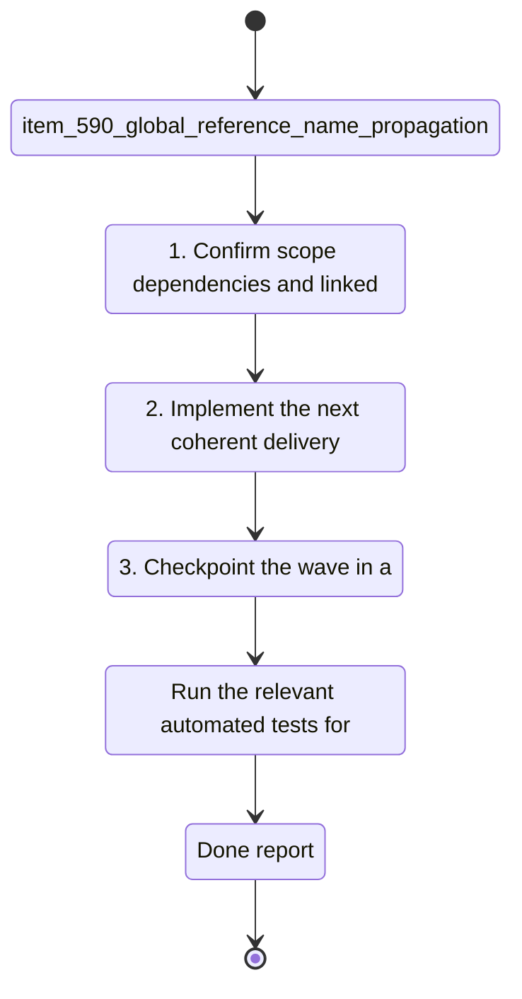

## task_104_global_reference_name_propagation_for_wire_endpoint_renames - Global reference name propagation for wire endpoint renames
> From version: 1.4.4
> Schema version: 1.0
> Status: Done
> Understanding: 98%
> Confidence: 96%
> Progress: 100%
> Complexity: Medium
> Theme: UI
> Reminder: Update status/understanding/confidence/progress and linked request/backlog references when you edit this doc.

# Context
- Derived from backlog item `item_590_global_reference_name_propagation_for_wire_endpoint_renames`.
- Source file: `logics\backlog\item_590_global_reference_name_propagation_for_wire_endpoint_renames.md`.
- Related request(s): `req_121_global_reference_name_propagation_for_wire_endpoint_renames`.
- Restore the intended global naming model for wire endpoint references: one normalized `connection` reference or one normalized `seal` reference must map to one shared name across all wires that carry that same reference.
- When the operator chooses to overwrite a reference name after a detected conflict, apply that chosen name to every wire endpoint that carries the same normalized reference and same reference kind, not only to the endpoint currently being edited.
- Preserve the safeguards introduced by the previous bug fix: no cross-kind contamination, no cross-reference contamination, and no propagation to endpoints that have no corresponding reference.

# Plan
- [x] 1. Inspect the current reference-name synchronization flow in `src/app/hooks/useWireHandlers.ts` and identify where the previous safety fix stopped propagation at the edited endpoint instead of the full `(kind, normalized reference)` group.
- [x] 2. Restore dataset-wide propagation for the confirmed winning name so every endpoint carrying the same `(kind, normalized reference)` is updated, regardless of whether the matching reference sits on endpoint A or endpoint B.
- [x] 3. Preserve all isolation guards from the previous fix: no propagation across different references, no mixing of `connection` and `seal`, and no writes to endpoints whose corresponding reference is empty or undefined.
- [x] 4. Preserve atomic behavior so a discard or cancel leaves all matching endpoints unchanged and does not partially update the dataset.
- [x] 5. Add or update focused regression coverage in `src/tests/app.ui.creation-flow-wire-endpoint-refs.spec.tsx` for confirmed overwrite propagation across several wires and across both endpoint sides.
- [x] 6. Add or update catalog-side coverage in `src/tests/app.ui.catalog.spec.tsx` if the catalog rename surface reuses the same propagation logic.
- [x] 7. Run the targeted validation commands, capture evidence in this task, and update linked Logics docs before closure.
- [x] CHECKPOINT: leave the current wave commit-ready and update the linked Logics docs before continuing.
- [ ] CHECKPOINT: if the shared AI runtime is active and healthy, run `python logics/skills/logics.py flow assist commit-all` for the current step, item, or wave commit checkpoint.
- [x] GATE: do not close a wave or step until the relevant automated tests and quality checks have been run successfully.
- [x] FINAL: Update related Logics docs

# Delivery checkpoints
- Each completed wave should leave the repository in a coherent, commit-ready state.
- Update the linked Logics docs during the wave that changes the behavior, not only at final closure.
- Prefer a reviewed commit checkpoint at the end of each meaningful wave instead of accumulating several undocumented partial states.
- If the shared AI runtime is active and healthy, use `python logics/skills/logics.py flow assist commit-all` to prepare the commit checkpoint for each meaningful step, item, or wave.
- Do not mark a wave or step complete until the relevant automated tests and quality checks have been run successfully.

# AC Traceability
- AC1 -> Scope: When the operator confirms a name choice for a given normalized `connection` reference, every wire endpoint carrying that same normalized `connection` reference is updated to the chosen name across the dataset.. Proof: capture validation evidence in this doc.
- AC2 -> Scope: When the operator confirms a name choice for a given normalized `seal` reference, every wire endpoint carrying that same normalized `seal` reference is updated to the chosen name across the dataset.. Proof: capture validation evidence in this doc.
- AC3 -> Scope: Confirming a name choice for one `(kind, normalized reference)` never updates another reference, another kind, or an endpoint whose corresponding reference is empty or undefined.. Proof: capture validation evidence in this doc.
- AC4 -> Scope: If all known names for a given `(kind, normalized reference)` already normalize to the same value, saving that same value does not trigger an unnecessary overwrite dialog.. Proof: capture validation evidence in this doc.
- AC5 -> Scope: If the operator cancels or discards the overwrite choice, no rename is applied anywhere in the dataset.. Proof: capture validation evidence in this doc.

# Decision framing
- Product framing: Not needed
- Product signals: (none detected)
- Product follow-up: No product brief follow-up is expected based on current signals.
- Architecture framing: Required
- Architecture signals: data model and persistence, state and sync
- Architecture follow-up: Create or link an architecture decision before irreversible implementation work starts.

# Links
- Product brief(s): (none yet)
- Architecture decision(s): (none yet)
- Derived from `item_590_global_reference_name_propagation_for_wire_endpoint_renames`
- Request(s): `req_121_global_reference_name_propagation_for_wire_endpoint_renames`

# AI Context
- Summary: Restore dataset-wide shared-name propagation for identical wire endpoint references after a confirmed overwrite choice.
- Keywords: wire, endpoint, connection, seal, reference, shared name, overwrite, propagation, global sync, atomicity
- Use when: Use when grooming or implementing the follow-up correction that restores global rename propagation for identical references.
- Skip when: Skip when the work targets unrelated contamination bugs that are already fixed, or non-rename features.
# References
- `logics/skills/logics-ui-steering/SKILL.md`

# Validation
- `npm run typecheck`
- `npx vitest run src/tests/app.ui.creation-flow-wire-endpoint-refs.spec.tsx`
- `npx vitest run src/tests/app.ui.catalog.spec.tsx`
- If the implementation changes shared handler wiring beyond the direct save flow, extend validation with:
- `npx vitest run src/tests/app-controller-modeling-handlers-assembly.hook.spec.ts`

# Implementation notes
- Primary implementation surface is expected to remain `src/app/hooks/useWireHandlers.ts`.
- The propagation target must be every endpoint that carries the exact `(kind, normalized reference)` key, not only the endpoint currently edited.
- The propagation scope must still exclude:
- endpoints whose normalized reference differs;
- endpoints of the other kind;
- endpoints whose corresponding reference is missing or empty.
- Candidate-name conflict detection must stay scoped to the exact `(kind, normalized reference)` group and must not regress to wire-wide or opposite-endpoint mixing.
- Prefer regression tests that prove the confirmed overwrite updates:
- multiple wires sharing the same `connection` reference;
- matches located on endpoint A for some wires and endpoint B for others;
- multiple wires sharing the same `seal` reference without touching non-matching `connection` fields.
- Keep discard and cancel scenarios covered so the restored global propagation does not reintroduce partial writes.

# Validation evidence
- `npm run typecheck`
- `npx vitest run src/tests/app.ui.creation-flow-wire-endpoint-refs.spec.tsx`
- `npx vitest run src/tests/app.ui.catalog.spec.tsx`

# Definition of Done (DoD)
- [x] Scope implemented and acceptance criteria covered.
- [x] Validation commands executed and results captured.
- [x] No wave or step was closed before the relevant automated tests and quality checks passed.
- [x] Linked request/backlog/task docs updated during completed waves and at closure.
- [x] Each completed wave left a commit-ready checkpoint or an explicit exception is documented.
- [x] Status is `Done` and progress is `100%`.

# Report
- Verified that the current handler still propagates a confirmed winning name to every matching endpoint in the dataset for the same `(kind, normalized reference)` group.
- Added a dedicated regression in `src/tests/app.ui.creation-flow-wire-endpoint-refs.spec.tsx` that proves overwrite confirmation updates matching references across several wires and across endpoint A and endpoint B.
- Revalidated the shared catalog rename surface so the propagation contract stays covered on both entry points.
