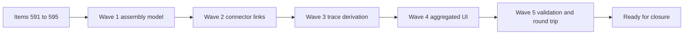

## task_105_multi_harness_assembly_and_cross_harness_functional_schematic_orchestration - Multi-Harness Assembly and Cross-Harness Functional Schematic Orchestration
> From version: 1.6.4
> Schema version: 1.0
> Status: Done
> Understanding: 99%
> Confidence: 96%
> Progress: 100%
> Complexity: High
> Theme: Multi-Harness Modeling and Functional Schematic
> Reminder: Update status/understanding/confidence/progress and linked request/backlog references when you edit this doc.

# Context
This orchestration task executes the multi-harness delivery bundle from `req_122`.

The requested product capability is to add a `Harness assembly` level above existing `Network` objects, treat each `Network` as one harness, connect harnesses through physical-only inter-harness connector links, and render a filtered functional schematic trace that can cross those links.

The delivery spans five linked backlog items:
- `item_591_harness_assembly_data_model_persistence_and_migration`
- `item_592_inter_harness_connector_links_and_symmetric_pin_continuity`
- `item_593_cross_harness_functional_trace_derivation_from_master_connectors`
- `item_594_aggregated_functional_schematic_ui_interconnector_blocks_and_harness_coloring`
- `item_595_multi_harness_validation_import_export_and_regression_coverage`

The main execution constraints are:
- existing single-network behavior must remain unchanged when no `Harness assembly` exists;
- connector links are physical-only, with signal/command continuity derived from wires plus symmetric pin mapping;
- one connector can participate in only one inter-harness connector link in the first version;
- mismatched connector pin counts are warnings, not blockers, and tracing only crosses symmetric pin pairs valid on both sides;
- the aggregated functional schematic is generated from one or more selected master connectors, not from an unrestricted full assembly by default.

# Plan
- [x] 1. Confirm implementation surfaces and companion decision needs before writing schema changes:
  - inspect current `Network`, connector, persistence, import/export, validation, and functional schematic modules;
  - decide whether to create a product brief for the assembly UX entry point;
  - decide whether to create an ADR for the assembly schema and connector-link continuity contract.
- [x] 2. Deliver Wave 1 for `item_591`:
  - add the `Harness assembly` domain model;
  - treat existing `Network` objects as harnesses inside assemblies;
  - add generated and manually overridable harness display colors;
  - add migration-safe persistence and import/export support for assembly metadata;
  - preserve existing single-network workflows when no assembly exists.
- [x] 3. Deliver Wave 2 for `item_592`:
  - add physical-only inter-harness connector links scoped to a `Harness assembly`;
  - enforce one connector link per connector in V1;
  - derive symmetric way continuity with pin `1 -> 1`, `2 -> 2`, and so on;
  - report mismatched pin counts as warnings while preserving valid symmetric pairs.
- [x] 4. Deliver Wave 3 for `item_593`:
  - extend functional trace derivation to assembly scope;
  - support one or more selected master connectors as trace roots;
  - cross valid connector links through symmetric pins;
  - stop at natural continuity boundaries or terminal connectors;
  - add cycle guards and preserve existing single-harness derivation behavior.
- [x] 5. Deliver Wave 4 for `item_594`:
  - expose an assembly-level functional schematic entry point;
  - add pre-render root selection for master connectors;
  - render interconnector crossings as dedicated blocks;
  - color each wire segment by owning harness color;
  - open navigation/details for both linked connectors and both harnesses from interconnector blocks;
  - preserve or explicitly document aggregated export behavior.
- [x] 6. Deliver Wave 5 for `item_595`:
  - validate broken harness references, missing connectors, connector-to-self links, duplicate connector participation, deleted entities, and mismatched pin counts;
  - verify import/export round trips for assemblies, connector links, colors, and continuity assumptions;
  - add regression coverage for model, validation, derivation, UI, and legacy-data compatibility.
- [x] 7. Update linked Logics docs during each wave and capture validation evidence before marking any wave complete.
- [ ] CHECKPOINT: leave each completed wave in a coherent, commit-ready state.
- [ ] CHECKPOINT: if the shared AI runtime is active and healthy, run `python logics/skills/logics.py flow assist commit-all` for the current step, item, or wave commit checkpoint.
- [ ] GATE: do not close a wave or step until the relevant automated tests and quality checks have passed.
- [ ] FINAL: update related request/backlog/task docs and capture final validation evidence.

# Delivery checkpoints
- Each wave should be independently reviewable and should leave existing single-harness behavior working.
- Schema and persistence changes must be covered before UI work depends on them.
- Connector-link semantics must stay physical-only unless the request is explicitly reopened.
- The functional trace derivation should be validated with unit tests before the aggregated UI is treated as complete.
- Linked docs should be updated during the wave that changes behavior, not only at final closure.

# AC Traceability
- `item_591` AC1-AC5 -> Wave 1. Proof: persisted assembly model, network-as-harness references, harness color settings, legacy load compatibility, and import/export coverage.
- `item_592` AC1-AC6 -> Wave 2. Proof: valid connector-link creation, one-link-per-connector guard, physical-only symmetric pin continuity, mismatched-pin warning behavior, and valid-pair-only tracing.
- `item_593` AC1-AC6 -> Wave 3. Proof: assembly-scope trace derivation from selected master connectors, cross-harness traversal, terminal stopping, cycle protection, and single-harness compatibility.
- `item_594` AC1-AC7 -> Wave 4. Proof: assembly schematic entry point, root selection, interconnector blocks, harness-colored wires, interconnector navigation, and export decision.
- `item_595` AC1-AC6 -> Wave 5. Proof: validation diagnostics, import/export round trips, regression test suite, legacy compatibility, and navigation to affected objects where practical.

# Decision framing
- Product framing: Required
- Product signals: new assembly-level workflow, master connector root selection, interconnector navigation, color ownership by harness
- Product follow-up: Create or link a product brief before implementation if the assembly entry point affects primary navigation or workspace layout.
- Architecture framing: Required
- Architecture signals: persisted model, migrations, import/export schema, graph traversal, cross-entity validation
- Architecture follow-up: Create or link at least one ADR before implementing irreversible schema or traversal contracts.

# Links
- Product brief(s): (none yet)
- Architecture decision(s): `logics/architecture/adr_007_harness_assembly_and_physical_interconnector_contract.md`
- Derived from `logics/backlog/item_591_harness_assembly_data_model_persistence_and_migration.md`
- Derived from `logics/backlog/item_592_inter_harness_connector_links_and_symmetric_pin_continuity.md`
- Derived from `logics/backlog/item_593_cross_harness_functional_trace_derivation_from_master_connectors.md`
- Derived from `logics/backlog/item_594_aggregated_functional_schematic_ui_interconnector_blocks_and_harness_coloring.md`
- Derived from `logics/backlog/item_595_multi_harness_validation_import_export_and_regression_coverage.md`
- Request(s): `logics/request/req_122_multi_harness_super_category_and_cross_harness_functional_schematic.md`

# AI Context
- Summary: Orchestrate delivery of multi-harness assemblies, physical connector links, cross-harness functional trace derivation, aggregated schematic UI, and validation/import-export coverage.
- Keywords: harness assembly, multi harness, interconnector, physical-only connector link, symmetric pins, master connector, functional schematic, validation, import export
- Use when: Use when implementing or coordinating the complete req_122 multi-harness delivery bundle.
- Skip when: Skip when working on unrelated single-harness UI polish or catalog-only changes.

# Validation
- `npm run -s typecheck`
- `npm run -s lint`
- `npm test -- --run src/tests/core.functional-schematic.spec.ts`
- `npm test -- --run src/tests/store.reducer.entities.spec.ts`
- `npm test -- --run src/tests/app.ui.network-summary-workflow-polish.spec.tsx`
- Add or update targeted tests for:
  - harness assembly persistence and migration;
  - inter-harness connector-link validation;
  - cross-harness trace derivation from selected master connectors;
  - aggregated functional schematic rendering and interconnector-block navigation;
  - import/export round trips for assembly data and links.
- If the Logics lint entrypoint is restored, run the repository Logics linter before closure.

# Implementation notes
- Current functional schematic logic is expected around `src/core/functionalSchematic.ts`.
- Current functional schematic UI is expected around `src/app/components/network-summary/FunctionalSchematicPanel.tsx`.
- Existing persistence and reducer tests should guide the model and migration surfaces.
- Keep wire/signal continuity derived from technical data; do not add manual signal declarations to connector links in V1.
- Prefer narrow core tests for graph traversal before writing broad UI integration tests.
- Preserve export behavior when possible; if aggregated export is deferred, document the decision in the relevant backlog item and task report.

# Validation evidence
- `npm run -s typecheck` passed.
- `npm run -s lint` passed.
- `npm test -- --run src/tests/core.harness-assembly.spec.ts src/tests/store.reducer.harness-assemblies.spec.ts src/tests/core.functional-schematic.spec.ts src/tests/network-file-harness-assembly.spec.ts src/tests/app.ui.network-summary-workflow-polish.spec.tsx` passed: 5 test files, 25 tests.
- `npm run -s build` passed. Vite reported the existing large chunk warning for one generated bundle.

# Definition of Done (DoD)
- [x] Scope implemented and acceptance criteria covered for items `591` through `595`.
- [x] Validation commands executed and results captured.
- [x] No wave or step was closed before the relevant automated tests and quality checks passed.
- [x] Linked request/backlog/task docs updated during completed waves and at closure.
- [x] Companion product/architecture docs created or explicitly waived with rationale.
- [x] Each completed wave left a commit-ready checkpoint or an explicit exception is documented.
- [x] Status is `Done` and progress is `100%`.

# Report
- Current status: complete and validated.
- Delivered: ADR, assembly data model, state/reducer actions, persistence migration normalization, import/export support, physical-only connector links, symmetric pin validation, cross-harness trace derivation, operator assembly/link/root editor, interconnector graph nodes, harness-colored schematic edges, interconnector detail/navigation, and regression coverage.
- Remaining: no blocking scope remains for this task. Future refinements can improve layout density and add broader end-to-end UI coverage.
