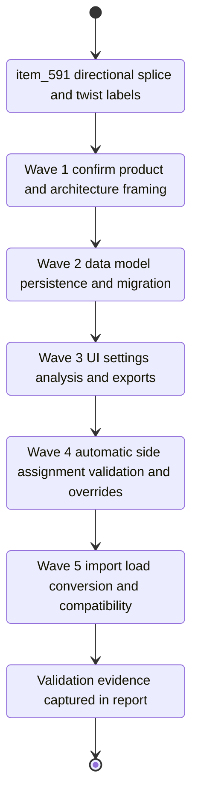

## task_105_wire_twist_groups_and_left_right_splice_pin_mode - Wire twist groups and left right splice pin mode
> From version: 1.6.2
> Schema version: 1.0
> Status: Done
> Understanding: 96%
> Confidence: 96%
> Progress: 100%
> Complexity: High
> Theme: Modeling
> Reminder: Update status/understanding/confidence/progress and linked request/backlog references when you edit this doc.

# Context
- Derived from backlog item `item_591_wire_twist_groups_and_left_right_splice_pin_mode`.
- Source file: `logics/backlog/item_591_wire_twist_groups_and_left_right_splice_pin_mode.md`.
- Related request: `req_122_wire_twist_groups_and_left_right_splice_pin_mode`.
- Implement nullable wire twist group labels, then replace normal splice creation with a directional `L` / `R` splice model.
- Directional splice side assignment is automatic from routing and visual node/segment layout, supports whole-splice inversion, and supports per-wire-endpoint forced/locked overrides near the existing way/port index controls.
- Legacy numeric splice networks must prompt conversion at import/load time, with an explicit option to keep the old design.
- Section imbalance validation compares total wire section per side as a percentage ratio, defaults to `300%`, is configurable in Settings, and warns without blocking save.

# Plan
- [x] Wave 1: Confirm product and architecture framing before code work.
- [x] Product brief explicitly waived for this implementation pass; the request/backlog/task capture the scoped product decisions.
- [x] ADR explicitly waived for this implementation pass; the task report records the compatibility and model decisions.
- [x] Inspect existing splice, wire, settings, validation, import/export, and persistence surfaces before editing.
- [x] Wave 2: Extend the data model and persistence contracts.
- [x] Add nullable wire twist group label storage with normalization and defaults for existing data.
- [x] Add directional splice modeling data for automatic side assignment, whole-splice inversion, and per-wire-endpoint forced/locked side overrides.
- [x] Add Settings persistence for section imbalance threshold with default `300%`.
- [x] Keep legacy bounded/unbounded numeric splice data loadable and distinguishable from the new directional model.
- [x] Wave 3: Update user-facing UI surfaces.
- [x] Add twist group label input to wire create/edit and expose it in wire list, wire analysis, and relevant wire exports.
- [x] Update splice create/edit so new splices use the directional model and no longer ask for bounded/unbounded numeric port behavior.
- [x] Add Settings control for the section imbalance ratio threshold.
- [x] Place forced/locked side controls near the existing endpoint way/port index area in the wire endpoint UI.
- [x] Wave 4: Implement automatic directional behavior and validation.
- [x] Infer `L` / `R` from routing and visual node/segment disposition so wires arriving from the same side share the same side.
- [x] Implement deterministic ambiguous fallback where `R` is assigned to the side with fewer connectors in the harness.
- [x] Add whole-splice side inversion so all `L` values become `R` and all `R` values become `L`.
- [x] Allow multiple wires on each side with no maximum count and adjust occupancy/validation accordingly.
- [x] Add non-blocking validation warnings when total section ratio between `L` and `R` reaches the configured threshold.
- [x] Wave 5: Add legacy conversion and compatibility coverage.
- [x] Prompt at import/load when legacy numeric splice data is detected, offering conversion to directional splices or keeping the old design.
- [x] Preserve import/export and persistence schema documentation for twist labels, side assignment, fallback rule, inversion state, per-endpoint locks, and imbalance settings.
- [x] Add regression coverage for loading legacy numeric splice projects, converting them, and keeping old design when selected.
- [x] FINAL: update linked request/backlog/task docs with implementation report and validation evidence.

# Likely Code Surfaces
- `src/core/entities.ts`
- `src/core/splicePortMode.ts`
- `src/store/actions.ts`
- `src/store/types.ts`
- `src/store/reducer/*`
- `src/store/persistence*`
- `src/app/hooks/useWireHandlers.ts`
- `src/app/hooks/useSpliceHandlers.ts`
- `src/app/components/workspace/ModelingWireFormPanel.tsx`
- `src/app/components/workspace/ModelingSpliceFormPanel.tsx`
- `src/app/components/settings/*`
- `src/app/lib/*export*`
- `src/tests/store.reducer.wires.spec.ts`
- `src/tests/store.reducer.entities.spec.ts`
- `src/tests/store.reducer.networks.spec.ts`
- `src/tests/app.ui.creation-flow-wire-endpoint-refs.spec.tsx`
- `src/tests/app.ui.catalog.spec.tsx`

# Validation
- `npm run typecheck`
- `npm run lint`
- `npx vitest run src/tests/store.reducer.entities.spec.ts src/tests/store.reducer.wires.spec.ts src/tests/store.reducer.networks.spec.ts`
- `npx vitest run src/tests/app.ui.creation-flow-wire-endpoint-refs.spec.tsx`
- `npx vitest run src/tests/app.ui.catalog.spec.tsx`
- `npm run build`

# AC Traceability
- AC1 -> Wave 2: nullable wire twist group label data model and default empty/null behavior.
- AC2 -> Wave 3: wire create/edit UI can enter, clear, and modify labels such as `CAN 1`.
- AC3 -> Wave 3: wire list, analysis, and relevant exports expose twist group labels.
- AC4 -> Wave 3: new splice creation uses directional behavior instead of bounded/unbounded numeric port selection.
- AC5 -> Wave 4: automatic `L` / `R` assignment from routing and visual node/segment disposition.
- AC6 -> Wave 4: wires arriving from the same side share the same automatic side assignment.
- AC7 -> Wave 4: ambiguous assignment uses deterministic fallback with `R` on the side with fewer connectors.
- AC8 -> Wave 4: whole-splice inversion swaps every `L` and `R`.
- AC9 -> Wave 3 and Wave 4: per-wire-endpoint force/lock controls and persistence near way/port index.
- AC10 -> Wave 4: multiple wires allowed on both sides without maximum count.
- AC11 -> Wave 4: validation and occupancy support physical fusion cases.
- AC12 -> Wave 2 and Wave 3: settings model and UI expose section imbalance threshold with default `300%`.
- AC13 -> Wave 4: total section ratio warning behavior, including `2 mm2` vs `4 mm2` at `200%`.
- AC14 -> Wave 4: section imbalance warning is non-blocking.
- AC15 -> Wave 5: import/load conversion prompt offers conversion or keeping the old design.
- AC16 -> Wave 2 and Wave 5: persistence and import/export schemas document all new fields and compatibility behavior.

# Decision Framing
- Product framing: Required.
- Product need: document the legacy conversion journey, keep-old-design option, and operator workflow for auto assignment, inversion, and locks.
- Architecture framing: Required before implementation.
- Architecture need: lock down the directional splice data model, per-endpoint override shape, settings persistence, and migration strategy.

# Links
- Product brief(s): (none yet)
- Architecture decision(s): (none yet)
- Derived from `logics/backlog/item_591_wire_twist_groups_and_left_right_splice_pin_mode.md`
- Request: `logics/request/req_122_wire_twist_groups_and_left_right_splice_pin_mode.md`

# AI Context
- Summary: Executable delivery task for nullable wire twist group labels and directional left/right splice modeling.
- Keywords: wire, twist group, splice, left, right, directional assignment, inversion, lock, settings, migration, validation
- Use when: Use when implementing the harness modeling work from `item_591`.
- Skip when: Skip when work only targets unrelated connector cavities, BOM pricing, or wire reference naming.

# Definition of Done (DoD)
- [x] Product brief and ADR are created or explicitly waived with rationale.
- [x] All ACs from `item_591` are covered by implementation or documented follow-up.
- [x] Validation commands are executed and results captured in this task.
- [x] Linked request and backlog docs are updated with task links and progress.
- [x] The repository is left in a coherent, commit-ready state.
- [x] Status is `Done` and progress is `100%`.

# Report
- Implemented nullable `twistGroupLabel` on wires with form input, modeling/analysis table display, inspector display, search coverage, and CSV/XLSX table exports.
- Implemented `directional` splice mode for new splices, while preserving legacy `bounded` and `unbounded` splices for existing networks.
- Added per-splice side inversion, per-wire endpoint side override/lock fields, and L/R endpoint display/export for directional splices.
- Directional splice endpoints infer side from route geometry, then fall back to assigning `R` to the side with fewer connector nodes.
- Directional splice occupancy allows multiple wires per side and no longer treats L/R as exclusive numeric ports.
- Added Settings persistence and UI for directional splice section imbalance ratio, default `300%`, with non-blocking validation warnings.
- Added import-time legacy numeric splice detection with a conversion prompt; cancel keeps the old numeric design.
- Added an edit-time conversion action for legacy bounded/unbounded splices so a user can convert a selected splice to automatic directional L/R mode after load/import.
- Validation executed:
- `npm run typecheck` passed.
- `npm run lint` passed.
- `npx vitest run tests/store.reducer.wires.spec.ts tests/store.reducer.entities.spec.ts tests/store.reducer.occupancy.spec.ts tests/persistence.migrations.spec.ts tests/entity-forms-state.hook.spec.ts tests/app.ui.modeling-dropdown-ordering.spec.tsx --pool=forks --maxWorkers=2` passed, 48 tests.
- `npm run build` passed with existing large chunk warning.
