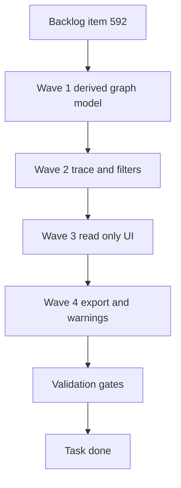

## task_106_mvp_read_only_functional_derived_views - MVP read-only functional derived views
> From version: 1.6.3
> Schema version: 1.0
> Status: Done
> Understanding: 94%
> Confidence: 86%
> Progress: 100%
> Complexity: High
> Theme: Visualization
> Reminder: Update status/understanding/confidence/progress and linked request/backlog references when you edit this doc.

# Definition of Done (DoD)
- [x] A read-only level 2 functional schematic can be generated from the detailed network state.
- [x] The generated schematic supports trace entry from wire, connector, and splice selections when available.
- [x] Significant electrical elements are preserved and physical-only routing elements are hidden.
- [x] Source IDs remain visible or available in the derived view model.
- [x] Missing or ambiguous data produces non-blocking warnings.
- [x] SVG and PNG export are available for the generated view.
- [x] The implementation does not persist a second editable graph as source of truth.
- [x] Focused tests and project quality gates pass.

# Backlog
- `item_592_mvp_read_only_functional_derived_views`

# Request
- `req_123_mvp_read_only_functional_derived_views`

# Execution diagram

# Implementation plan
- [x] Wave 1: Inspect existing network summary and graph modules to choose the smallest compatible derived view boundary.
- [x] Wave 1: Add a functional graph builder that consumes the current network state and emits read-only nodes, edges, source IDs, and warnings.
- [x] Wave 1: Collapse or exclude physical-only routing nodes, path segments, branch geometry, and length-only information.
- [x] Wave 1: Represent inline wire protection/fuse data as virtual read-only significant nodes where data exists.
- [x] Wave 2: Implement trace generation from a selected wire.
- [x] Wave 2: Implement trace generation from connector and splice selections when connected wire endpoint data can identify a path.
- [x] Wave 2: Add domain filtering for `12 V`, `48 V`, `CAN`, and existing subnetwork/domain tags using current data only.
- [x] Wave 2: Ensure missing or ambiguous domain classification does not block generation and creates a warning.
- [x] Wave 3: Add a read-only UI entry point for the generated level 2 functional schematic, preferably reusing Network Summary patterns where they fit.
- [x] Wave 3: Show preserved source IDs for wires, connectors, pins/cavities, splices, fuses/protections, and inferred endpoints.
- [x] Wave 3: Make the UI clearly non-editable and recomputed from the current detailed model.
- [x] Wave 4: Wire SVG and PNG export through the existing export pipeline or a compatible extension.
- [x] Wave 4: Add warning display for missing endpoint references, unresolved connector or splice references, missing fuse/protection labels, ambiguous domain classification, and disconnected trace paths.
- [x] Wave 4: Update local docs/comments only where needed to explain the derived read-only graph boundary.

# Acceptance criteria
- AC1: The application provides a read-only derived functional schematic view generated from the existing detailed model.
- AC2: The generated view cannot be edited independently; any correction must be made in the detailed model and then regenerated.
- AC3: The MVP supports generating a trace from at least one selected wire.
- AC4: The MVP supports generating a trace from connector and splice selections when enough endpoint data is available.
- AC5: The functional trace keeps significant elements: connector, pin/cavity, splice, inline fuse/protection, source endpoint, destination endpoint, ground-like endpoint, and power-like endpoint when those can be inferred from existing data.
- AC6: The functional trace hides physical-only elements: routing nodes, path segments, branch geometry, wire lengths, and intermediate passage points.
- AC7: The generated view preserves source IDs for wires, connectors, pins/cavities, splices, fuses/protections, and inferred endpoints so the operator can relate the schematic back to the detailed model.
- AC8: The MVP exposes simple filters for `12 V`, `48 V`, `CAN`, and existing subnetwork/domain tags when those values are available in the current data.
- AC9: If classification data is missing, the view still generates the trace and reports a non-blocking warning instead of failing silently.
- AC10: Warnings cover at minimum missing endpoint references, unresolved connector or splice references, missing fuse/protection labels, ambiguous domain classification, and disconnected trace paths.
- AC11: The MVP can export the generated functional view to SVG and PNG through the existing export pipeline or a compatible local extension of it.
- AC12: PDF export is out of scope for the MVP unless it is already directly supported by the existing export pipeline without adding a new dependency.
- AC13: The generated view is recomputed from the current network state and is not stored as an independent editable graph in the saved project file.
- AC14: No mandatory save-file schema migration is required for the MVP unless implementation discovers that a small optional UI preference must be persisted.
- AC15: Automated tests cover functional graph derivation, trace generation from a wire, hiding of physical-only nodes, ID preservation, warnings for incomplete data, and export action availability.

# AC traceability
- AC1 -> Wave 1 and Wave 3.
- AC2 -> Wave 3.
- AC3 -> Wave 2.
- AC4 -> Wave 2.
- AC5 -> Wave 1 and Wave 2.
- AC6 -> Wave 1.
- AC7 -> Wave 1 and Wave 3.
- AC8 -> Wave 2.
- AC9 -> Wave 2 and Wave 4.
- AC10 -> Wave 4.
- AC11 -> Wave 4.
- AC12 -> Wave 4.
- AC13 -> Wave 1 and Wave 3.
- AC14 -> Wave 1 and final review.
- AC15 -> Validation.

# Validation
- [x] `npx vitest run src/tests/core.functional-schematic.spec.ts src/tests/app.ui.network-summary-workflow-polish.spec.tsx --pool=forks --maxWorkers=2 --testTimeout=15000`
- [x] `npm run -s typecheck`
- [x] `npm run -s lint`
- [x] `npm run -s build`
- [x] `py -3 -m logics_manager lint --require-status` checked with no new warnings for `req_123`, `item_592`, or `task_106`.
- [x] Finish workflow executed on 2026-05-05 and linked backlog/request close verification passed.

# Risks and rollback
- Risk: Existing data may not identify ECU, actuator, sensor, power, or ground roles reliably. Mitigation: emit warnings and keep labels tied to existing IDs instead of inventing semantic certainty.
- Risk: The existing Network Summary renderer may be too coupled to physical topology. Mitigation: isolate a derived graph model before adapting UI rendering.
- Risk: Export code may assume physical network shapes. Mitigation: add a small compatibility adapter for the derived view rather than changing the source model.
- Rollback: Remove the new UI entry point and derived graph modules; no save-file migration should be required for the MVP.

# Report
- Finished on 2026-05-05.
- Implemented `src/core/functionalSchematic.ts` as the read-only derived graph boundary.
- Added `FunctionalSchematicPanel` under the existing Network Summary flow with trace generation, filters, warnings, and SVG/PNG export action wiring.
- Added unit and UI coverage for graph derivation, physical-node suppression, ID preservation, warning behavior, filters, and export action availability.
- Linked backlog item(s): `item_592_mvp_read_only_functional_derived_views`
- Related request(s): `req_123_mvp_read_only_functional_derived_views`

# AI Context
- Summary: Implement the MVP read-only level 2 functional schematic derived from the detailed harness model.
- Keywords: functional schematic, derived graph, read only, trace, wire, connector, splice, fuse, SVG export, PNG export, warnings
- Use when: Implementing or validating the functional derived view MVP from request 123 and backlog item 592.
- Skip when: The work targets level 1 architecture synopsis, editable diagrams, or physical routing behavior.

# Links
- Request: `logics/request/req_123_mvp_read_only_functional_derived_views.md`
- Backlog: `logics/backlog/item_592_mvp_read_only_functional_derived_views.md`
- Product brief(s): (none yet)
- Architecture decision(s): (recommended if implementation adds a reusable derived graph abstraction or persistence change)
