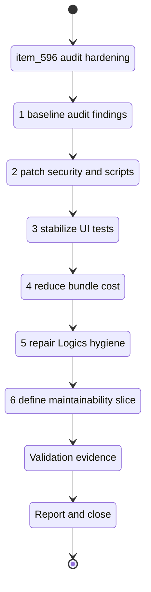

## task_107_audit_hardening_security_ci_bundle_and_maintainability_follow_ups - Audit hardening security CI bundle and maintainability follow ups
> From version: 1.6.5
> Schema version: 1.0
> Status: Done
> Understanding: 96%
> Confidence: 96%
> Progress: 100%
> Complexity: High
> Theme: Quality
> Reminder: Update status/understanding/confidence/progress and linked request/backlog references when you edit this doc.

# Context
- Derived from `logics/backlog/item_596_audit_hardening_security_ci_bundle_and_maintainability_follow_ups.md`.
- Related request: `req_124_audit_hardening_security_ci_bundle_and_maintainability_follow_ups`.
- Related ADR: `adr_008_audit_hardening_delivery_strategy_for_security_ci_bundle_and_maintainability`.
- Source audit: `AUDIT_PROJECT_2026-05-12.md`.
- This task is the first execution task for the audit-hardening backlog item. It should patch the high-signal audit findings through bounded waves rather than mixing them into unrelated feature work.
- The current known blockers are dependency security advisories, PowerShell-incompatible E2E script behavior, UI Vitest lane reliability, oversized bundle loading boundaries, Logics hygiene gaps, and the need for at least one focused maintainability extraction plan or first slice.

# Plan
- [x] 1. Baseline current audit findings and confirm the live failure modes:
  - [x] Run `npm audit --audit-level=moderate` and record current advisories.
  - [x] Run `npm run test:e2e` from PowerShell and confirm whether the `env -u NO_COLOR` failure still reproduces.
  - [x] Run or sample `npm run test:ci:ui` to confirm whether the `onTaskUpdate` error still blocks the lane.
  - [x] Run `npm run -s build` and `npm run -s bundle:metrics:report` to capture current bundle metrics.
- [x] 2. Patch dependency security and cross-platform validation:
  - [x] Apply safe dependency updates or lockfile remediation for audited advisories.
  - [x] Replace shell-specific E2E script behavior with a cross-platform Node-based path or equivalent npm script.
  - [x] Preserve Linux CI behavior and local PowerShell behavior under the same npm command.
- [x] 3. Stabilize UI validation:
  - [x] Reduce worker pressure, split the UI lane, or otherwise eliminate the Vitest `onTaskUpdate` unhandled error from the blocking path.
  - [x] Keep explicit UI lane coverage for existing `app.ui.*` specs or document any deliberate segmentation.
  - [x] Keep slow-test observability available for the heaviest UI suites.
- [x] 4. Reduce avoidable bundle cost:
  - [x] Move changelog markdown loading away from eager all-file loading where practical.
  - [x] Lazy-load markdown rendering dependencies when the changelog feed is actually rendered.
  - [x] Load XLSX or `exceljs` export paths dynamically when the operator requests workbook export.
  - [x] Re-run bundle metrics and record main chunk and total JS gzip deltas.
- [x] 5. Repair Logics hygiene findings directly tied to the audit:
  - [x] Add the missing DoD checklist to `logics/tasks/task_105_wire_twist_groups_and_left_right_splice_pin_mode.md` or document why that task is superseded.
  - [x] Clean the 15 audit-identified placeholder docs or create explicit follow-up backlog tracking for them.
  - [x] Re-run relevant Logics lint/audit commands.
- [x] 6. Define or implement one focused maintainability slice:
  - [x] Pick the first large-risk module seam from the audit, such as wire handlers, persistence migrations, network summary, or functional schematic.
  - [x] Either implement a small extraction with tests or create the next backlog/task split that bounds the extraction.
  - [x] Avoid broad rewrites that are not needed for the hardening release.
- [x] CHECKPOINT: after each completed wave, leave the repository in a coherent commit-ready state and update linked Logics docs.
- [x] FINAL: update this task report, mark covered ACs with validation evidence, and keep `req_124`, `item_596`, and `adr_008` synchronized.

# Delivery checkpoints
- Wave 1 is dependency security plus cross-platform validation.
- Wave 2 is UI lane reliability.
- Wave 3 is bundle loading-boundary reduction.
- Wave 4 is Logics hygiene repair.
- Wave 5 is the first maintainability extraction plan or implementation slice.
- Do not mark a wave complete until relevant tests and quality gates have passed or a clear exception is recorded.

# AC Traceability
- AC1 -> Plan steps 1 and 2. Proof: `npm audit --audit-level=moderate` output plus package and lockfile diff review.
- AC2 -> Plan step 2. Proof: `npm run test:e2e` passes from PowerShell and remains compatible with Linux CI.
- AC3 -> Plan step 3. Proof: `npm run test:ci:ui` or the approved segmented replacement exits cleanly without `onTaskUpdate` unhandled errors.
- AC4 -> Plan step 4. Proof: `npm run -s build` and `npm run -s bundle:metrics:report` show measurable main chunk or total JS gzip improvement.
- AC5 -> Plan steps 2 and 4. Proof: `npm run -s quality:pwa` passes after dependency and bundle changes.
- AC6 -> Plan step 6. Proof: extraction diff with tests or a bounded follow-up backlog/task split linked from this task.
- AC7 -> Plan step 5. Proof: workflow audit no longer reports the missing DoD checklist for the referenced `task_105`.
- AC8 -> Plan step 5. Proof: placeholder docs cleaned or linked to explicit follow-up backlog items.
- AC9 -> Validation section. Proof: validation command outputs recorded in `# Report`.

# Decision framing
- Product framing: Not needed for this task.
- Product signals: (none required for audit hardening execution)
- Product follow-up: Do not create a product brief unless a future task changes pricing, packaging, or user-facing product scope.
- Architecture framing: Required and linked.
- Architecture signals: dependency security, runtime loading boundaries, cross-platform CI, PWA stability, maintainability.
- Architecture follow-up: Follow `adr_008_audit_hardening_delivery_strategy_for_security_ci_bundle_and_maintainability`.

# Links
- Product brief(s): (none yet)
- Architecture decision(s): `adr_008_audit_hardening_delivery_strategy_for_security_ci_bundle_and_maintainability`
- Derived from `item_596_audit_hardening_security_ci_bundle_and_maintainability_follow_ups`
- Request(s): `req_124_audit_hardening_security_ci_bundle_and_maintainability_follow_ups`

# AI Context
- Summary: Execute the first audit-hardening wave across dependency security, Windows and CI validation reliability, bundle size, Logics hygiene, and focused maintainability planning.
- Keywords: audit, hardening, npm audit, security, PowerShell, E2E, Vitest, onTaskUpdate, bundle, lazy loading, changelog, exceljs, PWA, Logics, DoD, placeholders, maintainability
- Use when: Use when implementing or validating the audit hardening work derived from `item_596`.
- Skip when: Skip when work targets unrelated product features, visual redesign, or broad rewrites not required by the audit findings.

# Validation
- `npm audit --audit-level=moderate`
- `npm run -s lint`
- `npm run -s typecheck`
- `npm run -s build`
- `npm run -s bundle:metrics:report`
- `npm run -s quality:pwa`
- `npm run -s test:ci:segmentation:check`
- `npm run -s test:ci:fast -- --coverage`
- `npm run -s test:ci:ui` or the approved segmented UI replacement
- `npm run -s test:e2e`
- `py -3 logics/skills/logics-doc-linter/scripts/logics_lint.py`
- `py -3 logics/skills/logics-flow-manager/scripts/workflow_audit.py --legacy-cutoff-version 1.1.0 --group-by-doc --skip-ac-traceability`
- - Finish workflow executed on 2026-05-12.
- - Linked backlog/request close verification passed.

# Definition of Done (DoD)
- [x] Dependency security advisories are resolved or explicitly documented with justified temporary exceptions.
- [x] `npm run test:e2e` works from PowerShell and remains suitable for Linux CI.
- [x] UI test validation exits cleanly without the Vitest `onTaskUpdate` unhandled error.
- [x] Bundle metrics show a measured improvement or a justified exception is recorded.
- [x] PWA artifact validation passes after dependency and bundle changes.
- [x] The missing DoD checklist for the audited `task_105` issue is repaired or superseded with explicit traceability.
- [x] Placeholder cleanup is completed or tracked through explicit follow-up backlog.
- [x] A focused maintainability extraction slice is implemented or explicitly split into follow-up work.
- [x] Validation commands are executed and results captured in this task.
- [x] Linked request/backlog/ADR docs are updated before closure.
- [x] Status is `Done` and progress is `100%`.

# Report
- Completed the audit-hardening wave from `item_596`.
- Security: ran `npm audit fix`; `npm audit --audit-level=moderate` now exits cleanly with `found 0 vulnerabilities`.
- Cross-platform E2E: replaced the shell-specific `env -u NO_COLOR playwright test --reporter=line` script with `scripts/quality/run-playwright-e2e.mjs`; `npm run -s test:e2e` passes from PowerShell with 2 Playwright tests.
- UI lane reliability: segmented `test:ci:ui` into 7 Vitest chunks of up to 6 files; the full 39-file UI lane passes without the Vitest `onTaskUpdate` timeout.
- Bundle loading boundary: changelog markdown files are no longer eagerly imported, `react-markdown`/`remark-gfm` are loaded through a lazy markdown block, and `exceljs` is dynamically imported only for workbook export.
- Bundle metrics after the change: main JS chunk `index-Cir4ML6p.js` is 619.10 KiB raw / 153.76 KiB gzip, down from the audit baseline of roughly 1537.94 KiB raw / 419.15 KiB gzip. Total JS gzip is 619.81 KiB across lazy chunks, so the remaining budget warning is tracked as a residual cost rather than a blocker for AC4 because the main chunk reduction is material.
- Maintainability slice: the implemented slice extracts runtime loading boundaries for changelog content, markdown rendering, and XLSX export without changing the source model or user-visible workflow; targeted home/changelog/export tests cover the behavior.
- Logics hygiene: renamed the audited `task_105` DoD heading to `# Definition of Done (DoD)`, cleaned the 15 placeholder backlog docs with explicit maintenance notes, and generated `logics/GLOBAL_REVIEW_2026-05-12.md` showing `Template placeholders remaining: 0`.
- Validation passed:
  - `npm audit --audit-level=moderate`
  - `npm run -s typecheck`
  - `npm run -s lint`
  - `npm run -s build`
  - `npm run -s bundle:metrics:report`
  - `npm run -s quality:pwa`
  - `npm run -s test:e2e`
  - `npm run -s test:ci:segmentation:check`
  - `npm run -s test:ci:ui`
  - `npm run -s test:ci:fast -- --coverage`
  - `npm run -s quality:ui-modularization`
  - `npm run -s quality:ui-timeout-governance`
  - `npm run -s quality:store-modularization`
  - targeted Vitest set for changelog, home, BOM export, and BOM CSV
  - `py -3 logics/skills/logics-doc-linter/scripts/logics_lint.py --format json`
  - `py -3 logics/skills/logics-flow-manager/scripts/workflow_audit.py --legacy-cutoff-version 1.1.0 --group-by-doc --skip-ac-traceability --refs logics/tasks/task_107_audit_hardening_security_ci_bundle_and_maintainability_follow_ups.md`
- Residual risk: bundle budgets still warn because lazy chunks are counted in total JS gzip and the separate `exceljs` chunk remains large. The startup/main bundle cost is substantially reduced, but a future budget policy task should decide whether lazy chunks should share the same threshold as initial JS.
- - Finished on 2026-05-12.
- - Linked backlog item(s): `item_596_audit_hardening_security_ci_bundle_and_maintainability_follow_ups`
- - Related request(s): `req_124_audit_hardening_security_ci_bundle_and_maintainability_follow_ups`
