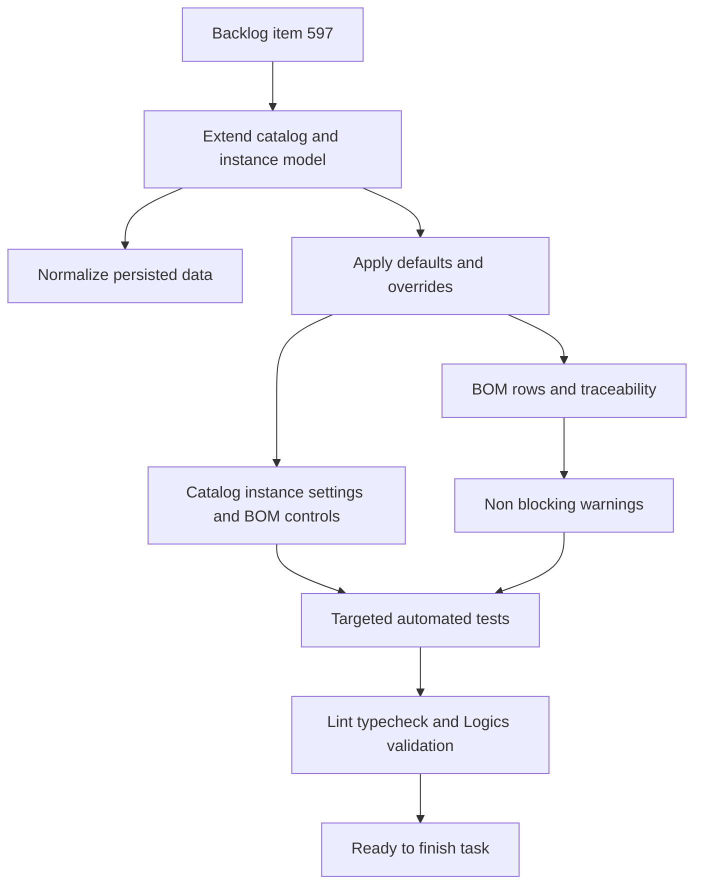

## task_108_connector_catalog_terminal_seal_and_plug_defaults - Connector catalog terminal seal and plug defaults
> From version: 1.6.5
> Schema version: 1.0
> Status: Done
> Understanding: 94%
> Confidence: 92%
> Progress: 100%
> Complexity: High
> Theme: Catalog and BOM
> Reminder: Update status/understanding/confidence/progress and linked request/backlog references when you edit this doc.

# Context
Implement the connector catalog terminal, seal, and plug defaults defined in `logics/backlog/item_597_connector_catalog_terminal_seal_and_plug_defaults.md`.

The delivery must keep catalog data as the source of default material behavior, while connector instances remain the place for explicit overrides and opt-out decisions. Seals and plugs are distinct:

- Seal: material associated only with a terminal on a used cavity.
- Plug: material associated with an unused cavity.
- Unused cavities: calculated from connector instance usage, not manually assigned in the MVP.
- Multiple plug references: represented as `plug reference + quantity`, with no plug-to-cavity assignment required.

# Definition of Done (DoD)
- [x] Connector catalog data supports all-same-terminal defaults, terminal refs, seal refs, plug refs, and plug quantities.
- [x] Connector instance data supports explicit terminal/seal overrides plus separate plug and seal opt-outs.
- [x] Existing connector instances refresh from catalog defaults when catalog defaults change, while preserving explicit overrides and opt-outs.
- [x] BOM generation includes catalog-derived terminals, seals, and unused-cavity plugs with traceability labels.
- [x] Application settings can hide BOM traceability labels without changing BOM calculations or export quantities.
- [x] Ambiguous terminal, seal, or plug configurations produce non-blocking warnings.
- [x] Existing saved projects and catalog entries without the new fields load without a breaking migration.
- [x] Acceptance criteria are covered by targeted automated tests.
- [x] Validation commands pass and results are recorded in the report before finishing the task.

# Backlog
- Derived from `logics/backlog/item_597_connector_catalog_terminal_seal_and_plug_defaults.md`

# Request
- `logics/request/req_125_connector_catalog_terminal_seal_and_plug_defaults.md`

# Implementation plan
- [x] Inspect the current catalog, connector, wire termination, BOM, persistence, and settings contracts.
  - Likely anchors: `src/core/entities.ts`, `src/store`, `src/adapters/persistence/migrations.ts`, `src/app/lib`, `src/app/components`, and `src/tests`.
- [x] Extend domain types with optional connector catalog defaults.
  - Include all-same-terminal behavior, default terminal reference, default seal reference, plug definitions, plug quantities, and compatibility with mixed connector setups.
- [x] Extend connector instance state for overrides and opt-outs.
  - Keep separate settings for plug application and seal application.
  - Preserve explicit instance choices as authoritative over catalog refreshes.
- [x] Add persistence normalization and compatibility coverage.
  - Old project files without the new fields must normalize cleanly.
  - Imported or loaded connector instances must not lose existing catalog links or wire termination data.
- [x] Implement default resolution logic.
  - Resolve terminal and seal defaults for used cavities.
  - Resolve plugs for unused cavities from calculated cavity usage.
  - Detect quantity mismatches or ambiguous mixed definitions and surface warnings.
- [x] Update BOM generation.
  - Include terminals, seals, and unused-cavity plugs.
  - Add traceability metadata such as `catalog default`, `instance override`, or `manual`.
  - Ensure hiding traceability labels affects display only, not material quantities.
- [x] Update UI surfaces.
  - Catalog editor: define all-same-terminal defaults and plug definitions.
  - Connector instance editor: override defaults and separately disable plugs or seals.
  - BOM/settings UI: show traceability labels and provide a setting to hide them.
- [x] Add targeted tests first around domain behavior, then UI/export coverage.
  - Keep tests focused on the material calculation and override contracts instead of broad visual snapshots.
- [x] Run validation and update this task report with command results.

# Acceptance criteria
- AC1: The connector catalog supports an `all same terminals` option for connector references whose cavities all share the same default terminal reference and default seal reference.
- AC2: When `all same terminals` is enabled, newly placed or refreshed connector instances use the configured default terminal and seal references for every applicable cavity unless overridden.
- AC3: The connector catalog supports one or more plug references for unused cavities, with quantity per plug reference and no required plug-to-cavity assignment.
- AC4: Unused connector cavities are calculated from the instance cavity usage, filled with the catalog-defined plug quantities by default, and included in the BOM.
- AC5: Connectors that do not use the same terminal or seal on every cavity can override the default terminal and seal selection at cavity level or another explicit grouping level.
- AC6: Connectors can define more than one plug type and define how many of each plug type is used when unused cavities are populated, without requiring the operator to assign those plugs to specific cavities.
- AC7: Connector instance settings include an option to disable automatic plug application for that specific instance even when the catalog defines plug defaults.
- AC8: Connector instance settings include an option to disable automatic seal application for that specific instance when the connector is used in a context where seals are not needed.
- AC9: The plug and seal opt-out controls are separate instance-level settings so an operator can disable plugs without disabling terminal seals, or disable seals without disabling plugs.
- AC10: BOM generation respects catalog defaults, per-connector overrides, unused-cavity plug quantities, and instance-level opt-out settings.
- AC11: Existing projects and catalog entries without terminal, seal, or plug defaults continue to load without a mandatory breaking migration.
- AC12: Existing connector instances refresh from updated catalog defaults when the catalog entry gains terminal, seal, or plug defaults, unless an instance has an explicit override or opt-out that must remain authoritative.
- AC13: The BOM UI can show whether a BOM line comes from catalog defaults, an instance override, or a manual operator entry.
- AC14: Application settings include an option to hide BOM traceability labels when the operator wants a cleaner BOM view; hiding labels does not change BOM quantities, exports, defaults, overrides, warnings, or material calculation.
- AC15: Ambiguous plug, seal, or terminal configurations produce non-blocking warnings instead of hard failures.
- AC16: Automated tests cover catalog defaults, mixed-terminal overrides, multiple plug types with quantities, unused-cavity BOM inclusion, existing-instance refresh, BOM traceability visibility settings, non-blocking warnings, and instance-level opt-out behavior.

# AC traceability
- AC1 -> Domain model and catalog editor tests for all-same-terminal defaults. Proof: `ConnectorCatalogDefaults`, catalog form fields, and BOM tests cover shared terminal/seal defaults.
- AC2 -> Reducer/default-resolution tests for newly placed and refreshed connector instances. Proof: catalog sync preserves explicit instance data while refreshed instances read catalog defaults.
- AC3 -> Domain and catalog form tests for multiple plug references with quantities. Proof: plug definitions are parsed from the catalog form and normalized into catalog defaults.
- AC4 -> BOM unit tests that calculate unused cavities from connector usage and add plug rows. Proof: BOM tests assert plug rows from unused connector cavities.
- AC5 -> Reducer and UI tests for cavity-level or grouped terminal/seal overrides. Proof: connector terminal override parsing and BOM resolution prefer instance override material.
- AC6 -> BOM tests for multiple plug quantities without cavity assignment. Proof: plug definitions are quantity-based and never require cavity assignment.
- AC7 -> Instance editor and BOM tests for disabling automatic plugs. Proof: connector instance `applyCatalogPlugs` opt-out prevents catalog plug BOM rows.
- AC8 -> Instance editor and BOM tests for disabling automatic seals. Proof: connector instance `applyCatalogSeals` opt-out prevents catalog seal BOM rows while terminals remain resolved.
- AC9 -> UI and reducer tests proving plug and seal opt-outs are independent. Proof: independent connector settings and BOM tests cover separate seal/plug opt-out behavior.
- AC10 -> BOM tests combining defaults, overrides, unused-cavity quantities, and opt-outs. Proof: `network-summary-bom-csv` specs cover catalog defaults, overrides, plugs, and opt-outs together.
- AC11 -> Persistence migration/load tests for old projects and sparse catalog entries. Proof: migration and network-file normalization leave missing optional fields compatible.
- AC12 -> Reducer or integration tests for catalog update refresh preserving explicit instance overrides. Proof: catalog reducer test verifies opt-outs and terminal overrides survive catalog default refresh.
- AC13 -> BOM UI/export tests for traceability labels. Proof: BOM export supports optional origin labels for `catalog default`, `instance override`, and `manual`.
- AC14 -> Settings/UI tests proving hidden labels do not change calculated or exported BOM material. Proof: persisted `bomTraceabilityLabelsHidden` only toggles export label visibility.
- AC15 -> Validation tests for non-blocking warnings on ambiguous quantities or references. Proof: plug quantity mismatch is surfaced as a warning and does not block BOM generation.
- AC16 -> Test suite coverage across domain, reducer, persistence, BOM, settings, and UI behavior. Proof: targeted Vitest, UI lane, fast tests, typecheck, lint, build, and PWA checks passed.

# Validation
- Run `npm run -s lint`.
- Run `npm run -s typecheck`.
- Run targeted Vitest files as implementation discovers the exact coverage set, expected starting points:
  - `npx vitest run src/tests/store.reducer.catalog.spec.ts`
  - `npx vitest run src/tests/network-summary-bom-csv.spec.ts`
  - `npx vitest run src/tests/persistence.migrations.spec.ts src/tests/persistence.localStorage.spec.ts src/tests/portability.network-file.spec.ts`
  - `npx vitest run src/tests/app.ui.catalog.spec.tsx src/tests/app.ui.settings.spec.tsx`
- Run `npm run -s test:ci:fast` after targeted tests pass.
- Run `npm run -s build`.
- Run `py -3 -m logics_manager lint --require-status`.
- Finish with `py -3 -m logics_manager flow finish task logics/tasks/task_108_connector_catalog_terminal_seal_and_plug_defaults.md` after implementation, tests, and report updates are complete.
- - Finish workflow executed on 2026-05-13.
- - Linked backlog/request close verification passed.

# Report
- Implemented optional connector material defaults on catalog items, including all-same-terminal terminal/seal defaults and plug definitions with quantities.
- Added connector instance material controls for terminal/seal overrides plus independent `apply catalog plugs` and `apply catalog seals` opt-outs.
- Added shared connector material resolution helpers for catalog defaults, instance overrides, used-cavity detection, unused-cavity plug calculation, and non-blocking warnings.
- Updated catalog sync, connector reducer normalization, persistence migrations, and network import normalization so older projects without the new fields continue to load and existing explicit overrides survive catalog refreshes.
- Updated BOM CSV/workbook generation to include catalog-derived terminals, catalog-derived seals, unused-cavity plugs, optional origin traceability labels, and warning output for mismatched plug quantities.
- Added a persisted settings option to hide BOM traceability labels while leaving BOM calculations, warnings, and export quantities unchanged.
- Updated catalog, connector, settings, validation, and export UI plumbing for the new fields and preferences.
- Added targeted tests for catalog defaults, multiple plug quantities, independent opt-outs, non-blocking plug warnings, BOM traceability labels, and catalog refresh preservation of instance overrides.
- - Finished on 2026-05-13.
- - Linked backlog item(s): `item_597_connector_catalog_terminal_seal_and_plug_defaults`
- - Related request(s): `req_125_connector_catalog_terminal_seal_and_plug_defaults`

Validation results:
- `npm run -s typecheck` passed.
- `npx vitest run src/tests/network-summary-bom-csv.spec.ts` passed.
- `npx vitest run src/tests/store.reducer.catalog.spec.ts src/tests/persistence.migrations.spec.ts src/tests/persistence.localStorage.spec.ts src/tests/portability.network-file.spec.ts src/tests/app.ui.catalog.spec.tsx src/tests/app.ui.settings.spec.tsx src/tests/app.ui.network-summary-bom-export.spec.tsx` passed.
- `npx vitest run src/tests/store.reducer.catalog.spec.ts src/tests/network-summary-bom-csv.spec.ts src/tests/app.ui.validation.spec.tsx` passed.
- `npm run -s lint` passed.
- `npm run -s test:ci:fast` passed.
- `npm run -s build` passed. Vite reported existing chunk-size warnings for large generated chunks, but the build succeeded.
- `npm run -s quality:pwa` passed.
- `npm run -s test:ci:ui` passed after increasing the command timeout for the segmented UI lane.
- `py -3 -m logics_manager lint --require-status` passed before report update.
- `py -3 -m logics_manager flow finish task logics/tasks/task_108_connector_catalog_terminal_seal_and_plug_defaults.md` passed and auto-closed the linked backlog item and request.
- Final `py -3 -m logics_manager lint --require-status` passed after closure.
- `py -3 -m logics_manager audit --legacy-cutoff-version 1.1.0 --group-by-doc` still fails on pre-existing historical traceability debt, but no remaining finding references `req_125_connector_catalog_terminal_seal_and_plug_defaults`.

# AI Context
- Summary: Implement connector catalog defaults for terminals, seals, and plugs, including all-same-terminal behavior, multiple plug quantities, unused-cavity BOM material, separate seal and plug opt-outs, BOM traceability labels, a setting to hide traceability labels, persistence compatibility, and non-blocking warnings.
- Keywords: task, connector catalog, all same terminals, terminal defaults, seal defaults, plug defaults, unused cavities, BOM traceability, instance override, opt out, settings, persistence migration
- Use when: Implementing or reviewing the connector catalog terminal, seal, plug, override, BOM, and settings behavior from item 597.
- Skip when: The change is unrelated to connector material defaults, connector instance overrides, BOM calculation, or BOM traceability display.

# Links
- Request: `logics/request/req_125_connector_catalog_terminal_seal_and_plug_defaults.md`
- Backlog: `logics/backlog/item_597_connector_catalog_terminal_seal_and_plug_defaults.md`
- Product brief(s): (none yet)
- Architecture decision(s): (none yet)
