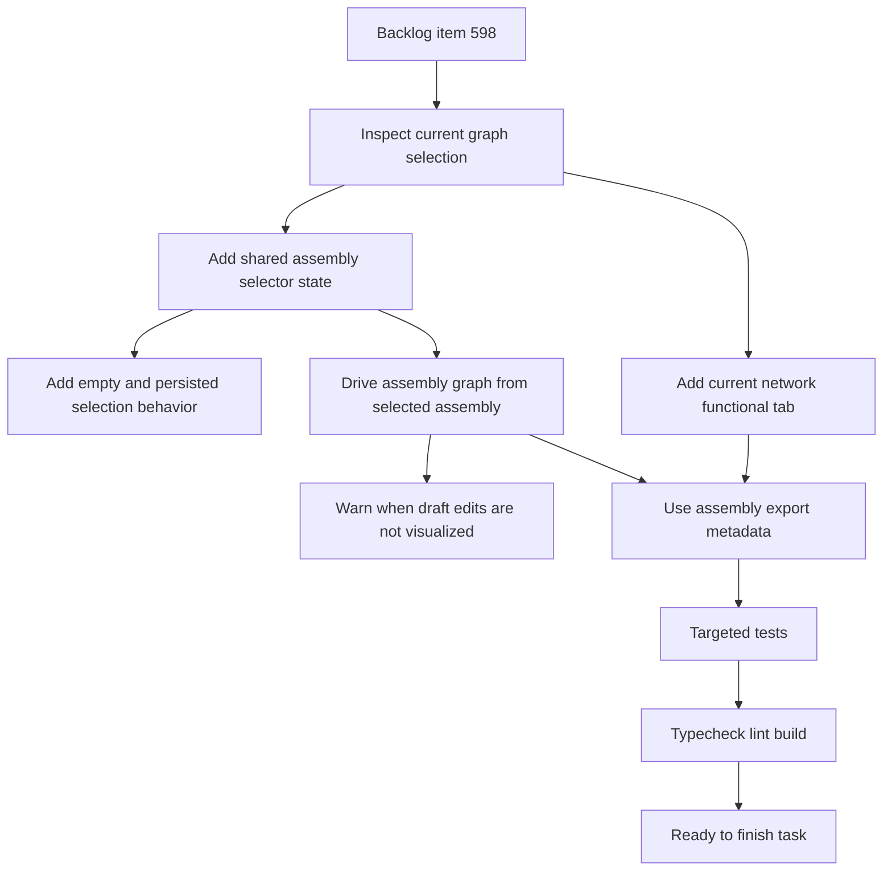

## task_109_explicit_harness_assembly_display_selection_and_current_network_functional_tab - Explicit Harness Assembly Display Selection and Current Network Functional Tab
> From version: 1.6.6
> Schema version: 1.0
> Status: Done
> Understanding: 96%
> Confidence: 94%
> Progress: 100%
> Complexity: Medium
> Theme: UI
> Reminder: Update status/understanding/confidence/progress and linked request/backlog references when you edit this doc.

# Context
Implement the UI and controller changes defined in `logics/backlog/item_598_explicit_harness_assembly_display_selection_and_current_network_functional_tab.md`.

The current harness assembly workspace derives the displayed assembly graph from `activeNetworkId`. This task replaces that implicit behavior with one explicit operator-controlled assembly selector. The same selector controls the assembly form being edited and the assembly functional graph being displayed.

The current active network still needs a functional graph view, but it must live in a separate `Current network functional` tab. In assembly mode, the active network must not choose, suggest, or replace the displayed assembly.

# Definition of Done (DoD)
- [x] One shared selector controls both the edited harness assembly and the displayed assembly graph.
- [x] The assembly workspace starts from an empty state when no displayed assembly selection is persisted.
- [x] The operator's displayed assembly selection persists after selection and survives reload.
- [x] `activeNetworkId` no longer chooses, suggests, or replaces the displayed harness assembly graph.
- [x] The displayed assembly graph uses saved assembly data, not unsaved draft data.
- [x] Unsaved member/root/link/color edits show a local warning explaining that save is required before the visualization updates.
- [x] A `Current network functional` tab displays only the current active network functional graph.
- [x] Assembly graph exports use selected assembly metadata, while current-network exports use active network metadata.
- [x] Existing saved harness assemblies load and remain selectable without data loss.
- [x] Targeted tests and quality checks pass before closure.

# Backlog
- Derived from `logics/backlog/item_598_explicit_harness_assembly_display_selection_and_current_network_functional_tab.md`

# Request
- `logics/request/req_126_explicit_harness_assembly_display_selection_and_current_network_functional_tab.md`

# Implementation plan
- [x] 1. Inspect the current selection and rendering path.
  - Confirm how `activeHarnessAssembly` is currently computed from `activeNetworkId`.
  - Confirm where `HarnessAssemblyManagerPanel` owns the selected assembly form state.
  - Confirm how `FunctionalSchematicPanel` receives graph data, filters, title, and export metadata.
- [x] 2. Introduce explicit displayed assembly selection.
  - Add state for the displayed assembly ID at the controller or workspace level.
  - Reuse the existing manager dropdown as the single shared edit/display selector.
  - Do not derive the displayed assembly from active network membership.
- [x] 3. Add empty and persisted selection behavior.
  - Show an explicit empty state when no displayed assembly is selected.
  - Persist the displayed assembly selection after the operator chooses an assembly.
  - Clear the selection when the persisted assembly no longer exists.
- [x] 4. Rewire assembly graph derivation.
  - Build the assembly functional graph from the selected saved assembly.
  - Preserve existing assembly filters, master connector roots, connector links, harness colors, and warnings.
  - Ensure connector navigation and active network changes do not replace the displayed assembly.
- [x] 5. Separate current-network functional view.
  - Add a `Current network functional` tab.
  - Render the existing single-network functional schematic for the active network in that tab.
  - Show an empty state in the tab when no active network exists.
- [x] 6. Add unsaved visualization warning.
  - Detect draft changes to members, master roots, connector links, and harness colors.
  - Show a small warning close to the modified controls.
  - Keep the graph tied to saved data until `Save assembly` succeeds.
- [x] 7. Update export metadata routing.
  - Use selected assembly name and technical ID for assembly graph exports.
  - Keep active network metadata for `Current network functional` exports.
- [x] 8. Add targeted automated tests.
  - Cover explicit selection, persisted selection, empty state, active-network decoupling, unsaved warnings, current-network tab behavior, and export metadata branching.
- [x] 9. Run validation and update this task report with command results.

# Acceptance criteria
- AC1: The harness assembly functional graph is selected by an explicit displayed assembly state, not by `activeNetworkId`.
- AC2: One shared selector controls both the edited assembly form and the displayed assembly graph.
- AC3: When no displayed assembly selection is persisted, the assembly workspace starts with an empty state that asks the operator to select a harness assembly.
- AC4: After the operator selects an assembly, the displayed assembly selection persists across reloads.
- AC5: Changing the active network does not change the displayed harness assembly graph.
- AC6: The displayed assembly graph is derived from saved assembly data, not unsaved form draft state.
- AC7: Unsaved member/root/link/color changes show a small warning near the modified controls explaining that save is required before the visualization updates.
- AC8: Opening interconnector details or navigating to linked connectors does not replace the displayed assembly graph through active network changes.
- AC9: A separate tab named `Current network functional` displays the functional graph of the current active network only.
- AC10: The `Current network functional` tab changes when the active network changes, while the harness assembly graph remains unchanged.
- AC11: Existing single-network functional graph behavior remains available through the new current-network tab.
- AC12: Assembly graph export metadata uses the selected assembly name and technical ID where available.
- AC13: Current-network graph export metadata continues to use active network metadata.
- AC14: Existing saved harness assemblies load, remain selectable, and keep import/export behavior without data loss.
- AC15: Automated tests cover explicit assembly selection, persisted selection, active-network decoupling, empty state behavior, unsaved warning behavior, current-network tab behavior, and export metadata selection.

# AC traceability
- AC1 -> Plan steps 2 and 4.
- AC2 -> Plan step 2.
- AC3 -> Plan step 3.
- AC4 -> Plan step 3.
- AC5 -> Plan step 4.
- AC6 -> Plan steps 4 and 6.
- AC7 -> Plan step 6.
- AC8 -> Plan step 4.
- AC9 -> Plan step 5.
- AC10 -> Plan steps 4 and 5.
- AC11 -> Plan step 5.
- AC12 -> Plan step 7.
- AC13 -> Plan step 7.
- AC14 -> Plan steps 3 and 8.
- AC15 -> Plan steps 8 and 9.
- request-AC1 -> This task. Evidence needed: The `Harness assembly` functional graph is selected by an explicit displayed assembly state, not by `activeNetworkId`.
- request-AC2 -> This task. Evidence needed: Changing the active network does not change the displayed harness assembly graph.
- request-AC3 -> This task. Evidence needed: The operator can select which saved harness assembly is displayed and edited through one shared selector.
- request-AC4 -> This task. Evidence needed: If no harness assembly is selected, the assembly workspace shows a clear empty state instead of falling back to the active network graph.
- request-AC5 -> This task. Evidence needed: The UI clearly shows which harness assembly currently drives the displayed assembly graph.
- request-AC6 -> This task. Evidence needed: The shared assembly selector controls both the edited assembly form and the displayed assembly graph.
- request-AC7 -> This task. Evidence needed: Unsaved member/root/link/color changes are visible before save, and a small warning near the modified controls explains that the visualization has not been updated yet.
- request-AC8 -> This task. Evidence needed: A separate tab lets the operator view the functional graph of the current active network only.
- request-AC9 -> This task. Evidence needed: The current-network functional tab changes when the active network changes, but the harness assembly graph does not.
- request-AC10 -> This task. Evidence needed: Existing single-network functional graph behavior remains available through the new current-network tab.
- request-AC11 -> This task. Evidence needed: Assembly graph export metadata uses selected assembly metadata where available.
- request-AC12 -> This task. Evidence needed: Current-network graph export metadata continues to use active network metadata.
- request-AC13 -> This task. Evidence needed: Existing saved harness assemblies load and remain selectable without data loss.
- request-AC14 -> This task. Evidence needed: Automated tests cover assembly selection, active-network decoupling, empty state behavior, and current-network tab behavior.
- request-AC15 -> This task. Evidence needed: The displayed assembly selection persists after the operator chooses an assembly and reloads the app.
- request-AC1 -> This task. Proof: Historical delivery is recorded in the linked backlog/task report and validation sections; this corpus repair formalizes strict audit traceability without changing shipped scope. Source: `logics corpus strict audit repair`
- request-AC2 -> This task. Proof: Historical delivery is recorded in the linked backlog/task report and validation sections; this corpus repair formalizes strict audit traceability without changing shipped scope. Source: `logics corpus strict audit repair`
- request-AC3 -> This task. Proof: Historical delivery is recorded in the linked backlog/task report and validation sections; this corpus repair formalizes strict audit traceability without changing shipped scope. Source: `logics corpus strict audit repair`
- request-AC4 -> This task. Proof: Historical delivery is recorded in the linked backlog/task report and validation sections; this corpus repair formalizes strict audit traceability without changing shipped scope. Source: `logics corpus strict audit repair`
- request-AC5 -> This task. Proof: Historical delivery is recorded in the linked backlog/task report and validation sections; this corpus repair formalizes strict audit traceability without changing shipped scope. Source: `logics corpus strict audit repair`
- request-AC6 -> This task. Proof: Historical delivery is recorded in the linked backlog/task report and validation sections; this corpus repair formalizes strict audit traceability without changing shipped scope. Source: `logics corpus strict audit repair`
- request-AC7 -> This task. Proof: Historical delivery is recorded in the linked backlog/task report and validation sections; this corpus repair formalizes strict audit traceability without changing shipped scope. Source: `logics corpus strict audit repair`
- request-AC8 -> This task. Proof: Historical delivery is recorded in the linked backlog/task report and validation sections; this corpus repair formalizes strict audit traceability without changing shipped scope. Source: `logics corpus strict audit repair`
- request-AC9 -> This task. Proof: Historical delivery is recorded in the linked backlog/task report and validation sections; this corpus repair formalizes strict audit traceability without changing shipped scope. Source: `logics corpus strict audit repair`
- request-AC10 -> This task. Proof: Historical delivery is recorded in the linked backlog/task report and validation sections; this corpus repair formalizes strict audit traceability without changing shipped scope. Source: `logics corpus strict audit repair`
- request-AC11 -> This task. Proof: Historical delivery is recorded in the linked backlog/task report and validation sections; this corpus repair formalizes strict audit traceability without changing shipped scope. Source: `logics corpus strict audit repair`
- request-AC12 -> This task. Proof: Historical delivery is recorded in the linked backlog/task report and validation sections; this corpus repair formalizes strict audit traceability without changing shipped scope. Source: `logics corpus strict audit repair`
- request-AC13 -> This task. Proof: Historical delivery is recorded in the linked backlog/task report and validation sections; this corpus repair formalizes strict audit traceability without changing shipped scope. Source: `logics corpus strict audit repair`
- request-AC14 -> This task. Proof: Historical delivery is recorded in the linked backlog/task report and validation sections; this corpus repair formalizes strict audit traceability without changing shipped scope. Source: `logics corpus strict audit repair`
- request-AC15 -> This task. Proof: Historical delivery is recorded in the linked backlog/task report and validation sections; this corpus repair formalizes strict audit traceability without changing shipped scope. Source: `logics corpus strict audit repair`

# Validation
- Run targeted tests for the changed controller/UI flow, expected starting points:
  - `npm test -- --run src/tests/app.ui.network-summary-workflow-polish.spec.tsx`
  - `npm test -- --run src/tests/core.functional-schematic.spec.ts`
  - `npm test -- --run src/tests/store.reducer.harness-assemblies.spec.ts`
- Add or update tests for:
  - explicit displayed assembly selection;
  - persisted displayed assembly selection;
  - empty state with no selected assembly;
  - active network changes not changing the assembly graph;
  - current-network tab changing with active network;
  - unsaved form warning near modified assembly controls;
  - assembly versus current-network export metadata.
- Run `npm run -s typecheck`.
- Run `npm run -s lint`.
- Run `npm run -s build`.
- Run the Logics linter when the Python entrypoint is available:
  - `py -3 logics/skills/logics.py lint --require-status`

# Implementation notes
- Likely code anchors:
  - `src/app/components/network-summary/HarnessAssemblyManagerPanel.tsx`
  - `src/app/hooks/controller/useAppControllerNetworkSummaryPanelDomain.tsx`
  - `src/app/components/network-summary/FunctionalSchematicPanel.tsx`
  - `src/core/functionalSchematic.ts`
  - `src/store/reducer/harnessAssemblyReducer.ts`
- Prefer keeping the displayed assembly selection in UI/controller state unless existing persisted UI preferences provide a better local pattern.
- Avoid introducing a second editable graph model. Both assembly and current-network views remain derived read-only graphs.
- Keep the assembly warning local and concise; it should explain saved data versus draft data without blocking form editing.

# Report
- Implemented one shared `Harness assembly` selector that controls both the edited assembly and displayed assembly graph.
- Removed active-network membership as the assembly graph selection source. Active network changes no longer replace the selected assembly graph.
- Added explicit empty assembly state when no displayed assembly is selected.
- Persisted the displayed assembly selection in local UI storage after the operator chooses an assembly, without changing the project save schema.
- Added a `Current network functional` tab for the active network's single-network functional schematic.
- Kept the assembly graph derived from saved assembly data; draft member/root/color edits show a local warning until `Save assembly`.
- Routed assembly graph export metadata through selected assembly name, technical ID, and creation date while preserving network metadata for current-network exports.
- Updated UI regression coverage for explicit selection, persistence, active-network decoupling, current-network tab behavior, and unsaved warning behavior.

Validation results:
- `npm test -- --run src/tests/app.ui.network-summary-workflow-polish.spec.tsx` passed: 17 tests.
- `npm test -- --run src/tests/core.functional-schematic.spec.ts` passed: 6 tests.
- `npm test -- --run src/tests/store.reducer.harness-assemblies.spec.ts` passed: 1 test.
- `.\\node_modules\\.bin\\tsc.cmd --noEmit` passed.
- `npm run -s lint` passed.
- `npm run -s build` passed. Vite reported existing chunk-size warnings for large generated chunks, but the build succeeded.
- `py -3 logics\\skills\\logics.py lint --require-status` could not run because the local WindowsApps `py.exe` launcher failed with an opening-session error.

# AI Context
- Summary: Implement explicit harness assembly display selection, persisted operator choice, active-network decoupling, unsaved visualization warnings, a current-network functional tab, and export metadata routing.
- Keywords: task, harness assembly, displayed assembly, active network, current network functional tab, persisted selection, unsaved warning, functional schematic export
- Use when: Implementing or reviewing graph-selection behavior in the harness assembly and current-network functional schematic UI.
- Skip when: The change targets connector link semantics, pin mapping, catalog data, or unrelated network modeling.

# Links
- Request: `logics/request/req_126_explicit_harness_assembly_display_selection_and_current_network_functional_tab.md`
- Backlog: `logics/backlog/item_598_explicit_harness_assembly_display_selection_and_current_network_functional_tab.md`
- Product brief(s): (none yet)
- Architecture decision(s): (none yet)
