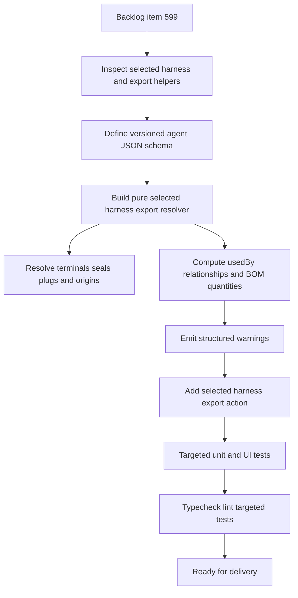

## task_110_selected_harness_agent_json_export - Selected Harness Agent JSON Export
> From version: 1.7.0
> Schema version: 1.0
> Status: Done
> Understanding: 99%
> Confidence: 97%
> Progress: 100%
> Complexity: Medium
> Theme: Export
> Reminder: Update status/understanding/confidence/progress and linked request/backlog references when you edit this doc.

# Context
Implement the selected-harness-only agent JSON export defined in `logics/backlog/item_599_selected_harness_agent_json_export.md`.

AI agents need one complete, stable, machine-readable payload for the currently selected harness assembly. The export must consolidate the saved selected harness assembly, its member networks, wires, connectors, splices, segments, connector catalog material resolution, protected-wire catalog references, BOM-like quantities, explicit relationships, and structured warnings.

This task is intentionally scoped to one selected harness assembly and one JSON format. It must not export all harness assemblies, must not add an import path, and must not fall back to `activeNetworkId` when no harness assembly is selected.

# Backlog
- Derived from `logics/backlog/item_599_selected_harness_agent_json_export.md`

# Request
- `logics/request/req_127_selected_harness_agent_json_export.md`

# Implementation Plan
- [x] 1. Inspect existing data and export paths.
  - Confirm selected harness assembly state after `req_126` and how it differs from `activeNetworkId`.
  - Review harness assembly entities in `src/core/entities.ts`.
  - Review connector terminal, seal, and plug precedence in `src/core/connectorCatalogMaterials.ts`.
  - Review existing BOM/export helpers in `src/app/lib/networkSummaryBomCsv.ts` and related tests.
- [x] 2. Define the versioned agent JSON contract.
  - Add a stable envelope with `schemaVersion`, `exportKind`, `exportedAt`, app version, and selected harness identity.
  - Model selected harness metadata, member networks, domain entities, catalog-backed parts, relationships, quantities, and warnings.
  - Keep schema fields ID-oriented and avoid relying on display labels for joins.
- [x] 3. Implement a pure export builder.
  - Add a builder such as `src/app/lib/selectedHarnessAgentJson.ts` or `src/core/harnessAgentExport.ts`.
  - Accept the selected harness assembly explicitly instead of deriving it from `activeNetworkId`.
  - Gather only member-network data referenced by the selected harness.
  - Return a non-exporting error or warning result when the selected harness is missing.
- [x] 4. Populate network entity details.
  - Export harness fields: ID, technical ID, name, members, master connector refs, connector links, created date, and updated date.
  - Export member networks plus relevant wires, connectors, splices, segments, connector cavity occupancy, catalog items, and protected-wire catalog references.
  - Include wire route, lock, color, twist group, functional domain, protection, length, and endpoint details.
  - Include connector and splice endpoint details with network IDs and stable entity references.
- [x] 5. Resolve materials, usage, quantities, and relationships.
  - Reuse existing terminal and seal precedence across manual wire-side refs, connector overrides, and catalog defaults.
  - Export unused-cavity plug requirements from connector catalog defaults when configured and applicable.
  - Add origin labels such as `manual`, `connectorOverride`, `catalogDefault`, or `computed` when determinable.
  - Compute `usedBy` references and BOM-like quantities for connectors, splices, terminals, seals, plugs, and protected-wire components.
  - Emit explicit relationship records so agents can traverse the payload without inferring joins from labels.
- [x] 6. Add structured warning generation.
  - Emit warnings with `code`, `severity`, `message`, and related entity references.
  - Cover missing or unresolved harness, network, connector, catalog, terminal, seal, plug, and relationship data.
  - Represent quantity-only plug data clearly when exact cavity assignment cannot be guaranteed.
- [x] 7. Wire the selected harness export action.
  - Add the selected-harness agent JSON export action to the appropriate harness assembly UI surface.
  - Disable the action or show a clear non-exporting state when no harness assembly is selected.
  - Download or emit exactly one JSON payload for the selected harness assembly.
- [x] 8. Add automated coverage and update Logics closeout.
  - Cover selected-harness scoping and active-network decoupling.
  - Cover terminal, seal, and plug resolution precedence.
  - Cover `usedBy`, BOM-like quantities, relationship records, and warning generation.
  - Update this task, the backlog item, and the request with validation evidence before closure.

# Acceptance Criteria Traceability
- AC1 -> Plan steps 3 and 7; one selected harness can be exported as JSON.
- AC2 -> Plan steps 1, 3, and 8; selected harness scoping is independent from `activeNetworkId`.
- AC3 -> Plan steps 3 and 7; no selected harness produces a disabled or clear non-exporting state.
- AC4 -> Plan step 2; the JSON envelope includes schema and export metadata.
- AC5 -> Plan step 4; selected harness metadata is included.
- AC6 -> Plan step 4; member networks and relevant entities are included.
- AC7 -> Plan step 4; wire records include routing, electrical, color, lock, protection, and endpoint details.
- AC8 -> Plan steps 4 and 5; connector endpoint records include IDs, labels, refs, and resolved materials.
- AC9 -> Plan step 4; splice endpoint records include network, splice, port, side, and lock data.
- AC10 -> Plan step 4; connector records include catalog and cavity occupancy details.
- AC11 -> Plan step 5; terminal and seal resolution reuses existing precedence and exposes origin labels.
- AC12 -> Plan step 5; unused-cavity plugs come from catalog defaults when applicable.
- AC13 -> Plan step 5; catalog-backed parts include `usedBy` references.
- AC14 -> Plan step 5; BOM-like quantities are computed.
- AC15 -> Plan step 5; explicit relationship records are emitted.
- AC16 -> Plan step 6; structured warnings cover missing and unresolved data.
- AC17 -> Plan step 8; automated tests cover the export builder and selected UI behavior.

# Decision Framing
- Product framing: Not needed.
- Product signal: The request and backlog already define the user, consumer, scope, format, and out-of-scope export variants.
- Product follow-up: Create a product brief only if this grows into human-facing packages, paid agent features, or multiple export variants.
- Architecture framing: Maybe later.
- Architecture signal: The task introduces a versioned machine-readable schema and a pure export boundary.
- Architecture follow-up: Create an ADR if implementation establishes a broader schema versioning policy, import compatibility contract, or shared export architecture.

# Links
- Product brief(s): (none yet)
- Architecture decision(s): (none yet)
- Derived from `logics/backlog/item_599_selected_harness_agent_json_export.md`
- Request(s): `logics/request/req_127_selected_harness_agent_json_export.md`

# AI Context
- Summary: Implement a selected-harness-only JSON export that consolidates harness assembly, member network, wire, connector, terminal, seal, plug, catalog part, BOM usage, relationship, and validation warning data for AI agents.
- Keywords: selected harness, agent JSON, harness export, wires, connectors, terminals, seals, plugs, catalog parts, BOM, usedBy, relationships, validation warnings
- Use when: Implementing or reviewing the selected harness agent JSON export.
- Skip when: Work targets human-readable export formats, all-harness export, import support, or active-network-only export.

# Validation
- `npm test -- --run src/tests/selected-harness-agent-json.spec.ts`
- Add or extend targeted UI tests for selected harness export disabled/enabled behavior if the action is UI-mounted.
- `.\\node_modules\\.bin\\tsc.cmd --noEmit`
- `npm run -s lint`
- Run broader test/build gates if implementation touches shared export, BOM, catalog, or harness assembly behavior.

# Definition of Done (DoD)
- [x] Selected-harness-only agent JSON export is implemented.
- [x] The export never falls back to `activeNetworkId`.
- [x] Missing selected harness behavior is explicit and non-exporting.
- [x] The JSON envelope, domain records, material resolution, relationships, quantities, and warnings cover AC1 through AC16.
- [x] Automated tests cover AC17.
- [x] Validation commands are run and results captured in `# Report`.
- [x] Linked request/backlog/task docs are updated during closure.
- [x] Status is `Done` and progress is `100%`.

# Report
- Task created from backlog item 599.
- Implemented `src/app/lib/selectedHarnessAgentJson.ts` as a pure selected-harness export builder with schema metadata, selected harness identity, member networks, wires, connectors, splices, segments, catalog parts, material resolution, `usedBy`, BOM-like quantities, explicit relationships, and structured warnings.
- Added an `Agent JSON` action to the Harness Assembly manager. The action is disabled unless a saved selected harness assembly exists and downloads exactly one selected-harness JSON payload.
- Added targeted builder and UI tests:
  - `src/tests/selected-harness-agent-json.spec.ts`
  - `src/tests/harness-assembly-agent-json-ui.spec.tsx`
- Validation passed:
  - `npm test -- --run src/tests/selected-harness-agent-json.spec.ts src/tests/harness-assembly-agent-json-ui.spec.tsx`
  - `.\\node_modules\\.bin\\tsc.cmd --noEmit`
  - `npm run -s lint`
  - `npm run -s build`
