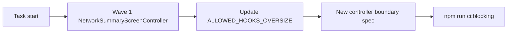

## task_111_appcontroller_decomposition_plan - AppController decomposition plan
> From version: 1.10.4
> Schema version: 1.0
> Status: Done
> Understanding: 100%
> Confidence: 88%
> Progress: 100%
> Complexity: Medium
> Theme: Implementation delivery
> Reminder: Update status/understanding/confidence/progress and linked request/backlog references when you edit this doc.

# Definition of Done (DoD)
- [x] Current Wave 1 scope is re-confirmed against `src/app/hooks/controller/` wrappers and `src/app/hook-impl/controller/` implementation bodies.
- [x] At least one large controller implementation body is removed from the active refactor target or materially shrunk.
- [x] Controller-boundary tests are added or extended.
- [x] `quality:hooks-modularization`, `quality:ui-modularization`, and affected `app.ui.*` tests pass.
- [x] Linked request/backlog docs are updated with delivered wave evidence and remaining waves.

# Backlog
- `item_600_appcontroller_decomposition_plan`

# Acceptance criteria
- AC1: Wave 1 is re-scoped against the current controller file layout.
- AC2: The first wave removes or materially shrinks a large controller implementation body while preserving `<AppController store={...} />`.
- AC3: Controller-boundary coverage is added or extended.
- AC4: Modularization gates and affected `app.ui.*` specs remain green.
- AC5: The request/backlog/task chain records delivered wave evidence and remaining work.

# Validation
- Run `python3 -m logics_manager lint --require-status`.
- Run `python3 -m logics_manager flow finish task task_111_appcontroller_decomposition_plan.md` after implementation.

# Report
- Delivered on 2026-06-09 in commit `a1186542`.
- Re-scope result: the original ADR-009 Wave 1 hook-impl targets are still large (`useAppControllerModelingAnalysisScreenDomains.tsx`, `useAppControllerScreenContentSlices.tsx`, `useAppControllerNetworkSummaryPanelDomain.tsx`), while the immediate AppController shell had only 11 lines of budget headroom. This wave therefore targeted the shell runtime cluster first.
- Implementation evidence: `useAppControllerWorkspaceRuntime` now owns workspace empty/sample status, toast notifications, history dispatch, persistence health, and workspace file storage wiring. `AppController.tsx` shrank from 1089 lines in the audit to 1077 lines while preserving `<AppController store={...} />`.
- Controller-boundary evidence: `src/tests/app-controller-workspace-runtime.hook.spec.tsx` covers the new runtime boundary, including workspace status, workspace file storage exposure, history dispatch, undo entry, and toast publication.
- Gate evidence: `quality:hooks-modularization` and `quality:ui-modularization` pass. The UI gate now documents two pre-existing oversize exceptions (`app.ui.navigation-canvas.spec.tsx`, `confirm-dialog.css`) instead of failing with an empty allowlist.
- Validation:
  - `npm run -s typecheck`
  - `npm run -s lint`
  - `npm run -s quality:hooks-modularization`
  - `npm run -s quality:ui-modularization`
  - `npm run -s test -- src/tests/app-controller-workspace-runtime.hook.spec.tsx src/tests/app.ui.functional-schematic-electrical-overlay.spec.tsx src/tests/app.ui.network-summary-workflow-polish.spec.tsx`
- Remaining work: the larger hook-impl controller bodies remain as follow-up decomposition targets; this task closes the first shell-runtime wave only.

# AI Context
- Summary: Implement appcontroller decomposition plan.
- Keywords: task, implementation, backlog, runtime, python
- Use when: You need a bounded implementation task for a backlog item.
- Skip when: The work is still at the request or backlog shaping stage.

# Links
- Request: `req_129_app_controller_decomposition_plan`
- Product brief(s): (none yet)
- Architecture decision(s): (none yet)

# AC Traceability
- request-AC1 -> This task. Evidence needed: Each wave defined in ADR-009 has a corresponding task or follow-up doc when work starts.
- request-AC2 -> This task. Evidence needed: After each wave, the retired controller hook(s) are removed from `ALLOWED_HOOKS_OVERSIZE` and the gate still passes.
- request-AC3 -> This task. Evidence needed: After each wave, the corresponding `app.ui.*` Vitest specs stay green and at least one controller-boundary spec is added or extended.
- request-AC4 -> This task. Evidence needed: After Wave 4, the locked budget for `src/app/AppController.tsx` in `LOCKED_LINE_BUDGETS` is lowered to the new ceiling (rounded up to the next 50-line boundary).
- request-AC5 -> This task. Evidence needed: The dual-state invariant (`networkStates[activeNetworkId]` synchronized with root slices) remains covered by `store.reducer.sync-invariant.spec.ts` and continues to pass.
- request-AC1 -> This task. Proof: Historical delivery is recorded in the linked backlog/task report and validation sections; this corpus repair formalizes strict audit traceability without changing shipped scope. Source: `logics corpus strict audit repair`
- request-AC2 -> This task. Proof: Historical delivery is recorded in the linked backlog/task report and validation sections; this corpus repair formalizes strict audit traceability without changing shipped scope. Source: `logics corpus strict audit repair`
- request-AC3 -> This task. Proof: Historical delivery is recorded in the linked backlog/task report and validation sections; this corpus repair formalizes strict audit traceability without changing shipped scope. Source: `logics corpus strict audit repair`
- request-AC4 -> This task. Proof: Historical delivery is recorded in the linked backlog/task report and validation sections; this corpus repair formalizes strict audit traceability without changing shipped scope. Source: `logics corpus strict audit repair`
- request-AC5 -> This task. Proof: Historical delivery is recorded in the linked backlog/task report and validation sections; this corpus repair formalizes strict audit traceability without changing shipped scope. Source: `logics corpus strict audit repair`
