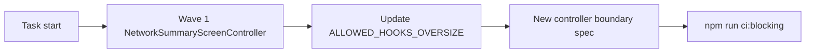

## task_111_appcontroller_decomposition_plan - AppController decomposition plan
> From version: 1.10.4
> Schema version: 1.0
> Status: Ready
> Understanding: 100%
> Confidence: 88%
> Progress: 0%
> Complexity: Medium
> Theme: Implementation delivery
> Reminder: Update status/understanding/confidence/progress and linked request/backlog references when you edit this doc.

# Definition of Done (DoD)
- [ ] Current Wave 1 scope is re-confirmed against `src/app/hooks/controller/` wrappers and `src/app/hook-impl/controller/` implementation bodies.
- [ ] At least one large controller implementation body is removed from the active refactor target or materially shrunk.
- [ ] Controller-boundary tests are added or extended.
- [ ] `quality:hooks-modularization`, `quality:ui-modularization`, and affected `app.ui.*` tests pass.
- [ ] Linked request/backlog docs are updated with delivered wave evidence and remaining waves.

# Backlog
- `item_600_appcontroller_decomposition_plan`

# Acceptance criteria
- AC1: Wave 1 is re-scoped against the current controller file layout.
- AC2: The first wave removes or materially shrinks a large controller implementation body while preserving `<AppController store={...} />`.
- AC3: Controller-boundary coverage is added or extended.
- AC4: Modularization gates and affected `app.ui.*` specs remain green.
- AC5: The request/backlog/task chain records delivered wave evidence and remaining work.

# Validation
- Run `python3 -m logics_manager lint --require-status`.
- Run `python3 -m logics_manager flow finish task task_111_appcontroller_decomposition_plan.md` after implementation.

# Report
- Real-status audit on 2026-06-09: implementation is not complete. `src/app/AppController.tsx` is 1089 lines with the locked budget still at 1100, and the large implementation bodies under `src/app/hook-impl/controller/` still exist. Thin wrappers under `src/app/hooks/controller/` make some gate paths look smaller but do not complete the ADR-009 decomposition target.
- Remaining work is still pertinent as maintainability debt, but this task should start with a re-scope of Wave 1 against the current file layout.

# AI Context
- Summary: Implement appcontroller decomposition plan.
- Keywords: task, implementation, backlog, runtime, python
- Use when: You need a bounded implementation task for a backlog item.
- Skip when: The work is still at the request or backlog shaping stage.

# Links
- Request: `req_129_app_controller_decomposition_plan`
- Product brief(s): (none yet)
- Architecture decision(s): (none yet)

# AC Traceability
- request-AC1 -> This task. Evidence needed: Each wave defined in ADR-009 has a corresponding task or follow-up doc when work starts.
- request-AC2 -> This task. Evidence needed: After each wave, the retired controller hook(s) are removed from `ALLOWED_HOOKS_OVERSIZE` and the gate still passes.
- request-AC3 -> This task. Evidence needed: After each wave, the corresponding `app.ui.*` Vitest specs stay green and at least one controller-boundary spec is added or extended.
- request-AC4 -> This task. Evidence needed: After Wave 4, the locked budget for `src/app/AppController.tsx` in `LOCKED_LINE_BUDGETS` is lowered to the new ceiling (rounded up to the next 50-line boundary).
- request-AC5 -> This task. Evidence needed: The dual-state invariant (`networkStates[activeNetworkId]` synchronized with root slices) remains covered by `store.reducer.sync-invariant.spec.ts` and continues to pass.
- request-AC1 -> This task. Proof: Historical delivery is recorded in the linked backlog/task report and validation sections; this corpus repair formalizes strict audit traceability without changing shipped scope. Source: `logics corpus strict audit repair`
- request-AC2 -> This task. Proof: Historical delivery is recorded in the linked backlog/task report and validation sections; this corpus repair formalizes strict audit traceability without changing shipped scope. Source: `logics corpus strict audit repair`
- request-AC3 -> This task. Proof: Historical delivery is recorded in the linked backlog/task report and validation sections; this corpus repair formalizes strict audit traceability without changing shipped scope. Source: `logics corpus strict audit repair`
- request-AC4 -> This task. Proof: Historical delivery is recorded in the linked backlog/task report and validation sections; this corpus repair formalizes strict audit traceability without changing shipped scope. Source: `logics corpus strict audit repair`
- request-AC5 -> This task. Proof: Historical delivery is recorded in the linked backlog/task report and validation sections; this corpus repair formalizes strict audit traceability without changing shipped scope. Source: `logics corpus strict audit repair`
