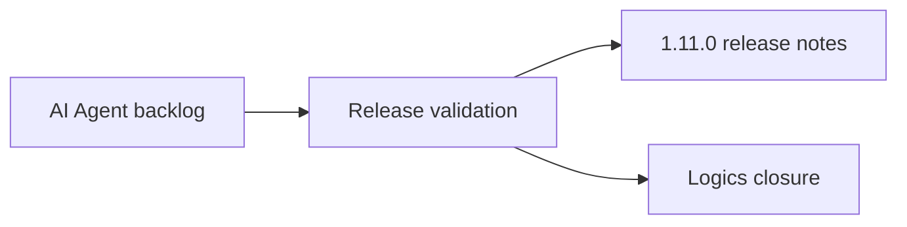

## task_112_ai_agent_modeling_workspace_release_validation - AI Agent Modeling Workspace Release Validation
> From version: 1.11.0
> Status: Done
> Owner: Codex
> Understanding: 99%
> Confidence: 96%
> Progress: 100%
> Related request: `req_128_ai_agent_modeling_workspace`
> Related backlog: `item_600_ai_provider_settings_and_capability_contract`, `item_601_ai_agent_context_builder_and_operation_contract`, `item_602_modeling_ai_agent_assisted_proposal_workflow`, `item_603_ai_agent_experimental_direct_execution_and_rollback`, `item_604_ai_agent_validation_regression_and_release_gate`
> Related architecture: `adr_009_ai_agent_operation_contract_and_reversible_execution`

# Objective
Record the Modeling AI Agent workspace scope and validation evidence for release `1.11.0`.

# Delivered Scope
- AI provider Settings for OpenAI/Gemini, local API key storage, editable model/endpoint/timeout/strictness, connection testing, and experimental mode opt-in.
- Modeling `AI Agent` entry gated by provider readiness.
- Assisted proposal workflow with scoped instruction, permissions, provider proposal, modified-plan diffing, validation, operation details, apply/reject controls, and undoable application.
- Operation contract covering add, move, update, route, delete, catalog assignment, connector layout, terminal material, batch move, and route lock workflows.
- Scoped contexts for active network, current selection, selected harness, and all networks.
- Network-scoped validation/apply so multi-network proposals target the correct `networkId` instead of the active network by accident.
- Impact preview and explicit rollback snapshot for the last applied AI session.
- Business validation hardening for endpoint occupancy, technical ID conflicts, delete impact, route locks, route permissions, and wire sizing recommendations.

# Acceptance Traceability
- `req_128` AC1-AC4: delivered by provider settings, readiness gating, AI Agent entry, scope/mode/instruction/permission controls.
- `req_128` AC5-AC8: delivered by default assisted mode, structured provider output, local validation, apply/reject, and single history replacement.
- `req_128` AC9-AC11: delivered for experimental opt-in gating, validated application, and reusable snapshot/rollback; true no-confirmation direct execution remains tracked as follow-up in `item_603`.
- `req_128` AC12-AC15: delivered by permission gates, existing domain validations, delete default-off behavior, result summaries, and rejected/unsupported issue reporting.
- `req_128` AC16: delivered by focused provider, context, operation, apply, plan diff, proposal, settings UI, and rollback tests.

# Validation Evidence
- `rtk npm run -s lint`
- `rtk npm run -s typecheck`
- `rtk npm test -- --run src/tests/changelog-feed.spec.ts src/tests/app.ui.home.spec.tsx src/tests/ai-agent-context.spec.ts src/tests/ai-agent-operation-contract.spec.ts src/tests/ai-agent-apply.spec.ts src/tests/ai-agent-plan-diff.spec.ts src/tests/ai-agent-proposal.spec.ts src/tests/ai-agent-provider-client.spec.ts src/tests/app.ui.settings.spec.tsx`
- `rtk npm run -s build`
- Local live OpenAI smoke passed with a temporary uncommitted test file using `.env.local`; the temporary test was removed and no secret was committed.
- `rtk python3 -m logics_manager lint --require-status`

# Release
- Included in `changelogs/CHANGELOGS_1_11_0.md`.
- Release metadata aligned in `VERSION`, `package.json`, `package-lock.json`, and `README.md`.
